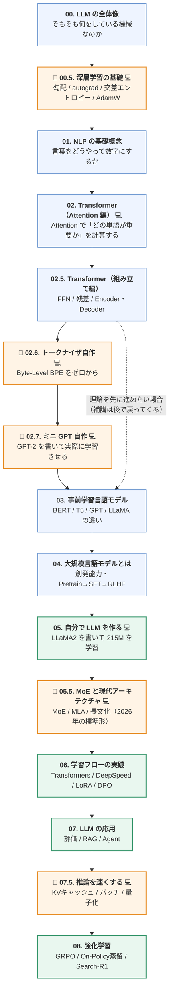

# 気軽にはじめる LLM 自作入門

> **知識ゼロから、大規模言語モデル（LLM）の原理を理解し、
> 実際に自分の手で小さな LLM を一つ作りきる**ための日本語学習資料です。

📖 **本文は Zenn の本として読めます → [気軽にはじめる LLM 自作入門](https://zenn.dev/thirtypower/books/kgr-llm-guide)**
（目次サイドバー・章送りつきで読みやすいのはこちら。GitHub では [`books/kgr-llm-guide/`](books/kgr-llm-guide/) にそのまま置いてあります）

💻 **実行可能なコードは [`code/`](code/) にあります**（Zenn 側からはリンクで参照）

---

## 0. この資料は何？

この資料のゴールは「**大規模言語モデル（LLM）の原理を理解し、実際に自分の手で小さな LLM を一つ作りきる**」ことです。
ChatGPT のような AI が「なぜ動くのか」を、ブラックボックスのまま使うのではなく、中身の部品を一つずつ分解して理解していきます。

そのために、この資料では

- **専門用語を日本語＋英語の両方で押さえる**（論文やライブラリは英語なので、英語名も必ず併記します）
- **数式より先に「たとえ話」で直感をつかむ**
- **各章で「結局何ができるようになるのか」を最初に書く**
- **読んだ内容を、その場で動かせるコードとセットにする**（[`code/`](code/) に実行可能なスクリプト）
- **主張の出どころを追えるようにする**（[参考文献](books/kgr-llm-guide/appendix-references.md) に一次資料へのリンクを章ごとに集約）

という方針でまとめています。

全体は**本編8章＋補講5本**（`00.5` / `02.6` / `02.7` / `05.5` / `07.5`）という構成です。
補講の前3本は「理論を読んでいて、前提知識が足りずに詰まりやすい場所」を埋めるため、
後2本（`05.5` / `07.5`）は **教科書的な構成（2024年ごろ）と2026年の実物とのギャップ**
——MoE・MLA・長文化・推論の最適化——を埋めるためのものです。

> 📌 **健全性について**：この教材では、
> 「よく言われているが一次資料に照らすと不正確」な説明を
> **[参考文献 の「訂正した主張」](books/kgr-llm-guide/appendix-references.md#この教材で明示的に訂正した主張)** に一覧化しています
> （例：「RoPE は長文にそのまま外挿できる」「MoE は軽い」「8x7B は 56B」）。
> 他の解説記事を読むときのチェックリストとしても使えます。

---

## 1. 全体像：LLM ができるまでの流れ

まず、この教材のゴールを1枚の図にするとこうなります。



| 色 | 意味 |
|---|---|
| 🟦 青 | 理論パート（読んで理解する） |
| 🟩 緑 | 実践パート（手を動かす） |
| 🟧 橙 | 🔰 補講（前提を埋める・実装する） |

> 🔰 = 補講　／　💻 = 対応する実行可能コードあり（[`code/`](code/)）

**前半（1〜4章）は理論、後半（5〜8章）は手を動かすパート**、という2部構成です。
補講（🔰）は、その手前で詰まりやすい所を埋めるために足したものです。

---

## 2. 目次

🔰 = 補講　／　💻 = 対応する実行可能コードあり

| # | ファイル | 内容 | 難易度 | コード |
|---|---------|------|--------|-------|
| 00 | [00. LLM の全体像](books/kgr-llm-guide/00-overview.md) | 【まずここ】そもそも LLM とは何をしている機械なのか | ★☆☆ | |
| 🔰00.5 | [00.5. 深層学習の基礎](books/kgr-llm-guide/005-deep-learning-basics.md) | **「学習する」とは何か**。勾配・autograd・交差エントロピー・AdamW | ★☆☆ | 💻 `01_` |
| 01 | [01. NLP の基礎概念](books/kgr-llm-guide/01-nlp-basics.md) | 自然言語処理の歴史・タスク・単語のベクトル化 | ★☆☆ | |
| 02 | [02. Transformer アーキテクチャ](books/kgr-llm-guide/02-transformer-attention.md) | **Attention 編**。Q・K・V / Self-Attention / Masked / Multi-Head | ★★☆ | 💻 `02_` |
| 02.5 | [02.5. Transformer ブロック](books/kgr-llm-guide/025-transformer-block.md) | **組み立て編**。FFN / LayerNorm / 残差接続 / 位置エンコーディング / Encoder・Decoder | ★★☆ | |
| 🔰02.6 | [02.6. トークナイザを理解する](books/kgr-llm-guide/026-tokenizer.md) | **Byte-Level BPE をゼロから**。未知語が消える理由、日本語が割高な理由 | ★★☆ | 💻 `03_` |
| 🔰02.7 | [02.7. ミニ GPT を作る](books/kgr-llm-guide/027-mini-gpt.md) | **GPT-2 を自作して学習させる**。実装バグの潰し方6項目 | ★★☆ | 💻 `04_` |
| 03 | [03. 事前学習言語モデル](books/kgr-llm-guide/03-pretrained-models.md) | BERT・T5・GPT・LLaMA の違い | ★★☆ | |
| 04 | [04. 大規模言語モデルとは](books/kgr-llm-guide/04-what-is-llm.md) | 創発能力・In-Context Learning・Pretrain/SFT/RLHF | ★★☆ | |
| 05 | [05. 自分で LLM を作る（前編）](books/kgr-llm-guide/05-build-your-own-llm.md) | **LLaMA2 の実装**。RMSNorm / RoPE / GQA / SwiGLU をゼロから書く | ★★★ | 💻 `05_` |
| 05 | [05. 自分で LLM を作る（後編）](books/kgr-llm-guide/05-2-pretrain-your-llm.md) | **トークナイザ訓練と事前学習**。215M モデルを実際に学習させ、生成させる | ★★★ | 💻 `06_` |
| 🔰05.5 | [05.5. MoE と現代アーキテクチャ](books/kgr-llm-guide/055-moe-modern-arch.md) | **2026年の標準形との差分**。MoE / MLA / 長文化（YaRN）/ 希薄な Attention | ★★★ | 💻 `08_` |
| 06 | [06. 学習フローの実践](books/kgr-llm-guide/06-training-pipeline.md) | Transformers / DeepSpeed / LoRA / QLoRA / DPO | ★★★ | 💻 `07_` |
| 07 | [07. LLM の応用](books/kgr-llm-guide/07-applications.md) | 評価ベンチマーク・RAG・Agent | ★★☆ | |
| 🔰07.5 | [07.5. 推論を速くする](books/kgr-llm-guide/075-fast-inference.md) | **推論の速度と費用**。prefill/decode / KVキャッシュ / バッチ / 量子化 / 投機的デコード | ★★☆ | 💻 `09_` |
| 08 | [08. 強化学習](books/kgr-llm-guide/08-reinforcement-learning.md) | GRPO・On-Policy蒸留・Search-R1・ReTool | ★★★ | |
| ✚ | [用語集](books/kgr-llm-guide/appendix-glossary.md) | 用語辞典（日本語⇔英語） | — | |
| ✚ | [参考文献](books/kgr-llm-guide/appendix-references.md) | **一次資料へのリンク集**＋「よくある誤説明の訂正」一覧 | — | |
| 🛠 | [環境構築ガイド](books/kgr-llm-guide/appendix-setup.md) | Python 導入からコード実行まで。トラブル対処表つき | — | |

---

## 2.5. 実際に動かす（[`code/`](code/)）

読むだけでは、Attention も学習ループも絶対に腹落ちしません。
そこで **[`code/`](code/) に、そのまま実行できるスクリプトを置いています**。

```bash
cd code
python 01_tensor_autograd.py        # 「学習する」を最小の例で最後まで見る
python 02_attention_step_by_step.py # Attention の途中の行列を全部表示する
python 03_bpe_tokenizer.py          # BPE トークナイザをゼロから作る
python 04_minigpt.py                # GPT を自作して実際に学習させる（CPU で3〜5分）
python 05_llama.py                  # GPT-2 を LLaMA2 に現代化する
python 06_pretrain.py --demo        # 事前学習パイプライン完全版（CPU で約3分）
python 07_lora_sft.py               # 公開モデルを LoRA で微調整（要 GPU/Colab）
python 08_moe.py --train            # MoE を作る＋ルータが偏る現象を実測（CPU で約3分）
python 09_inference.py --quant      # KVキャッシュ・バッチ・量子化を実測（CPU で約1分）
```

| スクリプト | 内容 | 必要なもの | 対応ドキュメント |
|-----------|------|-----------|----------------|
| `01_tensor_autograd.py` | テンソル / 勾配 / autograd / 交差エントロピー / SGD vs AdamW | torch | [00.5章](books/kgr-llm-guide/005-deep-learning-basics.md) |
| `02_attention_step_by_step.py` | 4トークン×4次元で Attention の全行列を目視。PyTorch 公式実装との一致も確認 | torch | [02章](books/kgr-llm-guide/02-transformer-attention.md) |
| `03_bpe_tokenizer.py` | Byte-Level BPE の訓練を1マージずつ観察 | **標準ライブラリのみ** | [02.6章](books/kgr-llm-guide/026-tokenizer.md) |
| `04_minigpt.py` | GPT-2 相当を自作 → 自己検査6項目 → 学習 → 生成 → 文法採点 | torch | [02.7章](books/kgr-llm-guide/027-mini-gpt.md) |
| `05_llama.py` | RMSNorm / RoPE / GQA / SwiGLU への置き換えを数値で検証 | torch | [05章](books/kgr-llm-guide/05-build-your-own-llm.md) |
| `06_pretrain.py` | **データ準備→トークナイザ訓練→事前学習→保存→生成**の完全パイプライン。`--demo` は CPU 約3分、`--full` は wikipedia-ja で 215M を学習（要 GPU 12GB〜） | torch（`--full` は +datasets/tokenizers） | [05章（後編）](books/kgr-llm-guide/05-2-pretrain-your-llm.md) |
| `07_lora_sft.py` | Qwen2.5-0.5B を日本語データで **LoRA 微調整**。学習前後の応答を比較 | transformers / peft 等（VRAM 6GB〜 or Colab T4） | [06章](books/kgr-llm-guide/06-training-pipeline.md) |
| `08_moe.py` | **MoE を自作**。総/活性パラメータの数え上げ、ルータの top-k、**補助損失なしで専門家が遊ぶ様子**、MHA/GQA/MQA/MLA のキャッシュ量 | torch | [05.5章](books/kgr-llm-guide/055-moe-modern-arch.md) |
| `09_inference.py` | **推論の実測**。KVキャッシュの一致検証と効果、文脈長ごとの1トークン単価、バッチのスループット、量子化の崖 | torch | [07.5章](books/kgr-llm-guide/075-fast-inference.md) |

### この教材のコードの3つの方針

1. **コア教材（01〜06 `--demo`、08、09）は全部 CPU で数分以内に終わる。** GPU は要りません。`04_minigpt.py` の学習も実測で3〜5分です。
   （例外は「本物のデータ・本物のモデル」を扱う `06_pretrain.py --full` と `07_lora_sft.py` の2つだけ。GPU または Colab を使います → [環境構築ガイド](books/kgr-llm-guide/appendix-setup.md)の早見表参照）
2. **コア教材は外部ライブラリを使わない。** `torch` 以外は使いません（`03_` は標準ライブラリのみ）。
   ライブラリが隠している部分こそが、理解したい部分だからです。
3. **「正解が分かっている問題」で検証する。**
   [`_corpus.py`](code/_corpus.py) が**文法規則を自分で決めた人工コーパス**を生成するので、
   生成文が正しいかを**機械的に採点**できます。
   これにより「**学習不足なのか実装バグなのか**」を数値で切り分けられます。
   本物の Wikipedia で学習していたら、この判断は絶対にできません。

> 💡 `python 04_minigpt.py --sanity` は**学習せずに自己検査だけ**を走らせます。
> 「初期 loss ≈ ln(語彙数)」「未来を見ていないか」「1バッチを暗記できるか」など、
> **実務でそのまま使えるバグ検出手順**です。詳しくは [02.7章](books/kgr-llm-guide/027-mini-gpt.md)。

---

## 3. 前提知識と環境

### 必要な前提知識

| 項目 | 必要度 | 備考 |
|------|-------|------|
| Python の基本文法 | **必須** | for / class / 関数が読めれば OK |
| 行列・ベクトルの掛け算 | 不要 | 忘れていても [00.5章の「数学の最低限」](books/kgr-llm-guide/005-deep-learning-basics.md)（5分）で足ります |
| PyTorch | 不要 | [00.5章 1.5.3「PyTorch でモデルを書く作法」](books/kgr-llm-guide/005-deep-learning-basics.md)で最低限（`nn.Module` / `forward`）を説明します |
| 深層学習の基礎 | 不要 | [00.5章](books/kgr-llm-guide/005-deep-learning-basics.md) がゼロから説明します |

> **本当に必須なのは Python だけ**です。
> 数学（内積・行列積・softmax）と深層学習（勾配・損失・Optimizer）は、
> [00.5章](books/kgr-llm-guide/005-deep-learning-basics.md) で全部ゼロから説明しています。
> 「損失関数」「勾配降下法」がピンと来ないなら、必ず 00.5章 から読んでください。
> ここが曖昧なままだと、5章で確実に詰まります。

### 環境

> 🛠 **Python のインストールから躓かず進むための手順を [環境構築ガイド](books/kgr-llm-guide/appendix-setup.md) にまとめました。**
> 仮想環境の作り方・実行順・実測所要時間・トラブルシューティング表つきです。

| やりたいこと | 必要な環境 |
|------------|-----------|
| 1〜4章・7章を読む | **不要**（読むだけ） |
| `code/03_bpe_tokenizer.py` を動かす | **Python だけ**（標準ライブラリのみ） |
| `code/01_`〜`05_`・`08_`・`09_` を動かす | **CPU で十分**。`pip install torch` だけ。数分で終わります（実測値はガイド参照） |
| 5章の 215M モデルを本気で学習する | GPU 1枚（VRAM 12GB〜、例：RTX 3060/4060）。無ければ Google Colab 無料枠でも一部動く |
| 6章以降で 7B クラスを扱う | フル微調整なら A100 級。ただし **LoRA なら消費者向け GPU でも可能** |

主なライブラリ：

```bash
# code/ を動かすだけならこれだけでよい
pip install torch

# 6章以降（Hugging Face エコシステム）を試すとき
pip install transformers datasets tokenizers accelerate peft trl
```

---

## 4. おすすめの学習の進め方

目的別に3コース用意しました。**自分に合うものを1つ選んでください。**

### コースA：「とりあえず全体像だけ知りたい」（半日）

```
00-LLMの全体像 → 04-大規模言語モデルとは → 07-LLMの応用
```

コードは動かしません。**LLM が何をしていて、実務でどう使うか**が分かります。

### コースB：「仕組みをちゃんと理解したい」（2〜4週間）★おすすめ

| 週 | 読むもの | 動かすもの | この週の到達目標 |
|----|---------|-----------|----------------|
| 1週目 | 00 → **00.5** → 01 → 02 → **02.5** | [環境構築](books/kgr-llm-guide/appendix-setup.md) → `01_`, `02_` | **Attention の式を自分で説明できる**／`loss.backward()` が何をしているか言える |
| 2週目 | **02.6** → **02.7** | `03_`, `04_` | **自作 GPT で文法正答率90%を出す**（実装できたことの証明） |
| 3週目 | 03 → 04 | — | BERT と GPT の違い、Pretrain/SFT/RLHF を説明できる |
| 4週目 | 05 → **05.5** → 06 | `05_`, `06_ --demo`, `08_`, `07_` | LLaMA2 の5つの改良点を説明できる／事前学習パイプラインを端から端まで1周する／**MoE の構成表を読める**／LoRA で微調整を1回通す |
| （+α） | 07 → **07.5** → 08 | `09_` | RAG を1つ作る／**「なぜ遅いか」を切り分けられる**／強化学習まで踏み込む |

> 💡 **2週目が山場です。** ここで「自分の書いたモデルが実際に学習した」という
> 体験をしておくと、3週目以降の理論が全部**自分のコードの話**として読めるようになります。

### コースC：「もう知っている。実装だけしたい」（3日）

```
02.7-ミニGPTを作る（自己検査6項目だけでも読む価値あり）
   → 05-自分でLLMを作る + code/05_llama.py
   → 05.5-MoEと現代アーキテクチャ + code/08_moe.py   ← 2026年の実物とのギャップ
   → 06-学習フローの実践（LoRA / DPO）
   → 07.5-推論を速くする + code/09_inference.py      ← 運用で効くのはここ
```

> 💡 **すでに実務で LLM を使っている人には、[05.5章](books/kgr-llm-guide/055-moe-modern-arch.md) と
> [07.5章](books/kgr-llm-guide/075-fast-inference.md) が単独でも読む価値があります。**
> 「構成表の読み方」と「遅い原因の切り分け方」だけを取り出した章です。

---

## 4.5. 完走チェックリスト（＝「理解した」「作れた」の判定基準）

「読んだ」と「理解した」は別物です。以下が**全部チェックできたら完走**です。
どれかで詰まったら、括弧内の章に戻ってください。

### レベル1：仕組みが分かった（読むだけで到達可能）

- [ ] 「LLM がやっていることは何か」を**1文で**言える（→ 00章）
- [ ] 「層」「パラメータ」が何を指すか言える／`model(x)` が何を呼んでいるか言える（→ 00.5章 1.5節）
- [ ] 勾配とは何か、`loss.backward()` が何をするかを説明できる（→ 00.5章）
- [ ] softmax を**電卓で**計算できる（→ 00.5章 0.5節）
- [ ] Attention の計算4ステップを、2トークンの例で**紙の上で**再現できる（→ 02章 2.1.4節）
- [ ] FFN がないと Attention を何段積んでも表現力が上がらない理由を説明できる（→ 02.5章 2.2.2節）
- [ ] BERT（穴埋め・双方向）と GPT（次単語予測・因果的）の違いを説明できる（→ 03章）
- [ ] Pretrain / SFT / RLHF がそれぞれ何を与える工程かを説明できる（→ 04章）

### レベル2：手が動いた（環境構築が必要）

- [ ] [環境構築ガイド](books/kgr-llm-guide/appendix-setup.md)どおりに `01_`〜`03_` を実行し、出力を読んだ
- [ ] `python 04_minigpt.py --sanity` で**6項目すべて OK** を確認した
- [ ] 「初期 loss ≈ ln(語彙数)」が**なぜバグ検出になるのか**を説明できる（→ 00.5章 / 02.7章）

### レベル3：LLM を作った（この教材のゴール）

- [ ] `python 04_minigpt.py` を完走し、**文法正答率 90% 以上で「合格」**を見た
- [ ] 温度 0 で生成すると同じ文がループする理由を説明できる（→ 02.7章）
- [ ] val loss が理論下限で止まる理由を「バグ」以外の言葉で説明できる（→ 02.7章）
- [ ] `python 05_llama.py --train` を完走し、GPT-2 構成との差を説明できる（→ 05章）
- [ ] `python 06_pretrain.py --demo` を完走し、**データ準備→トークナイザ→学習→保存→生成**の全工程を自分の言葉で説明できる（→ 05章 5.3）

**レベル3の1つ目にチェックが付いた時点で、あなたは「LLM をゼロから学習させた」経験者です。**
規模が数億倍違うだけで、ChatGPT と工程は同じです。

### レベル4：実務へ（この教材の先）

- [ ] LoRA が「何を凍結し、何を学習するか」を図なしで説明できる（→ 06章）
- [ ] 「知識は RAG、振る舞いはファインチューニング」の使い分けを具体例で言える（→ 07章）
- [ ] 公開モデル（Qwen など）を LoRA で1回微調整してみる（→ `python 07_lora_sft.py`、要 GPU または Colab）
- [ ] 本物のデータで事前学習に挑戦する（→ `python 06_pretrain.py --full`、要 GPU 12GB〜）
- [ ] 「671B / 活性 37B / MLA / 128K」のような**構成表を読んで意味を説明できる**（→ 05.5章）
- [ ] MoE の学習で**loss 以外に何を必ずログするか**を言える（→ 05.5章）
- [ ] 「LLM が遅い」と言われたとき、**prefill と decode のどちらの問題か**を切り分けられる（→ 07.5章）
- [ ] 量子化を入れるとき、**loss ではなくタスクの指標で判断する**理由を説明できる（→ 07.5章）

### 挫折しないコツ

1. **1回目は分からなくても最後まで読む。** 2章の Attention は誰でも1回目は分かりません。
   2周目に `code/02_attention_step_by_step.py` を動かすと、いきなり腹落ちします。
2. **手を動かす前に「何を作っているか」を1文で言えるようにする。**
3. **英語の用語をカタカナで覚えない。** `Attention` `Embedding` `Fine-tuning` はスペルごと覚えると、後で論文やドキュメントが読めます。
4. **各章末の「理解度チェック」を必ず解く。** 解答は折りたたみで付けてあります。
   答えられない項目があったら、その節だけ読み直してください。
5. **詰まったら [用語集](books/kgr-llm-guide/appendix-glossary.md) に戻る。** 用語が分からないだけで詰まっていることが、かなりの割合であります。
6. **「本当にそうなのか？」と思ったら [参考文献](books/kgr-llm-guide/appendix-references.md) で一次資料を見る。**
   この教材の記述にも間違いはありえます。**論文にあたる癖を付けた人だけが、
   情報が古くなった後も自力で更新できます。**

---

## 5. 改訂履歴とこの資料の賞味期限

### 📅 改訂履歴

| 版 | 何をしたか |
|----|-----------|
| 初版 | 本編（第1〜8章）＋補講 00.5 / 02.6 / 02.7 の執筆、全コードの実行検証 |
| 第2版 | 初心者レビュー34件への対応 |
| **第3版（2026-08）** | **①** 一次資料に照らして誤りだった記述の訂正（[参考文献 の一覧](books/kgr-llm-guide/appendix-references.md#この教材で明示的に訂正した主張)）／**②** 2026年時点の実物とのギャップを埋める補講 **05.5**（MoE・MLA・長文化）と **07.5**（推論の最適化）を追加、対応コード `08_moe.py` `09_inference.py` も新規作成／**③** [参考文献](books/kgr-llm-guide/appendix-references.md) を新設 |

> ⚠️ **この教材も必ず古くなります。**
> モデル名や数値（表の「2026年時点」）は賞味期限がある情報です。
> **仕組みの説明（Attention・FFN・学習ループ・KV キャッシュ）はほぼ変わりません**が、
> 「いま何が主流か」は [参考文献 の情報源リスト](books/kgr-llm-guide/appendix-references.md#継続的に追うための情報源)で
> 追いかけてください。

---

**🔰 の補講5本を足した理由**

- **00.5 / 02.6 / 02.7**：一般的な LLM の解説は前提知識がある読者を想定しているため、
  「そもそも学習とは何か」「トークナイザの中身」「実装が正しいかの確かめ方」が省略されがちです。
  日本語で最初から読む人が詰まりやすいのがまさにその3か所だったので、コードとセットで書き足しました。
- **05.5 / 07.5**：教科書的な構成と**2026年の実物との差**（MoE・MLA・長文化・推論の最適化）を
  埋めるために足しました。骨格（Transformer / Pre-Norm / RoPE / SwiGLU）はそのまま通用するので、
  **「何が変わっていないか」も同じくらい重視して書いています。**

---

## 6. リポジトリ構成

このリポジトリは **Zenn の GitHub 連携**に対応しています。
`books/` と `articles/` の中身が Zenn に自動反映され、それ以外のディレクトリは Zenn からは無視されます。

```
kgr-llm/
├─ README.md                      ← このファイル（GitHub 側の入口）
├─ LICENSE                        ← CC BY-SA 4.0
├─ code/                          ← 実行可能スクリプト（Zenn は無視）
│   ├─ 01_tensor_autograd.py 〜 09_inference.py
│   └─ _bpe.py / _console.py / _corpus.py
├─ articles/                      ← Zenn の記事
│   └─ llm-jisaku-guide-intro.md      ← 本への導線となる紹介記事
└─ books/                         ← Zenn の本
    └─ kgr-llm-guide/
        ├─ config.yaml                ← タイトル・トピック・章順・公開設定
        ├─ cover.png                  ← 表紙 500×700
        ├─ 00-overview.md 〜 08-reinforcement-learning.md
        └─ appendix-glossary.md / appendix-references.md / appendix-setup.md
```

**章ファイル名について**：Zenn のチャプター slug は `a-z0-9` `-` `_` しか使えないため、
日本語ファイル名（`00-LLMの全体像.md` など）から ASCII 名に変更しています。
章のタイトル自体は各ファイル先頭の frontmatter（`title:`）に日本語で入っています。

**章どうしのリンクについて**：Zenn のビューアは相対 `.md` リンクを解決しないため、
`books/` 配下の章間リンクは `https://zenn.dev/thirtypower/books/kgr-llm-guide/viewer/...` の絶対 URL、
`code/` へのリンクは GitHub の絶対 URL に統一しています。
GitHub から読んだ場合は、公開版の該当ページに飛びます。

### 公開までの手順

```bash
npm init -y && npm install zenn-cli   # 初回のみ
npx zenn preview                      # http://localhost:8000 で確認

# 内容を確認したら config.yaml の published を true にして push
git push origin main                  # → Zenn に自動反映
```

---

## 7. ライセンス

このリポジトリの内容（本編・補講・用語集・参考文献・[`code/`](code/) のスクリプトを含む）は
**[CC BY-SA 4.0（表示 - 継承 4.0 国際）](LICENSE)** で公開しています。

- ✅ **転載・改変・再配布・商用利用、すべて可能**です
- 📌 条件は2つだけ：
  1. **出典を表示する**（例：`thirtypower / KGR-LLM` ＋ 本リポジトリへのリンク）
  2. **改変して再配布する場合は、同じ CC BY-SA 4.0 で公開する**

Copyright (c) 2026 thirtypower

> なお、本文で引用している論文・データセット・モデル名などの権利は、それぞれの権利者に帰属します。
> [参考文献](books/kgr-llm-guide/appendix-references.md) に一次資料へのリンクをまとめています。
