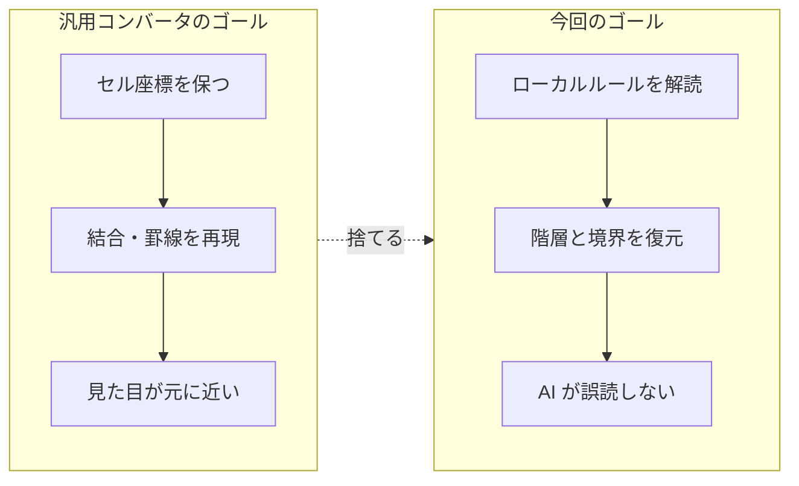

AI に社内ドキュメントを読ませようとしたとき、最初にぶつかるのはたいてい「**ファイル形式**」です。

設計書は `.xlsx`、マニュアルは `.docx`。どちらもそのままでは AI に渡せません。そこで `markitdown` のような汎用コンバータを入れて、Markdown にして、渡す。ここまでは誰でも思いつきます。

私もそうしました。そして、**うまくいきませんでした**。

この記事は変換ツールの紹介ではありません。ツール自体はいくらでもあります。書きたいのは、**既存ツールで駄目だったときに何をどう分析して、どういう変換ルールに着地したか**という、思考の道筋のほうです。

最終的に Python で Excel 用・Word 用の 2 本を書き、非エンジニアのメンバーにも exe で配りました。同じ悩み——「**AI に読ませたい社内資料が Office 形式で山ほどある**」——を持っている人に、判断の分かれ目ごと持って帰ってもらうのが狙いです。

:::message
この記事に出てくる設計書の例は、説明用に作った架空のものです。マーカー記号や列位置といった具体的な値は現場ごとに違うので、**「そういう約束事が存在する」という構造のほうを読み取ってください**。読み替えられる形で書きます。
:::

## まず、何が起きるかを見てもらう

言葉で説明するより早いので、先に結果を並べます。

### ① 変換前：Excel（いわゆる「方眼紙」）

列幅を狭く揃えたシートに、こんなふうに書かれているとします。左端が行番号、上が列です。

|  | A | B | C | D | E | F | G | H |
|---|---|---|---|---|---|---|---|---|
| **1** |  |  |  | Doc. Title |  | 版数 | 1.2 |  |
| **2** |  |  |  |  |  |  |  |  |
| **3** |  |  |  |  |  |  |  |  |
| **4** |  | ■ 検索機能 |  |  |  |  |  |  |
| **5** |  |  |  |  |  |  |  |  |
| **6** |  |  | 項番 | 項目名 |  | 区分 |  |  |
| **7** |  |  | 1 | 取引先コード |  | 入力 |  |  |
| **8** |  |  | 2 | 取引先名 |  | 表示 |  |  |
| **9** |  |  |  |  |  |  |  |  |
| **10** |  |  | 処理内容 |  |  |  |  |  |
| **11** |  |  |  | 入力値をチェックする |  |  |  |  |
| **12** |  |  |  |  | 未入力ならエラー |  |  |  |
| **13** |  |  |  |  | 桁数が不正ならエラー |  |  |  |
| **14** |  |  |  | 検索SQLを実行する |  |  |  |  |
| **15** |  |  |  |  |  |  |  |  |
| **16** |  | ※ 1000件を超える場合は警告 |  |  |  |  |  |  |

人間はこれを一目で読めます。**■ が見出し**で、**6〜8 行目が表**で、**11 行目と 14 行目が処理の親、12〜13 行目はその子**で、**16 行目は注意書き**。1 行目は帳票のヘッダーなので中身とは関係ない。

なぜ読めるかというと、**列位置と記号の約束事を知っているから**です。ここが後で効いてきます。

### ② 汎用コンバータに通すと

```markdown
| Unnamed: 0 | Unnamed: 1 | Unnamed: 2 | Unnamed: 3 | Unnamed: 4 | Unnamed: 5 | Unnamed: 6 | Unnamed: 7 |
| --- | --- | --- | --- | --- | --- | --- | --- |
| nan | nan | nan | Doc. Title | nan | 版数 | 1.2 | nan |
| nan | nan | nan | nan | nan | nan | nan | nan |
| nan | nan | nan | nan | nan | nan | nan | nan |
| nan | ■ 検索機能 | nan | nan | nan | nan | nan | nan |
| nan | nan | nan | nan | nan | nan | nan | nan |
| nan | nan | 項番 | 項目名 | nan | 区分 | nan | nan |
| nan | nan | 1 | 取引先コード | nan | 入力 | nan | nan |
| nan | nan | 2 | 取引先名 | nan | 表示 | nan | nan |
| nan | nan | nan | nan | nan | nan | nan | nan |
| nan | nan | 処理内容 | nan | nan | nan | nan | nan |
| nan | nan | nan | 入力値をチェックする | nan | nan | nan | nan |
| nan | nan | nan | nan | 未入力ならエラー | nan | nan | nan |
| nan | nan | nan | nan | 桁数が不正ならエラー | nan | nan | nan |
| nan | nan | nan | 検索SQLを実行する | nan | nan | nan | nan |
| nan | nan | nan | nan | nan | nan | nan | nan |
| nan | ※ 1000件を超える場合は警告 | nan | nan | nan | nan | nan | nan |
```

**間違ってはいません。**シートを表として忠実に読めば、確かにこうなります。

ただ、出力されたセルは 16 行 × 8 列 = **128 個**、そのうち中身があるのは **19 個**です。残り 85% は `nan` と `|` で埋まっています。

そして深刻なのは量ではなく、**消えたもの**のほうです。

- 「■ が見出し」という情報 → ただのセルの文字列になった
- 「6〜8 行目が 1 つの表」という境界 → 上下の文章と同じ 1 枚の表に溶けた
- 「12〜13 行目は 11 行目の子」という階層 → 完全に消えた
- 「16 行目は注意書き」 → 表の最終行になった

この状態で「検索機能の前提条件は？」と AI に聞くと、**隣のセクションの内容を混ぜた、それらしい嘘**が返ってきます。境界が消えているので、AI 側には区別のしようがありません。

### ③ 専用の変換ルールを書いた後

同じ Excel から、こうなりました。

```markdown
### 検索機能

| 項番 | 項目名 | 区分 |
|---|---|---|
| 1 | 取引先コード | 入力 |
| 2 | 取引先名 | 表示 |

#### 処理内容

- 入力値をチェックする
    - 未入力ならエラー
    - 桁数が不正ならエラー
- 検索SQLを実行する

> ※ 1000件を超える場合は警告
```

**情報は 1 つも増えていません。**帳票ヘッダーと空セルを捨てて、残りを元の意味どおりに並べ直しただけです。

でも AI から見ると別物になります。見出しの階層があり、表の範囲がはっきりし、処理の親子関係が残り、注意書きが本文と区別されている。しかも短い。

この ② → ③ をどう設計したか、というのがこの記事の中身です。

## 分かれ目：ここで「プロンプトで頑張る」に行かない

② の出力を見た時点で、選択肢は 3 つありました。

| 選択肢 | やること | 判断 |
|---|---|---|
| A. プロンプトで補正 | 「`nan` は無視して」「4 列目が項目名です」と毎回説明する | ❌ 説明コストが永久に続く。ファイルが変わると崩れる |
| B. もっと高精度な汎用ツールを探す | 別のコンバータ、LLM ベースの変換サービスを試す | ❌ ゴールが違うので、精度を上げても解決しない |
| C. このフォーマット専用に書く | 自分たちのテンプレートの構造を解析して、専用ルールを作る | ⭕ 採用 |

B を捨てた理由が、この記事で一番言いたいところです。

### 汎用コンバータは「見た目の再現」を目指している。欲しかったのは「意味の再現」だった

汎用の Office → Markdown コンバータが暗黙に置いている前提は、こうです。

> **1 シート = 1 つの表である。** セルの位置は、行と列の座標である。

そして評価基準は「**元の見た目をどれだけ再現できたか**」です。セルの位置関係が保たれていれば成功。

ところが、① の Excel は**表ではありません**。**方眼紙に描かれたレイアウト**です。

- 列幅を狭く揃えて、セルを「ドット」として使う
- インデントは、スペースではなく**「右の列から書き始める」**ことで表現する
- 表の範囲は、罫線や記号で人間に伝えている
- 1 シートの中に、見出し・表・処理手順・注意書きが縦に並んでいる

人間がこれを読めるのは、**座標ではなくローカルルールを知っているから**です。「この記号で始まる行は見出し」「基準の列より右から書いてあればネストしている」という、そのテンプレート固有の約束事。

汎用ツールは、この約束事を知りません。知らないまま座標を忠実に再現するので、**約束事という情報だけがきれいに消えます**。そして消えたそれこそが、AI が構造を理解するために必要なものでした。

だから、より高精度な汎用ツールを探しても解決しません。**汎用であること自体が、この問題では欠点**だからです。

逆に言うと、こうなります。

> **テンプレートが統一されている**＝**ローカルルールが存在する**＝**それはプログラムで読める**。

「全社で同じ様式を使え」という、普段は面倒に感じる制約が、ここでは**一番の資産**でした。専用ツールが成立する条件がそろっています。

## 思想：「AI が読む Markdown」を先に定義する

C を選んだ時点で、次の問いが立ちます。**では、何に変換したら正解なのか。**

ここで意識的に切り替えました。ゴールは「**人が読んで元の設計書に見える Markdown**」ではなく、「**AI が誤解なく読める Markdown**」である、と。

この 2 つは似ているようで、要求が違います。整理するとこうなりました。

| # | AI が読める Markdown の条件 | 元の Excel での表現 | 外すとどうなるか |
|---|---|---|---|
| 1 | **階層がテキストで表現されている** | 書き始めの列位置 | 親子関係が消え、全部が並列に見える |
| 2 | **1 トークンも無駄がない** | 空セル・装飾・帳票ヘッダー | 情報密度が落ち、コンテキストに入らない |
| 3 | **固有名詞が識別できる** | 括弧で囲む慣習 | テーブル名や画面名が地の文に埋もれる |
| 4 | **ブロックの境界が明示されている** | 罫線・記号・空行 | 隣のセクションの内容を混ぜて答える |
| 5 | **レイアウト情報は捨ててよい** | セル結合・色・フォント | （捨ててよい。AI は見た目を必要としない） |

**5 番目が効きました。**人間向けの変換なら絶対に捨てられない情報を、堂々と捨てられる。セル結合も、色も、行の高さも、全部無視していい。逆に、見た目としては何の意味もない記号 1 文字を、**最重要の構造情報として扱う**。

優先順位が、人間向けの変換と真逆になります。



ここから先は、この思想を手順に落とした話です。

## 手順 1：シートを「役割」で分類する

最初にやったのは、**全シートを役割で仕分けること**でした。設計書を数十ファイル開いて、シート名を全部書き出す。すると、シートは大きく 3 種類しかないと分かりました。

| 種類 | 中身 | どう変換すべきか |
|---|---|---|
| **構造化された表** | 項目定義、I/F 定義など | Markdown テーブル |
| **自由記述の文章** | 表紙、補足、レビューメモなど | テキストとして抽出（**表にしない**） |
| **独自構造を持つ** | 処理仕様、機能概要など | **専用パーサが必要** |

コードでは、シート名のリストで分岐します。泥臭いですが、これが一番確実でした。

```python
# 表として解釈せず、テキストとして流し込むシート
TEXT_ONLY_SHEETS = [
    "表紙", "補足", "レビューメモ", "画面レイアウト", ...
]
```

**画面レイアウトのシートを、わざとテキスト扱いにしている**のがポイントです。ここには画面の絵がセルで描かれていて、位置に意味があります。でも AI に渡すのに絵の配置は要りません。**ラベルの文字列さえ拾えれば十分**なので、表にしようとせず、テキストとして流し込んでコードブロックに入れました。

「全シートを同じロジックで処理する」のをやめたのが、最初の前進です。汎用ツールが絶対にできないことでもあります。

## 手順 2：自分が構造を読み取っている手がかりを、全部書き出す

これが一番時間をかけた工程で、**一番移植性が高い工程**です。

やることは単純で、設計書を開いて、**自分がどこを見て構造を判断しているかを実況する**。無意識にやっていることを言語化します。

① の例だと、こうなります。

- 行頭の記号（`■` `●` `○` など）がある行は見出し。**記号の種類で階層が違う**
- 表の範囲は、罫線か、特定の文字が置かれた行で区切られている
- **表のヘッダーは 2 行にまたがることがある**（上下のセルで 1 つの見出し）
- **基準の列より右から書き始めていたら、その分だけネストしている**
- 行頭が `※` なら注意書き
- 括弧で囲まれた語は、テーブル名・画面名・関数名などの識別子
- 上の数行は帳票ヘッダーで、中身と関係ない
- 行頭が `・` なら箇条書き

書き出してみて驚いたのは、**これが全部「見た目」ではなく「記号と位置の約束」だった**ことです。色や罫線の太さで判断している項目は、1 つもありませんでした。つまり**全部プログラムで判定できます**。

:::message
ここが読者の現場で一番変わる部分です。記号は違うかもしれないし、基準列は違うかもしれない。**でも「何らかの約束事がある」ことはほぼ確実**です。テンプレートが統一されているなら、必ずあります。まずそれを洗い出してください。ここが終われば、残りは作業です。
:::

## 手順 3：手がかりと Markdown 記法の対応表を作る

手順 2 のリストができたら、右側に「Markdown で何に対応するか」を書き足します。これが**変換ツールの仕様書そのもの**になります。

| Excel 側の手がかり | Markdown 側の表現 | 狙い |
|---|---|---|
| 見出し記号で始まる行 | `###` / `####` | 階層の明示 |
| 表の開始マーカー 〜 終了マーカー | Markdown テーブル | **表の境界を明示** |
| マーカーの外側の行 | ` ``` ` で囲んだテキストブロック | 表と地の文を**混ぜない** |
| 基準列からの相対位置 | 半角スペース 4 つ × N のインデント | **階層の復元** |
| `※` で始まる行 | 引用（`>`） | 本文と区別する |
| 括弧で囲まれた語 | `` `識別子` `` | 固有名詞の明示 |
| 縦に結合されたヘッダー | `<br>` で連結して 1 つのヘッダーに | 列数を合わせる |
| セル内改行 | `<br>` | **テーブルを壊さない** |
| 帳票ヘッダー行 | （破棄） | ノイズ削減 |
| セル結合・色・罫線 | （破棄） | ノイズ削減 |

ここまで来れば、実装は**この表をコードに翻訳する作業**です。設計の難所は全部、手順 2 と手順 3 にあります。

## 手順 4：対応表をコードに落とす

実装から、判断が出ている部分だけ抜き出します。

### テンプレート依存の値は、1 か所にまとめる

最初にこれをやっておくと後が楽です。**現場ごとに変わる値だけを、ファイルの先頭に集める**。

```python
# --- テンプレート固有の定義（移植するときはここだけ書き換える）---
MARK_HEADER_START = "…"   # 表ヘッダの開始を示す記号
MARK_HEADER_END   = "…"   # 表ヘッダの終了
MARK_DATA_END     = "…"   # 表データの終了
BASE_INDENT_COL   = 17    # 処理記述の基準列。これより右＝ネストしている
SKIP_HEADER_ROWS  = 3     # 各シート上部の帳票ヘッダー行数
```

ロジック本体はこの定数しか見ないようにしておくと、**別部署の別テンプレートに移植するときに、この 5 行を書き換えるだけで済みます**。実際そうなりました。

### 階層の復元 ── 「列位置 = ネストの深さ」

一番効いたのがここです。方眼紙では、インデントが**書き始める列**で表現されています。これを Markdown のインデントに戻します。

```python
# 行の中で最初に中身があるセルの列番号を取る
first_col = next((i for i, v in enumerate(row) if v), None)

# 基準列より右にある分だけ、ネストが深い
indent_level = max(0, first_col - BASE_INDENT_COL)
indent = "    " * indent_level

line = " ".join(row[first_col:]).strip()
if line.startswith("・"):          # 箇条書き記号を Markdown に寄せる
    line = "- " + line[1:].strip()

md.write(f"{indent}{line}\n")
```

たった数行ですが、ここで**元の設計書にあった処理の入れ子構造が復活します**。① の例で言えば、12〜13 行目が 11 行目の子として出るようになる部分です。汎用ツールの出力では完全に失われていた情報でした。

「列番号のハードコードでは？」——その通りで、テンプレートが変わったら直す必要があります。**それでいい**と判断しました。様式が変わる頻度は年単位です。汎用性のために階層を諦めるほうが、はるかに高くつきます。

### 表の切り出し ── マーカーで挟み、残りは再帰する

1 シートの中に「見出し → 表 → 注意書き → また表」が縦に並んでいます。これを 1 枚の巨大な表にしてしまうのが、汎用ツールの敗因でした。

そこで、マーカーで表を切り出し、**表の後ろに残った部分を同じ関数に再帰的に渡す**構造にしました。

```python
def process_block(rows, md):
    start = find_marker(rows, MARK_HEADER_START)

    if start is None:
        # マーカーがない = 表ではない。まるごとテキストとして出す
        write_text_block(rows, md)
        return

    write_text_block(rows[:start], md)        # ① 表より前 → テキスト
    end = write_table(rows, start, md)        # ② 表 → Markdown テーブル

    if end is not None and end + 1 < len(rows):
        process_block(rows[end + 1:], md)     # ③ 残り → 同じ処理を再帰
```

これで「1 シート = 複数ブロック」が自然に表現できました。出力側では表が Markdown テーブル、地の文がテキストブロックと、**見た目でも境界がはっきり分かれます**。AI が隣のセクションの内容を混ぜてくる事故は、ここで大きく減りました。

### セル内改行 ── `<br>` にしないとテーブルが壊れる

地味ですが必須です。Excel のセル内改行（`Alt` + `Enter`）をそのまま出すと、Markdown テーブルの行が途中で切れて崩壊します。

```python
def clean_text(value):
    if pd.isna(value):
        return ""
    return str(value).strip().replace("\n", "<br>")
```

「AI 向けなのに HTML タグ？」と一瞬思いましたが、**AI は `<br>` を改行として正しく読みます**。それよりテーブル構造が壊れるほうが致命的です。ここは割り切りました。

### 固有名詞をコードにする

`【伝票テーブル】` のような記法を `` `伝票テーブル` `` に変換しています。

```python
def format_as_code(text):
    # 【】[]「」『』（）で囲まれた語を `コード` にする
    return re.sub(r"[【\[「『（]([^】\]」』）]+)[】\]」』）]", r"`\1`", text)
```

思想の表にあった「条件 3：固有名詞が識別できる」への対応です。**「このテーブルを参照している機能を全部挙げて」と聞いたときの拾い漏れが減ります。**

副作用として、ただの強調で使われた括弧までコードになります。人間向けなら直すところですが、AI 向けなら実害がないので放置しました。**ゴールが違えば、許容できるノイズも変わる**という例です。

### 静かにデータが消えるバグ ── 同名ヘッダー

これは踏んでから気づきました。設計書には「説明」「説明」のように**同じ名前の列が複数ある**ことがあります。列名をキーにして DataFrame を作ると、**後勝ちで片方のデータが消えます**。

なので、いったん**列インデックスをキーにして構築し、列名は最後に付ける**。

```python
df = pd.DataFrame({i: columns[i] for i in range(num_cols)})  # キーは列番号
df.columns = headers                                          # 名前は最後に
```

**データが欠けるバグはエラーを出しません。**静かに列が 1 本消えるだけです。後述する検査を入れていなければ、気づかないままだったと思います。

### その他、細かいが効いた判断

- **数式ではなく値を読む**（`load_workbook(path, data_only=True)`）。AI に `=VLOOKUP(...)` を読ませても意味がない
- **帳票ヘッダーは最初から読まない**。上 N 行をスキップして始める
- **`~$` で始まるファイルをスキップ**。Excel の一時ファイルを掴んで落ちるのを防ぐ
- **出力先が入力先の配下にある場合は走査対象から外す**。自分の出力を食って無限に増える事故を防ぐ

## Word は、まったく別の難しさだった

`.docx` のほうは方眼紙問題がない代わりに、**XML の罠**が集中していました。python-docx で書きましたが、`Document.paragraphs` を素直に回すだけでは足りず、結局 XML を直接歩くことになります。

踏んだものを並べます。どれも**特定の会社の話ではなく、.docx という形式そのものの話**です。

**1. 同じテキストが 2 回出る**

図形やテキストボックスを含む文書には、新しい Word 用（`mc:Choice`）と古い Word 用（`mc:Fallback`）が**同じ内容で両方入っています**。素直に全部拾うと、同じ文が重複します。

```python
if tag == f"{{{MC_NS}}}AlternateContent":
    choice = child.find(f"{{{MC_NS}}}Choice")
    if choice is not None:
        yield from _iter_runs(choice)   # Choice だけ見る
elif tag in (WPS_TXBX, W_TXBX_CONTENT):
    pass                                 # テキストボックス内はスキップ
```

**2. 円記号がバックスラッシュとして保存されている**

日本語 Word で入力した `¥` は、内部的には ASCII の `\`（U+005C）です。そのまま Markdown に出すと**エスケープ文字として解釈されて消えます**。金額表記が壊れるので、明示的に戻します。

```python
def _normalize_text(text: str) -> str:
    return text.replace("\x5c", "\xa5")   # U+005C → U+00A5
```

**3. 結合セルで列がずれる**

横結合（`w:gridSpan`）は**その分だけ空セルを足して列数を合わせる**、縦結合の 2 行目以降（`w:vMerge` が `continue`）は**空文字を入れる**。これをやらないと、以降の行が全部 1 列ずつずれます。

```python
span = int(span_el.get(qn("w:val"))) if span_el is not None else 1
row_cells.append(text)
for _ in range(span - 1):
    row_cells.append("")      # 横結合の分を空セルで埋める
```

**4. 表の中に表が入っている**

注意書きのボックスが、入れ子のテーブルで作られていることがあります。セルの中身を「前のテキスト / 入れ子テーブル / 後ろのテキスト」に分解して、入れ子部分は**テーブル変換関数を再帰呼び出し**してセル内に埋め込みました。Excel 側と同じ「再帰」の発想です。

**5. 見出しスタイルの ID が文書ごとに違う**

`見出し 1` の実体が、文書によって別の ID だったりします。日本語環境の Word ではよくあることです。マッピングを地道に作りました。

```python
HEADING_STYLES = {"1": 1, "2": 2, "3": 3, "a3": 1, "a5": 1}
```

**6. 画像を含む `run` はスキップする**

画像は Markdown に持っていけないので捨てます。ただし `run` ごと捨てるので、**同じ `run` に入っているテキストまで消えない**よう判定位置に注意が要ります。

Excel の難しさが「**レイアウトに埋め込まれた意味を読む**」ことだったのに対して、Word は「**形式の仕様を知らないと静かに壊れる**」でした。前者は設計の問題、後者は知識の問題です。

## 手順 5：「落ちていないこと」を自動で検査する

ここが、**一番やってよかった**部分です。

変換ツールの怖いところは、**失敗が例外にならない**ことです。列が 1 本消えても、注意書きが 1 つ落ちても、プログラムは正常終了します。そして AI は、落ちた内容について**何も言わずに、残った情報だけで答えます**。

数十ファイルを目視チェックするのは無理です。なので、検査用のスクリプトを別に書きました。

考え方はとても単純です。

> **元の文書から 10 文字以上の文を全部抜き出し、各文の先頭 20 文字が変換後の Markdown に含まれているかを調べる。**

```python
missing = []
for sent in extract_sentences(src):
    if len(sent) >= 10 and sent[:20] not in md_plain:
        missing.append(sent)

print(f"元の文章数: {len(sentences)} 件 / 未検出: {len(missing)} 件")
```

比較の前に、Markdown 側からは記法を剥がしてプレーンテキストにしておきます。

```python
md_plain = re.sub(r"\|", " ", content)                            # テーブル記号
md_plain = re.sub(r"^#+\s*", "", md_plain, flags=re.MULTILINE)    # 見出し
md_plain = re.sub(r"\*+([^*]+)\*+", r"\1", md_plain)              # 強調
```

雑な検査です。文の途中に `<br>` が入れば検出できませんし、順序も検証していません。

それでも、**「落ちている」ことだけは確実に分かります**。実際、これで見つけたのが

- テキストボックス内の文章が丸ごと消えていた
- 同じ文が 2 回出力されていた
- 円記号が消えて金額表記が壊れていた

でした。どれも目視では絶対に見つからなかったはずです。

:::message alert
専用の変換ツールを書くなら、**検査スクリプトは必ずセットで書いてください**。変換ロジックより先に書いてもいいくらいです。「動いた」と「落ちていない」はまったく別のことで、AI に読ませる用途では後者のほうが重要です。**落ちた情報は、AI の回答の中では最初から存在しなかったことになります。**
:::

## 配る ── GUI にして exe にした

最後の一押しです。ツールは書きましたが、**使うのは自分だけではありません**。

設計書を一番たくさん持っているのは、Python が入っていない PC を使っている業務メンバーです。「clone して `pip install` して……」と説明した時点で、このツールは使われなくなります。

なので `tkinter` で最小限の GUI（入力フォルダ・出力フォルダ・実行ボタン・ログ欄）を付けて、1 ファイルの exe にしました。

```bash
python -m PyInstaller --onefile --noconsole --name toMarkdown \
  --icon="icon.ico" --add-data "icon.ico;." toMarkdown.py
```

- `--onefile` ── exe 1 個。**配布が「このファイルを渡す」だけになる**
- `--noconsole` ── 黒い画面が出ない。これだけで「怪しいツール」感が消えます
- `--add-data` ── アイコンを exe 内部に同梱（Windows は区切りが `;`）

ログ欄を付けたのも意図的です。フォルダ配下を再帰的に処理するので、**どのファイルで失敗したかが画面に出ていないと、誰も報告してくれません**。1 ファイルの変換に失敗しても全体は止めず、失敗件数だけ最後に出すようにしています。

```python
except Exception as e:
    failed_count += 1
    log(f"  -> エラー: {name} の変換に失敗しました。理由: {e}")
```

**50 ファイル流して 1 つで落ちて全部やり直し**、が一番やる気を削ぐので、ここは最初から決めていました。

## 実際どうだったか

変換後の Markdown が手に入ってから、できるようになったことです。

**横断的な質問ができるようになった。** 「このテーブルを更新している機能を全部挙げて」のような質問は、設計書が Excel のままでは人力の grep でした。Markdown になった瞬間に AI の仕事になります。識別子がコード表記になっているので、拾い漏れも減りました。

**影響調査の初動が変わった。** 「この項目の仕様を変えたら、どの機能に影響するか」をまず AI に洗い出させて、人間はその検証から始められます。ゼロから設計書を開いて回るのと、候補リストを潰していくのとでは、立ち上がりが違います。

**レビューの下ごしらえに使える。** レビュー前に AI に読ませて、記載漏れや矛盾の候補を出させる。当たり外れはありますが、**人間が気づきにくいタイプの漏れ**を拾ってくることがあります。

**マニュアルの Q&A ができる。** 章立てが見出しとして残っているので、「この処理をやり直すには？」といった質問に、**どの章の話かも一緒に**返ってきます。

数値での効果測定はしていないので、盛った数字は書きません。ただ、**Excel のまま AI に渡していた期間には一度も成立しなかった使い方**が、変換を挟んだだけで成立するようになった、というのが実感です。

## 同じ悩みを持つ人へ：持って帰れるチェックリスト

最後に、この記事の内容を**あなたの現場に移植する手順**としてまとめます。コードより、こちらのほうが持ち帰る価値があるはずです。

**1. まず汎用ツールを試す。そして出力を必ず読む。**
いきなり自作しないでください。汎用ツールで足りるならそれが一番です。ただし「変換できた」で止めず、**出力を最後まで読んでください**。判断材料はそこにしかありません。

**2. 駄目だったとき、「精度が足りない」のか「ゴールが違う」のかを切り分ける。**
惜しい出力なら精度の問題で、より良いツールを探す価値があります。**構造そのものが消えている**なら、ゴールが違います。後者なら、どれだけツールを探しても解決しません。

**3. 「AI が読めるとはどういう状態か」を先に言葉にする。**
変換先を定義しないまま作り始めると、無意識に「元の見た目に近づける」方向へ流れます。この記事の 5 条件（階層・密度・識別子・境界・レイアウトは捨てる）は、そのまま使えるはずです。

**4. 自分が構造を読み取っている手がかりを、全部書き出す。**
ここが本丸です。記号、列位置、空行、書き出し位置。「無意識にやっていること」を言語化すると、**その大半がプログラムで判定できる**と分かります。

**5. 手がかりと Markdown 記法の対応表を作る。**
これが仕様書になります。ここまで作れば、実装は翻訳作業です。

**6. テンプレート依存の値は 1 か所に集め、そのうえでハードコードを恐れない。**
汎用性を捨てる代わりに階層情報を手に入れる、という取引です。定数を先頭にまとめておけば、別テンプレートへの移植もそこだけで済みます。

**7. 検査スクリプトを必ずセットで書く。**
変換の失敗は例外になりません。**落ちた情報は、AI の回答の中では最初から存在しなかったことになります。**「元の文の先頭 N 文字が出力に含まれるか」という雑な検査で十分効きます。

**8. 自分以外が使える形にする。**
GUI と exe 化にかかるのは半日ですが、これがないと「ドキュメントを一番持っている人」に届きません。

---

この 8 つのうち、コードを書くのは 5 番以降だけです。**1〜4 が終わった時点で、勝負はだいたい決まっています。**

既存ツールで済むなら、それが一番です。でも「出力を見たら構造が消えていた」なら、それは精度の問題ではありません。**あなたの現場のローカルルールという、汎用ツールが原理的に知り得ない情報**が落ちているだけです。そしてそのルールは、たいてい 1 日かけて書き出せば、ちゃんと形になります。
