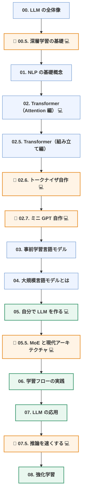

「Transformer の解説記事は山ほどあるのに、読み終わっても自分では何も作れない」——
この状態を終わらせるための日本語教材を書きました。

📖 **[気軽にはじめる LLM 自作入門](https://zenn.dev/thirtypower/books/kgr-llm-guide)**（無料・全18章）
💻 コードは GitHub： https://github.com/thirtypower/kgr-llm

本編8章＋補講5本＋付録3本。**必要な前提知識は Python の文法だけ**で、
行列の掛け算も PyTorch も深層学習も、教材の中でゼロから説明しています。

---

## 何が書いてあるか

ゴールは「**LLM の原理を理解し、自分の手で小さな LLM を一つ作りきる**」ことです。
読み物で終わらせず、最終的に 215M パラメータのモデルを事前学習するところまで行きます。



🔰 ＝ 補講　／　💻 ＝ 対応する実行可能コードあり

---

## 他の解説と違うようにした3点

### 1. 「読む」と「動かす」を必ずセットにした

各章に、そのまま実行できるスクリプトを対応させています。
そして**コア教材は全部 CPU で数分以内に終わります**。GPU は要りません。

```bash
python 01_tensor_autograd.py        # 「学習する」を最小の例で最後まで見る
python 02_attention_step_by_step.py # Attention の途中の行列を全部表示する
python 03_bpe_tokenizer.py          # BPE をゼロから（標準ライブラリのみ）
python 04_minigpt.py                # GPT を自作して実際に学習させる（CPU で3〜5分）
python 06_pretrain.py --demo        # 事前学習パイプライン完全版（CPU で約3分）
```

ポイントは、**検証に「正解が分かっている人工コーパス」を使っている**ことです。
文法規則を自分で決めたデータなので、生成文を機械的に採点できます。
これにより「**学習不足なのか実装バグなのか**」を数値で切り分けられます。
本物の Wikipedia で学習していたら、この判断は絶対にできません。

`python 04_minigpt.py --sanity` は学習せずに自己検査だけを走らせます。
「初期 loss ≈ ln(語彙数)」「未来を見ていないか」「1バッチを暗記できるか」など、
実務でそのまま使えるバグ検出手順を6項目にまとめました。

### 2. 「よく言われているが一次資料に照らすと不正確」な説明を明示的に訂正した

これが一番書きたかった部分かもしれません。抜粋します。

| よく見る説明 | 実際 |
|---|---|
| 「`8x7B` は 7B × 8 = 56B」 | **46.7B**。MoE 化されるのは FFN だけで、Attention と Embedding は共有される |
| 「MoE は軽い」 | **計算量は軽いが、メモリは重い**（全専門家を常駐させる必要がある） |
| 「GQA / MLA は計算量を削減する」 | 削減するのは**保存量（KV キャッシュ）**。計算量は変わらない |
| 「Flash Attention は計算量を減らす」 | 減らすのは**メモリ移動**。計算量は T² のままで、出力は素朴な実装と一致する（近似ではない） |
| 「QLoRA は 4bit だから速い」 | **速くならない**。bf16 に戻す処理が挟まるぶん、bf16 の LoRA より遅い |
| 「RoPE は長文にそのまま外挿できる」 | 素の RoPE は学習長を超えると**崩れる**。PI / NTK-aware / YaRN が必須 |
| 「Chinchilla の20倍が最適」 | 学習コストだけを最小にする点。**推論コストを含めると、はるかに多く学習した方が得** |

全リストと一次資料へのリンクは
[参考文献の章](https://zenn.dev/thirtypower/books/kgr-llm-guide/viewer/appendix-references)にあります。
**他の解説記事を読むときのチェックリストとしても使えます。**

### 3. 教科書的な構成と「2026年の実物」とのギャップを埋めた

Transformer の解説は 2017年の論文で止まりがちですが、実物はだいぶ違います。
その差分だけを取り出した補講を2本足しました。

- **[05.5章 MoE と現代アーキテクチャ](https://zenn.dev/thirtypower/books/kgr-llm-guide/viewer/055-moe-modern-arch)**
  ——「671B / 活性 37B / MLA / 128K」のような**構成表を読めるようになる**章
- **[07.5章 推論を速くする](https://zenn.dev/thirtypower/books/kgr-llm-guide/viewer/075-fast-inference)**
  ——「LLM が遅い」と言われたとき **prefill と decode のどちらの問題か切り分けられる**ようになる章

すでに実務で LLM を使っている人には、この2章は単独でも読む価値があると思います。

---

## 初心者レビュー34件を潰した

前提知識ゼロの状態で全章を通読し、「読みが止まった・モヤモヤが残った・矛盾に見えた」箇所を
34件記録して、全部つぶしました。たとえばこういうものです。

- 「層」という言葉が説明なしに使われている → **`W x + b` 1枚が層である**、から書き直し
- `nn.Module` / `forward` / `model(x)` が未説明のままコードが出てくる → PyTorch の作法4点を明記
- 「√d_k で割る」の理由が「分散が次元に比例するから」で止まっている → **独立な和の分散**から説明
- RoPE の「回転角の差が残る」が腑に落ちない → **電卓で追える2次元の例**を追加

---

## こういう人に向いています

| あなたの状態 | |
|---|---|
| ChatGPT は使うが、中身は完全にブラックボックス | ◎ 00章から |
| 「損失」「勾配」「Adam」を聞いたことがない | ◎ 00.5章が全部説明します |
| Transformer の記事を読んだが自分では書けない | ◎ 02.7章で GPT-2 を書いて動かします |
| 実務で LLM を使っているが構成表が読めない | ◎ 05.5章・07.5章だけ読んでください |

逆に、**すでに事前学習を回したことがある人には物足りない**はずです。
その場合は 05.5章と 07.5章だけ拾い読みするのがおすすめです。

---

## ライセンス

CC BY-SA 4.0 です。転載・改変・再配布・商用利用すべて可能で、
条件は「出典を表示する」「改変して再配布する場合は同じライセンスで公開する」の2つだけです。

内容の誤りを見つけたら
[GitHub の Issue](https://github.com/thirtypower/kgr-llm/issues) で教えてもらえると助かります。
この教材の記述にも間違いはありえますし、**論文にあたる癖を付けた人だけが、
情報が古くなった後も自力で更新できます**——というのは本編にも書いたことです。

📖 **[気軽にはじめる LLM 自作入門 を読む](https://zenn.dev/thirtypower/books/kgr-llm-guide)**
