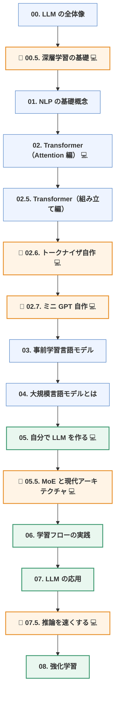

「Transformer の解説記事は山ほどあるのに、読み終わっても自分では何も作れない」——
この状態を終わらせるための日本語教材を書きました。

📖 **[気軽にはじめる LLM 自作入門](https://zenn.dev/thirtypower/books/kgr-llm-guide)**（無料・全18章）
💻 コードは GitHub： https://github.com/thirtypower/kgr-llm

本編8章＋補講5本＋付録3本。**必要な前提知識は Python の文法だけ**で、
行列の掛け算も PyTorch も深層学習も、教材の中でゼロから説明しています。

---

## まず、この7つに即答できますか

左は日本語の解説でよく見る説明、右が一次資料に当たった結果です。

| よく見る説明 | 実際 |
|---|---|
| 「`8x7B` は 7B × 8 = 56B」 | **46.7B**。MoE 化されるのは FFN だけで、Attention と Embedding は共有される |
| 「MoE は軽い」 | **計算量は軽いが、メモリは重い**（全専門家を常駐させる必要がある） |
| 「GQA / MLA は計算量を削減する」 | 削減するのは**保存量（KV キャッシュ）**。計算量は変わらない |
| 「Flash Attention は計算量を減らす」 | 減らすのは**メモリ移動**。計算量は T² のままで、出力は素朴な実装と一致する（近似ではない） |
| 「QLoRA は 4bit だから速い」 | **速くならない**。bf16 に戻す処理が挟まるぶん、bf16 の LoRA より遅い |
| 「RoPE は長文にそのまま外挿できる」 | 素の RoPE は学習長を超えると**崩れる**。PI / NTK-aware / YaRN が必須 |
| 「Chinchilla の20倍が最適」 | 学習コストだけを最小にする点。**推論コストを含めると、はるかに多く学習した方が得** |

全部「よく言われているが、一次資料に照らすと不正確」な説明です。
この教材は、こういう箇所を**片っ端から訂正しながら**進みます。

全リストと一次資料へのリンクは
[参考文献の章](https://zenn.dev/thirtypower/books/kgr-llm-guide/viewer/appendix-references)にあります。
**他の解説記事を読むときのチェックリストとしても使えます。**

---

## 動かすと、こうなります

読み物ではないので、先に実物を出します。以下は教材の 02.7 章で自作する
ミニ GPT（GPT-2 のミニチュア）の、**実際の出力をそのまま貼ったもの**です。

### 1. 学習を始める前に、実装のバグを潰す

```console
$ python 04_minigpt.py --sanity

  [OK] 出力の形が (B, T, vocab_size)        (2, 16, 400)
  [OK] 初期 loss ≈ ln(語彙数)               loss=6.031, ln(V)=5.991
  [OK] 未来のトークンが過去に影響しない      最大差=0.00e+00
  [OK] 全パラメータに勾配が届く
  [OK] KV キャッシュ生成 == 一括 forward     最大差=2.38e-07
  [OK] 1 バッチを暗記できる（loss→0）        loss=0.0194

  総合判定: すべて OK
```

学習を1ステップも回さずに、実装が正しいかを6項目で確認します。
2 が通れば損失計算と初期化が正しく、3 が通れば因果マスクが正しく、
6 が通れば勾配が流れている。**この順番を守らないと「データが悪いのかコードが悪いのか」で何日も溶かします。**

### 2. 学習させる

```console
    step        lr    train      val   val ppl      経過
       0  4.00e-05   5.8296   5.8293    340.11    0.2s
     150  2.98e-03   0.7005   0.7000      2.01    2.4s
     450  2.56e-03   0.6933   0.6909      2.00    6.7s
     900  1.32e-03   0.6893   0.6904      1.99   13.1s
    1499  3.00e-04   0.6853   0.6867      1.99   21.7s

  最終 val loss   = 0.6867
  理論下限        = 0.6827
  差              = +0.0041
```

注目してほしいのは**理論下限**の行です。このコーパスは文法規則を自分で決めたので、
「このデータから学べる情報量の限界」を先に計算できます。
だから「loss がこれ以上下がらない」がバグではなく**学び切った状態**だと断言できます。
Scaling Law が生まれる素朴な理由が、ここで数字として出ます。

### 3. 生成させて、機械的に採点する

```console
  「猫が」   → 「猫が魚を食べる。」
  「太郎は」 → 「太郎は店へ行く。」
  「公園に」 → 「公園に狐がいる。」

  生成した文: 421 文中 416 文が文法的に正しい  →  正答率 98.8%

  「猫が」の次に来るトークンの予測 上位 8:
     18.2%  '草'    #########
     17.5%  '肉'    ########
     16.6%  '魚'    ########
     16.2%  '米'    ########
     15.9%  '豆'    #######
     13.3%  '菓子'  ######
      0.4%  '鳥'
      0.4%  '兎'
```

最後の分布が、この教材で一番見てほしい画面です。
**モデルは「次のトークンの確率分布」しか出していません。**
1 個サンプリングして末尾に足し、また入力に戻す。これだけで文章が生まれます。
ChatGPT が内部でやっているのも、完全にこれと同じです。

---

## 何が書いてあるか

ゴールは「**LLM の原理を理解し、自分の手で小さな LLM を一つ作りきる**」ことです。
最終的には、Wikipedia を使って 215M パラメータのモデルを事前学習するところまで行きます。



🔰 ＝ 補講　／　💻 ＝ 対応する実行可能コードあり

---

## 他の解説と違うようにした3点

### 1. 「読む」と「動かす」を必ずセットにした

各章に、そのまま実行できるスクリプトを対応させています。

```bash
python 01_tensor_autograd.py        # 「学習する」を最小の例で最後まで見る
python 02_attention_step_by_step.py # Attention の途中の行列を全部表示する
python 03_bpe_tokenizer.py          # BPE をゼロから（標準ライブラリのみ）
python 04_minigpt.py                # GPT を自作して実際に学習させる
python 06_pretrain.py --demo        # 事前学習パイプライン完全版
```

そして**学習まで含めて、ここまで全部 CPU で完走します**。GPU は要りません
（GPU が要るのは、最後の 215M フル版 `06_pretrain.py --full` だけです）。

設計上のポイントは、**検証に「正解が分かっている人工コーパス」を使っている**ことです。
文法規則を自分で決めたデータなので、生成文を機械的に採点できます。
さきほどの「正答率 98.8%」と「理論下限 0.6827」は、これがあって初めて出せる数字です。
これにより「**学習不足なのか実装バグなのか**」を数値で切り分けられます。
本物の Wikipedia で学習していたら、この判断は絶対にできません。

### 2. 「よく言われているが一次資料に照らすと不正確」な説明を明示的に訂正した

冒頭の表がその実物です。これが一番書きたかった部分かもしれません。

「そう言われているから」で通っている説明を、論文に当たって一つずつ潰しました。
訂正は本編の各章に埋め込んであり、根拠の一次資料は全部リンクしてあります。

### 3. 教科書的な構成と「2026年の実物」とのギャップを埋めた

Transformer の解説は 2017年の論文で止まりがちですが、実物はだいぶ違います。
その差分だけを取り出した補講を2本足しました。

- **[05.5章 MoE と現代アーキテクチャ](https://zenn.dev/thirtypower/books/kgr-llm-guide/viewer/055-moe-modern-arch)**
  ——「671B / 活性 37B / MLA / 128K」のような**構成表を読めるようになる**章
- **[07.5章 推論を速くする](https://zenn.dev/thirtypower/books/kgr-llm-guide/viewer/075-fast-inference)**
  ——「LLM が遅い」と言われたとき **prefill と decode のどちらの問題か切り分けられる**ようになる章

すでに実務で LLM を使っている人には、この2章は単独でも読む価値があると思います。

---

## 初心者レビュー34件を潰した

前提知識ゼロの状態で全章を通読し、「読みが止まった・モヤモヤが残った・矛盾に見えた」箇所を
34件記録して、全部つぶしました。たとえばこういうものです。

- 「層」という言葉が説明なしに使われている → **`W x + b` 1枚が層である**、から書き直し
- `nn.Module` / `forward` / `model(x)` が未説明のままコードが出てくる → PyTorch の作法4点を明記
- 「√d_k で割る」の理由が「分散が次元に比例するから」で止まっている → **独立な和の分散**から説明
- RoPE の「回転角の差が残る」が腑に落ちない → **電卓で追える2次元の例**を追加

「ここで詰まるだろう」という推測ではなく、**実際に詰まった箇所だけ**を直しています。

---

## こういう人に向いています

| あなたの状態 | |
|---|---|
| ChatGPT は使うが、中身は完全にブラックボックス | ◎ 00章から |
| 「損失」「勾配」「Adam」を聞いたことがない | ◎ 00.5章が全部説明します |
| Transformer の記事を読んだが自分では書けない | ◎ 02.7章で GPT-2 を書いて動かします |
| 実務で LLM を使っているが構成表が読めない | ◎ 05.5章・07.5章だけ読んでください |

逆に、**すでに事前学習を回したことがある人には物足りない**はずです。
その場合は 05.5章と 07.5章だけ拾い読みするのがおすすめです。

---

## おわりに

LLM の解説記事を読んで分かった気になるのと、自分の手で動かして
「正答率 98.8%」まで持っていくのとでは、残るものが違います。
後者を、**Python の文法だけ**を前提に、**GPU なし**で体験できるようにしたのがこの教材です。

そして「論文にあたる癖」を付けた人だけが、情報が古くなった後も自力で更新できます。
冒頭の表は、そのための練習台でもあります。

📖 **[気軽にはじめる LLM 自作入門 を読む](https://zenn.dev/thirtypower/books/kgr-llm-guide)**（無料・全18章）
💻 **[GitHub でコードを取得する](https://github.com/thirtypower/kgr-llm)**

内容の誤りを見つけたら
[GitHub の Issue](https://github.com/thirtypower/kgr-llm/issues) で教えてもらえると助かります。
この教材の記述にも間違いはありえます。

:::details ライセンス（CC BY-SA 4.0）
転載・改変・再配布・商用利用すべて可能で、条件は
「出典を表示する」「改変して再配布する場合は同じライセンスで公開する」の2つだけです。
:::
