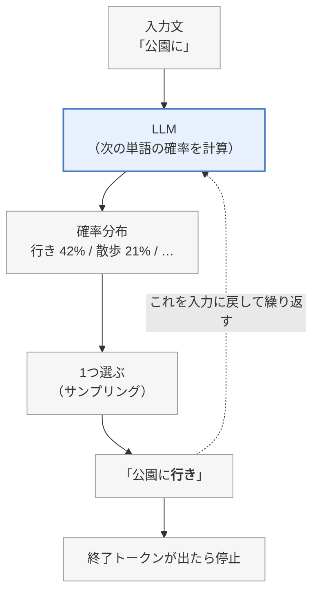
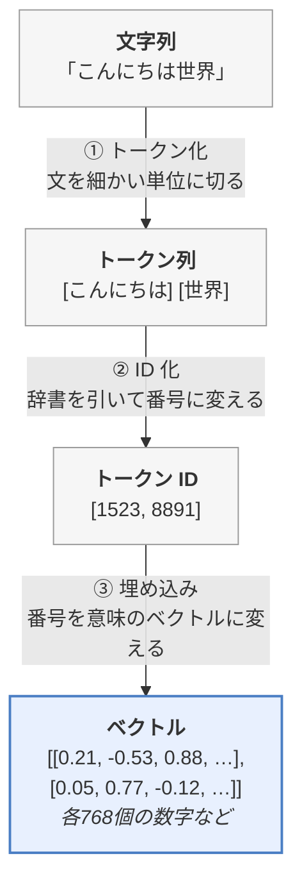
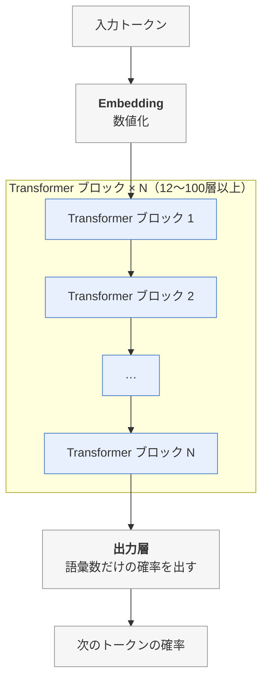
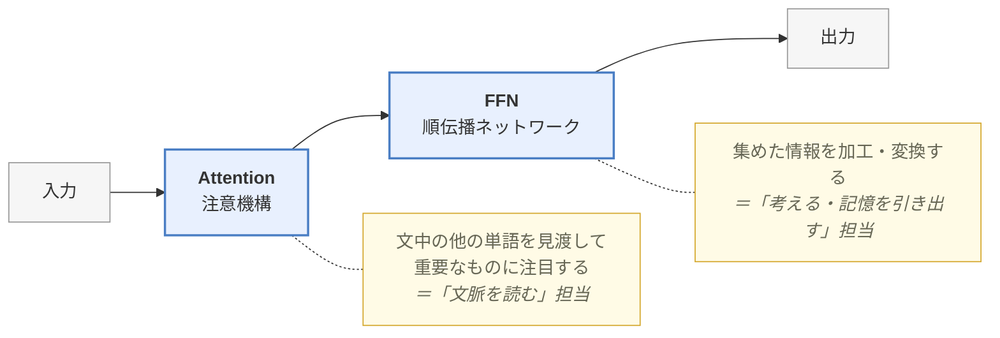
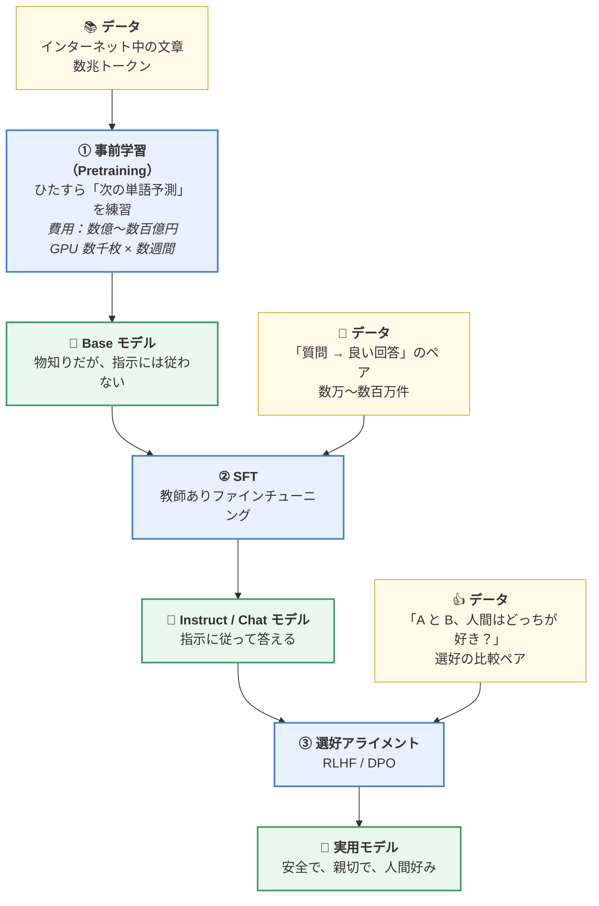
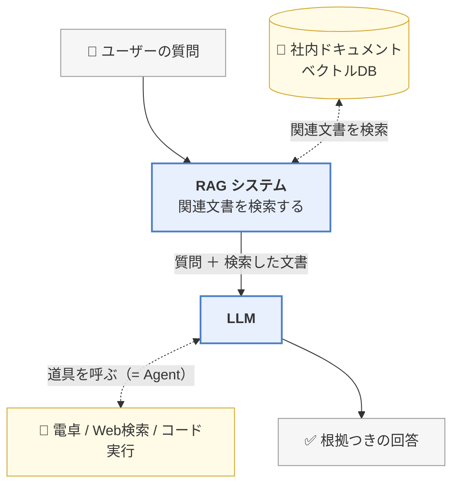

> この章は「導入」です。1〜8章に入る前に、全体の見取り図を作ります。

---

## 1. LLM がやっていることは、たった1つ

ChatGPT のような大規模言語モデル（LLM = Large Language Model）がやっていることは、驚くほど単純です。

> **「ここまでの文章を見て、次に来る単語として一番ありそうなものを1つ選ぶ」**

これだけです。これを何百回も繰り返すことで、長い文章が出てきます。

```
入力： 「今日は良い天気なので、公園に」
        ↓ モデルが次の単語の確率を計算
        行き   : 42%   ← これを選ぶ
        散歩   : 21%
        遊び   : 15%
        バナナ :  0.001%
        ↓
出力： 「今日は良い天気なので、公園に行き」
        ↓ また同じことを繰り返す
出力： 「今日は良い天気なので、公園に行きました。」
```

この「次の単語を予測する」という作業を **言語モデリング（Language Modeling）** と呼びます。
そして、次の単語を1つずつ順番に生成していく方式を **自己回帰生成（Autoregressive Generation）** と言います。

図にすると、**自分の出力を自分の入力に戻すループ**です。



> 📝 図に「サンプリング」とあるのは、実際には**最大確率のものを必ず選ぶのではなく、
> 確率に応じたくじ引きで選ぶ**（＝サンプリング）ことが多いためです。
> 冒頭の例の「一番ありそうなものを選ぶ」は最も基本的な選び方で、
> 詳しくは [02.7章](https://zenn.dev/thirtypower/books/kgr-llm-guide/viewer/027-mini-gpt) の「温度」の話で扱います。

> 🔑 **ChatGPT が長い文章を書いているとき、内部では「次の1単語」を
> 何百回も選び直しているだけ**です。文全体を一度に考えているわけではありません。

### 「そんな単純な仕組みで、なぜ賢く見えるのか？」

これが LLM の一番面白いところです。

「次の単語を正確に当てる」ためには、実は膨大な知識が要ります。

- 「日本の首都は」の次を当てるには → **事実の知識**が要る
- 「1 + 1 = 」の次を当てるには → **計算能力**が要る
- 「彼は嬉しかった。なぜなら」の次を当てるには → **因果関係の理解**が要る
- 「以下のコードのバグを修正すると：」の次を当てるには → **プログラミング能力**が要る

つまり、**「次の単語を当てる」というタスクを極限まで上手くやろうとすると、副産物として知識や推論能力が身についてしまう**。これが LLM の本質です。

---

## 2. 「言葉」を「数字」に変える必要がある

コンピュータは文字を直接扱えません。すべて数字にする必要があります。
LLM の内部では、次の3ステップで文字が数字になります。



**① トークン（Token）** は、モデルが扱う言葉の最小単位です。
単語よりやや細かく、「単語の断片（subword）」になっていることが多いです。
（例：`unhappiness` → `un` + `happi` + `ness`）
→ 詳しくは [01章](https://zenn.dev/thirtypower/books/kgr-llm-guide/viewer/01-nlp-basics) と [05章](https://zenn.dev/thirtypower/books/kgr-llm-guide/viewer/05-build-your-own-llm)

**③ 埋め込み（Embedding）** は、「意味が近い言葉は、ベクトルとしても近い位置に置く」という数値表現です。
有名な例：`王 - 男 + 女 ≒ 女王` というベクトル演算が成り立ちます。

> 🤔 **なぜ引き算や足し算に意味が出るのか**：
> 埋め込みは「似た文脈で使われる語を近くに置く」ように作られます。
> すると **`王→女王`、`俳優→女優`、`彼→彼女` のような「性別を変える」変化が、
> どのペアでもだいたい同じ向き・同じ長さの矢印になります**。
> その矢印を「`女 − 男` という差」として取り出せるので、
> `王` にその矢印を足すと `女王` の近くに着く——というだけの話です。
> **意味の"差"が、ベクトルの"向き"として表れている**のがポイントです。
>
> → 詳しくは [01章 1.4.3](https://zenn.dev/thirtypower/books/kgr-llm-guide/viewer/01-nlp-basics)

---

## 3. LLM の中身は「Transformer ブロックの積み重ね」

数字になった言葉は、**Transformer（トランスフォーマー）** という部品を何十層も通過します。



> 📝 **2026年の実物との違いを1つだけ先に**：大きなモデルでは、この
> 「Transformer ブロック」の中の FFN 部分が **N 個に分割**され、
> トークンごとに数個だけ使う形（**MoE**）になっています。
> 「671B のうち 37B だけを使う」という表記はこれのことです。
> **骨格はこの図のまま**なので、まずはこの図を押さえてください
> （→ 詳しくは [05.5章](https://zenn.dev/thirtypower/books/kgr-llm-guide/viewer/055-moe-modern-arch)）。

1つの Transformer ブロックの中身は、大きく2つの部品です。



この図を表にすると、次のとおりです。

| 部品 | 役割 | たとえると |
|------|------|-----------|
| **Attention（注意機構）** | 文中の他の単語を見渡して、重要なものに注目する | 「文脈を読む」担当 |
| **FFN（順伝播ネットワーク）** | 集めた情報を加工・変換する | 「考える・記憶を引き出す」担当 |

→ 詳しくは [02章](https://zenn.dev/thirtypower/books/kgr-llm-guide/viewer/02-transformer-attention)

### なぜ Attention が革命的だったのか

Transformer 以前（RNN / LSTM）は、単語を**1個ずつ順番に**処理していました。
これだと ①遅い（並列化できない） ②長い文だと最初の方を忘れる、という問題がありました。

Attention は、**文中の全単語を一度に見比べる**ことで、この2つを同時に解決しました。
2017年の論文タイトルがそのまま答えです ——「**Attention Is All You Need**（注意機構さえあればいい）」。

---

## 4. LLM の作り方は「3段階」

一般的な LLM は、次の3ステップで作られます。この流れは絶対に覚えてください。



> 📝 ② の「教師あり」とは、**正解例（お手本の回答）を人間が用意して見せる方式**のことです。
> ③ の正式名は **RLHF** = Reinforcement Learning from Human Feedback（人間のフィードバックによる強化学習）、
> **DPO** = Direct Preference Optimization（直接選好最適化）です。

### たとえ話：新人社員の育成

| 段階 | 例え |
|------|------|
| ① 事前学習 | 図書館の本を全部読ませる。知識は付くが、話し方は知らない |
| ② SFT | 「お客様にはこう答える」というマニュアルを叩き込む |
| ③ RLHF/DPO | 先輩が「今の返答はイマイチ」「今のは良かった」とフィードバックし、感覚を磨かせる |

→ 詳しくは [04章](https://zenn.dev/thirtypower/books/kgr-llm-guide/viewer/04-what-is-llm)・[06章](https://zenn.dev/thirtypower/books/kgr-llm-guide/viewer/06-training-pipeline)

---

## 5. できあがったモデルを実務でどう使うか

学習済みの LLM をそのまま使うと、次の弱点があります。

| 弱点 | 内容 | 対策 |
|------|------|------|
| **ハルシネーション** | 知らないことを、それらしく捏造する | **RAG**（外部文書を検索して根拠を与える） |
| **知識が古い** | 学習した時点までの知識しかない | **RAG** |
| **計算・最新情報が苦手** | 正確な計算やWeb検索ができない | **Agent**（電卓や検索を道具として使わせる） |
| **自社ドメインを知らない** | 社内用語・専門分野に弱い | **ファインチューニング（LoRA）** |
| **遅い・高い** | 1トークンずつ生成するので、長い応答は時間も費用もかかる | **推論の最適化**（KVキャッシュ・量子化・バッチ） → [07.5章](https://zenn.dev/thirtypower/books/kgr-llm-guide/viewer/075-fast-inference) |



→ 詳しくは [07章](https://zenn.dev/thirtypower/books/kgr-llm-guide/viewer/07-applications)

---

## 6. この時点で覚えておきたい言葉 10 個

| 用語 | 英語 | ざっくりの意味 |
|------|------|--------------|
| トークン | Token | モデルが扱う言葉の最小単位。単語より少し細かい |
| 埋め込み | Embedding | 言葉を「意味を表す数字の列」にしたもの |
| 注意機構 | Attention | 文中のどの単語に注目すべきかを計算する仕組み |
| パラメータ | Parameter | モデル内部の学習される数値（＝掛け算に使う行列 `W` の成分）。「7B」＝70億個 |
| 事前学習 | Pretraining | 大量の文章で「次の単語予測」を練習する第1段階 |
| ファインチューニング | Fine-tuning | 学習済みモデルを特定用途に微調整すること |
| 推論 | Inference | 学習済みモデルを使って実際に答えを生成すること |
| コンテキスト長 | Context Length | 一度に読める文章の長さ（トークン数） |
| ハルシネーション | Hallucination | もっともらしい嘘を生成してしまう現象 |
| 創発能力 | Emergent Ability | モデルが大きくなると突然できるようになる能力 |

→ 全用語は [用語集.md](https://zenn.dev/thirtypower/books/kgr-llm-guide/viewer/appendix-glossary) にまとめています。

---

## 次に読む

準備完了です。次は、あなたの状態によって分かれます。

| あなたの状態 | 次に読むもの |
|------------|------------|
| 「損失関数」「勾配降下法」がピンと来ない | → **[00.5. 深層学習の基礎](https://zenn.dev/thirtypower/books/kgr-llm-guide/viewer/005-deep-learning-basics)**（先にここを埋めてください） |
| 深層学習は分かっている | → **[01. NLP の基礎概念](https://zenn.dev/thirtypower/books/kgr-llm-guide/viewer/01-nlp-basics)** |

> 💡 迷ったら [00.5章](https://zenn.dev/thirtypower/books/kgr-llm-guide/viewer/005-deep-learning-basics) を読んでください。
> ここが曖昧なまま5章まで行くと、ほぼ確実に詰まります。逆にここさえ押さえれば、
> 以降の「学習」「損失」「勾配」という言葉が全部具体的な計算として読めるようになります。
