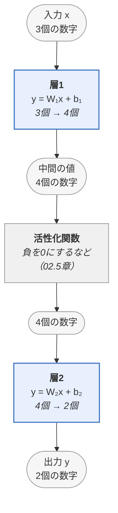
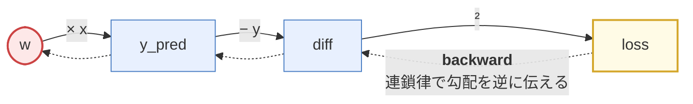
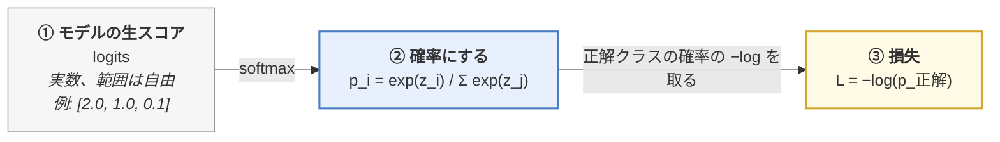
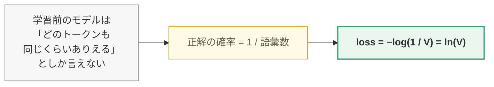
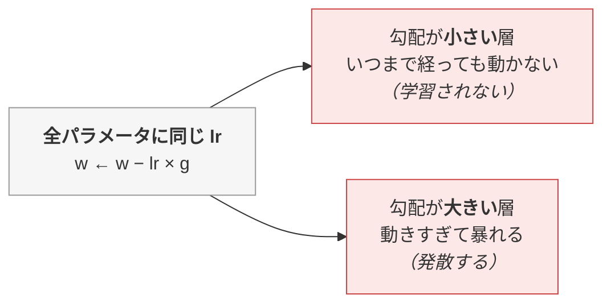
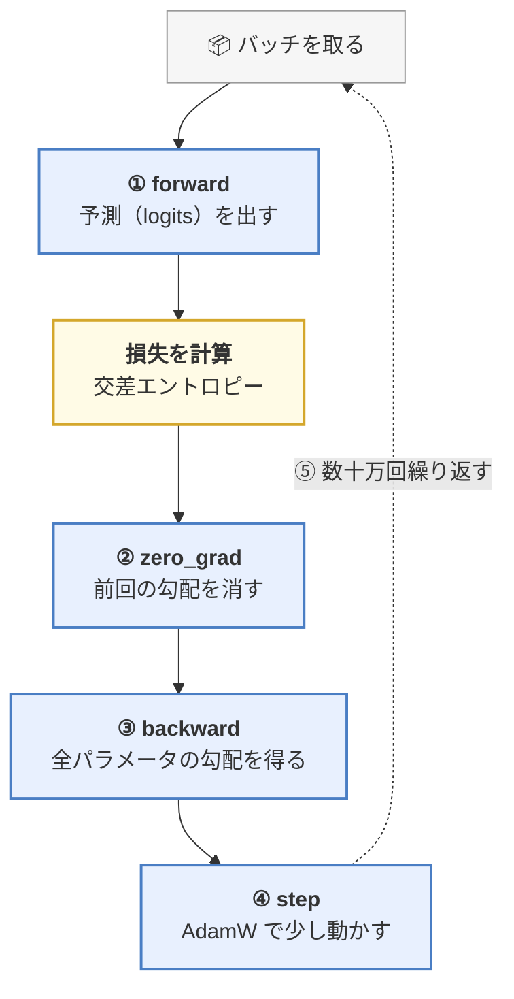

> この章は、**LLM を読むために最低限必要な深層学習の知識**だけを集めた補講です。
> **この章のゴール**：「モデルが学習する」という言葉を、**具体的な計算の手順**として説明できるようになる。
>
> 📎 **対応コード**：[`code/01_tensor_autograd.py`](https://github.com/thirtypower/kgr-llm/blob/main/code/01_tensor_autograd.py)
> この章の内容は全部、実際に動くコードとして書いてあります。
> 読みながら `python 01_tensor_autograd.py` を実行すると、数字が目の前で動きます。

---

## この章を読むべき人

| あなたの状態 | どうすべきか |
|------------|------------|
| 「損失」「勾配」「Adam」を聞いたことがない | **必読**。ここを飛ばすと5章で確実に詰まります |
| 言葉は知っているが、何をしているかは説明できない | **推奨**。ここが曖昧なままだと理解が積み上がりません |
| PyTorch でモデルを書いたことがない | **1.5節だけは必読**。以降の全章のコードがあの型で書かれています |
| PyTorch で学習ループを書いたことがある | **飛ばしてよい**。02章へどうぞ |

この章で扱うのは、**数学の準備（0節・5分）＋ 次の9つだけ**です。深層学習の教科書のような網羅はしません。
**LLM を読むのに実際に必要になるものだけ**を、必要な深さで説明します。

```
① テンソル        （1節）  … 数値の入れ物
② モデルと層      （1.5節）… 「層を積む」とは何か ＋ PyTorch での書き方
③ 勾配            （2節）  … どちらに動かせば良くなるか
④ 自動微分        （3節）  … 勾配をコンピュータに計算させる仕組み
⑤ 勾配降下法      （4節）  … 「学習」そのもの
⑥ 交差エントロピー （5節）  … LLM が使う唯一の損失関数
⑦ 次トークン予測   （6節）  … LLM の損失計算の実体
⑧ パープレキシティ （7節）  … 損失の読み方
⑨ Optimizer      （8節）  … なぜ AdamW ばかり使うのか
```

---

## 0. 数学の最低限（5分で済ませる）

この教材で出てくる数学は、実は**6つだけ**です（最後の1つは数学というより記法の話です）。
高校数学を忘れていても、以下だけ押さえれば全章読めます。知っている人は飛ばしてください。

### 0.1 ベクトル ＝ 数字を並べたもの

```
v = [2, 1, 3]     ← 3次元ベクトル（数字が3個並んでいるだけ）
```

LLM では「1つのトークン ＝ 1本のベクトル（数百〜数千次元）」として扱います。
「768次元のベクトル」と聞いたら「**数字が768個並んだもの**」と読み替えてください。
それ以上の意味はありません。

### 0.2 内積 ＝「向きがどれだけ似ているか」を1つの数字にする

2本のベクトルの**同じ位置の数字を掛けて、全部足す**。これだけです。

```
a = [1, 2, 0]
b = [3, 1, 5]

a · b = 1×3 + 2×1 + 0×5 = 5
```

**内積の値の読み方（ここが大事）：**

| 内積の値 | 意味 |
|---------|------|
| 大きい正の値 | 2本のベクトルは**同じ方向**を向いている（＝似ている） |
| 0 | 無関係（直交） |
| 負の値 | **逆方向**を向いている |

> 🔑 2章の Attention は「Query と Key の内積で類似度を測る」仕組みです。
> つまり **Attention の中身は、この掛けて足すだけの計算**です。

### 0.3 行列の掛け算 ＝ 内積をまとめて大量にやる

行列は「ベクトルを束ねたもの」です。行列の掛け算 `A @ B` は、
**A の各行と B の各列の内積を、総当たりで計算する**操作です。

```
A = | 1  2 |        B = | 5  6 |
    | 3  4 |            | 7  8 |

A @ B = | 1×5+2×7   1×6+2×8 |   | 19  22 |
        | 3×5+4×7   3×6+4×8 | = | 43  50 |
          ↑ A の1行目と B の1列目の内積が左上に入る
```

**形のルールだけ覚えてください**：`(m × n) @ (n × k) = (m × k)`。
**内側の n が一致していないと掛けられません。**
LLM のコードを読むとき必要なのは、この形の追跡だけです（計算自体は機械がやります）。

#### 転置（ᵀ）＝ 行と列を入れ替える

行列の右肩に付く小さな **ᵀ**（transpose / 転置）は、「**行と列を入れ替える**」という意味です。

```
K = | 1  2 |         Kᵀ = | 1  3 |
    | 3  4 |              | 2  4 |
      ↑ 1行目 [1,2] が、転置すると 1列目に立つ
```

なぜこんな操作が要るのか？　上の形のルールを見てください。
たとえば 3本の Query（3×2 の行列 Q）と 3本の Key（3×2 の行列 K）の
**全組み合わせの内積**を一気に取りたいとき、`Q @ K` は (3×2)@(3×2) で内側が合わず**掛けられません**。
K を転置して (3×2)@(2×3) にすると掛けられて、結果は 3×3 ——
**「どの Query とどの Key がどれだけ似ているか」の総当たり表**になります。
2章の Attention に出てくる `Q · Kᵀ` は、まさにこれをやっています。

> 📝 **記号のゆれについて**：この教材では、コード中の行列積は `A @ B`（Python の演算子）、
> 数式中では `A · B` や `ABᵀ` と書きます。**全部同じ「行列の掛け算」**です。

### 0.4 exp と log ＝「確率の世界」と行き来する道具

- **exp(x)**（指数関数）：どんな実数も**必ず正の数**に変換する。大きい x ほど爆発的に大きくなる
- **log(x)**（自然対数）：exp の逆。掛け算を足し算に変える（`log(a×b) = log a + log b`）

```
exp(0) = 1        log(1) = 0
exp(1) ≈ 2.72     log(2.72) ≈ 1
exp(5) ≈ 148      log(0.01) ≈ -4.6（1より小さい数の log は負）
```

モデルの出力（logits）は正負どちらもある生の数値なので、
**確率（0以上・合計1）にするために exp が必要**になります。それが次の softmax です。

### 0.5 softmax ＝ 生の点数を「合計100%の確率」に変換する

手順は2つだけ：**① 全部 exp する ② 合計で割る**。

```
logits = [2.0, 1.0, 0.1]        ← モデルの生の点数（正負も大小も自由）

① exp する:   [7.39, 2.72, 1.11]
② 合計 11.22 で割る: [0.659, 0.242, 0.099]   ← 全部正で、合計が 1（=100%）
```

**性質：**
- 一番大きい点数が一番大きい確率になる（順位は変わらない）
- 点数の**差**が大きいほど、確率の差はもっと極端になる（exp のせい）
- だから点数を何かで割ってから softmax すると分布の尖り方を調整できる
  → これが **温度（temperature）** と、Attention の **√d_k で割る**理由の正体
  （d_k は2章で出てくる「ベクトルの長さ」の記号です。今は
  「割り算で尖り方を調整できる」ことだけ分かれば OK）

> ✅ **確認**：`softmax([1.0, 1.0, 1.0])` はどうなるでしょう？
> → exp すると [2.72, 2.72, 2.72]、合計で割ると **[1/3, 1/3, 1/3]**。
> 「差がなければ均等に割る」——直感どおりです。

### 0.6 平均・分散・標準偏差 ＝「散らばり」を測る3兄弟

- **平均**：全部足して個数で割る。おなじみのやつです
- **分散**：「平均からのズレ」を二乗して平均したもの。**散らばりの大きさ**を表す
- **標準偏差（std）**：√分散。散らばりを元の数値と同じ単位で表したもの

```
v = [2, 4, 6]
平均       = (2 + 4 + 6) ÷ 3 = 4
分散       = ((2−4)² + (4−4)² + (6−4)²) ÷ 3 = (4+0+4) ÷ 3 ≈ 2.67
標準偏差   = √2.67 ≈ 1.63     ← 「だいたい ±1.63 くらい散らばっている」
```

「分散が大きい＝値が激しくバラつく」「分散を1に揃える＝バラつきを標準サイズに整える」
と読めれば十分です。02章（√d_k で割る理由）と 02.5章（LayerNorm）で使います。

> 📌 **もう1つだけ性質を覚えてください**：**互いに無関係（独立）な数をたくさん足すと、
> 分散は「個数の分だけ」大きくなります。**
> 分散1の数を2個足せば分散2、100個足せば分散100（＝標準偏差は10倍）。
> 「たくさん足すと値が大きく散らばる」という当たり前の話ですが、
> **02章の「なぜ √d_k で割るのか」がまさにこれ**です（d_k 個の掛け算の結果を足すから、分散が d_k 倍になる）。

### 0.7 指数表記（`1e-4`）の読み方

以降の表に `1e-4` `3e-4` `5e-7` `1e-8` という書き方が大量に出てきます。
**`e` は「10 の何乗か」**を表すプログラミングの記法で、難しいことは何もありません。

```
1e-4  = 1 × 10⁻⁴ = 0.0001        （e の後ろの数だけ、小数点を左にずらす）
3e-4  = 0.0003
5e-7  = 0.0000005
1e-8  = 0.00000001
5e8   = 500000000                 （マイナスが無ければ右にずらす）
```

> 🔑 **`e` の後ろの数が小さい（マイナスが大きい）ほど、小さい値**です。
> `1e-5` と `1e-4` なら **`1e-5` の方が10倍小さい**。
> 学習率の話（4節）はずっとこの表記で進むので、ここだけ押さえてください。

これで数学の準備は終わりです。**この6つ（内積・行列積と転置・exp/log・softmax・平均と分散・指数表記）
以外の数学は、出てくるたびにその場で説明します。**

---

## 1. テンソル（Tensor）＝ 多次元の数値の箱

**テンソル**とは、ただの「数値が並んだ箱」です。難しい概念は何もありません。
次元の数だけで呼び分けています。

| 次元 | 呼び方 | 例 |
|------|-------|-----|
| 0次元 | スカラー | `3.0` |
| 1次元 | ベクトル | `[1.0, 2.0, 3.0]` |
| 2次元 | 行列 | `[[1, 2], [3, 4]]` |
| 3次元以上 | テンソル | 画像のバッチ、Attention の重みなど |

```python
import torch

scalar  = torch.tensor(3.0)                       # 0次元
vector  = torch.tensor([1.0, 2.0, 3.0])           # 1次元
matrix  = torch.tensor([[1.0, 2.0], [3.0, 4.0]])  # 2次元
tensor3 = torch.zeros(2, 3, 4)                    # 3次元
```

### shape（形）を追えることが8割

LLM のコードを読むとき、**変数が何次元で、各次元が何を意味するか**を追えれば、
そのコードは9割読めたことになります。逆に、shape を見失うと何も分からなくなります。

LLM で頻出する shape は、実はこの4つしかありません。

```
(batch, seq_len)              … トークン ID の列
                                 例: (32, 512) = 32文を並列に、各512トークン

(batch, seq_len, dim)         … 各トークンのベクトル表現（隠れ状態 hidden state）
                                 例: (32, 512, 768) = 各トークンが768次元のベクトル

(batch, heads, seq, seq)      … Attention の重み行列
                                 例: (32, 12, 512, 512) = 12ヘッド分の「どこを見るか」表
                                 （ヘッド＝Attention を複数並列で走らせる仕組み。2章で説明）

(batch, seq_len, vocab_size)  … 出力（各位置での次トークンの確率）
                                 例: (32, 512, 32000) = 全語彙分のスコア
```

> 💡 **読むときのコツ**：コードを読みながら、行の横に shape をコメントで書き込んでいく。
> これだけで理解速度が劇的に変わります。本教材のコードにも全部書いてあります。

- **batch（バッチ）**：一度にまとめて処理する文の本数。GPU を効率よく使うために束ねます
- **seq_len（系列長）**：1文あたりのトークン数
- **dim / d_model**：1トークンを表すベクトルの長さ。大きいほど表現力が上がる

---

## 1.5 モデルと層 ＝ 「重みを掛けて足す」を積み重ねたもの

この後、**「層（layer）」「深いモデル」「パラメータ70億個」**という言葉が当たり前のように出てきます。
その正体を先に押さえます。**難しい話は1つもありません。**

### 1.5.1 パラメータ1個のモデル → 層1枚のモデル

次節（2節）で使う世界一小さいモデルは、パラメータ `w` が**1個だけ**です。

```
y = w × x            ← パラメータ 1 個
```

これを「入力3個 → 出力2個」に拡張すると、**掛ける相手が行列になります**。

```
入力  x = [x₁, x₂, x₃]                     出力 y = [y₁, y₂]

y₁ = W₁₁x₁ + W₁₂x₂ + W₁₃x₃ + b₁      ← 入力の全部を使う
y₂ = W₂₁x₁ + W₂₂x₂ + W₂₃x₃ + b₂      ← これも全部使う

     → 行列で書けば   y = W x + b     （W は 2行×3列、b は2個）
```

> 🔑 **これが「層（layer）」1枚です。**
> **パラメータ＝ここに出てくる `W` と `b` の中の数値そのもの**（この例なら 2×3 + 2 = 8個）。
> 「7B モデル」とは、**この `W` と `b` の数値が全部で70億個ある**という意味です。
> それ以上の意味はありません。
>
> 「入力の全員と出力の全員が線で繋がっている」形なので **全結合層（Fully Connected）** と呼びます。
> 詳しい図解は [02.5章 2.2.2 ①](https://zenn.dev/thirtypower/books/kgr-llm-guide/viewer/025-transformer-block) にありますが、いまは上の式で十分です。

### 1.5.2 層を「積む」＝ 出力を次の層の入力にする

層を2枚つなげると、こうなります。



- **層の枚数を増やす** ＝ 「深くする」。これが **深層**学習の「深」です
- **各層の出力の個数を増やす** ＝ 「広くする」（LLM の `dim` / `d_model` がこれ）
- 層と層の間には必ず**活性化関数**を挟みます。理由（挟まないと何枚積んでも1枚に潰れる）は
  [02.5章 2.2.2 ④](https://zenn.dev/thirtypower/books/kgr-llm-guide/viewer/025-transformer-block) で詳しく扱います。**ここでは「挟むものだ」と覚えるだけで OK**

> 💡 **LLM も、この図が縦に長くなっただけ**です。
> GPT-3 は「Transformer ブロック」という部品を96段積んでいますが、
> 1つのブロックの中身も結局 `W x + b` と活性化関数の組み合わせです（02章・02.5章）。
>
> ⚠️ そして重要なのは、**`W` の中身は最初はただの乱数**だということ。
> 意味のある値ではありません。これを「損失が減る方向に少しずつ動かす」のが
> 2節以降でやる**学習**です。

### 1.5.3 PyTorch でモデルを書く作法（これを知らないと以降のコードが読めません）

以降この教材に出てくる**すべてのモデルのコードは、次の型に従っています**。
Python の文法だけでは分からない約束事なので、ここで押さえてください。

```python
import torch
import torch.nn as nn

class TwoLayerNet(nn.Module):        # ① nn.Module を継承する（これがモデルの土台）
    def __init__(self):
        super().__init__()           # ② お約束。必ず最初に呼ぶ
        self.fc1 = nn.Linear(3, 4)   # ③ 「箱」を用意する（層1：3個 → 4個）
        self.fc2 = nn.Linear(4, 2)   #    （層2：4個 → 2個）

    def forward(self, x):            # ④ データの流し方を書く
        h = torch.relu(self.fc1(x))  #    層1 → 活性化関数
        return self.fc2(h)           #    → 層2

model = TwoLayerNet()
y = model(torch.randn(1, 3))         # ⑤ ★ model(x) と書くと forward が呼ばれる
```

**4つの約束事**：

| 書き方 | 意味 |
|--------|------|
| `class ○○(nn.Module)` | 「これはモデルの部品です」という宣言。学習の面倒（勾配の管理・保存・GPU 転送）を全部 PyTorch が引き受けてくれます |
| `super().__init__()` | 土台の初期化。**書き忘れるとエラーになります**。理由を考える必要はなく、必ず1行目に書く決まりです |
| `self.fc1 = nn.Linear(3, 4)` | `W`（4行×3列）と `b`（4個）が**乱数で作られ、自動的に「学習対象」として登録される**。自分で `requires_grad=True` を書く必要はありません |
| `model(x)` | **`forward(x)` が呼ばれます。** `model.forward(x)` と書かずに `model(x)` と書くのが PyTorch の作法です |

> 🔑 **`__init__` は「部品を並べる場所」、`forward` は「データを流す順番を書く場所」。**
> この2つの役割分担さえ掴めば、02章以降の
> `class MultiHeadAttention(nn.Module)` も `class MiniGPT(nn.Module)` も同じ型で読めます。

あと2つだけ、コード中に出てくる部品の名前を先に紹介します。

| 書き方 | 意味 |
|--------|------|
| `nn.Parameter(...)` | 「これも学習対象の数値です」と手動で登録するときに使う（`nn.Linear` の中では自動でこれが使われています）。→ 02.5章の LayerNorm で登場 |
| `nn.ModuleList([...])` | 層をリストで並べて持つための入れ物。「同じブロックを N 段積む」ときに使う。→ 02.7章の `MiniGPT` で登場 |

> 💡 **学習対象になった数値の一覧は、いつでもこれで見られます。**
> ```python
> for name, p in model.named_parameters():
>     print(name, p.shape, p.numel())   # 名前・形・個数
> # → fc1.weight (4,3) 12 / fc1.bias (4,) 4 / fc2.weight (2,4) 8 / fc2.bias (2,) 2
> #   合計 26 個 ＝ このモデルの「パラメータ数」
> ```
> **「パラメータ7億個」も、これを全部足しただけの数字**です。
> （02.7章では、この方法で自作 GPT の80万個の内訳を実際に見ます）

---

## 2. 勾配（Gradient）＝「どちらに動かせば損失が減るか」

ここが**この章で一番重要**です。

### まず、世界一小さいモデルで考える

パラメータ（学習される数値）が `w` **1個だけ**のモデルを考えます。

```
    予測:  y_pred = w × x
    正解:  y_true
    損失:  L = (y_pred − y_true)²        ← 二乗誤差。ズレが大きいほど大きい値
```

具体的に `x = 2.0`、`y_true = 10.0`、いまの `w = 1.0` としましょう。

```
    y_pred = 1.0 × 2.0 = 2.0
    L      = (2.0 − 10.0)² = 64.0        ← 大きくズレている
```

正解の `w` は `10 ÷ 2 = 5.0` です。でもモデルはそれを知りません。
**「w を増やすべきか、減らすべきか」を、モデル自身に判断させる必要があります。**

### 微分がその答えを教えてくれる

**微分**とは「**w をほんの少し動かしたら、L がその何倍動くか**」という変化率のことです。
高校数学を忘れていても、実際に動かして測れば分かります。

```
    w = 1.00 のとき: L = (1.00×2 − 10)² = (−8.00)² = 64.0000
    w = 1.01 のとき: L = (1.01×2 − 10)² = (−7.98)² = 63.6804

    w を +0.01 動かしたら、L は −0.3196 動いた
    → 変化率 ≈ −0.3196 ÷ 0.01 ≈ −32
```

この「約 −32」が、L を w で微分した値です。
公式（合成関数の微分）で計算すると、ぴったり −32.0 になります：

```
    L = (w·x − y)²
    dL/dw = 2 · (w·x − y) · x        ← 公式。導出は追えなくてOK。
          = 2 · (1.0·2.0 − 10.0) · 2.0    上の「実測」と一致することだけ確認
          = 2 · (−8.0) · 2.0
          = −32.0
```

> 📝 **実測が −31.96 で、公式が −32.0 なのはなぜ？**
> 微分は本来「w を**限りなく小さく**動かしたときの変化率」です。
> 上では `+0.01` という**有限の幅**で動かして測ったので、そのぶんだけズレます
> （幅を `+0.001` にすれば −31.996 と、より −32 に近づきます）。
> **公式の値が正解で、実測はその近似**——ただし「動かしたら損失がどう変わるか」を
> 体感するには実測の方が分かりやすいので、ここでは両方を並べました。

> 💡 公式の導出が追えなくても心配いりません。この後すぐ分かるとおり、
> **微分は全部コンピュータ（autograd）がやってくれます**。
> 人間に必要なのは「微分＝動かしたときの変化率」という読み方だけです。

この `dL/dw = −32.0` が **勾配（gradient）** です。読み方はこうです。

> **「w を +1 動かしたら、損失 L はおよそ −32 変化する」**

つまり **w を増やせば損失は減る**。だから w を増やせばいい。
これが機械が「どちらに動かすべきか」を知る方法です。

```
損失 L
  ↑
  │╲                      ／
  │ ╲                   ／
  │  ╲                ／      ← いまここ（w=1.0）にいる。
  │   ╲             ／           接線の傾き（＝勾配）が負
  │    ╲___________／            → 右に行けば下る → w を増やす
  └──────────┬──────────────→ w
             w=5.0（最小値）
```

> 🔑 **これだけ覚えてください**：
> **勾配は「増やしたら損失がどう変わるか」を表す。だから勾配と逆方向に動かせば損失は減る。**
>
> パラメータが70億個あっても、話は完全に同じです。
> **70億個それぞれについて「増やすべきか減らすべきか」を計算している**だけです。

---

## 3. 自動微分（Autograd）＝ 微分をコンピュータに任せる

パラメータが70億個ある式を手で微分することは、当然できません。
これを自動化するのが **autograd（自動微分）** です。PyTorch の心臓部です。

```python
w = torch.tensor([1.0], requires_grad=True)   # ★ この印をつけた変数だけ追跡される
x = torch.tensor([2.0])
y = torch.tensor([10.0])

y_pred = w * x
loss = (y_pred - y) ** 2
loss.backward()               # ★ この1行で全ての勾配が計算される

print(w.grad.item())          # → -32.0  （手計算と完全に一致）
```

### 仕組み：計算グラフ

PyTorch は、計算をするたびに **「どんな演算をしたか」を裏で記録**しています。



**実線 = forward（順伝播）**：実際に計算しながら、経路を記録する
**点線 = backward（逆伝播）**：記録を逆にたどり、連鎖律で勾配を求める

`loss.backward()` を呼ぶと、この記録を**出口から入口に向かって逆にたどり**、
微分の連鎖律（chain rule）を適用して、経路上の全変数の勾配を求めます。

これが **誤差逆伝播法（Backpropagation / バックプロパゲーション）** の正体です。
名前は仰々しいですが、やっていることは「**記録した計算を逆順にたどって微分する**」だけです。

> 💡 **なぜ「逆」向きなのか**：損失は1個のスカラー、パラメータは70億個あります。
> 入口から順に計算すると70億回の微分が要りますが、
> 出口から逆にたどれば**1回のパスで全部の勾配が同時に求まります**。
> だから逆向きなのです。

---

## 4. 勾配降下法（Gradient Descent）＝「学習」そのもの

勾配が手に入ったら、あとは**勾配の逆方向に少し動かす**だけです。

```
    w ← w − lr × (dL/dw)
```

`lr`（**learning rate / 学習率**）は「1歩の大きさ」です。

```python
w = torch.tensor([1.0], requires_grad=True)
lr = 0.1

for step in range(8):
    loss = (w * x - y) ** 2
    if w.grad is not None:
        w.grad.zero_()        # ★ 勾配は累積するので毎回ゼロにする（超重要）
    loss.backward()
    with torch.no_grad():     # 更新自体は微分の対象外
        w -= lr * w.grad
```

実行すると、`w` が 1.0 → 5.0 へ近づいていく様子が見えます。

```
step        w       loss       grad
   0   1.0000    64.0000   -32.0000    ← 大きくズレている → 大きく動く
   1   4.2000     2.5600    -6.4000    ← w = 1.0 − 0.1×(−32.0) = 4.2
   2   4.8400     0.1024    -1.2800    ← w = 4.2 − 0.1×(−6.4) = 4.84
   3   4.9680     0.0041    -0.2560
   ...
最終 w = 4.9999   （正解は 5.0）
```

**これが「学習」です。** LLM もこれと完全に同じことを、
パラメータ70億個について、数十万回繰り返しているだけです。

### 学習率（lr）の感覚

まず、**いま何の上を歩いているのか**を絵にします。
上の例の損失は `L(w) = (2w − 10)²`——**w を横軸に取ると、ただの谷**です。

```
  損失 L
  64 |*                                               *
     | **                                           ** 
     |   **                                       **   
     |     *                                     *     
  36 |      ***                               ***      
     |         **                           **         
  16 |           ***                     ***           
     |              ****             ****              
   0 +                  *************                  
      -------------------------------------------------
       w=1                w=5                  w=9
       （開始）           （正解・底）
```

**勾配降下法は、この谷をボールが転がり落ちるだけの手続き**です。
「1歩の大きさ（lr）」を変えて、実際に同じコードを回した w の軌跡です。

| step | lr = 0.01<br/>（小さすぎる） | lr = 0.1<br/>（ちょうどよい） | lr = 0.3<br/>（大きすぎる） |
|---|---|---|---|
| 0 | 1.00 | 1.00 | 1.00 |
| 1 | 1.32 | **4.20** | 10.60 |
| 2 | 1.61 | **4.84** | −2.84 |
| 3 | 1.89 | **4.97** | 15.98 |
| 4 | 2.13 | **4.99** | −10.37 |
| 5 | 2.36 | **5.00** | 26.51 |
| **5歩後の loss** | 27.8（64 から少し減った） | **0.0** ✅ | **1851.2** ❌ 増えている |

```
   [1] 小さすぎる            [2] ちょうどよい          [3] 大きすぎる
   底へ向かってはいるが、    数歩で底に着き、           底を飛び越え、反対側の
   1歩が小さすぎて           そこから動かない           もっと高い所に着地。
   いつまでも着かない                                   往復するたびに遠ざかる
        \                        \                         \    ↗    ↖
      0 1 2 3 4 5 …               \ 1 2 3(底)               \ ↙  0  ↘
   ＿＿＿＿＿＿＿＿＿＿        ＿＿＿＿＿＿＿＿＿＿        ＿＿＿＿＿＿＿＿＿＿
```

> 🔑 **[3] で何が起きたのかが重要です。**
> 勾配は「どちら向きに下るか」しか教えてくれません。**どこまで進めば底かは教えてくれない**ので、
> 歩幅が大きいと通り過ぎます。しかも反対側の斜面は元より急なので、
> **次の勾配はもっと大きくなり、次の1歩はもっと大きく飛ぶ**——これが発散です。

| lr | 何が起きるか |
|----|------------|
| **小さすぎる**（1e-8） | ほとんど動かない。何日回しても収束しない |
| **ちょうどよい**（1e-4 〜 3e-4） | 順調に損失が下がる。LLM の事前学習の定番 |
| **大きすぎる**（1.0） | 最小値を飛び越えて往復し、**発散する**（loss が `nan` になる） |

> ⚠️ 学習中に loss が `nan` になったら、**まず学習率を疑ってください**。
> LLM 学習のトラブルで最も多い原因です。
>
> 📝 **実物の損失は、この図のような綺麗な1個の谷ではありません。**
> パラメータが70億個あれば「70億次元の地形」で、谷も尾根も無数にあります。
> それでも**やっていることはこの図と同じ**（勾配の逆向きに lr ぶん動かす）です。
> 「1次元の谷を転がすのを、70億回同時にやっている」と思ってください。

---

## 5. 交差エントロピー（Cross Entropy）＝ LLM が使う唯一の損失関数

上の例では二乗誤差を使いましたが、**LLM は交差エントロピーしか使いません**。
なぜなら、LLM の出力は数値ではなく **「次のトークンの確率分布」** だからです。

### LLM は「語彙数クラスの分類問題」を解いている

```
入力: 「今日は良い」
出力: 語彙 32000 個それぞれについて「次に来る確率」

     天気  : 42%
     日   : 21%
     こと  : 15%
     ...
     バナナ:  0.0001%
     ─────────────
     合計   100%
```

つまり LLM は **「32000択のクイズ」** を解いているわけです。
これは分類問題なので、分類の標準的な損失である**交差エントロピー**を使います。

> 📝 **この「32000個の数字」はどこで作られるのか**：
> モデルの**いちばん最後に、語彙数へ変換する層が1枚だけ付いています**
> （1.5節の言葉で言えば `nn.Linear(768, 32000)`。つまり `dim` 個 → `語彙数` 個の全結合層）。
> Transformer ブロックを何十段も通って出てきた「768個の数字」を、
> この最後の1枚が「32000個の点数」に変換します。
> → 実物は [02.5章 2.3.3](https://zenn.dev/thirtypower/books/kgr-llm-guide/viewer/025-transformer-block) と [02.7章 2.5](https://zenn.dev/thirtypower/books/kgr-llm-guide/viewer/027-mini-gpt) で見ます。
> **いまは「最後に語彙数へ広げる層がある」ことだけ押さえてください**（次の 6節の `(2, 5, 1000)` の
> 末尾の `1000` が、まさにこの層の出力です）。

### 計算の3ステップ



### なぜ「−log」なのか

正解の確率 `p` に対して `−log(p)` を取ると、こうなります。

| 正解に与えた確率 `p` | 損失 `−log(p)` | 意味 |
|-------------------|--------------|------|
| 1.0（確信をもって正解） | **0** | 罰なし。完璧 |
| 0.5 | 0.693 | まあまあ |
| 0.1 | 2.303 | ちょっと違うよ |
| 0.01 | 4.605 | かなり違う |
| → 0（正解を「ありえない」と断言） | **→ ∞** | 大罰 |

```
損失
 ↑
 │╲
 │ ╲
 │  ╲
 │   ╲___
 │       ╲______
 └────────────────╲──→ 正解に与えた確率 p
 0                  1
「正解をありえないと言うほど、罰が青天井に大きくなる」
```

**「自信をもって間違える」ことを最も強く罰する**——これが交差エントロピーの性質です。
だから学習が進むと、モデルは「分からないときは分からないなりの確率を出す」ようになります。

### PyTorch での実装

```python
import torch
import torch.nn.functional as F   # 損失関数などの関数群。慣例で F と略す

logits = torch.tensor([[2.0, 1.0, 0.1]])   # 3クラス分のスコア
target = torch.tensor([0])                 # 正解はクラス0

# 手計算
probs = F.softmax(logits, dim=-1)
manual = -torch.log(probs[0, target[0]])   # → 0.417

# PyTorch
loss = F.cross_entropy(logits, target)     # → 0.417  完全に一致
```

> ⚠️ **最頻出のバグ**：`F.cross_entropy` は **内部で softmax をやっています**
> （数値安定性のため `log_softmax` を使う）。
> 自分で softmax してから渡すと**二重適用**になり、学習が進まなくなります。
> **logits をそのまま渡すのが正解**です。

---

## 6. 次トークン予測の損失計算（LLM の実体）

では実際の LLM ではどう計算するのか。ミニチュアで再現します。

```python
vocab_size, batch, seq_len = 1000, 2, 5

logits  = model(input_ids)                          # (2, 5, 1000)
targets = ...                                       # (2, 5)  1つ後ろにずらしたトークン

# cross_entropy は (N, C) と (N,) を要求するので、位置を全部つぶす
loss = F.cross_entropy(
    logits.view(-1, vocab_size),   # (2*5, 1000) = (10, 1000)
    targets.view(-1),              # (10,)
)
```

> 📝 **「1つ後ろにずらした」とは**：LLM の学習では、正解データを別に用意する必要がありません。
> 文そのものが正解だからです。
>
> ```
> 入力     : 今日  は   良い  天気
> 正解     : は   良い  天気  だ      ← 入力を1つ後ろにずらしただけ
> ```
>
> こうすると「各位置の正解＝その次のトークン」になり、
> 1文から一気に4個分の「次トークン予測クイズ」が作れます。
> **これが「LLM はラベル付けなしで学習できる」ことの正体**です（詳細は2.5章・02.7章）。

**`view(-1, ...)` で位置をつぶす**のがポイントです。
「バッチの何番目の、何トークン目か」はもう関係なく、
**10個の独立した1000択クイズ**として一気に採点しています。

### ★ 実務で最重要のチェック：初期 loss ≈ ln(語彙数)

学習を始めた瞬間の loss の値には、**理論的な期待値があります**。



> 📝 `ln` は「自然対数」の別記法で、0.4節の `log` と**同じもの**です
> （数学では底を明示するとき ln と書く慣例があります。この教材の log は全部自然対数です）。

| 語彙数 V | 期待される初期 loss = ln(V) |
|---------|--------------------------|
| 1,000 | 6.91 |
| 6,144（本教材のモデル） | 8.72 |
| 32,000（LLaMA-2） | 10.37 |
| 128,256（LLaMA-3） | 11.76 |

> 🔑 **この1行の確認だけで、実装バグの半分は開始10秒で見つかります。**
>
> | 観測された初期 loss | 疑うべきこと |
> |------------------|------------|
> | **ln(V) 付近** | ✅ 初期化と損失計算は正しい。学習を進めてよい |
> | **ln(V) より大幅に大きい** | 初期化のスケールが大きすぎる（重みの std を確認） |
> | **いきなり異常に小さい** | **ラベルがリークしている**（入力に正解が混入。マスクのバグ） |
>
> 「とりあえず回して様子を見る」前に必ずこれを見てください。
> 数日分の GPU 時間を救います。

### 損失マスク（SFT で使う）

一部の位置を損失計算から除外したいことがあります（4章の SFT）。
PyTorch では、**ラベルを `-100` にするだけ**です。

```python
targets_masked = targets.clone()
targets_masked[:, :3] = -100          # 前半3トークンを損失計算から除外

loss = F.cross_entropy(logits.view(-1, vocab_size),
                       targets_masked.view(-1),
                       ignore_index=-100)      # ★ この位置は損失に寄与しない
```

`-100` は `cross_entropy` の `ignore_index` のデフォルト値です。
「なぜ -100 なのか」に深い意味はありません。**語彙 ID として絶対に出てこない値**だから、というだけです。

→ これが4章・5章・6章で繰り返し出てくる「**損失マスク**」の実装です。

---

## 7. パープレキシティ（Perplexity）＝ 損失の読み方

`loss = 3.2` と言われても、良いのか悪いのか分かりません。
そこで **exp() を取って「何択で迷っているか」に翻訳**します。

```
    perplexity = exp(loss)
```

| loss | perplexity | 直感的な意味 |
|------|-----------|------------|
| 10.37 | 32,000 | 32000択で完全に当てずっぽう（学習前） |
| 5.0 | 148 | 148択くらいまで絞れた |
| 3.0 | 20 | 20択 |
| 2.0 | 7.4 | 7択 |
| 1.0 | 2.7 | ほぼ3択。かなり賢い |

**目安**：GPT-2 級で ppl 20 前後、現代の大規模 LLM で 5〜10 程度です。

> 💡 loss が 3.0 → 2.9 に下がったと言われてもピンと来ませんが、
> ppl で見ると **20択 → 18択** になったと分かります。
> **exp は指数なので、loss のわずかな差が実力の大きな差を意味します。**
> 論文が小数点以下2桁で競っているのはこのためです。

---

## 8. Optimizer ＝ なぜ LLM は AdamW ばかり使うのか

4節の更新式（`w ← w − lr × g`）は **SGD（確率的勾配降下法）** と呼ばれる、
最も素朴な手法です。しかし LLM では**ほぼ100% AdamW**が使われます。理由を見ます。

### SGD の問題：全パラメータに同じ歩幅

```
SGD  : w ← w − lr × g              （素朴。パラメータごとの事情を完全に無視）
```

深いモデルでは、**層ごとに勾配の大きさが桁違いにバラつきます**
（「層」＝ `W x + b` 1枚のこと。1.5節で見たとおりです）。
ある層の勾配は 0.0001、別の層は 100、ということが普通に起きます。

このとき同じ `lr` を使うと——



**どちらに lr を合わせても、もう片方が壊れます。**

### Adam の解決：パラメータごとに歩幅を変える

```
Adam : 勾配の移動平均 m と、勾配の二乗の移動平均 v を各パラメータごとに持つ

       w ← w − lr × m / (√v + ε)
                    └────┬────┘
              勾配が大きいパラメータは √v で割られて小さく
              勾配が小さいパラメータは相対的に大きく動く
```

> 📝 **移動平均**＝「最近の値ほど重く効く平均」。過去を少しずつ忘れながら平均を取り続ける
> 計算のことです。勾配はステップごとに暴れるので、均してから使います。
> **ε（イプシロン）**は 1e-8 程度のごく小さい数で、√v が0のときの**ゼロ除算を防ぐだけ**の保険です。

つまり **「その1個のパラメータにとっての適切な歩幅」に自動で正規化**します。
これで層ごとのスケール差が吸収されます。

- **m（1次モーメント）**：勾配の移動平均。慣性（モーメンタム）として働き、ブレを均す
- **v（2次モーメント）**：勾配の二乗の移動平均。そのパラメータの「暴れやすさ」の指標

**AdamW** は、Adam の **weight decay** を数学的に正しく分離した改良版です。**LLM の事実上の標準**です。

> 📝 **weight decay（重み減衰）とは**：更新のたびに、**重みを少しだけ 0 の方向へ引き戻す**仕掛けです
> （例：`w ← w − lr×g − lr×0.1×w`。最後の項が引き戻し分）。
>
> **なぜ重みが大きいと困るのか**：ある重みが極端に大きくなると、モデルは
> **その1本の経路だけに頼った、極端な判断をするようになります**。
> 学習データにはよく当たりますが、少し違う入力が来ると外す——つまり**過学習**しやすくなります。
> 「全員が少しずつ意見を出す」状態に保つために、大きくなりすぎた重みに常に軽い罰を与えるわけです。
>
> こういう「学習データへの当てはまりを少し犠牲にして、未知のデータへの強さを上げる」工夫を
> まとめて **正則化（Regularization）** と呼びます。
> 02.5章の Dropout も、02.7章の勾配クリッピングと並ぶ「事故防止の安い保険」も、同じ発想の仲間です。

### 実際に比べてみる

`code/01_tensor_autograd.py` の STEP 8 では、
わざと**列ごとにスケールが100万倍違うデータ**を与えて比較しています。
以下は実際の実行結果です。

```
 optimizer      lr |    step 0   step 50  step 100  step 200
--------------------------------------------------------------
       SGD   1e-06 |  261.2019  247.7122  233.9471  206.4170   ← ほぼ動かない
       SGD   1e-03 |  261.2019    6.4849   37.5628  139.6054   ← 下がって跳ね上がる
     AdamW   1e-02 |  261.2019   11.4585    1.3564    0.8400   ← 素直に収束
```

**SGD は学習率をどこに合わせても破綻します。**

- `lr=1e-6`（スケール1000の列に合わせた）：スケール0.001の列が **100万倍遅く**しか学習されず、ほぼ動かない
- `lr=1e-3`（小さい列に合わせた）：大きい列にとって歩幅が大きすぎ、**下がったと思ったら跳ね上がる**（発散と回復の繰り返し）
- AdamW：何も調整していないのに収束する

> 💡 実際に学習を回すと「loss が下がったのにまた上がった」という現象に必ず出会います。
> この SGD lr=1e-3 の行が、まさにそれを最小の形で再現しています。
> **loss は一直線には下がらない**ということも、ここで覚えておいてください。

### ★ 学習ループの3点セット

順番を間違えると壊れます。**必ずこの順**です。

```python
opt.zero_grad(set_to_none=True)   # ① 前回の勾配をリセット
loss.backward()                   # ② 勾配を計算
opt.step()                        # ③ パラメータを更新
```

> ⚠️ **`zero_grad()` を忘れると勾配が累積し続け**、学習が意味不明に壊れます。
> 初心者が最もよく踏むバグです。
>
> 💡 逆に、**これを意図的にサボる**のが5章・6章で出てくる
> **勾配累積（Gradient Accumulation）** です。
> 「①を数回に1度しか呼ばない」ことで、GPU メモリを増やさずに
> 実質的なバッチサイズを大きくできます。仕組みが分かれば当たり前の話です。

### LLM でよく使うハイパーパラメータの定番値

> 💡 `1e-4` のような書き方の読み方は 0.7節を参照（`1e-4` ＝ 0.0001）。

| 項目 | 定番値 | 補足 |
|------|-------|------|
| optimizer | **AdamW** | ほぼ一択 |
| `betas` | `(0.9, 0.95)` | m と v の「忘れにくさ」（0.9 が m 用、0.95 が v 用）。LLM では第2引数を 0.999 → 0.95 に下げるのが慣例 |
| `weight_decay` | `0.1` | 事前学習時。微調整では 0.01 程度（→ すぐ上の 📝） |
| `lr`（事前学習） | `1e-4` 〜 `3e-4` | モデルが大きいほど小さく |
| `lr`（SFT） | `1e-5` 〜 `5e-5` | 事前学習の1/10程度 |
| `lr`（DPO） | `5e-7` 〜 `5e-6` | さらに2桁小さい（理由は [06章 6.4.2](https://zenn.dev/thirtypower/books/kgr-llm-guide/viewer/06-training-pipeline)） |
| 勾配クリッピング | `1.0` | 事故防止の安い保険。**この章では未説明** → [02.7章 5.2](https://zenn.dev/thirtypower/books/kgr-llm-guide/viewer/027-mini-gpt) で実物を見ます |
| ウォームアップ | 全体の 1〜3% | **この章では未説明** → [02.7章 5.3](https://zenn.dev/thirtypower/books/kgr-llm-guide/viewer/027-mini-gpt) |

> 📝 **この表に初出の用語が2つ混ざっています**（勾配クリッピング・ウォームアップ）。
> どちらも「学習を安定させるための後づけの工夫」で、**いま理解する必要はありません**。
> 02.7章で実際に使うときに説明します。

---

## この章のまとめ

**LLM の学習は、規模が違うだけで、次の5行に尽きます。**

```python
for batch in データ:
    logits, loss = model(batch)       # ① 予測を出す（forward）
    opt.zero_grad()                   # ② 前回の勾配を消す
    loss.backward()                   # ③ 全パラメータの勾配を得る（backward）
    opt.step()                        # ④ AdamW で少し動かす
# ⑤ これを数十万回繰り返す
```



> ⚠️ **②→③→④ の順番は絶対**です。`zero_grad` を忘れると勾配が累積して学習が壊れます。

| 概念 | ひとことで |
|------|-----------|
| **テンソル** | 多次元の数値の箱。shape を追えれば8割読める |
| **層 / パラメータ** | 層 ＝ `W x + b` 1枚。パラメータ ＝ その `W` `b` の中の数値。「7B」はそれが70億個 |
| **PyTorch の作法** | `__init__` で部品を並べ、`forward` で流す。`model(x)` は `forward` を呼ぶ |
| **勾配** | 「そのパラメータを増やしたら損失がどう変わるか」 |
| **autograd** | 計算グラフを逆にたどって全勾配を1パスで求める仕組み |
| **勾配降下法** | 勾配の逆方向に `lr` だけ動かす。これが「学習」 |
| **交差エントロピー** | `−log(正解の確率)`。自信をもって間違えると大罰 |
| **初期 loss ≈ ln(V)** | **最も費用対効果の高いバグ検出法** |
| **損失マスク** | ラベルを `-100` にした位置は損失に寄与しない |
| **パープレキシティ** | `exp(loss)`。「何択で迷っているか」 |
| **AdamW** | パラメータごとに歩幅を自動調整。LLM の標準 |

## 理解度チェック

1. 勾配が「負の値」だったとき、そのパラメータは増やすべきですか、減らすべきですか？
2. `loss.backward()` は何をしていますか？
3. 語彙数 32000 のモデルを学習し始めたら、初期 loss はいくつになるべきですか？
4. `F.cross_entropy` に softmax 済みの確率を渡すと、なぜダメなのですか？
5. `opt.zero_grad()` を呼び忘れると何が起きますか？
6. LLM で SGD ではなく AdamW を使う理由を説明できますか？

<details>
<summary><b>▶ 解答を見る</b></summary>

1. **増やすべき**です。勾配は「+1 動かしたときの損失の変化」なので、負なら増やすと損失が減ります。更新式 `w ← w − lr×g` に負の g を代入すると、実際に w は増えます。
2. 順伝播で記録された**計算グラフを出口から逆にたどり**、連鎖律を使って `requires_grad=True` の全変数の勾配を計算し、各テンソルの `.grad` に格納しています。
3. **ln(32000) ≈ 10.37** です。学習前のモデルは全トークンを等確率としか言えないため、`−log(1/32000) = ln(32000)`。ここから下がり始めるのが正常です。
4. `F.cross_entropy` は**内部で log_softmax を適用している**ためです。softmax 済みの値を渡すと softmax が二重に掛かり、分布が平坦化して勾配がほとんど流れなくなります。**logits をそのまま渡すのが正解**です。
5. 勾配が**前回の値に累積されていきます**。3ステップ目には1〜3回目の勾配の合計で更新されることになり、学習が意味不明に壊れます。（なお、これを意図的に利用するのが勾配累積です）
6. 深いモデルでは**層ごとに勾配のスケールが桁違いにバラつく**ためです。SGD は全パラメータに同じ歩幅を使うので、勾配の小さい層は動かず、大きい層は暴れます。Adam系は勾配の二乗の移動平均 `√v` で割ることで、パラメータごとに歩幅を自動正規化します。

</details>

---

## 手を動かす

```bash
cd code
python 01_tensor_autograd.py
```

この章の STEP 1〜8 が、そのまま順番に実行されます。
特に見てほしいのは次の3つです。

- **STEP 3**：手計算した勾配と autograd の結果が**完全に一致**すること
- **STEP 6**：初期 loss が `ln(語彙数)` に一致すること
- **STEP 8**：同じ問題で SGD と AdamW の収束が**どれだけ違うか**

---

**次へ** → [01. NLP の基礎概念](https://zenn.dev/thirtypower/books/kgr-llm-guide/viewer/01-nlp-basics)
（すでに読んだ人は → [02. Transformer アーキテクチャ](https://zenn.dev/thirtypower/books/kgr-llm-guide/viewer/02-transformer-attention)）
