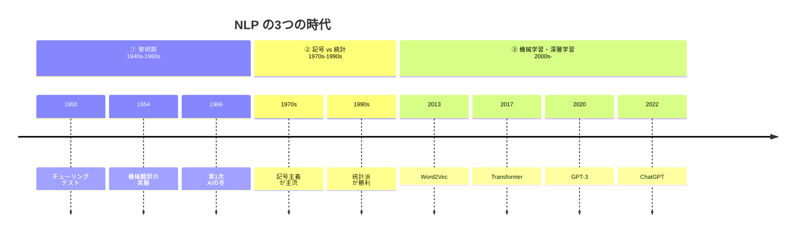
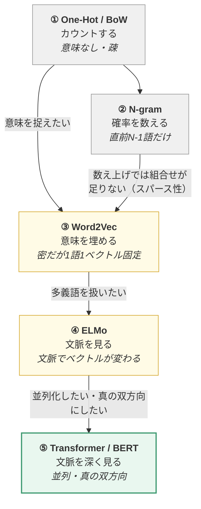
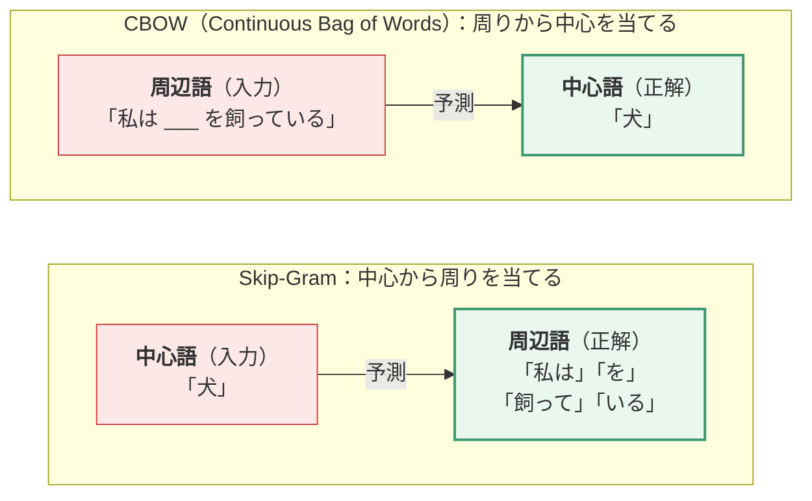

> **この章のゴール**：「言葉をコンピュータで扱う」という分野の全体像と歴史、そして「単語をベクトルにする技術」がどう進化してきたかを理解する。

---

## 1.1 NLP とは何か

**NLP（Natural Language Processing / 自然言語処理）** とは、
人間が普段使っている言葉（＝自然言語）を、コンピュータに理解・解釈・生成させる技術分野です。

「自然言語」という言い方は、Python や C++ のような **人工言語（プログラミング言語）** と区別するための呼び方です。

### なぜ難しいのか

プログラミング言語は文法が厳密で曖昧さがありませんが、自然言語には次の困難があります。

| 困難 | 例 |
|------|-----|
| **曖昧性（Ambiguity）** | 「彼女は美しい水着の女性を見た」→ 美しいのは水着？女性？ |
| **多義性（Polysemy）** | 「はし」＝ 橋 / 箸 / 端。「bank」＝ 銀行 / 土手 |
| **文脈依存** | 「それ、取って」の「それ」は状況次第 |
| **省略** | 日本語は主語をよく省略する |
| **比喩・皮肉** | 「最高だね（棒読み）」は褒めていない |
| **常識の必要性** | 「コップを落とした。だから」→ 割れた、と分かるには物理常識が要る |

LLM が「賢く見える」のは、これらを大量のデータから暗黙的に学習しているからです。

---

## 1.2 NLP の発展の歴史

NLP の歴史は大きく3期に分かれます。



| 時代 | 何が起きたか |
|------|------------|
| **① 黎明期**（1940s〜60s） | 暗号解読技術から機械翻訳研究が始まる。チューリングテストの提案（1950）。期待が過剰になり、辞書の単純置換では翻訳できないと判明して資金打ち切り（**第1次AIの冬**） |
| **② 記号 vs 統計**（1970s〜90s） | 「人間がルールを全部書く」記号主義と、「大量テキストから確率を数える」統計的手法が対立。計算機の性能向上とデータ増加により、**統計派が勝利**（N-gram の時代） |
| **③ 機械学習・深層学習**（2000s〜） | ニューラルネットで性能が飛躍。Word2Vec（2013）→ Transformer（2017）→ GPT-3（2020）→ ChatGPT（2022） |

### ① 黎明期（1940年代〜1960年代）

- 第二次大戦の暗号解読技術の流れで、**機械翻訳**の研究が始まる（ロシア語→英語）
- **1950年：チューリングテスト**。アラン・チューリングが「機械が人間と区別できない会話をできれば、それは知能だ」と提案
- 期待が過剰に高まったが、辞書を単純に置き換えるだけでは翻訳できないと判明し、資金が打ち切られる（**第1次AIの冬**）

### ② 記号主義 vs 統計的手法（1970年代〜1990年代）

研究者が2派に分かれた時代です。

| 派閥 | 考え方 | 弱点 |
|------|-------|------|
| **記号主義（ルールベース）** | 言語には文法規則がある。人間が全部ルールを書けば処理できる | 例外が無限にあり、書ききれない |
| **統計的手法** | 大量のテキストから「この単語の次はこの単語が来やすい」という確率を数える | データと計算力が必要 |

計算機の性能向上とデータの増加により、**最終的に統計派が勝利**します。
この時代の代表が次節で説明する **N-gram モデル** です。

### ③ 機械学習・深層学習（2000年代〜現在）

ニューラルネットワークによって、性能が飛躍的に向上しました。

> 📝 **ニューラルネットワーク**＝「入力の数字たちに重みを掛けて足し、変換する」という計算を
> 何段も重ねたものです。その1段1段を**層（layer）**と呼び、重ねるほど複雑なパターンを捉えられます。
> 仕組みの詳細は [00.5章](https://zenn.dev/thirtypower/books/kgr-llm-guide/viewer/005-deep-learning-basics) と [02.5章](https://zenn.dev/thirtypower/books/kgr-llm-guide/viewer/025-transformer-block) で扱います。

| 年 | 出来事 | 意味 |
|----|-------|------|
| 2003 | ニューラル言語モデル（Bengio） | 単語を密なベクトルで表す発想 |
| 2013 | **Word2Vec** | 単語ベクトルが実用レベルに |
| 2014 | Seq2Seq / RNN・LSTM の全盛 | 翻訳・要約が実用化 |
| 2015 | **Attention 機構**の提案 | 長文の情報損失を解決 |
| **2017** | **Transformer**（Attention Is All You Need） | 現在の全ての LLM の土台 |
| 2018 | **BERT** / **GPT-1** | 「事前学習 + 微調整」パラダイムの確立 |
| 2020 | **GPT-3**（1750億パラメータ） | 創発能力・文脈内学習の発見 |
| 2022 | **ChatGPT** | 一般社会への普及 |
| 2023〜 | LLaMA / Qwen / DeepSeek など | オープンソース LLM の隆盛 |

> 📝 **RNN**（Recurrent Neural Network）＝文を頭から1語ずつ読み、「ここまでの内容の要約」を
> 次の語の処理に引き継いでいく方式。**LSTM** はその改良版で、長い文でも要約を忘れにくくしたものです。

---

## 1.3 NLP の代表的なタスク 9 種

「NLP で何ができるのか」の一覧です。LLM 以前は、これらを**個別のモデル**で解いていました。
LLM 時代の大きな変化は、**これら全部を1つのモデルが会話形式でこなせるようになった**ことです。

### 1.3.1 分かち書き（Word Segmentation）

英語は `I love natural language processing` のように**スペースで単語が区切られています**が、
日本語には区切りがありません。

```
日本語： 私は自然言語処理が好きです
分かち書き後： 私 / は / 自然言語処理 / が / 好き / です
```

日本語では **形態素解析** と呼び、MeCab・Janome・SudachiPy などのツールが有名です。
区切り方を間違えると後の処理が全部おかしくなるため、非常に重要な前処理でした。

> 💡 **LLM 時代のポイント**：現代の LLM はこの処理を**サブワード分割（次項）で吸収**しており、
> 形態素解析器を使わないのが普通です。

### 1.3.2 サブワード分割（Subword Tokenization）

**現代の LLM で実際に使われている方式**なので、ここは重要です。

単語をそのまま辞書に入れると、次の問題が起きます。

- 語彙が爆発する（英語だけで数十万語、活用形を入れるともっと）
- 辞書にない単語（**未知語 / OOV: Out-Of-Vocabulary**）が処理できない

そこで、**単語をさらに細かい「部品」に割る**という発想が生まれました。

```
"unhappiness"  →  ["un", "happi", "ness"]
"tokenization" →  ["token", "ization"]
"自然言語処理"  →  ["自然", "言語", "処理"]
```

こうすると、
- 見たことのない単語も、既知の部品の組み合わせで表現できる
- 語彙サイズを数万程度に抑えられる
- `un-` が「否定」を意味することをモデルが学べる

主なアルゴリズム：

| 手法 | 概要 | 採用例 |
|------|------|-------|
| **BPE**（Byte Pair Encoding） | 最頻出の文字ペアを繰り返し1つに結合していく | GPT系、LLaMA、Qwen |
| **WordPiece** | BPE に似るが、結合の基準に尤度（ゆうど：そのデータが観測される「もっともらしさ」の度合い）を使う | BERT |
| **Unigram / SentencePiece** | 確率モデルで最適な分割を選ぶ | T5、多言語モデル |

→ **BPE を自分でゼロから実装する**手順は [02.6章](https://zenn.dev/thirtypower/books/kgr-llm-guide/viewer/026-tokenizer) で扱います。
　（「なぜ未知語が消えるのか」「なぜ日本語は英語よりトークン消費が多いのか」もそこで説明します）
→ ライブラリを使った実務的な訓練手順は [05章（後編）5.2](https://zenn.dev/thirtypower/books/kgr-llm-guide/viewer/05-2-pretrain-your-llm) です。

### 1.3.3 品詞タグ付け（POS Tagging）

各単語に「名詞」「動詞」「形容詞」などのラベルを付けるタスク。

```
私(代名詞) は(助詞) 本(名詞) を(助詞) 読む(動詞)
```

### 1.3.4 テキスト分類（Text Classification）

文章をあらかじめ決めたカテゴリに振り分けるタスク。NLP の最も基本的な応用。

- **感情分析（Sentiment Analysis）**：レビューが肯定的か否定的か
- **スパム判定**：メールが迷惑メールかどうか
- **トピック分類**：ニュース記事が政治/スポーツ/経済のどれか

### 1.3.5 固有表現抽出（NER: Named Entity Recognition）

文中から人名・地名・組織名・日付・金額などを抜き出すタスク。

```
「田中さんは2024年4月にトヨタ自動車へ入社した」
   ↓
田中     → 人名(PERSON)
2024年4月 → 日付(DATE)
トヨタ自動車 → 組織(ORG)
```

情報抽出や知識グラフ構築の基礎になります。

### 1.3.6 関係抽出（Relation Extraction）

抽出した固有表現どうしの**関係**を特定するタスク。

```
「田中さんはトヨタ自動車へ入社した」
   ↓
(田中, 勤務先, トヨタ自動車)
```

これを大量に集めると **知識グラフ（Knowledge Graph）** ができます。

### 1.3.7 文書要約（Summarization）

長い文章を短くまとめるタスク。2種類あります。

| 方式 | 内容 |
|------|------|
| **抽出型（Extractive）** | 原文から重要な文をそのまま選び出す。安全だが不自然になりがち |
| **生成型（Abstractive）** | 内容を理解して自分の言葉で書き直す。自然だが捏造のリスク |

LLM は生成型が得意です。

### 1.3.8 機械翻訳（Machine Translation）

ある言語を別の言語に変換するタスク。NLP 最古のテーマであり、
**Transformer はもともと機械翻訳のために作られた**モデルです。

### 1.3.9 質問応答（Question Answering）

質問に答えるタスク。方式が3つあります。

| 方式 | 内容 |
|------|------|
| **検索型（Retrieval-based）** | 文書を検索して該当箇所を抜き出す → 現在の **RAG** の原型 |
| **知識ベース型（Knowledge-based）** | 知識グラフに問い合わせる |
| **生成型（Generative）** | モデル自身の知識から文章を生成する → 現在の LLM |

---

## 1.4 テキスト表現（＝単語のベクトル化）の進化

**この章で一番重要なパート**です。
「言葉をどうやって数字にするか」の技術は、次のように進化してきました。



**各段階は「前の段階の限界を埋める」形で進化しています。**
矢印のラベルが、次の技術が生まれた動機です。

### 1.4.1 ベクトル空間モデル（Bag of Words）

最も素朴な方法は、**「語彙表の中で、その単語だけを1にする」** というものです。
これを **One-Hot 表現** と言います。

```
語彙 = [りんご, みかん, 犬, 猫, 走る]

りんご → [1, 0, 0, 0, 0]
みかん → [0, 1, 0, 0, 0]
犬     → [0, 0, 1, 0, 0]
```

文章を表すときは、単語の出現回数を数えます（**Bag of Words / BoW**）。

```
「犬が走る。犬が走る。」 → [0, 0, 2, 0, 2]
```

さらに、「よく出る単語ほど重要度を下げる」重み付けをしたものが
**TF-IDF**（Term Frequency-Inverse Document Frequency：その文書に多く出るが、
他の文書にはあまり出ない単語を重視する重み付け）です。

**この方式の欠点：**

| 欠点 | 説明 |
|------|------|
| **スパース（疎）すぎる** | 語彙10万語なら10万次元。ほとんどが 0 |
| **意味を全く捉えない** | 「りんご」と「みかん」の距離＝「りんご」と「走る」の距離。どちらも無関係扱い |
| **語順を無視する** | 「犬が猫を噛む」と「猫が犬を噛む」が同じベクトルになる |

### 1.4.2 N-gram 言語モデル

「次の単語を予測する」を、**確率の数え上げ**で実現する方法です。

考え方：**直前の N-1 個の単語だけを見て、次の単語の確率を決める**（マルコフ仮定）。

```
2-gram（bigram）の場合：
P(処理 | 言語) = 「言語 処理」の出現回数 ÷ 「言語」の出現回数

3-gram（trigram）の場合：
P(処理 | 自然 言語) = 「自然 言語 処理」の出現回数 ÷ 「自然 言語」の出現回数
```

> 📝 `P(A | B)` は「**B が起きたという条件のもとで、A が起きる確率**」と読みます
> （縦棒の左が知りたいもの、右が条件）。上の例なら「『言語』の次に『処理』が来る確率」です。

**この方式の欠点：**

- **データスパース性**：N を大きくすると、その並びがコーパスに1回も出てこなくなり確率0になる
- **長距離依存を捉えられない**：「私が昨日会った、赤い帽子をかぶった男性__は__」の主語を N=3 では追えない
- 語彙数^N のテーブルが必要でメモリを食う

> 💡 それでも「次の単語を予測する」という**タスク設定そのもの**は今の LLM と全く同じです。
> 手段が「数え上げ」から「ニューラルネット」に変わっただけ、と理解してください。

### 1.4.3 Word2Vec（2013年）— 意味をベクトルに埋め込む

**NLP の歴史を変えたブレイクスルー**です。

アイデア：**「似た文脈で使われる単語は、似た意味を持つ」**（分布仮説）

例えば「猫」と「犬」は、どちらも「〜がかわいい」「〜を飼う」「〜が鳴く」という文脈に出てきます。
だから両者は似たベクトルになるべきだ、という発想です。

学習方法は2種類：



この予測クイズを解くために、モデルは **「単語 ID → 数値列」の対応表を1枚持ちます**。
表の中身（数値）は最初はただの乱数で、予測を当てられるように少しずつ調整されていきます。

```
       単語ID          対応表（＝学習される重み行列）
        犬(0)  →  [ 0.21, -0.53, 0.88, ... ]   ← この1行が「犬」のベクトル
        猫(1)  →  [ 0.19, -0.48, 0.91, ... ]   ← この1行が「猫」のベクトル
        走る(2) → [-0.77,  0.32, -0.15, ... ]
          ⋮
```

学習が終わったとき、**この対応表の各行そのものが「意味を反映した単語ベクトル」**になっています。
——つまり、**ベクトルは予測練習の副産物**です。
「予測が上手くなるには、似た文脈に出る語を似た行にしておくのが得**だから**、そうなる」わけです。

> 🔗 **この「対応表」の実物が、後の章の Embedding 層です**（[02.5章 2.3.1](https://zenn.dev/thirtypower/books/kgr-llm-guide/viewer/025-transformer-block) の
> `nn.Embedding(32000, 768)`）。Word2Vec ではこの表を作ることが目的でしたが、
> **現代の LLM では同じ表が「モデルの入口の1枚目」として中に組み込まれ、本体と一緒に学習されます。**
> 別の技術に見えて、実体はまったく同じものです。

結果として、**200〜300次元の密なベクトル（Dense Vector）** が得られます。

```
犬  → [0.21, -0.53, 0.88, 0.11, ... ]   ← 300個の実数
猫  → [0.19, -0.48, 0.91, 0.08, ... ]   ← 犬と近い！
走る → [-0.77, 0.32, -0.15, 0.66, ...]   ← 遠い
```

有名な性質 —— **ベクトルの足し算引き算で意味の演算ができる**：

```
vec(王様) - vec(男) + vec(女) ≒ vec(女王)
vec(パリ) - vec(フランス) + vec(日本) ≒ vec(東京)
```

> 🤔 **なぜこうなるのか**：分布仮説の結果として、
> **「同じ種類の意味の違い」が「同じ向きの矢印」になる**からです。
>
> ```
>   男 ──────→ 女        この矢印（性別を変える差）が…
>   王様 ────→ 女王      …別のペアでもほぼ同じ向き・同じ長さになる
>   俳優 ────→ 女優
> ```
>
> なぜ揃うのかというと、`男/女`・`王様/女王`・`俳優/女優` の各ペアは
> **「性別に関する語だけが入れ替わり、他の文脈はほぼ共通」**という形でコーパスに現れるためです。
> だから「差」を取ると性別の成分だけが残る。
> `vec(女) − vec(男)` でその矢印を取り出し、`vec(王様)` に足せば `vec(女王)` の近くに着きます。
>
> **意味の"差"がベクトルの"向き"として表れている**——これが「意味をベクトルに埋め込めた」の実体です。
> （ただし常に綺麗に成り立つわけではなく、頻度の低い語では崩れます）

**Word2Vec の限界：**

- **1単語＝1ベクトル固定**。だから多義語を扱えない
  → 「川の **bank**（土手）で休む」も「**bank**（銀行）でお金をおろす」も、
    `bank` には**まったく同じ1本のベクトル**が割り当てられます。
    学習の結果できあがるのは「土手」と「銀行」の**平均**のような、
    どっちつかずのベクトルです
- 局所的な文脈（前後数語）しか見ない

### 1.4.4 ELMo（2018年）— 文脈で変わるベクトルへ

**ELMo（Embeddings from Language Models）** は、上の「多義語問題」を解決しました。

アイデア：**単語のベクトルを固定せず、文脈ごとに計算し直す**（＝**動的単語ベクトル**）。

```
「川の bank で休んだ」   → bank = [0.8, -0.2, ...]  （土手っぽいベクトル）
「bank に振込に行った」  → bank = [-0.3, 0.9, ...]  （銀行っぽいベクトル）
```

やり方：**双方向 LSTM（bi-LSTM）** を大量のテキストで言語モデルとして学習させ、
その中間層の出力を単語ベクトルとして使う。

そしてもう1つ重要なのが、ELMo が確立した使い方 ——

> **大量データで「事前学習（Pretrain）」→ 個別タスクで「微調整（Fine-tune）」**

この2段階のパラダイムが、この後の BERT / GPT / 現代の LLM すべてに受け継がれます。

**ELMo の限界：**
- LSTM は1語ずつ順番に処理する方式なので**並列化できず、遅い**
- 「双方向」といっても、左→右と右→左を別々に学習して繋げているだけで、真の双方向ではない

> 🤔 **「別々に学習して繋げるだけ」がなぜ"真"でないのか**
>
> **次の語を予測するモデルは、予測すべき語自身を絶対に見られません**（見たらカンニングです）。
> だから ELMo の2本の LSTM は、どちらも**片側しか見ていない状態で答えを出します**。
>
> ```
> 文：  川 の bank で 休んだ
>
> 左→右の LSTM が bank を処理するとき見えるもの:  川 の ___          （右が見えない）
> 右→左の LSTM が bank を処理するとき見えるもの:        ___ で 休んだ  （左が見えない）
>                                                        ↓
>                        別々に出した2つの答えを、最後に「くっつける」だけ
> ```
>
> つまり **「左だけを見た意見」と「右だけを見た意見」の合体**であって、
> 「左右を同時に見ながら1つの判断をした」わけではありません。
> 「川の」と「で休んだ」を**同時に**踏まえて初めて「これは土手だ」と確定できるのに、
> その"同時"ができていないのです。
>
> これを解決したのが次章以降の **BERT の穴埋め（MLM）**です。
> 予測対象を `[MASK]` という別の記号に置き換えてしまえば、
> **カンニングの心配なく左右を同時に見られます**（→ [03章 3.1.1](https://zenn.dev/thirtypower/books/kgr-llm-guide/viewer/03-pretrained-models)）。
> 「なぜ BERT はわざわざ穴を空けるという面倒な学習をするのか」の答えがこれです。

→ **この2つの限界を解決したのが、次章の Transformer です。**

---

## この章のまとめ

- NLP は「曖昧で文脈依存な人間の言葉」をコンピュータに扱わせる分野
- 歴史は **ルールベース → 統計 → ニューラルネット** と進んだ
- 現代の LLM で使われるトークン化は **サブワード分割（BPE など）**
- 単語のベクトル表現は
  **One-Hot（意味なし）→ Word2Vec（意味あり・固定）→ ELMo（文脈で変わる）** と進化した
- ELMo が確立した「**事前学習 → 微調整**」が現代 LLM の基本パラダイム

## 理解度チェック

1. サブワード分割を使うと、何が嬉しいか2つ挙げられますか？
2. One-Hot 表現と Word2Vec の決定的な違いは何ですか？
3. Word2Vec が「銀行 / 土手」を区別できないのはなぜですか？
4. N-gram モデルの2つの弱点は何ですか？
5. ELMo が現代の LLM に残した、最も重要な「使い方」は何ですか？

<details>
<summary><b>▶ 解答を見る</b></summary>

1. 次のうち2つ挙げられていれば正解です。
   - **未知語（OOV）が減る**：見たことのない単語も、既知の部品の組み合わせで表現できる
   - **語彙サイズを抑えられる**：数十万語 → 数万語に圧縮でき、Embedding 行列が小さくなる
   - **接頭辞・接尾辞の意味を学べる**：`un-` が否定を意味することをモデルが学習できる
2. **意味を捉えているかどうか**です。One-Hot は「どの単語か」を示すだけの記号で、
   「りんご」と「みかん」の距離＝「りんご」と「走る」の距離になってしまいます（どちらも無関係扱い）。
   Word2Vec は**似た文脈に現れる単語が似たベクトルになる**ため、意味的な近さが距離として表現されます。
   加えて、One-Hot は語彙数と同じ次元の**疎（スパース）**なベクトル、Word2Vec は数百次元の**密（デンス）**なベクトル、という違いもあります。
3. **1単語につき1本のベクトルしか持たないから**です。学習が終わった時点で `bank` のベクトルは固定され、
   文脈によって変わりません。結果、「土手」と「銀行」の**平均のような、どっちつかずのベクトル**になります。
   この多義語問題を解決したのが、文脈ごとにベクトルを計算し直す ELMo です。
4. - **データスパース性**：N を大きくすると、その並びがコーパスに1回も出現せず確率が 0 になってしまう
   （さらに 語彙数^N のテーブルが必要でメモリも食う）
   - **長距離依存を捉えられない**：直前 N-1 語しか見ないので、離れた位置にある主語などを追えない
5. **「大量データで事前学習（Pretrain）→ 個別タスクで微調整（Fine-tune）」という2段階のパラダイム**です。
   ELMo が確立したこの使い方が、BERT・GPT を経て現代の LLM すべてに受け継がれています。

</details>

---

**次へ** → [02. Transformer アーキテクチャ](https://zenn.dev/thirtypower/books/kgr-llm-guide/viewer/02-transformer-attention)
