> **この章のゴール**：現代のあらゆる LLM の土台である **Attention** を理解する。
> **この章が一番重要で、一番難しい**です。1回で分からなくても普通なので、繰り返し読んでください。
>
> 🔗 **この章は Attention だけ**を扱います。
> FFN・Layer Norm・残差接続・Encoder / Decoder による**組み立て**は
> **[02.5. Transformer ブロックを組み立てる](https://zenn.dev/thirtypower/books/kgr-llm-guide/viewer/025-transformer-block)** に続きます。
>
> 📎 **対応コード**：[`code/02_attention_step_by_step.py`](https://github.com/thirtypower/kgr-llm/blob/main/code/02_attention_step_by_step.py)
> 4トークン×4次元という**手で追える大きさ**で、Attention の途中の行列を全部表示します。
> **数式だけ見ても Attention は絶対に腹落ちしません。**
> 一度読んで分からなかったら、このコードを動かしてから読み直してください。
>
> ```bash
> cd code && python 02_attention_step_by_step.py
> ```

2017年、Google の論文 **「Attention Is All You Need」** で発表されたモデルです。
GPT も Claude も LLaMA も、全てこの Transformer の派生形です。

---

## 2.1 注意機構（Attention）

### 2.1.1 Attention とは何か

**Attention（注意機構）** は、
**「文中の各単語が、他のどの単語をどれだけ参照すべきかを計算する仕組み」** です。

なぜ必要か、例で考えます。

```
① 彼は 電話  を かけた   →  「かけた」＝ 通話する
② 彼は メガネ を かけた   →  「かけた」＝ 装着する
③ 彼は 保険  を かけた   →  「かけた」＝ 契約する
```

**「かけた」という単語は3文とも完全に同じ**です。文字も、語順も同じ。
それなのに意味は全く違います。

では、何が意味を決めているのか。**直前の目的語**（電話／メガネ／保険）です。

> 🔑 **「かけた」の意味を確定させるには、「かけた」自身を見ても分からない。
> 文中の他の単語を見に行くしかない。**
>
> しかも「どの単語を見るべきか」は文ごとに変わります。
> ①なら「電話」、②なら「メガネ」。位置が同じでも中身が違えば、取り込む意味も変わる。

「じゃあ *直前の単語* を見ればいいのでは？」——それでは足りません。

```
④ 彼は 昨日 駅前 で 母親 に 電話 を かけた
```

④で「かけた」が本当に見るべきは、直前の「を」ではなく、**5語前の「電話」**です。
一方「母親」は *誰に* を教えてくれるので、これも少しは見る価値がある。
つまり必要なのは「直前を見る」ではなく——

> **文中の全単語を見渡して、どれをどれだけ参照すべきかを、その場で決める。**

これを機械的に計算する仕組みが **Attention** です。
「見るべき相手を、固定のルールではなく計算で決める」——ここが Transformer の発明でした。

### 2.1.2 Q・K・V の考え方（検索エンジンのたとえ）

前節で「**かけた**」は「**メガネ**」を見に行く必要がある、と分かりました。
この「見に行く」を計算にするのが **Query（クエリ）・Key（キー）・Value（バリュー）** の3役です。

#### やりたいことは、要するに「検索」

「かけた」がやろうとしているのは、**文中の全単語を対象にした検索**です。

> **「かけた」の検索ワード ＝「私の意味を決めてくれる語はどれ？」**

なので、検索エンジンの3点セットがそのまま当てはまります。

| 検索エンジン | Attention での名前 | 誰が出すか |
|---|---|---|
| 検索窓に打ち込む言葉 | **Query** | **探す側**が出す「こういうのを探している」 |
| 各ページのタイトル・タグ | **Key** | **探される側**が出す「私はこういうページです」 |
| 各ページの本文 | **Value** | ヒットしたとき、実際に**受け取る中身** |

検索エンジンは Query と Key を照合して **関連度スコア** を出します。
**完全一致でなくてもヒットする**——ここが重要です。

ただし1点だけ、検索エンジンと違います。

> **検索エンジンは「上位1件を開く」。
> Attention は「全部のページを、関連度の比率で混ぜて1つの答えにする」。**

#### 「メガネをかけた」で具体的にやる

文：`彼 / は / メガネ / を / かけた`

「かけた」が Query を出し、**自分を含めた全単語の Key** と照合します。

> 📝 **下の表の数字（0.70 など）は、話を分かりやすくするために置いた「例示の値」です。**
> 実際の計算で出た値ではありません（本物の計算は 2.1.4 で電卓で追います）。
> ここでは「メガネが強くヒットし、合計が 1.00 になる」という**形**だけ見てください。

| 照合相手 | その単語の Key（＝検索用のタグ） | 「かけた」の Query との関連度 |
|---|---|---|
| **メガネ** | 「私は身につける道具です」 | **0.70** ← 強くヒット |
| 彼 | 「私は人、動作をする側です」 | 0.10 |
| かけた（自分自身） | 「私は動作です」 | 0.10 |
| を | 「私は目的語の印です」 | 0.06 |
| は | 「私は主題の印です」 | 0.04 |
| | | **合計 1.00** |

> 自分自身も照合相手に含まれます（**自分を0.10だけ残す**）。
> 元の意味を完全に捨てるのではなく、そこに文脈を混ぜ込むイメージです。
> 関連度は softmax で必ず**合計1.00**になります（2.1.3 で計算します）。

そして、この関連度を重みにして **Value（中身）を混ぜます**。

```
「かけた」の新しいベクトル
   = 0.70 × V_メガネ ＋ 0.10 × V_彼 ＋ 0.10 × V_かけた ＋ 0.06 × V_を ＋ 0.04 × V_は
   ≒ 中身の7割が「メガネ」の情報
```

計算後の「かけた」は、もう辞書的な「かけた」ではありません。
**「メガネの情報を7割吸い込んだ かけた」** ＝ *装着する* の意味に寄ったベクトルです。

①の文（`電話 を かけた`）で同じ計算をすれば、7割が「電話」の情報になり、
*通話する* の意味に寄ります。

> 🔑 **同じ単語が、周りの単語しだいで違うベクトルになる。**
> これが「文脈を理解した」の実体です。Attention はこれを起こすための計算です。

#### 図で追う

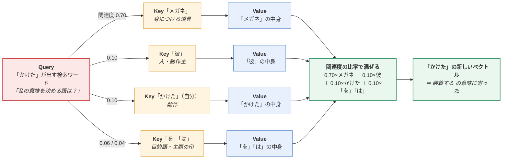

> **Query が照合するのは Key だけ。混ぜられるのは Value だけ。**
> Q と K は「マッチングのため」、V は「実際に運ばれる荷物」。役割が完全に別です。

#### ⚠️ 一番の落とし穴：Q・K・V は「3つの別データ」ではない

検索エンジンでは、検索ワードとページは**別々に存在**します。
しかし Attention では違います。

> **Q・K・V は、1つの単語ベクトルから掛け算で作った「3つの顔」です。**

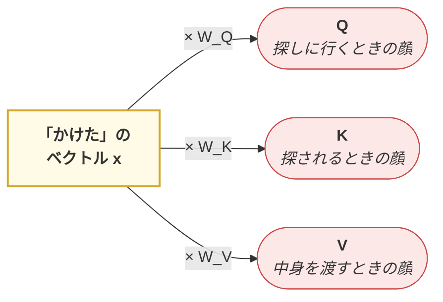

つまり、

- **全単語が Q・K・V を3つとも持っている。**
  「かけた」も Key を持つし、「メガネ」も Query を持って別の語を探しに行く。
- `W_Q`, `W_K`, `W_V` は**学習で決まる行列**。
  → **どんな検索ワードを出すか・どんなタグを掲げるかも、モデルが学習する。**

ここが「単語ベクトルをただ比べる」のと決定的に違うところです。
具体的な図解は [2.1.6 自己注意](#216-自己注意self-attention) で扱います。

<details>
<summary>❓ なぜ Key と Value を分けるの？ 同じ単語なんだから1つでいいのでは</summary>

**「見つけてもらうための情報」と「渡したい情報」は別物**だからです。

Web ページも、検索でヒットさせるための *タイトル・タグ* と、
読者が本当に読みたい *本文* は別々に書きますよね。

「メガネ」という単語も同じで、

- **Key** としては「私は身につける道具カテゴリです」という
  **検索されやすい特徴**を出したい
- **Value** としては「視力を補正する / 顔に装着する / 割れやすい」といった
  **中身の意味**を渡したい

K と V を別々の行列（`W_K` と `W_V`）で作ることで、
**「どう見つけてもらうか」と「何を渡すか」をモデルが独立に学習できる**ようになります。

もし K と V が同じだったら、「見つけやすさ」を上げると「渡す中身」まで
歪んでしまい、両立できません。
</details>

### 2.1.3 数式にする

**ステップ1：類似度を測る**

2つのベクトルの「向きの近さ」は **内積（dot product）** で測れます。

```
score(Q, K) = Q · Kᵀ
```

> 📝 `ᵀ` は**転置**（行と列を入れ替える）です（→ [00.5章 0.3節](https://zenn.dev/thirtypower/books/kgr-llm-guide/viewer/005-deep-learning-basics)）。
> K を転置するのは、**全部の Query と全部の Key の内積を、行列の掛け算1発で
> 総当たり計算する**ためです。トークンが1個ずつなら、ただの内積と同じことです。

**ステップ2：スケーリング**

ベクトルの次元 `d_k` が大きいと内積の値が巨大になります。

> 📝 **なぜ次元が大きいと値が散らばるのか**：内積は `q₁k₁ + q₂k₂ + … + q_{d_k}k_{d_k}` という
> **d_k 個の項の足し算**です。そして [00.5章 0.6節](https://zenn.dev/thirtypower/books/kgr-llm-guide/viewer/005-deep-learning-basics) で見たとおり、
> **互いに無関係な数を n 個足すと、分散は n 倍になります**。
> 学習初期の Q・K の成分は互いに無関係で分散1程度なので、
> **内積の分散はちょうど d_k 倍**（＝散らばりが √d_k 倍）に膨らみます。
> だから `√d_k` で割ると、次元がいくつでも散らばりが同じに戻ります。


すると次の softmax が極端（ほぼ 0 か 1）になって学習が進まなくなります。
そこで `√d_k` で割って、散らばりを次元によらず一定に戻します。

```
score = (Q · Kᵀ) / √d_k
```

**ステップ3：softmax で確率にする**

合計が 1 になるように正規化します。これが **Attention 重み**です。

```
weight = softmax( (Q · Kᵀ) / √d_k )
```

**ステップ4：Value を重み付き平均する**

```
Attention(Q, K, V) = softmax( (Q · Kᵀ) / √d_k ) · V
```

これが Transformer の核となる式です。**この1行が LLM のすべての出発点**です。

4ステップを図にすると、こうなります。

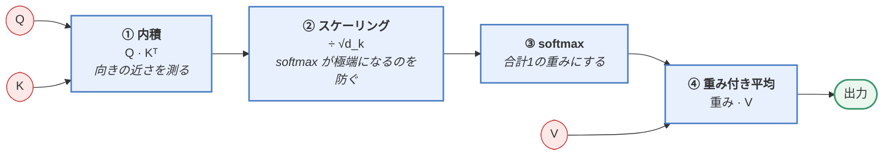

### 2.1.4 電卓だけで Attention を1回計算してみる

式を眺めるだけでは身につかないので、**2トークン・2次元**という最小サイズで
実際に1回計算します。紙と電卓で追えます。

**設定**：文は「メガネ かけた」の2トークン。
いま「**かけた**」が、どこをどれだけ見るべきかを計算します。

2次元しかないので、各次元に意味を与えておきます。

```
次元1 = 「モノらしさ」   次元2 = 「動作らしさ」
```

> 📝 **本来の手順との違い**：2.1.2 で見たとおり、Q・K・V は本来
> 「単語ベクトル x に W_Q・W_K・W_V を掛けて」作ります（例：`Q = x @ W_Q`）。
> ここでは**掛け算が終わった後の値を仮定して**、そこから先の4ステップに集中します。
> 例えば x_かけた = [1, 1]、W_Q = [[2, 0], [0, 0]] なら
> Q = 1×2+1×0, 1×0+1×0 = [2, 0] ——下の値はこうして出てきたものだと思ってください。

```
「かけた」の Query:  Q = [2, 0]     ← 「モノを探している」という向き

各トークンの Key:    K_メガネ = [1, 0]    ← 私はモノです
                     K_かけた = [0, 1]    ← 私は動作です

各トークンの Value:  V_メガネ = [10, 0]   ← 「メガネ」が渡せる情報
                     V_かけた = [0, 10]   ← 「かけた」自身の情報
```

**ステップ1：内積で類似度**（掛けて足すだけ。[00.5章 0.2節](https://zenn.dev/thirtypower/books/kgr-llm-guide/viewer/005-deep-learning-basics)）

```
Q · K_メガネ = 2×1 + 0×0 = 2       ← 向きが合っている（探しているのはコレ）
Q · K_かけた = 2×0 + 0×1 = 0       ← 直交（＝無関係）
```

**ステップ2：√d_k で割る**（d_k = 2 なので √2 ≈ 1.41）

```
2 ÷ 1.41 = 1.41
0 ÷ 1.41 = 0
```

**ステップ3：softmax で確率に**（全部 exp して、合計で割る）

```
exp(1.41) = 4.10        exp(0) = 1.00       合計 5.10

重み： 4.10 / 5.10 = 0.80        1.00 / 5.10 = 0.20
```

**ステップ4：Value を重み付き平均**

```
出力 = 0.80 × V_メガネ + 0.20 × V_かけた
     = 0.80 × [10, 0] + 0.20 × [0, 10]
     = [8.0, 2.0]
```

**結果を読む**：「かけた」の新しいベクトル `[8.0, 2.0]` は、
**8割が「メガネ」の情報、2割が自分自身の情報**でできています。

もとの「かけた」は `[0, 10]`（純粋な動作）でした。
それが計算後には `[8.0, 2.0]`（＝ほぼ「メガネ」寄り）に変わった。
**「かけた」のベクトルに「メガネ」の意味が混ざり込んだ**——
これが 2.1.2 で言った「文脈を理解した」の、数字で見た実体です。

> もし文が「電話 かけた」なら、同じ計算で `V_電話` が8割入ります。
> **式は1文字も変えていないのに、出てくるベクトルが変わる。**

> ✅ 今やった4ステップ（内積 → √d_k で割る → softmax → 重み付き平均）が
> Attention の**全て**です。実物は次元が 4096、トークンが数千個になるだけで、
> 計算は1文字も変わりません。
>
> 💻 4トークン×4次元で全行列を表示しながら同じことをやるのが
> [`code/02_attention_step_by_step.py`](https://github.com/thirtypower/kgr-llm/blob/main/code/02_attention_step_by_step.py) です。

### 2.1.5 PyTorch での実装

驚くほど短く書けます。

```python
import torch
import torch.nn.functional as F
import math

def attention(query, key, value, mask=None):
    # query, key, value: (batch, seq_len, d_k)
    d_k = query.size(-1)

    # ① 内積で類似度 → ② √d_k でスケーリング
    scores = torch.matmul(query, key.transpose(-2, -1)) / math.sqrt(d_k)

    # （必要なら）マスクを適用：見てはいけない場所を -∞ にする
    #   ※ この3行の意味は 2.1.7 で説明します。今は読み飛ばしてOK
    if mask is not None:
        scores = scores.masked_fill(mask == 0, float('-inf'))

    # ③ softmax で重みに変換
    weights = F.softmax(scores, dim=-1)

    # ④ Value を重み付き平均
    return torch.matmul(weights, value)
```

---

### 2.1.6 自己注意（Self-Attention）

ここまでは **「かけた」1語の視点** だけで見てきました。
この節で足すのは、たった1つです。

> **これを、全単語が同時にやる。**

#### 「自己（Self）」とは何が Self なのか

**Self-Attention（自己注意）** の "Self" は、
**Q・K・V の取り出し元が、すべて同じ1つの文である**という意味です。

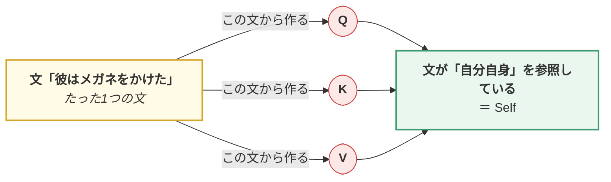

| | Query の出どころ | Key・Value の出どころ |
|---|---|---|
| **Self-Attention** | その文自身 | **同じ文** |
| **Cross-Attention**（[02.5章 2.2.6](https://zenn.dev/thirtypower/books/kgr-llm-guide/viewer/025-transformer-block#226-decoder-の構造)） | 出力側の文（例：英語） | **別の文**（例：日本語の原文） |

> ⚠️ **よくある誤解**：「X に W_Q, W_K, W_V を掛けて3つ作るのが Self の意味」ではありません。
> **その掛け算は Cross-Attention でもやります**（Q は出力側の文に、K・V は入力側の文に掛ける）。
> **Self と Cross を分けているのは「どの文から取ってくるか」だけ**です。

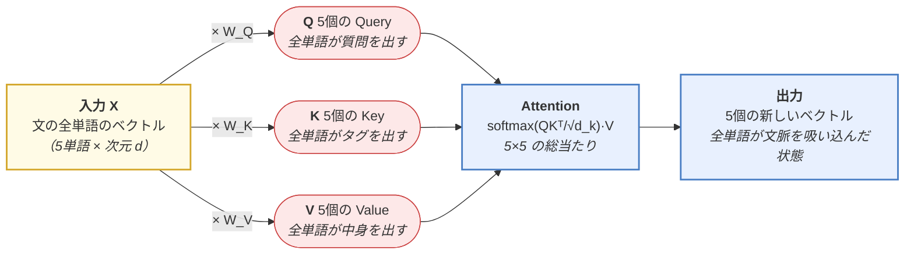

`W_Q`, `W_K`, `W_V` は学習される重み行列（2.1.2 の「3つの顔」）。
**入力5単語なら、Q も K も V も5個ずつ**できます。

#### 全単語が同時に質問する ＝ 総当たり表になる

5単語それぞれが Query を出し、5単語すべての Key と照合するので、
関連度は **5×5 の表** になります。これが **Attention 重み行列**です。

```
                    ← Key（見られる側）→
              彼     は   メガネ   を   かけた   ：合計
     ┌ 彼    0.45  0.20   0.15  0.05   0.15  ＝ 1.00
Query│ は    0.35  0.30   0.20  0.05   0.10  ＝ 1.00
（見 │メガネ 0.15  0.05   0.45  0.10   0.25  ＝ 1.00
る側）│ を    0.05  0.05   0.45  0.20   0.25  ＝ 1.00
     └かけた 0.10  0.04   0.70  0.06   0.10  ＝ 1.00
                            ↑
                  2.1.2 で見たのは、この1行だけ
```

> 📖 **表の読み方**：**行が「質問する側」、列が「見られる側」**。
> 一番下の行が 2.1.2 の表そのものです。Self-Attention は、
> **この行を全単語ぶん、まとめて計算している**だけです。
>
> 各行の合計が必ず 1.00 になるのは、行ごとに softmax をかけているからです。
>
> ⚠️ **この 25 個の数字も 2.1.2 と同じ「例示の値」です**（電卓で検算しようとしないでください）。
> 本物の計算は **[2.1.4](#214-電卓だけで-attention-を1回計算してみる)**（すでに読んだ節）で、
> 2トークン×2次元の最小サイズで最後まで追いました。

そして出力も5個。**全単語が「他をどれだけ見たか」に応じて更新されます**。

```
「かけた」→ メガネの情報を7割吸って、意味が「装着する」に確定
「メガネ」→ かけたの情報を2.5割吸って、「かけられる物」という役割を獲得
「彼」   → 自分中心のまま（0.45）、文の主語という位置づけを保つ
```

> 🔑 **1語だけが賢くなるのではなく、5語すべてが同時に文脈込みの表現になる。**
> これが Self-Attention 層の仕事です。

#### なぜこれが速いのか

> 🔑 **重要**：上の 5×5 の表は、**行列の掛け算1回**（`Q @ Kᵀ`）で全マスが同時に埋まります。
> RNN のように「彼 → は → メガネ → …」と1個ずつ順番に処理する必要がありません。
>
> | | 計算の進み方 | GPU との相性 |
> |---|---|---|
> | RNN | 1単語ずつ順番（前の結果を待つ） | ✗ 並列化できない |
> | Self-Attention | 全単語を1回の行列積で同時に | ✓ 猛烈に速い |
>
> **これが Transformer が RNN に勝った最大の理由**です。
> 一方で総当たりなので、計算量は単語数の**2乗**（5単語なら25マス、1000単語なら100万マス）。
> **これが「LLM のコンテキスト長がなかなか伸びない」理由そのもの**で、
> この1行がこの先ずっと効いてきます。
>
> | 対策 | どこで扱うか |
> |---|---|
> | GQA・Flash Attention | [05章 5.1.4](https://zenn.dev/thirtypower/books/kgr-llm-guide/viewer/05-build-your-own-llm) |
> | MLA・sliding window・線形 Attention | [05.5章 5.5.2/5.5.4](https://zenn.dev/thirtypower/books/kgr-llm-guide/viewer/055-moe-modern-arch) |
> | KV キャッシュと、その限界（実測） | [07.5章 7.5.2](https://zenn.dev/thirtypower/books/kgr-llm-guide/viewer/075-fast-inference) |

---

### 2.1.7 マスク付き自己注意（Masked Self-Attention）

**GPT 系の LLM で必ず使われる**仕組みです。

言語モデルは「次の単語を予測する」訓練をします。
このとき、**未来の単語が見えてしまってはカンニング**になります。

```
「今日は 良い 天気 です」を学習するとき

「今日は」の位置では → 「良い」以降を見てはいけない
「良い」の位置では   → 「天気」以降を見てはいけない
```

#### ❓ 入力を途中で切れば済む話ではないのか

素朴に考えると「今日は」だけを入力して「良い」を当てさせ、
次に「今日は 良い」を入力して「天気」を当てさせれば、マスクは要らないように見えます。
それでも学習はできますが、**1文につき、長さと同じ回数だけ forward** が必要になります。

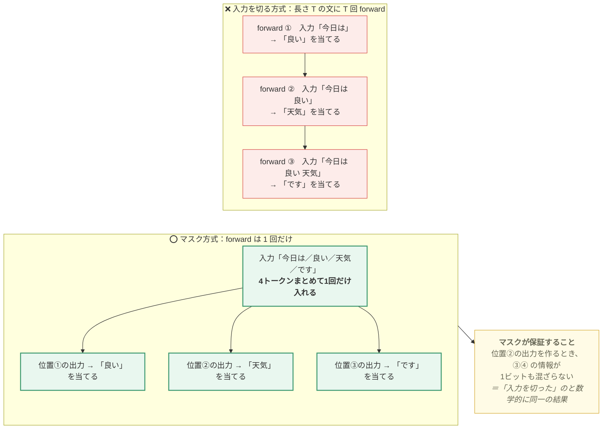

> 🔑 **マスクは「カンニング防止」の道具である以上に、
> 「1回の forward で全位置ぶんの学習を同時にやる」ための道具です。**
> 学習コストが T 分の1になるので、これが無ければ現在の規模の事前学習は成立しません。
> 正解が「入力を1つ後ろにずらしたもの」になる理由は
> → [00.5章 6節](https://zenn.dev/thirtypower/books/kgr-llm-guide/viewer/005-deep-learning-basics#6-次トークン予測の損失計算llm-の実体)

#### やり方：スコア行列の右上三角を −∞ にする

Attention のスコア行列の **右上三角（未来の部分）を -∞ にします**。
softmax を通すと `exp(-∞) = 0` なので、重みがちょうど 0 になります。

**手順は3ステップだけ**です。数字を入れて追いかけます（値は例示）。

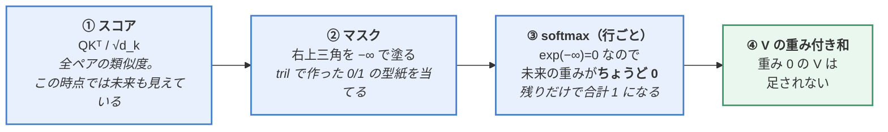

```
① スコア（マスク前）                    ② マスク後（右上を −∞）
        今日は  良い  天気  です                 今日は  良い  天気  です
今日は  [ 2.0   1.0   0.5   0.1 ]        今日は  [ 2.0   -∞    -∞   -∞ ]
良い    [ 1.0   3.0   1.5   0.2 ]   →    良い    [ 1.0   3.0   -∞   -∞ ]
天気    [ 0.5   2.0   2.5   1.0 ]        天気    [ 0.5   2.0   2.5  -∞ ]
です    [ 0.3   1.0   2.0   3.0 ]        です    [ 0.3   1.0   2.0  3.0 ]

③ softmax（行ごとに合計 1.000）
        今日は  良い  天気  です     合計
今日は  [1.000  0.000 0.000 0.000]   1.000   ← 自分しか見えない
良い    [0.119  0.881 0.000 0.000]   1.000
天気    [0.078  0.348 0.574 0.000]   1.000
です    [0.043  0.086 0.234 0.637]   1.000   ← 全部見える
```

この表の読み方で押さえるべき点が3つあります。

| 気づき | 意味 |
|--------|------|
| **1行目が `1.000` 1個だけ** | 先頭トークンの出力は「自分の V そのまま」。文脈が無いので当然です |
| **0 が入っても行の合計は必ず 1** | −∞ を入れたのは softmax の**前**なので、生き残った項だけで正規化されます。「後から 0 を掛ける」のでは合計が 1 になりません（★ここが実装ミスの定番） |
| **下の行ほど見える相手が多い** | 同じ1回の forward の中で、各位置が「そこまでの文脈」だけを使えています |

```python
# 上三角マスクの作り方
mask = torch.tril(torch.ones(seq_len, seq_len))  # 下三角が1、上三角が0
scores = scores.masked_fill(mask == 0, float('-inf'))
```

> ⚠️ **実装の注意3点**
> 1. **マスクは softmax の前**に掛けます（上の表の通り。後ろだと合計が 1 になりません）
> 2. この教材のコードは全部 `float('-inf')` を使っています。
>    **因果マスクでは必ず自分自身が見える**ので、行が全部 −∞ になることが無く、安全です。
>    危ないのは**パディング用のマスクを併用したとき**——行が全部 −∞ になると
>    softmax が NaN を返します。Hugging Face のような実装が −∞ の代わりに
>    `torch.finfo(scores.dtype).min`（その型で表せる最小の有限値）を使うのは、この保険です
> 3. PyTorch なら `F.scaled_dot_product_attention(q, k, v, is_causal=True)` で
>    マスク作りごと任せられます（→ 05章 5.1.4 の Flash Attention）

| 呼び方 | 意味 |
|--------|------|
| **Causal Attention（因果的注意）** | 同じもの。「原因は過去にしかない」という意味 |
| **Bidirectional Attention（双方向注意）** | マスクを掛けないもの。BERT が使う |

→ この違いが、第3章の **BERT（双方向）vs GPT（因果的）** の分岐点になります。

---

### 2.1.8 多頭注意（Multi-Head Attention）

Attention を **1セットだけでなく、複数セット並列に走らせます**。

なぜか？ 言葉の関係には**いろんな種類**があるからです。

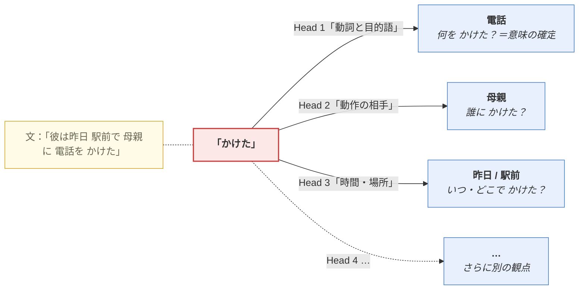

「かけた」1語をとっても、**知りたいことは1つではありません**。
*何を* かけたのか（意味の確定）、*誰に* か、*いつ* か——
1つの Attention では「一番強い1種類の関係」しか拾えないので、**8個や16個を並列に用意**します。

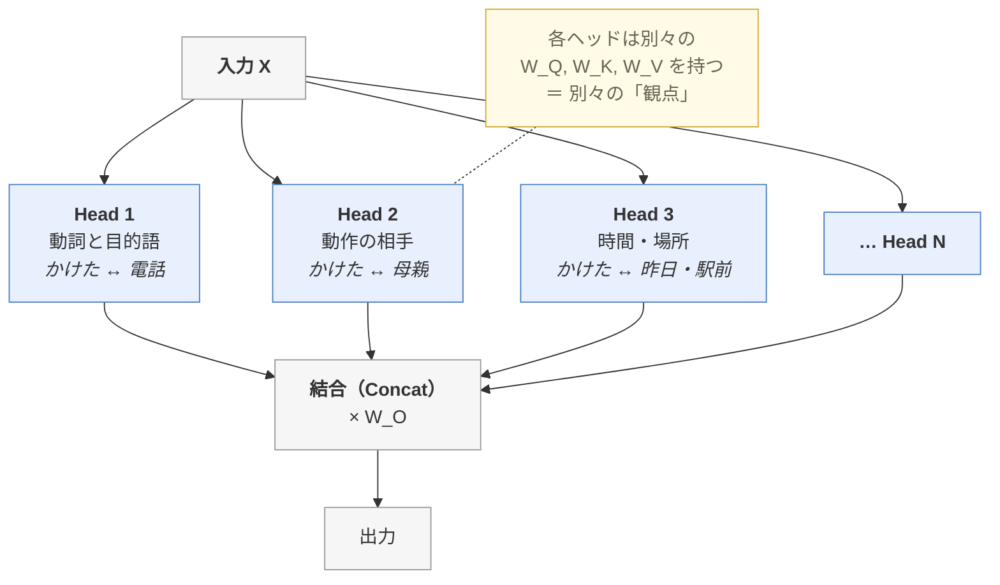

#### ❓「ヘッド1つ」とは、正確には何のことか

**ヘッド1つ ＝ `W_Q`・`W_K`・`W_V` の1セット（3つで1組）**です。
`W_Q` だけを指すのではありません。

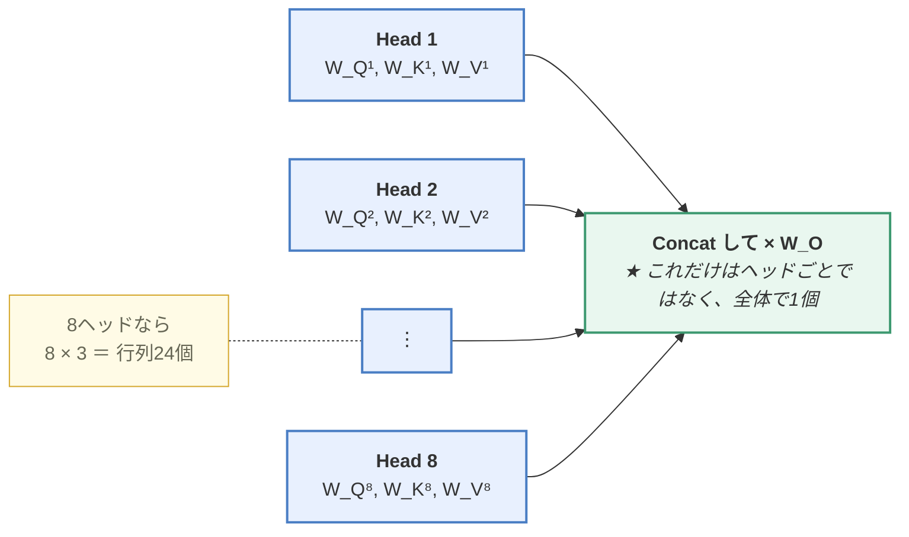

> ⚠️ **`W_O` だけは例外**です。ヘッドごとには持たず、
> 全ヘッドの出力をつなげた後に**1回だけ**掛けます。
> 「各ヘッドが出した結論を、どう混ぜて使うか」を学習する行列です。

#### 実装上のポイント：次元を分割して使う

`d_model = 768`、`n_heads = 12` なら、各ヘッドは `768 / 12 = 64` 次元を担当します。

ここで下のコードを見ると **`wq` が1個しかない**ことに気づくはずです。
「各ヘッドが別々の `W_Q` を持つ」はずなのに、なぜ12個ないのか。

> 🔑 **答え：大きい行列1個の中に、12個ぶんが横に並んで入っています。**

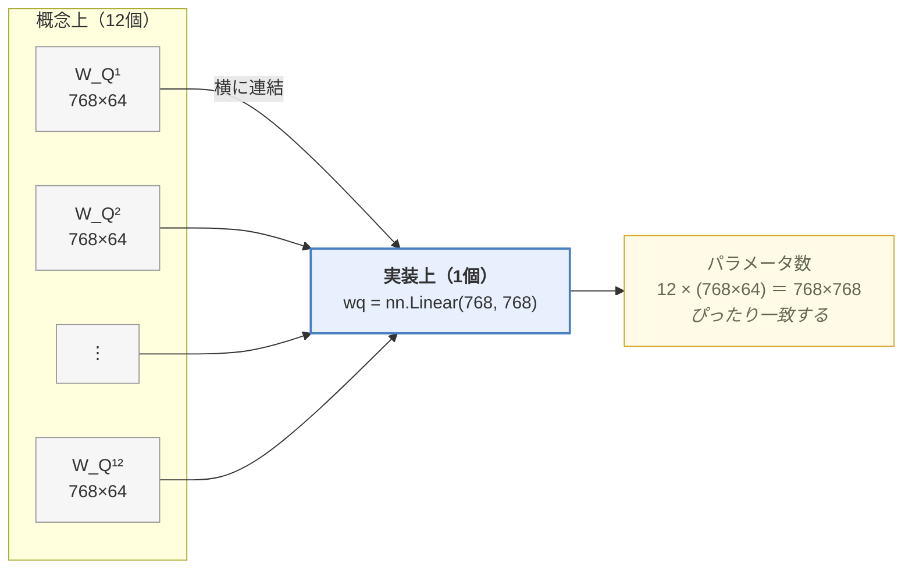

コード中の `.view(B, T, self.n_heads, self.d_k)` が、
この横長の出力を**12等分して各ヘッドに配る**行です。
数学的には「小さい行列12個」と「大きい行列1個＋分割」は完全に同じで、
GPU では行列積が1回で済む後者のほうが速いため、実装では必ずこう書きます。

> 💡 だから **計算量は1ヘッドのときとほぼ同じ**です。
> ヘッドを12個に増やしても、各ヘッドの次元が 1/12 になるので総量は変わりません。
> **「計算量を増やして視点を増やす」のではなく、
> 「同じ計算量を12個の視点に分割する」**——これが Multi-Head の正体です。

> ⚠️ **記号 `d_k` の意味がここで変わります**：2.1.3〜2.1.5 では
> `d_k` ＝「Q・K ベクトルの次元そのもの」でした。Multi-Head 以降は
> `d_k` ＝「**1ヘッドあたり**の次元（`d_model ÷ n_heads`、例：768÷12＝64）」を指します。
> どちらも「内積を取るベクトルの長さ」という役割は同じで、
> √d_k のスケーリングも各ヘッドの中では 64 を使います。

```python
class MultiHeadAttention(nn.Module):
    def __init__(self, d_model, n_heads):
        super().__init__()
        self.n_heads = n_heads
        self.d_k = d_model // n_heads          # 各ヘッドの次元（768/12 = 64）
        # ↓ 見た目は1個だが、中身は「全ヘッドぶんを横に並べた」もの
        self.wq = nn.Linear(d_model, d_model)  # = W_Q¹ … W_Q¹² を連結
        self.wk = nn.Linear(d_model, d_model)  # = W_K¹ … W_K¹² を連結
        self.wv = nn.Linear(d_model, d_model)  # = W_V¹ … W_V¹² を連結
        self.wo = nn.Linear(d_model, d_model)  # ★ これだけはヘッド共通で1個

    def forward(self, x, mask=None):
        B, T, C = x.shape
        # ↓ この .view(...) が「横長の出力を12等分して各ヘッドに配る」行
        #   (B, T, C) → (B, n_heads, T, d_k) に分割
        q = self.wq(x).view(B, T, self.n_heads, self.d_k).transpose(1, 2)
        k = self.wk(x).view(B, T, self.n_heads, self.d_k).transpose(1, 2)
        v = self.wv(x).view(B, T, self.n_heads, self.d_k).transpose(1, 2)

        out = attention(q, k, v, mask)          # 全ヘッド同時に計算

        # 元の形に戻して結合
        out = out.transpose(1, 2).contiguous().view(B, T, C)
        return self.wo(out)
```

---

## この章のまとめ（Attention 編）

| 部品 | ひとことで |
|------|-----------|
| **Attention** | `softmax(QKᵀ/√d_k)V`。Q と K の似た度合いで V を混ぜる |
| **Q・K・V** | 1つの単語ベクトルから作る「3つの顔」。検索ワード／タグ／中身 |
| **Self-Attention** | Q, K, V を全部**同じ文**から作る。文脈理解の本体 |
| **Masked Self-Attention** | 未来を -∞ でマスク。GPT 系で必須 |
| **Multi-Head** | 複数の視点で並列に Attention。次元を分割して使う |

## 理解度チェック

1. Attention の式を `√d_k` で割るのはなぜですか？
2. Self-Attention が RNN より速い理由を説明できますか？
3. Masked Self-Attention はなぜ必要ですか？
4. Multi-Head で `d_model=768`, `n_heads=12` のとき、各ヘッドの次元はいくつですか？
   また、なぜ計算量が1ヘッドの場合とほぼ同じなのですか？
5. 「ヘッド1つ」とは、どの重み行列のことを指しますか？

<details>
<summary><b>▶ 解答を見る</b></summary>

1. 次元 `d_k` が大きいと**内積の値の分散が大きくなり**、softmax の出力が極端（ほぼ 0 か 1）になるためです。そうなると勾配がほとんど流れなくなり学習が進みません。`√d_k` で割ると分散が 1 程度に正規化され、softmax が適度な滑らかさを保ちます。（`code/02_attention_step_by_step.py` の STEP 4 で、分散が実際に `d_k` 倍になっていることを実測できます）
2. RNN は単語を**1個ずつ順番に**処理するため、前の計算が終わらないと次に進めず**並列化できません**。Self-Attention は全単語の関係を**1回の行列積で同時に**計算するので、GPU の並列性をフルに使えます。
3. 言語モデルは「次の単語を予測する」訓練をするため、**未来の単語が見えるとカンニング**になるからです。マスクしないと学習時の loss はきれいに下がるのに、生成時（未来が存在しない）には破綻します。
4. 各ヘッドの次元は `768 / 12 = 64` です。**次元を分割して使う**ため、12ヘッド合計の計算量は `768` 次元1ヘッドの場合とほぼ同じになります（ヘッドを増やしても計算量は増えず、「視点の数」だけが増える）。
5. **`W_Q`・`W_K`・`W_V` の1セット（3つで1組）**です。`W_Q` だけを指すのではありません。8ヘッドなら行列24個。ただし `W_O` だけはヘッドごとに持たず、全ヘッドの出力を結合した後に1回だけ掛ける共通の行列です。

</details>

---

## 次に読む

Attention はこれで一通りです。
次は、これを**部品として使って Transformer 本体を組み立てます**。

**次へ** → **[02.5. Transformer ブロックを組み立てる](https://zenn.dev/thirtypower/books/kgr-llm-guide/viewer/025-transformer-block)**

> 💡 その前に、Attention が腹落ちしていなければ
> `code/02_attention_step_by_step.py` を動かしてから進むことを強くおすすめします。
>
> ```bash
> cd code && python 02_attention_step_by_step.py
> ```
