> **この章のゴール**：[02章](https://zenn.dev/thirtypower/books/kgr-llm-guide/viewer/02-transformer-attention) で理解した Attention を部品として、
> Transformer 本体を組み上げる。
>
> 📌 **前提**：[02. Transformer アーキテクチャ](https://zenn.dev/thirtypower/books/kgr-llm-guide/viewer/02-transformer-attention) の
> Attention（Q・K・V / Self-Attention / Masked / Multi-Head）を読んでいること。
>
> 🔢 **節番号は 2.2 から続きます**。02章の続きなので、通し番号にしてあります。

Attention は「**文中のどこを見るか**」を決める部品でした。
しかし、Attention だけでは Transformer にはなりません。

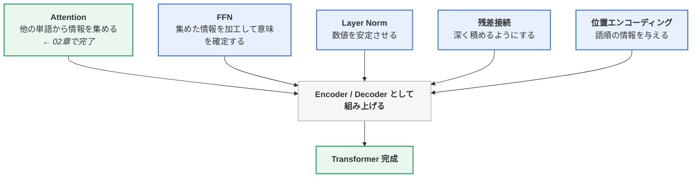

この章では、**足りない部品を1つずつ用意してから、組み立てます**。

---

## 2.2 Encoder-Decoder（符号化器・復号化器）

### 2.2.1 Seq2Seq とは

**Seq2Seq（Sequence to Sequence）** は、
「**可変長の入力列 → 可変長の出力列**」への変換タスクの総称です。

```
翻訳： 「私は猫が好きです」（5トークン） → "I like cats"（3トークン）
要約： 長い記事（1000トークン）        → 要約（50トークン）
```

Transformer は元々このために作られました。構造は2ブロックに分かれます。


| 部分 | 役割 | Attention の種類 |
|------|------|-----------------|
| **Encoder** | 入力文全体を読み、意味の表現に変換する | 双方向（マスクなし） |
| **Decoder** | 表現を受け取り、1トークンずつ出力を生成する | 因果的（マスクあり）＋ Cross-Attention |

### 2.2.2 順伝播ネットワーク（FFN: Feed-Forward Network）

Attention の後ろに必ず置かれる部品です。**2層の全結合層**でできています。

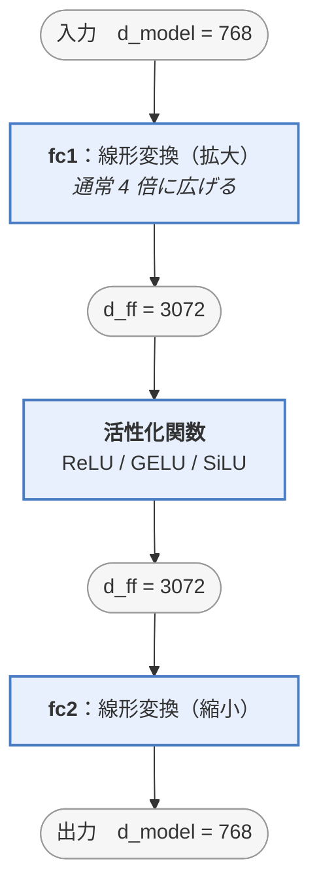

この図が読めるようになるところから始めます。

#### ① 【構造】そもそも「全結合層」とは何か

FFN を理解する前に、材料である **全結合層**（＝線形層、`nn.Linear`）を押さえます。
やっていることは、**たった1本の式**です。

```
y = W x + b

  x … 入力ベクトル
  W … 重み行列（学習で決まる）
  b … バイアス（学習で決まる、ただの足し算）
  y … 出力ベクトル
```

**入力2次元 → 出力4次元** の全結合層を、実際に手で書き下してみます。

```
入力  x = [x₁, x₂]                      出力 y = [y₁, y₂, y₃, y₄]

y₁ = W₁₁x₁ + W₁₂x₂ + b₁      ← x₁ と x₂ の両方を使う
y₂ = W₂₁x₁ + W₂₂x₂ + b₂      ← これも両方使う
y₃ = W₃₁x₁ + W₃₂x₂ + b₃      ← これも
y₄ = W₄₁x₁ + W₄₂x₂ + b₄      ← これも
```

> 🔑 **出力の1つ1つが、入力の全部を見て作られる。**
> 「入力の全員と出力の全員が繋がっている」から **全結合（Fully Connected）** と呼びます。

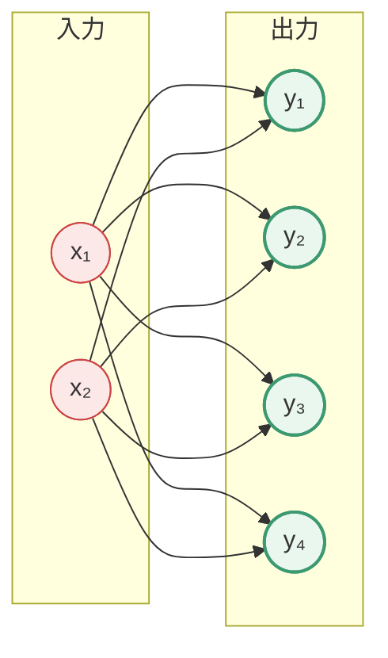

> **線が全部ある ＝ 全結合。線の1本1本が `W` の成分1個**です。
> 上の図には線が 2×4 ＝ 8本あり、これがそのまま `W` の 8個の成分に対応します。

つまり **`W` は 4行×2列 の行列、`b` は4個の数字**。これが層の中身の全てです。

> 💡 次元が「2 → 4 に増える」のは、**行列の形がそうなっているから**です。
> `(4×2) の行列` × `(2次元のベクトル)` = `(4次元のベクトル)`。
> [00.5章 0.3節](https://zenn.dev/thirtypower/books/kgr-llm-guide/viewer/005-deep-learning-basics) の行列積そのままです。

#### ② 【構築】FFN はどう組み立てられるか

FFN は、この全結合層を **2枚重ねて、間に活性化関数を挟んだだけ** のものです。

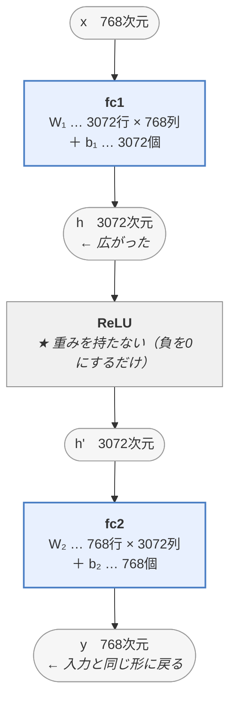

**1本の式で書くと、これだけです。**

```
FFN(x) = W₂ · ReLU( W₁ x + b₁ ) + b₂
```

コードで「構築」しているのは、まさに `W₁, b₁, W₂, b₂` の**箱を用意する**ことです。

```python
self.fc1 = nn.Linear(768, 3072)   # → W₁(3072×768) と b₁(3072) が作られる
self.fc2 = nn.Linear(3072, 768)   # → W₂(768×3072) と b₂(768) が作られる
```

> ⚠️ **`nn.Linear` を書いた時点では、W の中身は「乱数」です。**
> 意味のある値は入っていません。
> この乱数が、学習（[00.5章](https://zenn.dev/thirtypower/books/kgr-llm-guide/viewer/005-deep-learning-basics) の勾配降下法）を数十万回まわすうちに
> **少しずつ意味のある値に変わっていく**——それが「知識を獲得する」の実体です。
>
> ReLU には重みがありません。**学習するのは W と b だけ**です。

#### ③ 【処理】電卓だけで FFN を1回通してみる

[2.1.4](https://zenn.dev/thirtypower/books/kgr-llm-guide/viewer/02-transformer-attention#214-電卓だけで-attention-を1回計算してみる) で Attention を手計算したのと同じことを、FFN でもやります。
**[2.1.4](https://zenn.dev/thirtypower/books/kgr-llm-guide/viewer/02-transformer-attention#214-電卓だけで-attention-を1回計算してみる) の出力 `[8.0, 2.0]` が、そのままここへ入ってきます。**

**設定**：`d_model = 2`、`d_ff = 4`（本来は4倍ですが、手計算のため2倍にします）

02章 2.1.4 と同じく、2つの次元に意味を与えておきます。

```
次元1 = 「モノらしさ」    次元2 = 「動作らしさ」

入力 x = [8.0, 2.0]     ← 02章 2.1.4 の出力。「かけた」が「メガネ」の情報を8割吸った状態
```

**ステップ1：fc1 で 2次元 → 4次元 に広げる**

`W₁` の各行が「検出器」1個に相当します（②の `y₁〜y₄` がそれぞれ検出器）。

| 検出器 | 重み `W₁` の行 | バイアス | 計算 | 結果 |
|---|---|---|---|---|
| 1「身につけるモノが来た？」 | `[ 1.0, 0.0]` | −3.0 | `1×8 + 0×2 − 3` | **5.0** |
| 2「通話系が来た？」 | `[−1.0, 0.0]` | +3.0 | `−1×8 + 0×2 + 3` | −5.0 |
| 3「動作である？」 | `[ 0.0, 1.0]` | −1.0 | `0×8 + 1×2 − 1` | **1.0** |
| 4「疑問文である？」 | `[ 0.0,−1.0]` | 0.0 | `0×8 − 1×2 + 0` | −2.0 |

```
h = [5.0, −5.0, 1.0, −2.0]
```

**ステップ2：ReLU で負を 0 にする（＝反応しなかった検出器を黙らせる）**

```
h' = [5.0, 0.0, 1.0, 0.0]
       ↑    ↑
    強く発火  沈黙（「通話系」は今回は無関係なので消える）
```

> ここが**選別**です。4個の検出器のうち、2個だけが生き残りました。
> 実際の LLM では3072個のうち数十〜数百個だけが発火します（＝スパース）。

**ステップ3：fc2 で 4次元 → 2次元 に畳み直す**

`W₂` の各**列**が「その検出器が発火したときに出す知識ベクトル」です。

> 🤔 **なぜ fc1 は「行」で、fc2 は「列」なのか**（ここで1回止まる人が多いところです）
>
> 行列は必ず **`(出力の個数) 行 × (入力の個数) 列`** の形になります（`y = W x` の形のルール）。
> だから見る向きが逆になります。
>
> | | 行列の形 | 「1個」に対応するのは | 意味 |
> |---|---|---|---|
> | **fc1**（2 → 4） | 4行 × 2列 | **1行** ＝ 出力1個ぶん | その行が「何に反応するか」＝ **検出器** |
> | **fc2**（4 → 2） | 2行 × 4列 | **1列** ＝ 入力1個ぶん | その列が「その入力が来たら何を出すか」＝ **知識** |
>
> **「出力側から見るなら行、入力側から見るなら列」**——これだけです。
> fc2 では「4個の検出器のどれが来たか」が入力側なので、列で見ることになります。

```
検出器1 の知識ベクトル：[−1.0,  2.0]   「モノに寄りすぎを戻し、装着という動作性を足せ」
検出器2 の知識ベクトル：[ 0.0,  1.0]   （発火していないので使われない）
検出器3 の知識ベクトル：[ 0.0,  1.0]
検出器4 の知識ベクトル：[ 1.0,  0.0]   （発火していないので使われない）
```

発火した検出器の知識ベクトルを、**発火の強さで重み付けして足します**。

```
FFN(x) = 5.0 × [−1.0, 2.0]  ＋  0.0 × [0.0, 1.0]
       ＋ 1.0 × [ 0.0, 1.0]  ＋  0.0 × [1.0, 0.0]

       = [−5.0, 10.0] ＋ [0.0, 1.0]

       = [−5.0, 11.0]
```

**ステップ4：残差接続で元の入力に足す**（2.2.4節。FFN は必ずこの形で使われます）

```
出力 = x ＋ FFN(x)
     = [8.0, 2.0] ＋ [−5.0, 11.0]
     = [3.0, 13.0]
```

> 📝 **本物のブロックとの違い（ここでは1つだけ省略しています）**：
> 実際のブロックでは、FFN に入れる前に **Layer Norm**（2.2.3節）を1回通します。
> つまり正しくは `出力 = x ＋ FFN(Norm(x))` です。
> Norm は「値の大きさを揃え直す」だけで**意味を変えない**ので、
> 手計算では省いて FFN の働きに集中しました。
> **残差の `＋ x` に足されるのは、Norm を通す前の元の値** —— ここだけ覚えておいてください。

**結果を読む**：

```
              モノらしさ   動作らしさ
入力  [8.0, 2.0]   8.0        2.0     ← 「メガネ」の情報を吸っただけの状態
出力  [3.0, 13.0]  3.0       13.0     ← 「装着するという動作」に解釈が確定
```

> 🔑 **Attention が集めてきた「メガネ」という材料を、
> FFN が「＝装着するという意味だ」と解釈し直した。**
>
> Attention は情報を**運んだ**だけで、意味の確定はしていません。
> それを担当するのが FFN です。ここが両者の関係の核心です。

#### ④ 存在理由その1：Attention は「線形」なので、そのままでは深くできない

2.1 で見た Attention の中身は、結局こうでした。

```
出力 = 0.70 × V_メガネ ＋ 0.10 × V_彼 ＋ …
```

**掛けて足しているだけ**です。こういう計算を **線形変換** と呼びます。

> 🤔 **「softmax は exp を使うから非線形では？」**——鋭い指摘です。そのとおり、
> 0.70 などの**重みを決める部分**（softmax）は非線形です。
> しかし、**V（単語の中身）が通る経路**を見てください。V は重み付き平均で
> 混ぜられるだけで、**V の中身を加工する非線形変換はどこにもありません**。
> 「材料の選び方は凝っているが、選んだ材料はただ混ぜるだけ」——
> 意味を**加工**する仕組みが Attention には無いのです。

そして線形変換には、決定的な弱点があります。

> ⚠️ **線形変換は、何回重ねても「1回の線形変換」に潰れる。**

```
「2倍する」→「3を足す」→「5倍する」

   = 5 × (2x + 3) = 10x + 15

   → 最初から「10倍して15足す」1回と、まったく同じ
```

つまり **Attention 層だけを100段積んでも、表現力は1段と変わりません**。
深くする意味が消えてしまう。

そこで **わざと「折れ曲がり」を入れます**。これが **活性化関数** です。
一番単純な `ReLU` は「負の値を全部 0 にする」だけの関数です。

```
ReLU(x) = max(0, x)      ← 負なら 0、正ならそのまま

    出力 │        ／
         │      ／
         │    ／
    ─────┼──／────────  入力
         │ 0
      （左半分がぺたんと 0 に潰れている ＝ 折れ曲がり）
```

この折れ曲がりが1個入るだけで、上の「潰れる」計算が成立しなくなり、
**層を重ねただけ表現力が増える**ようになります。

> 🔑 **FFN の第一の存在理由 ＝ 非線形性を注入すること。**
> Attention が情報を集める係なら、FFN は「モデルを深くできるようにする」係です。

#### ⑤ 【関係】Attention と FFN はどう組み合わさるのか

Attention と FFN は、**処理する向きが違います**。

| | 処理の向き | やること | 他の単語を見る？ |
|---|---|---|---|
| **Attention** | **横**（単語 ↔ 単語） | 他の単語から情報を**集める** | 見る |
| **FFN** | **縦**（1単語の中身） | 集めた情報を**加工する** | **一切見ない** |

FFN は **トークン1個ずつ、完全に独立に** 適用されます。
「かけた」に対する FFN の計算に、「メガネ」は一切関与しません。

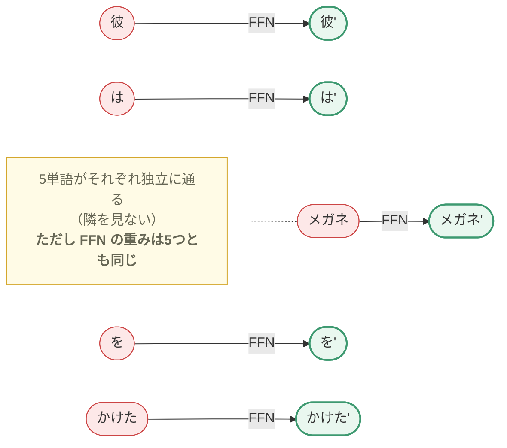

FFN の正式名称が **Position-wise** Feed-Forward Network（位置ごとの順伝播網）
なのは、これが理由です。

> **混ぜるのは Attention の仕事、混ぜたものを加工するのが FFN の仕事**、
> という明確な役割分担になっています。
>
> ⚠️ 「トークンごとに独立」＝「トークンごとに別の重み」ではありません。
> **重みは全トークンで共通**の1セットで、それを1個ずつに使い回します。

**ブロックの中での並び順**は、必ずこうなります。

> ⚠️ **下の図は Layer Norm を省いた簡略版です**（Attention と FFN の関係だけに集中するため）。
> 正規化を入れた**完成形は 2.2.5（Encoder）以降**で、
> 最終的にこの教材で実装するのは `x + Attention(Norm(x))` という形（**Pre-Norm**）です。
> → [02.7章 2.4](https://zenn.dev/thirtypower/books/kgr-llm-guide/viewer/027-mini-gpt) のコードが最終形。図の変遷は 2.2.5 末尾の 📝 に整理しました。

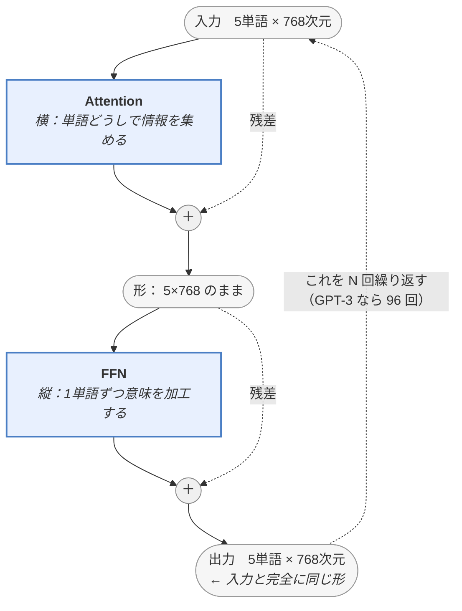

> 🔑 **FFN が入力と同じ次元に戻すのは、この「繰り返し」を可能にするため**です。
> 出口の形が入口と同じだから、同じブロックを何十段でも積み上げられます。
> ②の構造で `768 → 3072 → 768` と**わざわざ戻した**のは、ここに効いてきます。

そして、なぜ**交互に**繰り返すのか。③の計算がそのまま答えです。

```
1段目 Attention： 「かけた」が「メガネ」の情報を集めてくる     → [8.0, 2.0]
1段目 FFN      ： それを「装着するという動作」だと解釈する    → [3.0, 13.0]

2段目 Attention： その解釈を踏まえて、改めて他の単語を見に行く
2段目 FFN      ： さらに解釈を深める
       ⋮
```

> **集める → 解釈する → 集める → 解釈する**。
> Attention だけでは材料が集まるだけで意味が確定せず、
> FFN だけでは他の単語を見られないので材料が手に入らない。
> **どちらか片方では言語を扱えません。**

| | Attention | FFN |
|---|---|---|
| 向き | 横（単語 ↔ 単語） | 縦（1単語の中） |
| 役割 | 情報を**運ぶ**（配管） | 意味を**確定する**（工場） |
| 使う知識 | その場の文脈 | 学習で覚えた知識 |
| パラメータ | 1/3 | **2/3**（⑦参照） |
| 計算量 | 単語数の2乗 | 単語数に比例 |

#### ⑥ なぜ 4倍に広げて、また戻すのか

`768 → 3072 → 768`。広げてから戻すなら、意味がないように見えます。

イメージとしては **「作業机を広げる」** です。
768次元にぎゅうぎゅうに詰まった情報は、そのままでは解きほぐせません。
一度3072次元に展開して、ReLU で要らないものを 0 にして選別し、768次元に畳み直す。

近年有力な、もう少し具体的な解釈がこれです。

> 📖 **FFN ＝ 巨大な「連想メモリ」説**
>
> | 部品 | 役割 |
> |---|---|
> | **fc1**（拡大） | 3072個の**検出器**。各ニューロンが「この文脈は○○か？」を判定する |
> | **ReLU** | 反応しなかった検出器を 0 にして**黙らせる** |
> | **fc2**（縮小） | 反応が残った検出器に対応する**知識ベクトル**を足し合わせて出力する |
>
> 例：入力が「日本の首都は」という文脈のとき
> → fc1 の中の「首都を聞かれている」担当ニューロンが強く発火
> → fc2 がそれに対応する「東京」方向のベクトルを出力に足す

気づいたかもしれませんが、これは **[2.1.2](https://zenn.dev/thirtypower/books/kgr-llm-guide/viewer/02-transformer-attention#212-qkv-の考え方検索エンジンのたとえ) の Key・Value とまったく同じ構造**です。

|  | Attention | FFN |
|---|---|---|
| Key に相当 | 他の単語の K | **fc1 の各行**（何に反応するか） |
| Value に相当 | 他の単語の V | **fc2 の各列**（反応したら何を出すか） |
| どこから来る | **入力文から**その場で作る | **重みに焼き込まれている**（学習時に覚えた） |

決定的な違いは最後の行です。Attention の Key・Value は目の前の文から作られる
＝ **その場の文脈**。FFN の Key・Value は重みそのもの ＝ **学習で覚えた知識**。

> 🔑 **これが「LLM の知識は FFN 層に入っている」の中身**です。
> 「日本の首都は東京」という事実は、Attention ではなく **FFN の重みの中**にあります。

#### ⑦ パラメータの 2/3 が FFN、という事実

`d_model = 768`, `d_ff = 3072` として、1層あたりの重みを数えます（バイアスは無視）。

```
Attention：W_Q, W_K, W_V, W_O の4個
           4 × (768 × 768)   = 2,359,296

FFN      ：fc1 (768 × 3072) + fc2 (3072 × 768)
                             = 4,718,592      ← Attention の2倍

合計                          = 7,077,888
                                  ↓
           FFN の割合 = 4,718,592 / 7,077,888 = 66.7% = ちょうど 2/3
```

> 💡 Transformer は「Attention のモデル」と紹介されますが、
> **重みの量で言えば主役は FFN** です。
> Attention は情報を運ぶ**配管**、FFN は知識を貯める**タンク**、というバランスになっています。

#### コード

```python
class FeedForward(nn.Module):
    def __init__(self, d_model, d_ff, dropout=0.1):
        super().__init__()
        self.fc1 = nn.Linear(d_model, d_ff)    # 768 → 3072（拡大／検出器）
        self.fc2 = nn.Linear(d_ff, d_model)    # 3072 → 768（縮小／知識の取り出し）
        self.dropout = nn.Dropout(dropout)

    def forward(self, x):
        # x: (B, T, d_model) —— T個のトークンそれぞれに、同じ重みが独立に適用される
        return self.fc2(self.dropout(F.relu(self.fc1(x))))
        #                            ↑ ここが唯一の非線形。これが無いと層を積む意味が消える
```

> 📝 **Dropout（ドロップアウト）初出**：`nn.Dropout(0.1)` は「**学習中だけ**、
> 値の10%をランダムに0にする」部品です。一部が毎回欠けるため、モデルは
> 特定の経路に頼り切れなくなり、**丸暗記（過学習）がしにくく**なります。
> 推論時には自動で無効になります（`model.eval()` で切り替え。02.7章で実際に使います）。
> 以降のコードに出てくる `dropout` は全部これです。

> 📌 **現代の LLM では ReLU ではなく SwiGLU** を使うのが標準です。
> 折れ曲がりをもっと滑らかにして表現力を上げたもので、
> [05章 5.1.5](https://zenn.dev/thirtypower/books/kgr-llm-guide/viewer/05-build-your-own-llm) で実装します。ここでの役割分担は何も変わりません。

### 2.2.3 層正規化（Layer Normalization）

深いネットワークでは、層を通るごとに数値の分布がずれていき、学習が不安定になります。
これを防ぐため、**各層で数値の平均を0・分散を1に揃え直します**。

**Batch Norm との違い（重要）：**

正規化には、Transformer 以前から画像認識で使われてきた **Batch Normalization**
という先行手法があります。違いは「**どの方向に**平均・分散を取るか」だけです。

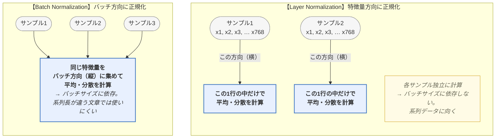

だから Transformer は **Layer Norm** を使います。

```python
class LayerNorm(nn.Module):
    def __init__(self, dim, eps=1e-5):
        super().__init__()
        # nn.Parameter = 「これも学習対象の数値です」という宣言（→ 00.5章 1.5.3）
        self.gamma = nn.Parameter(torch.ones(dim))   # 学習可能なスケール
        self.beta  = nn.Parameter(torch.zeros(dim))  # 学習可能なシフト
        self.eps = eps

    def forward(self, x):
        mean = x.mean(-1, keepdim=True)
        # unbiased=False（分散を n で割る）が PyTorch 標準。既定の n-1 だと値がずれる
        var  = x.var(-1, keepdim=True, unbiased=False)   # 分散（→ 00.5章 0.6節）
        return self.gamma * (x - mean) / torch.sqrt(var + self.eps) + self.beta
```

> ✅ **このコードは `nn.LayerNorm(dim)` と数値が一致します**（自分で確かめられます）。
>
> ```python
> x = torch.randn(2, 8)
> mine, theirs = LayerNorm(8), nn.LayerNorm(8)
> print((mine(x) - theirs(x)).abs().max())   # → 1e-7 程度（誤差の範囲）
> ```
>
> ⚠️ 写経するとき、次の2点を間違えると `nn.LayerNorm` と値が合わなくなります。
> 「実装が間違っているのか自分の理解が間違っているのか」で悩む定番ポイントです。
> - **`(std + eps)` ではなく `sqrt(var + eps)`** で割る（eps を√の中に入れる）
> - **`unbiased=False`**（`x.std()` や `x.var()` の既定は n−1 で割る不偏推定なので、そのままだとズレる）
>
> 実務では自作せず `nn.LayerNorm` を使います。ここでは中身を見るために書いています。

> 🤔 **「せっかく平均0・分散1に揃えたのに、なぜ γ・β でまた崩すのを許すのか？」**
> 「平均0・分散1」が常に最適とは限らないからです。強制的に固定してしまうと
> 表現力を削ぐことがあるため、**「揃え直した上で、必要なら分布を調整する権利」**を
> 学習可能な γ（スケール）・β（シフト）としてモデルに返しています。
> 不要ならモデルは γ=1・β=0 のまま（初期値のまま）にしておけばよいだけです。

> 💡 最近の LLM（LLaMA など）は、これをさらに簡略化した **RMSNorm** を使います。
> → [05章](https://zenn.dev/thirtypower/books/kgr-llm-guide/viewer/05-build-your-own-llm)

### 2.2.4 残差接続（Residual Connection / Skip Connection）

**入力をそのまま出力に足す**という、シンプルですが極めて重要な工夫です。

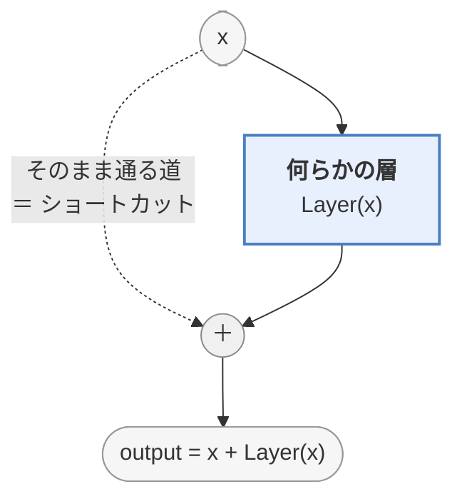

**なぜ必要か：**

1. **勾配消失を防ぐ**：深いネットワークでは誤差の逆伝播中に勾配が0に近づいて学習が止まります。
   残差接続があると勾配が「バイパス」を通ってそのまま前の層に届きます。
2. **層が「差分」だけを学べばよくなる**：完全な変換を学ぶより、
   「入力に何を足せば良くなるか」を学ぶ方がずっと簡単です。

これのおかげで **100層以上のモデルが学習可能**になりました。

### 2.2.5 Encoder の構造

Encoder Layer は、上の部品を組み合わせただけです。

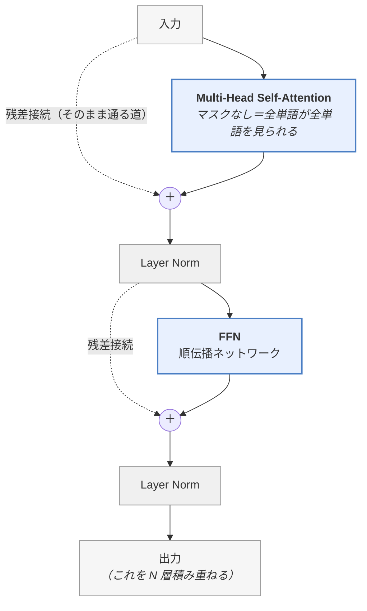

これを **N 層（元論文では6層、BERT-base は12層）積み重ねた**ものが Encoder です。

> 📝 **★ この章に出てくる3つのブロック図の関係（ここで整理します）**
>
> 同じブロックを、説明の都合で**3段階に分けて描いています**。混乱しないよう対応を示します。
>
> | | 図 | 式 | 位置づけ |
> |---|---|---|---|
> | ① | 2.2.2 ⑤ の図 | `x + Attention(x)` → `x + FFN(x)` | **簡略版**。Norm を省いて Attention と FFN の役割分担だけを見る |
> | ② | すぐ上の Encoder の図 | `Norm(x + Attention(x))` | **Post-Norm**。2017年の元論文の形（Norm がサブ層の**後ろ**） |
> | ③ | [02.7章 2.4](https://zenn.dev/thirtypower/books/kgr-llm-guide/viewer/027-mini-gpt)・[05章 5.1.6](https://zenn.dev/thirtypower/books/kgr-llm-guide/viewer/05-build-your-own-llm) のコード | `x + Attention(Norm(x))` | **Pre-Norm**。現代の LLM の形（Norm がサブ層の**前**）。**この教材で実装するのはこれ** |
>
> **①→②→③ と読み進めると完成形になります。** ①に Norm が無いのは間違いではなく、
> 意図的な簡略化です。
>
> **なぜ ② から ③ へ変わったのか**：Post-Norm では残差の「そのまま通る道」の上に Norm が乗ってしまい、
> 勾配がバイパスをまっすぐ通れません。Pre-Norm なら `x +` の経路に一切手を加えないので、
> **深い層でも勾配がそのまま前に届き、学習が安定します**。だから 40層・96層が可能になりました。

### 2.2.6 Decoder の構造

Decoder Layer は Encoder より1つブロックが多く、**3段構成**です。

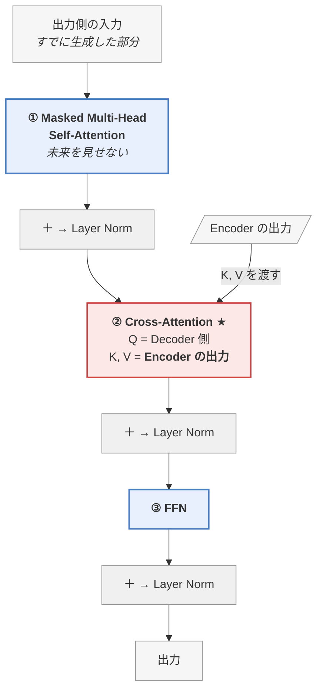

**② Cross-Attention（交差注意）が Encoder-Decoder の要**です。
「今、英語で何を出力すべきか（Q）」を持って、「日本語の原文（K, V）」を検索しに行く、というイメージです。

---

## 2.3 Transformer を組み立てる

### 2.3.1 Embedding 層

トークン ID を、密なベクトルに変換する **参照テーブル（lookup table）** です。

```python
# 語彙数 32000、次元 768 のとき
embedding = nn.Embedding(32000, 768)

ids = torch.tensor([1523, 8891])   # トークンID
vecs = embedding(ids)              # → shape (2, 768)
```

中身は単なる `32000 × 768` の行列で、ID を行番号として1行取り出しているだけです。
この行列も学習で更新されます（＝学習の結果、Word2Vec のような意味構造が自然に生まれる）。

### 2.3.2 位置エンコーディング（Positional Encoding）

**Transformer の弱点**：Attention は「集合」を扱うので、**単語の順番が分からない**。

なぜ「分からない」と言い切れるのか。Attention の計算を思い出してください。
各単語の出力は「全単語の V の重み付き平均」で、重みは Q と K の内積だけで決まります。
**足し算は順番を入れ替えても結果が同じ**なので、文の単語を並べ替えても、
各単語が受け取る出力ベクトルは1つも変わりません。

```
「犬が猫を噛む」と「猫が犬を噛む」が、Attention だけでは同じ結果になってしまう
（並び替えても、「犬」の出力も「猫」の出力も、まったく同じベクトルになる）
```

なぜ「まったく同じ」になるのか、計算に即して確かめます。

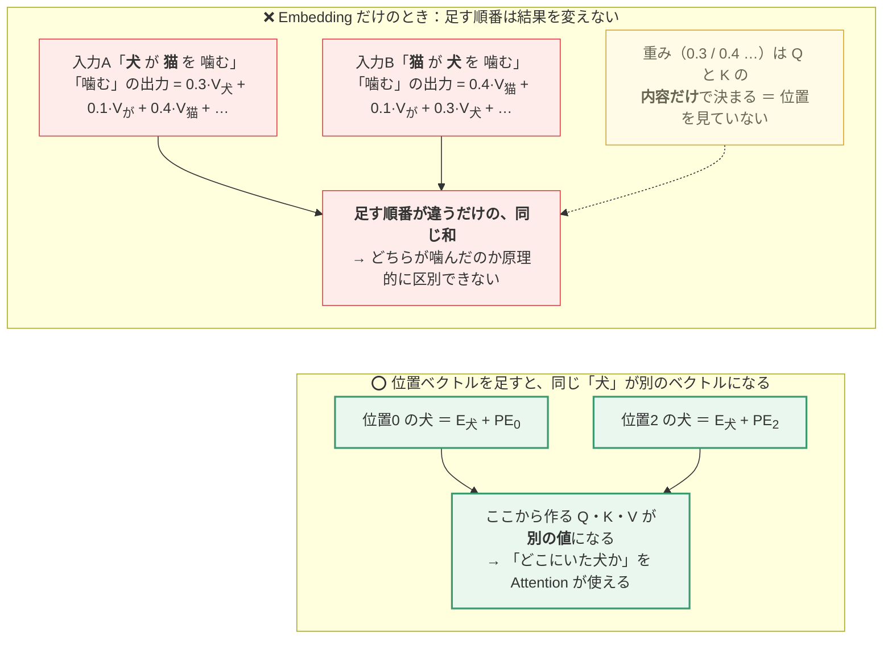

> 🔑 **Attention は「集合（順番の無い袋）」に対する演算**です。
> だから「順番を教える」仕事は Attention の外側で、
> **入力ベクトルそのものに位置の情報を混ぜておく**ことで済ませます。

そこで、**各位置に固有の「番地ベクトル」を足し込みます**。

元論文では **三角関数（sin/cos）** を使います。

```
PE(pos, 2i)   = sin( pos / 10000^(2i/d_model) )
PE(pos, 2i+1) = cos( pos / 10000^(2i/d_model) )

  pos : 単語の位置（0, 1, 2, ...）
  i   : 次元の「ペア番号」。次元を2個ずつ組にして、
        偶数番目（2i）に sin、その隣（2i+1）に cos を入れる
```

式だけでは分からないので、**d_model=4 の実数値**を見てください。

まず、割る数を式から実際に計算します（`d_model = 4` なので `i` は 0 と 1 の2つだけ）。

```
  ペア0（次元0と1）: i=0 → 10000^(2×0/4) = 10000⁰    = 1     → sin(pos / 1)   = sin(pos)
  ペア1（次元2と3）: i=1 → 10000^(2×1/4) = 10000^0.5 = 100   → sin(pos / 100)
                                            ↑ √10000 = 100
```

**後ろのペアほど大きい数で割る**ので、波がゆっくりになります（ペア0 は速さ1、ペア1 は 1/100）。

| 位置 pos | 次元0<br/>sin(pos) | 次元1<br/>cos(pos) | 次元2<br/>sin(pos/100) | 次元3<br/>cos(pos/100) |
|---|---|---|---|---|
| 0 | 0.00 | 1.00 | 0.000 | 1.000 |
| 1 | 0.84 | 0.54 | 0.010 | 1.000 |
| 2 | 0.91 | −0.42 | 0.020 | 1.000 |
| 3 | 0.14 | −0.99 | 0.030 | 1.000 |

各行（＝各位置の番地ベクトル）が全部違うパターンになっているのが分かります。
**速い波（次元0-1）が細かい位置を、遅い波（次元2-3）が大まかな位置を表す**——
時計の秒針と時針のような分担です。

#### 図で見る：次元ごとに「波の速さ」が違う

`d_model = 16` にして、**位置 0〜31 の値を次元ごとに1行の波として描いた**ものです
（16次元のうち前半8次元ぶん。`▁` が −1、`█` が +1。実際に計算して出力しました）。

```
                          位置 0 →                            → 位置 31
次元0  sin(pos/   1.0)  |▅██▅▁▁▃▇█▆▂▁▂▆█▇▃▁▁▅██▄▁▁▄██▆▂▁▃|  ← 速い（秒針）
次元1  cos(pos/   1.0)  |█▇▃▁▂▆██▄▁▁▅██▅▁▁▃▇█▆▂▁▂▆█▇▃▁▂▅█|
次元2  sin(pos/   3.2)  |▅▆▇█████▇▆▄▃▂▁▁▁▁▁▂▃▅▆▇█████▇▆▄▃|
次元3  cos(pos/   3.2)  |███▇▆▄▃▂▁▁▁▁▁▂▃▅▆▇█████▇▆▄▃▂▁▁▁▁|
次元4  sin(pos/  10.0)  |▅▅▅▆▆▆▇▇▇██████████████▇▇▇▇▆▆▅▅▅|
次元5  cos(pos/  10.0)  |████████▇▇▇▆▆▆▅▅▄▄▄▃▃▂▂▂▂▁▁▁▁▁▁▁|
次元6  sin(pos/  31.6)  |▅▅▅▅▅▅▅▅▆▆▆▆▆▆▆▆▆▇▇▇▇▇▇▇▇▇▇█████|  ← 遅い（時針）
次元7  cos(pos/  31.6)  |███████████████████████▇▇▇▇▇▇▇▇▇|
```

**縦に1本の列を読むと、それが「その位置の番地ベクトル」**です。

| 読み取れること | なぜ嬉しいのか |
|---|---|
| 上の次元は激しく振動する | **隣か1つ飛びか**、といった細かい差が付く |
| 下の次元はゆっくり動く | **文の前半か後半か**、という大まかな位置が分かる |
| どの列も他の列と一致しない | 位置が一意に決まる（同じ番地が2つ無い） |
| どの次元も −1〜1 に収まる | 位置 1000 でも値が爆発しないので、**足しても埋め込みを壊さない** |

> 💡 **なぜ「足す」のか（連結ではなく）**：
> 位置の情報のために次元を別枠で増やすと、その分だけ Attention と FFN の計算が増えます。
> 一方、埋め込みの次元（768〜4096）は意味を表すのに十分余っているので、
> **同じ次元に足し込んでも意味の情報は実用上壊れません**。
> 元論文は「足す」方式を採用した理由をとくに議論しておらず、
> **`sin/cos` と学習型のどちらでも「ほぼ同じ性能」だった**と報告しているだけです
> （＝位置の与え方はこの時点ではあまり重要でなかった、と読めます）。

**なぜ sin/cos なのか：**

- 位置が変わると必ず違うパターンになる（一意性）。上の表のとおり
- 値が -1〜1 に収まる（位置1000でも値が爆発しない）
- **相対位置が扱いやすい**：sin/cos には「位置を k ずらす」操作が
  **固定の回転（線形変換）で書ける**という性質があります（三角関数の加法定理。
  導出は追わなくてOK）。→ モデルが「2つ先の単語」といった相対関係を学習しやすい
  - 🔗 **ここが [05章 5.1.3 の RoPE](https://zenn.dev/thirtypower/books/kgr-llm-guide/viewer/05-build-your-own-llm) の伏線です。**
    「位置＝回転」というこの性質を、足し算をやめて**回転そのもの**で位置を表す方式まで
    突き詰めたのが RoPE です
- 学習データより長い文にも適用できる（**外挿**＝訓練で見た範囲の外へ延長すること）

```python
def positional_encoding(max_len, d_model):
    pe = torch.zeros(max_len, d_model)
    pos = torch.arange(0, max_len).unsqueeze(1).float()
    # ↓ 1/10000^(2i/d_model) と同じもの。「log を取って exp で戻す」書き換えで、
    #   累乗の計算を安定させる定石（exp(−a·log b) = b^(−a)）
    div = torch.exp(torch.arange(0, d_model, 2).float()
                    * (-math.log(10000.0) / d_model))
    pe[:, 0::2] = torch.sin(pos * div)   # 偶数次元（0,2,4,...）に sin
    pe[:, 1::2] = torch.cos(pos * div)   # 奇数次元（1,3,5,...）に cos
    return pe

# 使い方：Embedding に足すだけ
x = embedding(ids) + pe[:seq_len]
```

#### 位置の教え方は3世代ある（この教材のどこで出てくるか）

「位置エンコーディング」と一口に言っても、実物には3つの流派があります。
**この教材では3つ全部を実装する**ので、先に地図を置きます。

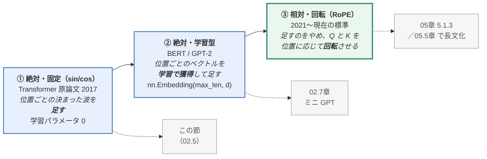

| | 長い文に伸ばせるか | 学習パラメータ | 「相対位置」の扱い |
|---|---|---|---|
| ① 固定 sin/cos | 式で計算できるので**一応**伸ばせる（精度は落ちる） | 0 | 加法定理のおかげで扱いやすい |
| ② 学習型 | ❌ **学習した最大長より先が存在しない** | max_len × d_model | 明示的には持たない |
| ③ RoPE | 工夫すれば伸ばせる（→ 05.5章 の YaRN） | 0 | **内積に「位置の差」だけが残る**のが売り |

> 💡 現代の LLM（LLaMA、Qwen など）は ③ の **RoPE（Rotary Position Embedding /
> 回転位置埋め込み）** を使います。位置情報をベクトルの「回転」で表す方式で、
> 長文への対応が優れています。→ [05章](https://zenn.dev/thirtypower/books/kgr-llm-guide/viewer/05-build-your-own-llm)
>
> ⚠️ ただし「RoPE なら無限に伸ばせる」は誤りです。**学習した長さを超えると壊れます**。
> その理由と対処（PI / NTK / YaRN）は [05.5章 5.5.3](https://zenn.dev/thirtypower/books/kgr-llm-guide/viewer/055-moe-modern-arch) で扱います。

### 2.3.3 完成した Transformer

すべてを組み合わせると、こうなります。

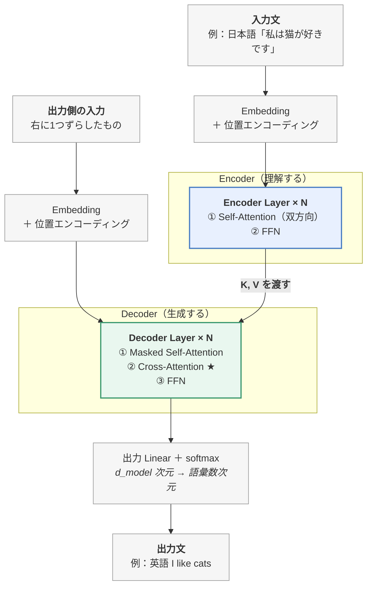

> 📝 **「出力側の入力＝右に1つずらしたもの」とは**：学習時の話です。
> 翻訳の正解が「I like cats」なら、Decoder には先頭に開始記号を付けて
> 1つ遅らせた「`<s>` I like」を入力します。
>
> ```
> Decoder への入力 : <s>   I     like        ← 正解を1つ右にずらしたもの
> 予測させる正解   : I     like  cats        ← 各位置の正解＝「次の単語」
> ```
>
> こうすると**全位置で同時に「次の単語当て」の練習ができます**
> （[00.5章 6節](https://zenn.dev/thirtypower/books/kgr-llm-guide/viewer/005-deep-learning-basics)の「1つ後ろにずらしたトークン」と同じ仕掛け）。
> 正解文を入力に使うこの方式を**教師強制（Teacher Forcing）**と呼びます。
> 生成時（推論時）は正解文が存在しないので、**自分が直前に生成した単語列**を入れて
> 1語ずつ伸ばしていきます（00章で見た自己回帰生成）。

最後の出力層は、`d_model` 次元のベクトルを **語彙数と同じ次元** に変換します。

```python
self.output = nn.Linear(d_model, vocab_size)   # 768 → 32000
logits = self.output(hidden)                   # 各トークンのスコア
probs  = F.softmax(logits, dim=-1)             # 確率に変換
```

これで「次の単語の確率分布」が得られました。**冒頭の話に戻ってきました。**

---

## この章のまとめ（組み立て編）

| 部品 | ひとことで |
|------|-----------|
| **FFN** | 2層の全結合 + 活性化関数。非線形性の注入と、知識の格納場所 |
| **Layer Norm** | 各サンプル内で正規化。学習を安定させる |
| **残差接続** | `x + Layer(x)`。深いネットワークを可能にする |
| **位置エンコーディング** | 順序情報を足し込む。sin/cos または RoPE |
| **Encoder** | 双方向 Attention。文を「理解」する |
| **Decoder** | 因果的 Attention + Cross-Attention。文を「生成」する |

> 🔁 **Attention 側のまとめ**は [02章](https://zenn.dev/thirtypower/books/kgr-llm-guide/viewer/02-transformer-attention#この章のまとめattention-編) にあります。

## 理解度チェック

1. FFN がないと、Attention 層を何段積んでも表現力が上がらないのはなぜですか？
2. FFN が「トークンごとに独立」とは、具体的にどういう意味ですか？
   （「トークンごとに別の重み」との違いは？）
3. 残差接続がないと何が起きますか？
4. 位置エンコーディングがないと、どんな文が区別できなくなりますか？
5. Encoder と Decoder の Attention は、何が違いますか？

<details>
<summary><b>▶ 解答を見る</b></summary>

1. Attention は「Value の重み付き平均」＝**線形変換**だからです。線形変換は何回重ねても1回の線形変換に潰れてしまい（`5×(2x+3) = 10x+15`）、深くする意味が消えます。FFN の中の**活性化関数（ReLU など）が「折れ曲がり」＝非線形性**を入れることで、初めて層を重ねた分だけ表現力が増えます。
2. FFN は**トークン1個ずつに、独立に**適用されます。「かけた」の FFN 計算に「メガネ」は一切関与しません（隣を見ない）。ただし使う**重みは全トークンで共通の1セット**で、それを1個ずつに使い回します。「トークンごとに別の重みを持つ」わけではありません。正式名称の *Position-wise* はこの意味です。
3. **勾配消失**が起きます。深いネットワークでは逆伝播中に勾配が 0 に近づいて学習が止まります。残差接続があると勾配が「バイパス」を通ってそのまま前の層に届くため、100層以上でも学習できます。加えて、層は完全な変換ではなく「入力に何を足せばよいか」という**差分だけを学べばよくなる**利点もあります。
4. **語順だけが違う文**が区別できなくなります。例：「犬が猫を噛む」と「猫が犬を噛む」。Attention は単語の「集合」を扱うので、順序情報を別途足し込む必要があります。
5. **Encoder は双方向**（マスクなし。全単語が全単語を見られる）で、文全体を理解するのに向きます。**Decoder は因果的**（Masked Self-Attention。未来を見せない）で、次の単語を生成するのに向きます。さらに Decoder には **Cross-Attention**（Q は Decoder 側、K・V は Encoder の出力）が加わり、ここで入力文を参照します。

</details>

---

## 次に読む

| あなたの状態 | 次に読むもの |
|------------|------------|
| Attention が腹落ちしていない | → [02章](https://zenn.dev/thirtypower/books/kgr-llm-guide/viewer/02-transformer-attention) に戻る／`code/02_attention_step_by_step.py` を動かす |
| 手を動かして定着させたい ★おすすめ | → **[02.6. トークナイザを理解する](https://zenn.dev/thirtypower/books/kgr-llm-guide/viewer/026-tokenizer)** → **[02.7. ミニ GPT を作る](https://zenn.dev/thirtypower/books/kgr-llm-guide/viewer/027-mini-gpt)** |
| 理論を先に進めたい | → **[03. 事前学習言語モデル](https://zenn.dev/thirtypower/books/kgr-llm-guide/viewer/03-pretrained-models)** |

> 💡 **強くおすすめするのは 02.6 → 02.7 のルート**です。
> ここで**自分の書いた GPT が実際に文法を学習する**のを見ておくと、
> 3章以降の理論が全部「自分のコードの話」として読めるようになります。

---

**次へ** → [02.6. トークナイザを理解する](https://zenn.dev/thirtypower/books/kgr-llm-guide/viewer/026-tokenizer)
／ 理論を進めるなら → [03. 事前学習言語モデル](https://zenn.dev/thirtypower/books/kgr-llm-guide/viewer/03-pretrained-models)
