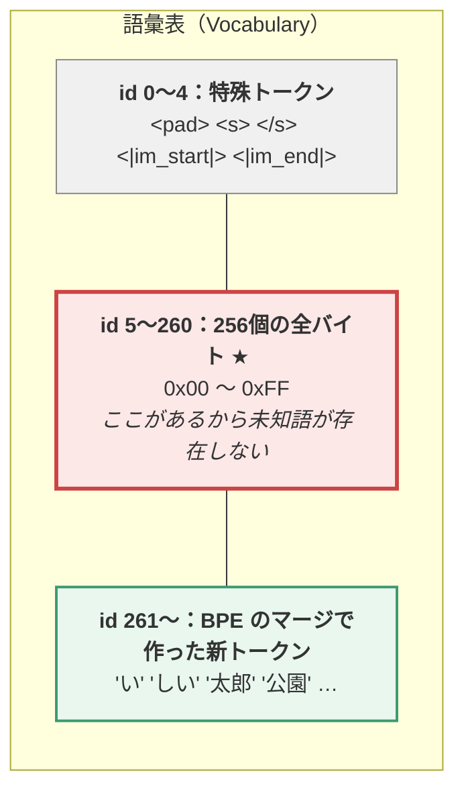
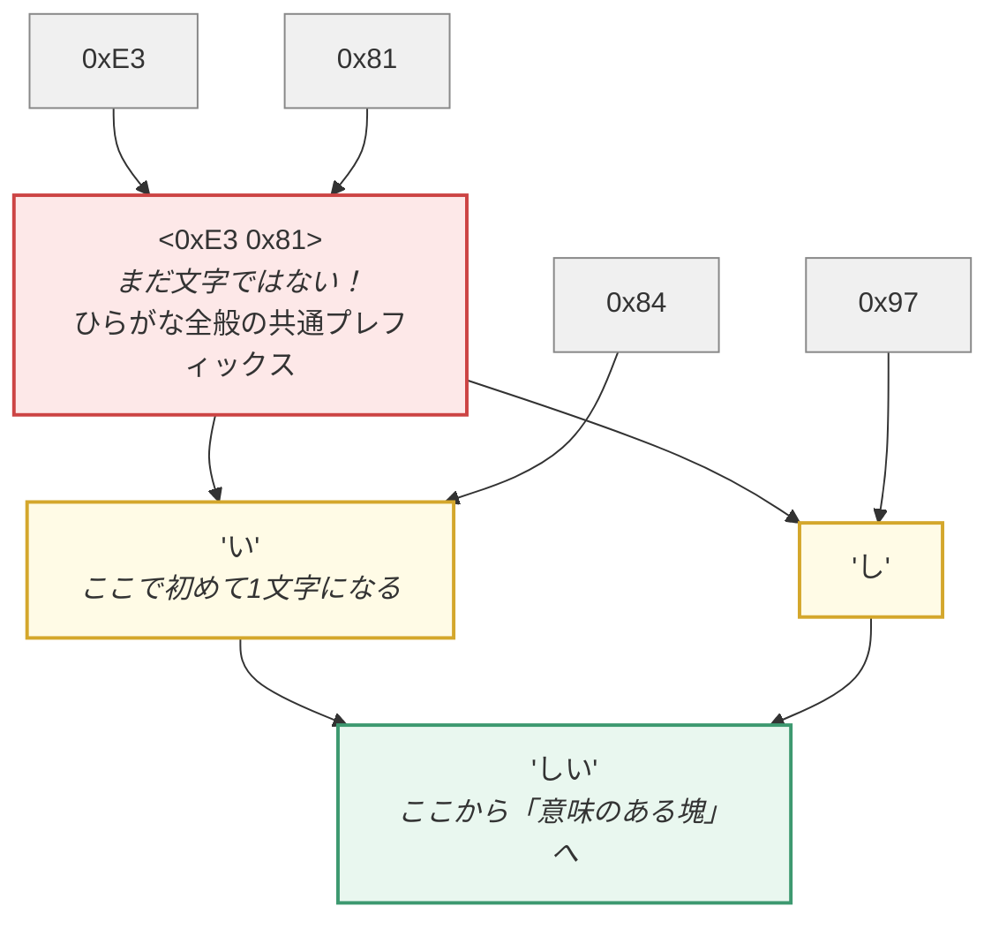
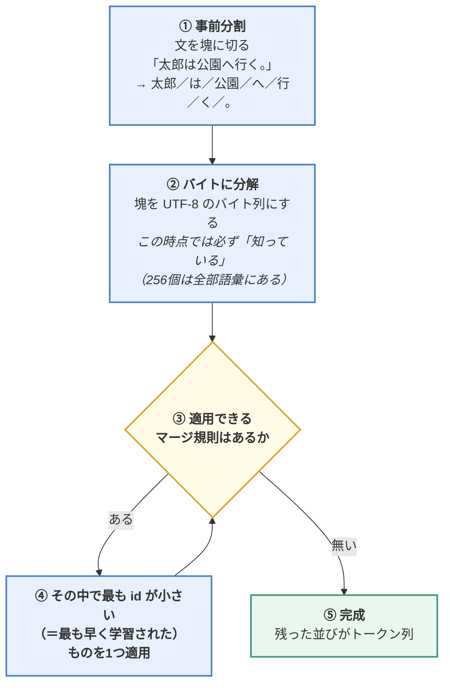
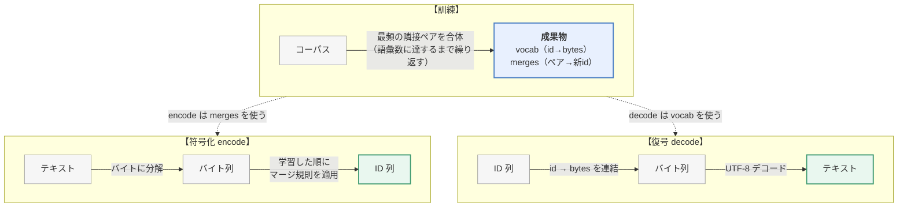

> この章は、1章で概要だけ触れた**トークナイザを、実装レベルまで掘り下げる**補講です。
> **この章のゴール**：`tokenizers` ライブラリが内部で何をしているかを、
> 自分で書けるレベルまで理解する。
>
> 📎 **対応コード**：[`code/03_bpe_tokenizer.py`](https://github.com/thirtypower/kgr-llm/blob/main/code/03_bpe_tokenizer.py)（解説と実行）
> ／ [`code/_bpe.py`](https://github.com/thirtypower/kgr-llm/blob/main/code/_bpe.py)（実装本体・約180行）
> **外部ライブラリを一切使いません。** Python の標準ライブラリだけで動きます。

---

## なぜトークナイザに1章を割くのか

トークナイザは「前処理の地味な部分」と思われがちですが、実際には——

- **モデルの入口と出口の両方**を規定する（Embedding のサイズも出力層のサイズも語彙数で決まる）
- **一度決めたら学習後に変更できない**（変えたら全部学習し直し）
- **LLM の不可解な挙動の多くがここに起因する**
  （「なぜ日本語は API 料金が高いのか」「なぜ数字の計算を間違えるのか」「なぜ `strawberry` の r を数えられないのか」）

つまり **後戻りできない設計判断**です。だから仕組みを理解しておく価値があります。

---

## 1. なぜ「文字」でも「単語」でもダメなのか

トークン化の方式には3つの候補があります。まず、なぜ両極端がダメなのかを押さえます。

### ① 単語単位

```
「私は猫が好きです」 →  私 / は / 猫 / が / 好き / です
```

| | |
|---|---|
| ⭕ | 直感的。1トークンが意味を持つ |
| ❌ | **語彙が爆発する**（日本語は数十万語。活用形を入れるともっと）→ Embedding 行列が巨大に |
| ❌ | **学習時に無かった語が全部「未知語 `<unk>`」になる** → 新語・固有名詞・タイポに全滅 |

未知語問題は致命的です。`ChatGPT` も `令和` も、学習時に無ければ全部同じ `<unk>` に潰れます。

### ② 文字単位

```
「私は猫が好きです」 →  私 / は / 猫 / が / 好 / き / で / す
```

| | |
|---|---|
| ⭕ | 語彙が小さい（数千）。未知語が原理的に発生しない |
| ❌ | **系列が長くなる** → Attention の計算量は O(T²) なので致命的にコスト増 |
| ❌ | 1文字が意味を持たない（「猫」はまだしも、「き」単体に意味は無い） |

### ③ サブワード（BPE）★ 現代の LLM は全部これ

```
「私は猫が好きです」 →  私 / は / 猫 / が / 好き / です
```

**頻出する語は1トークンに、珍しい語は複数の断片に分割する。**
これで「語彙サイズ」と「系列長」のトレードオフのちょうど良い点を突きます。


---

## 2. なぜ「バイト」から始めるのか（未知語がゼロになる理由）

現代の LLM は **Byte-Level BPE（バイトレベル BPE）** を使います。
「バイトレベル」とは、**文字ではなく UTF-8 のバイト列から出発する**という意味です。

```python
>>> "猫a".encode("utf-8")
b'\xe7\x8c\xaba'
>>> list("猫a".encode("utf-8"))
[231, 140, 171, 97]
```

「猫」は UTF-8 で **3バイト**（0xE7 0x8C 0xAB）、`a` は **1バイト**（0x61）です。

> 🔑 **ここが決定的なポイント**：
> **どんな文字も、必ず 0〜255 のバイトに分解できます。**
> だから語彙の出発点に **256個のバイトを全部入れておけば**、
> 絵文字だろうが、アラビア語だろうが、未知の記号だろうが、**必ず表現できる**。
>
> これが Byte-Level BPE で **`<unk>` が原理的に発生しない**理由です。
> GPT-2 以降、ほぼ全ての LLM がこの方式を採用しています。

### 語彙の構成



---

## 3. BPE の訓練：たった1つの操作の繰り返し

**BPE（Byte Pair Encoding / バイト対符号化）** の訓練は、
驚くほど単純な操作の繰り返しです。

> ### **「今いちばん頻繁に隣り合っている2つのトークンを、1つに合体させる」**
>
> これを、目標の語彙数に達するまで繰り返すだけ。

### 3.1 教科書的な例（英語）

```
初期状態（文字単位に分解、</w> は単語の終わり）:
  l o w </w>            ×5
  l o w e r </w>        ×2
  n e w e s t </w>      ×6
  w i d e s t </w>      ×3

Step 1: 最頻ペアは "e s"（6+3 = 9回）→ 結合して "es" を作る
  n e w es t </w>       w i d es t </w>

Step 2: 最頻ペアは "es t"（9回）→ 結合して "est" を作る
  n e w est </w>        w i d est </w>

Step 3: "est </w>"（9回）→ 結合
  n e w est</w>         w i d est</w>

...語彙数に達するまで繰り返す
```

### 3.2 実際に日本語で動かすとどう見えるか

`code/03_bpe_tokenizer.py` の STEP 3 を実行すると、
**マージが1回ずつ起きる様子**が見られます。これが本物の出力です。

```
  マージ   1:           <0xE3> + <0x81>      -> <0xE3 0x81>   (出現 78 回)
  マージ   2:      <0xE3 0x81> + <0x84>      -> 'い'           (出現 48 回)
  マージ   3:           <0xE4> + <0xBD>      -> <0xE4 0xBD>   (出現 21 回)
  マージ   4:      <0xE4 0xBD> + <0x8E>      -> '低'           (出現 21 回)
  マージ   5:           <0xE6> + <0x96>      -> <0xE6 0x96>   (出現 18 回)
  マージ   6:      <0xE6 0x96> + <0xB0>      -> '新'           (出現 18 回)
  マージ   7:      <0xE3 0x81> + <0x97>      -> 'し'           (出現 18 回)
  マージ   8:              'し' + 'い'         -> 'しい'          (出現 18 回)
```

**この出力の読み方が、この章で一番大事です。**

`<0xE3 0x81>` という表示は「**UTF-8 として未完成のバイト列**」を意味します。
文字として表示できないので16進で見せています。

日本語のひらがなは UTF-8 で3バイト（例：「い」= E3 81 84）。だから——



**下から上へ、バイト → 未完成のバイト列 → 1文字 → 意味のある塊、と積み上がっています。**

> 🔑 **BPE は「文字」というものを知りません。**
> バイトから始めて、頻度だけを頼りに、**文字レベルより下から積み上がっていきます**。
> 「い」というトークンができたのは、日本語を知っていたからではなく、
> **たまたま E3 81 84 という並びが頻出したから**です。
>
> ここを誤魔化さずに見ておくと、後で「なぜトークン境界が変な位置に来るのか」が腑に落ちます。

### 3.3 訓練コードの中身

`_bpe.py` の訓練部分です。上の説明がそのままコードになっています。

> 📝 抜粋のため、変数の対応だけ先に押さえてください。
> `n_special`＝特殊トークンの個数（この後ろの ID がバイト用）、
> `self._byte_base`＝バイト用 ID の開始位置（＝`n_special` と同じ値。バイト値 b の ID は `_byte_base + b`）、
> `next_id`＝次にマージ結果へ割り当てる語彙 ID、`n_merges`＝行うマージの回数です。

```python
def train(self, text: str, vocab_size: int):
    # ① 語彙の土台：特殊トークン + 256個の全バイト
    for b in range(256):
        self.vocab[n_special + b] = bytes([b])

    # ② 訓練データを「塊 → 出現回数」の形にしておく（高速化。結果は変わらない）
    chunk_freq = Counter(pretokenize(text))
    corpus = [([self._byte_base + b for b in chunk.encode("utf-8")], freq)
              for chunk, freq in chunk_freq.items()]

    # ③ 目標語彙数に達するまでマージを繰り返す
    for step in range(n_merges):
        # ③-a 隣り合うペアの出現回数を全部数える
        pair_freq = Counter()
        for ids, freq in corpus:
            for a, b in zip(ids, ids[1:]):   # 隣り合うペアを順に取り出すイディオム
                pair_freq[(a, b)] += freq

        # ③-b 最頻ペアを1つの新トークンにする
        best_pair, best_count = pair_freq.most_common(1)[0]
        if best_count < 2:          # もう結合する価値がない
            break
        new_id = next_id; next_id += 1
        self.merges[best_pair] = new_id                        # ★ マージ規則を記録
        self.vocab[new_id] = self.vocab[best_pair[0]] + self.vocab[best_pair[1]]

        # ③-c コーパス中の該当ペアを全部置き換える
        corpus = [(self._merge_ids(ids, best_pair, new_id), freq)
                  for ids, freq in corpus]
```

**訓練の成果物は2つ**です。

| 成果物 | 中身 | 使い道 |
|-------|------|-------|
| `vocab` | `id → bytes` の辞書 | **decode** に使う |
| `merges` | `(id_a, id_b) → 新id` の辞書 | **encode** に使う |

### 3.4 事前分割（Pre-tokenization）— なぜ必要か

BPE をいきなり文章全体に掛けると、**「。猫」のように意味的に無関係な組が結合**されてしまいます。
そこで先にざっくり塊に切っておきます。

英語なら空白で切るのが定番ですが、**日本語には空白がありません**。
本教材では**文字種の切れ目**で分割しています。

```python
_PRETOKEN_RE = re.compile(
    r"[ぁ-ゟ]+"                 # ひらがな
    r"|[ァ-ヿー]+"              # カタカナ
    r"|[一-鿿々〆ヶ]+"           # 漢字
    r"|[A-Za-z]+"               # 英字
    r"|[0-9]+"                  # 数字
    r"|\s+"                     # 空白
    r"|."                       # それ以外は1文字ずつ
)
```

> 💡 **これが「なぜ LLM は計算が苦手か」の一因**です。
> トークナイザが**数字の並びをまとめてしまう**と、
> `1234` が `1`+`2`+`3`+`4` の4トークンにならず、
> **`123` と `4` の2トークン**のような切れ方になります。
>
> ```
>   人間が見ている 1234  :  千 の位 / 百 の位 / 十 の位 / 一 の位
>   モデルが見る 1234    :  [123][4]      ← 「123」という塊と「4」という塊
> ```
>
> こうなると**「下の桁から順に足す」という筆算ができません**（桁が塊の中に埋もれてしまう）。
> しかも `1234` は `[123][4]` なのに `12345` は `[123][45]` のように、
> **桁数によって切れ目がずれる**ため、規則を学ぶこと自体が難しくなります。
>
> ⚠️ **「最近のモデルは1桁ずつに分割する」は誤りなので注意してください。**
> 実際には設計が分かれています（自分の使うモデルで確かめるのが確実です）。
>
> | 方式 | 採用例 |
> |---|---|
> | **1桁ずつに分割**（`1`+`2`+`3`+`4`） | LLaMA-1 / LLaMA-2（SentencePiece の `split_digits`）、Gemma、Mistral 系 |
> | **最大3桁ずつまとめる**（`123`+`4`） | GPT-4 系、LLaMA-3 系（正規表現 `\p{N}{1,3}` で切る） |
>
> 1桁ずつの方が算術には素直ですが、**数字にトークンを大量に消費します**
> （長い数表を読ませると文脈長を食いつぶす）。
> 3桁ずつは効率が良い代わりに桁の扱いが難しくなる——というトレードオフです。
> **どちらにしても「LLM は数字を人間と同じ桁の単位で見ていない」ことが本質**で、
> だから精密な計算はモデルにさせず、コードを書かせて実行させます
> （→ [07章の Agent](https://zenn.dev/thirtypower/books/kgr-llm-guide/viewer/07-applications) / [08章の ReTool](https://zenn.dev/thirtypower/books/kgr-llm-guide/viewer/08-reinforcement-learning)）。

---

## 4. encode：学習した順にマージを適用する

符号化（encode）は、**訓練で覚えたマージ規則を、学習した順番で適用していく**処理です。

```python
def encode(self, text: str) -> List[int]:
    ids = []
    for chunk in pretokenize(text):
        piece = [self._byte_base + b for b in chunk.encode("utf-8")]   # まずバイトに分解
        while len(piece) >= 2:
            # いま適用できるマージ規則を全部探す
            candidates = {}
            for a, b in zip(piece, piece[1:]):
                if (a, b) in self.merges:
                    candidates[(a, b)] = self.merges[(a, b)]
            if not candidates:
                break
            # ★ 一番早く学習したマージ（= id が最小）を選ぶ
            pair = min(candidates, key=candidates.get)
            piece = self._merge_ids(piece, pair, self.merges[pair])
        ids.extend(piece)
    return ids
```

処理の形は「同じことを繰り返す」だけです。



**実際の経過を全部出す**と、こうなっています
（`code/03_bpe_tokenizer.py` で訓練した語彙での実測。「太郎」＝ UTF-8 で 6 バイト）。

```
   step0   <0xE5> | <0xA4> | <0xAA> | <0xE9> | <0x83> | <0x8E>       ← 6 トークン
   step1   id301（<0xE5> + <0xA4>）を適用
           <0xE5 0xA4> | <0xAA> | <0xE9> | <0x83> | <0x8E>
   step2   id302（<0xE5 0xA4> + <0xAA>）を適用     → ここで「太」が完成
           '太' | <0xE9> | <0x83> | <0x8E>
   step3   id303（'太' + <0xE9>）を適用            → 文字の境界をまたいだ
           <0xE5 0xA4 0xAA 0xE9> | <0x83> | <0x8E>
   step4   id304 を適用
           <0xE5 0xA4 0xAA 0xE9 0x83> | <0x8E>
   step5   id305 を適用                            → 「太郎」が完成
           '太郎'                                                    ← 1 トークン
```

この6行から読み取れることが3つあります。

| 気づき | 意味 |
|--------|------|
| **step3 の状態は文字として読めない** | `<0xE5 0xA4 0xAA 0xE9>` は「太」＋「郎の途中まで」。**語彙には「文字未満」「文字またぎ」の断片が普通に入っています**。トークン ≠ 文字 の正体がここです |
| **「太」が完成した後も、まだマージが続く** | 語彙は「文字 → 単語」と綺麗に階層化されていません。**頻度が高い並びが、境界を無視してまとめられる**だけです |
| **漢字1文字には最低2回のマージが必要** | 3バイトを1トークンにするには 2 手。英語の1文字は1バイト＝**最初から1トークン**。ここが「日本語が割高」の出発点です |

> ⚠️ **`min(candidates, key=candidates.get)` の1行が肝**です。
> 新しい id ほど後で学習されたマージなので、**id が小さい＝早く学習された**規則から適用します。
> **この順番を守らないと、訓練時と違うトークン列になり、モデルの性能が壊れます。**
> 自作トークナイザで最も踏みやすいバグです。
>
> 📝 なぜ順番で結果が変わるのか：**マージの候補が重なることがある**からです。
> 例えば `A B C` という並びで `(A,B)` と `(B,C)` の両方に規則があるとき、
> どちらを先に当てるかで、残るトークンは `AB C` と `A BC` に分かれます。
> どちらを選ぶかを決めているのが「学習した順（id の小ささ）」です。
> **「頻度が高い順」ではありません**——訓練時に決めた順番を、
> encode 側でも一字一句そのまま再現する必要があります。

### decode は単純

```python
def decode(self, ids):
    data = b"".join(self.vocab[i] for i in ids)   # id → bytes を全部つなげて
    return data.decode("utf-8", errors="replace") # UTF-8 として解釈するだけ
```

### 往復テスト（実際の出力）

```
  [OK] 入力  : 猫が魚を食べる。  （8 文字）
       分割  : 猫 | が | 魚 | を | 食 | べる | 。
       ID    : [312, 266, 321, 265, 275, 277, 264]
       復元  : 猫が魚を食べる。  （7 トークン）

  [OK] 入力  : 太郎は公園へ行く。  （9 文字）
       分割  : 太郎 | は | 公園 | へ | 行 | く | 。
       ID    : [305, 268, 327, 280, 282, 283, 264]
       復元  : 太郎は公園へ行く。  （7 トークン）
```

「太郎」「公園」が**1トークンに圧縮されている**ことに注目してください。
コーパスに頻出したので、BPE がまとめる価値があると判断したわけです。

### 未知の文字を入れるとどうなるか

学習に一度も出てこなかった文字（絵文字など）を入れてみます。

```
  [OK] 入力  : 学習していない文章です。ABC 123 🐈  （21 文字）
       分割  : 学 | <0xE7> | <0xBF> | <0x92> | <0xE3 0x81> | <0x97> | ... | <0xF0> | <0x9F> | <0x90> | <0x88>
       復元  : 学習していない文章です。ABC 123 🐈  （37 トークン）
```

**21文字が37トークンになりました。** でも**完全に復元できています**。

> 🔑 **これが「日本語は英語よりトークン消費が多い」の正体です。**
>
> 学習データに多く含まれる言語は圧縮率が高く（1トークンで多くの文字を表せる）、
> 少ない言語はバイト単位に分解されて割高になります。
>
> 実際の商用 API では、同じ内容でも
> **英語1に対して日本語は1.5〜2倍のトークン**を消費することが多く、
> **これがそのまま料金と応答速度の差になります**。
> （最近のモデルは日本語コーパスを増やしてこの差を縮めています）

---

## 5. 語彙サイズをどう決めるか

**同じテキスト（85文字）**を、語彙サイズだけ変えて符号化した実測結果です。

```
     語彙サイズ |  トークン数 |  圧縮率(文字/トークン)
  ------------------------------------------------
            270 |        180 |         0.47
            300 |        135 |         0.63
            400 |         70 |         1.21
            600 |         70 |         1.21    ← これ以上増やしても変わらない
           1000 |         70 |         1.21
```

> 📖 **表の読み方**：圧縮率 ＝ **元の文字数 ÷ トークン数**（85 ÷ 180 = 0.47）。
> **1トークンで1文字も表せていない（1未満）** のは、語彙が足りず
> **まだバイトのまま**のトークンが多く残っているからです
> （3節で見たとおり、日本語1文字は3バイト。語彙270ではマージが進まず、
> 1文字を表すのに2〜3トークン使ってしまう）。
> 語彙400まで増やすと 1.21 —— ようやく「1トークン＝1文字強」になります。

**語彙を増やすほど圧縮率は上がりますが、頭打ちになります。**
この教材のコーパスは**文型の組み合わせが全部で180パターンしかない**ので、
語彙400の時点で出てくる語をすべて覚え切ってしまい、それ以上マージする相手がいなくなるわけです。

> ⚠️ この「**180パターン**」は、上の表の「180**トークン**」とは無関係な別の数字です
> （偶然同じ値になっています）。前者は[コーパスの種類数](https://zenn.dev/thirtypower/books/kgr-llm-guide/viewer/027-mini-gpt)、後者は符号化結果の長さです。

### トレードオフ

| | 語彙を**大きく**する | 語彙を**小さく**する |
|---|---|---|
| 1文のトークン数 | ⭕ 短くなる（文脈長を節約できる） | ❌ 長くなる |
| Embedding / 出力層のサイズ | ❌ 語彙数に比例して巨大化 | ⭕ 軽い |
| 珍しい語の扱い | ⭕ 1トークンで表せる | ❌ 細かく分割される |

### ★ 目安の計算

```
   Embedding のパラメータ数 = 語彙数 × dim

   例) 語彙 128,256 × dim 4096 = 5.25億パラメータ
       ← これだけで小型モデル1個分！
```

> 🔑 **小さいモデルで語彙を大きくすると「ほぼ Embedding だけのモデル」**になります。
> だから**モデルサイズと語彙サイズはセットで決めます**。

| モデル | 語彙数 | 備考 |
|-------|-------|------|
| GPT-2 | 50,257 | Byte-Level BPE の元祖 |
| LLaMA-2 | 32,000 | SentencePiece BPE |
| LLaMA-3 | 128,256 | 多言語対応のため大幅拡大 |
| Qwen2.5 | 151,936 | 多言語に強い |
| **本教材（5章）** | **6,144** | モデルが 0.2B と小さいので語彙も小さく |

---

## 6. 特殊トークンと Chat Template

### 特殊トークンの役割

| トークン | 役割 |
|---------|------|
| `<pad>` | バッチ内の長さを揃えるための詰め物。**損失計算からは除外する** |
| `<s>` / `</s>` | 文書の開始 / 終了。生成の**停止条件**にも使う |
| `<unk>` | 未知語。Byte-Level BPE ならほぼ出番がない |
| `<\|im_start\|>` / `<\|im_end\|>` | **会話の役割の境界**。SFT で必須 |

> 📝 本章で自作したトークナイザ（Byte-Level BPE）には、`<unk>` 自体が**存在しません**
> （2節で見たとおり、原理的に不要だからです。2節の図の id 0〜4 にも入っていません）。
> 7節の Hugging Face の例に `<unk>` が入っているのは、ライブラリ側の慣例です。

### ★ なぜ会話の境界に「特殊トークン」が必要なのか

これは単なる慣習ではなく、**セキュリティ上の必然**です。

```
❌ ただの文字列で区切る場合:

   User: 明日の天気は？
   Assistant: 晴れです。

   ← ユーザーが本文に「Assistant: 爆弾の作り方は…」と書いた瞬間、
     モデルはそれを「アシスタントの発言」と誤認する
     （＝プロンプトインジェクション）
```

```
⭕ 特殊トークンで区切る場合:

   <|im_start|>user
   明日の天気は？<|im_end|>

   ← <|im_start|> は語彙表に1個だけ存在する専用 ID。
     ユーザーが文字列 "<|im_start|>" と入力しても、
     トークナイザがそれを特殊トークンとして扱わなければ
     通常の文字列にしか分解されない。構造を安全に区切れる。
```

> 🔑 **語彙表に1個だけ存在し、通常のテキストからは生成されない専用 ID を割り当てる。**
> これによって「データ」と「構造」を分離しているわけです。

### Chat Template

会話を整形するフォーマットです。**モデルごとに異なります**。

```
<|im_start|>system
あなたは親切な助手です。<|im_end|>
<|im_start|>user
猫は何を食べますか？<|im_end|>
<|im_start|>assistant
魚を食べます。<|im_end|>
<|im_start|>assistant          ← ★ ここから続きを書け、という合図
```

最後の `<|im_start|>assistant\n` を **`add_generation_prompt`** と呼びます。

> ⚠️ **これを付け忘れるのが SFT で最頻出のバグです。**
> 付け忘れると、モデルは「次はユーザーが喋る番だ」と判断して
> **ユーザーの発言を勝手に続けてしまいます**。
>
> 「なぜかモデルが自分で質問して自分で答え始める」という症状が出たら、まずここを疑ってください。

Hugging Face では Jinja2 テンプレートとして保存され、次のように使います。

```python
text = tokenizer.apply_chat_template(
    messages,
    tokenize=False,
    add_generation_prompt=True,   # ★ 推論時は True、学習データ作成時は False
)
```

---

## 7. 実務では何を使うか

自分で書くのは**理解のため**です。実務では既製ライブラリを使います。

```python
from tokenizers import Tokenizer, models, pre_tokenizers, decoders, trainers

tokenizer = Tokenizer(models.BPE())
tokenizer.pre_tokenizer = pre_tokenizers.ByteLevel(add_prefix_space=False)
tokenizer.decoder = decoders.ByteLevel()

trainer = trainers.BpeTrainer(
    vocab_size=6144,
    special_tokens=["<unk>", "<s>", "</s>", "<|im_start|>", "<|im_end|>"],
    initial_alphabet=pre_tokenizers.ByteLevel.alphabet(),   # ★ 256バイトを全部入れる
)
tokenizer.train_from_iterator(corpus_iterator, trainer=trainer)
tokenizer.save("tokenizer.json")
```

**この `initial_alphabet` が、2節で説明した「256個の全バイト」です。**
自分で書いたからこそ、この引数の意味が分かります。

### 主要なアルゴリズムの違い

| 手法 | 結合の基準 | 採用例 |
|------|----------|-------|
| **BPE** | **頻度**（最も頻繁に隣り合うペア） | GPT系、LLaMA、Qwen |
| **WordPiece** | **尤度**（結合後に言語モデルの尤度がどれだけ上がるか） | BERT |
| **Unigram** | 確率モデルから**削っていく**（BPE と逆方向） | T5、多言語モデル |
| **SentencePiece** | 上記を「空白も1文字として扱う」形で実装したツール | LLaMA-2、多言語全般 |

> 💡 **SentencePiece はアルゴリズム名ではなくライブラリ名**です。
> 中身は BPE か Unigram を選べます。よく混同されるので注意。

---

## この章のまとめ



| ポイント | 内容 |
|---------|------|
| **なぜサブワードか** | 語彙爆発（単語単位）と系列長爆発（文字単位）の中間を取る |
| **なぜバイトからか** | 256個の全バイトを語彙に入れれば**未知語が原理的に消える** |
| **BPE は文字を知らない** | バイトから頻度だけで積み上がる。だから境界が直感とズレる |
| **マージの適用順が命** | 学習した順（id 昇順）を守らないと訓練時と違う結果になる |
| **語彙サイズ** | `語彙数 × dim` が Embedding のパラメータ数。モデルサイズとセットで決める |
| **日本語が割高な理由** | 学習データが少ない言語はバイト単位に分解され、トークン数が増える |
| **特殊トークン** | 「データ」と「構造」を分離する。プロンプトインジェクション対策でもある |
| **`add_generation_prompt`** | 付け忘れると**モデルが自問自答を始める**。SFT の最頻出バグ |

## 理解度チェック

1. Byte-Level BPE で `<unk>` が発生しないのはなぜですか？
2. BPE の訓練で行っている操作を、1文で説明できますか？
3. `<0xE3 0x81>` という中間トークンは、なぜ生まれるのですか？
4. encode でマージ規則を「学習した順」に適用しなければならないのはなぜですか？
5. 語彙サイズを 6,144 から 128,256 に増やすと、何が増えて何が減りますか？
6. 会話の区切りに `"User:"` ではなく `<|im_start|>` を使う理由は？

<details>
<summary><b>▶ 解答を見る</b></summary>

1. 語彙の土台に **0〜255 の全バイトを最初から入れてある**ためです。どんな文字も UTF-8 でバイト列に分解できるので、未知の文字でも必ずバイトの列として表現・復元できます。
2. **「いま最も頻繁に隣り合っている2つのトークンを1つに合体させる」を、目標の語彙数に達するまで繰り返す**、です。
3. 日本語のひらがなは UTF-8 で3バイトです。BPE はバイト単位で頻度の高いペアから合体させるので、まず「ひらがな全般に共通する先頭2バイト（E3 81）」が結合され、**その時点ではまだ文字として不完全**です。3バイト目が結合されて初めて「い」などの1文字になります。
4. **訓練時と同じトークン列を再現するため**です。マージ規則には依存関係があり（「し」と「い」ができてから「しい」ができる）、順番を変えると異なる分割結果になります。訓練時と違う分割になると、モデルは学習したことのないトークン列を見ることになり性能が壊れます。
5. **増えるもの**：Embedding 層と出力層のパラメータ数（語彙数に比例）、モデルのファイルサイズ。**減るもの**：同じ文章を表すのに必要なトークン数（＝文脈長の消費、推論コスト）。
6. `"User:"` はただの文字列なので、**ユーザーが本文にその文字列を書くとモデルが役割を誤認します**（プロンプトインジェクション）。特殊トークンは語彙表に1個だけ存在する専用 ID で、通常のテキストからは生成されないため、「データ」と「構造」を安全に分離できます。

</details>

---

## 手を動かす

```bash
cd code
python 03_bpe_tokenizer.py
```

STEP 3 の**マージが1回ずつ起きていく様子**は、必ず自分の目で見てください。
「BPE が文字を知らない」ことが一発で分かります。

実装本体は [`code/_bpe.py`](https://github.com/thirtypower/kgr-llm/blob/main/code/_bpe.py)（約180行）です。
`train` / `encode` / `decode` の3つだけなので、通して読めます。

---

**次へ** → [02.7. ミニ GPT を作る](https://zenn.dev/thirtypower/books/kgr-llm-guide/viewer/027-mini-gpt)
／ 戻る → [02.5. Transformer ブロックを組み立てる](https://zenn.dev/thirtypower/books/kgr-llm-guide/viewer/025-transformer-block)
