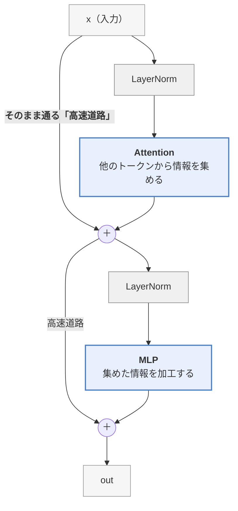
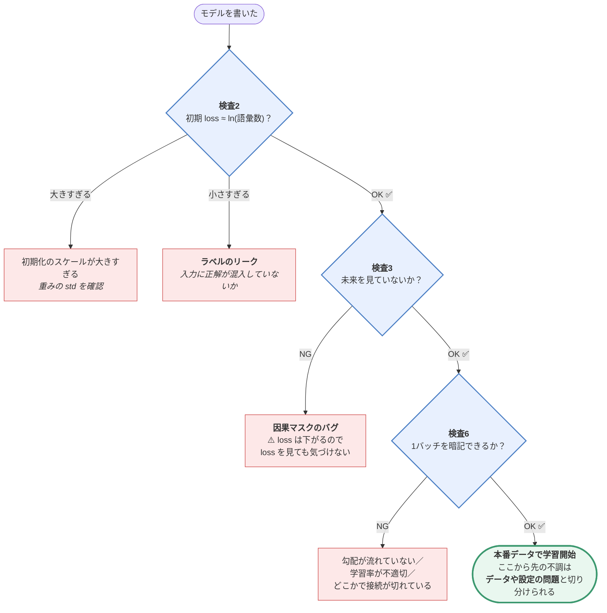
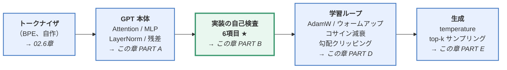

> この章は、2章の理論と5章の LLaMA2 実装の**あいだを埋める補講**です。
> **この章のゴール**：GPT-2 と同じ構造のモデルを外部ライブラリなしで書き、
> **実際に学習させて、日本語の文法を覚えさせる**。
>
> 📎 **対応コード**：[`code/04_minigpt.py`](https://github.com/thirtypower/kgr-llm/blob/main/code/04_minigpt.py)
> **CPU だけで動きます**（実測：クラウドの一般的な CPU で学習約3分、全体で約4分）。GPU は不要です。
>
> ```bash
> cd code
> python 04_minigpt.py              # 学習して生成まで
> python 04_minigpt.py --sanity     # 実装の自己検査だけ
> python 04_minigpt.py --steps 3000 # もっと学習させる
> ```

---

## なぜこの章があるのか

5章でいきなり「215M パラメータの LLaMA2 を学習させる」と言われても、
**うまくいかなかったときに原因が分かりません**。

- データが足りないのか？
- モデルが小さすぎるのか？
- **それとも実装にバグがあるのか？**

この切り分けができないと、何日も無駄にします。

そこでこの章では、**「正解が分かっている問題」**をわざと用意します。

> **文法規則を自分で決めた人工コーパスで学習させ、
> 生成された文が規則に合っているかを機械的に採点する。**

こうすれば「モデルは本当に学習したのか」を**数値で確認**できます。

| 採点結果 | 意味 |
|---------|------|
| 正答率 **90% 以上** | ✅ 実装は正しい。次は本物のデータへ |
| 正答率 **50〜90%** | 学習ステップ数かモデルサイズが足りない |
| 正答率 **30% 前後** | ❌ **実装にバグがある**（学習不足ではない） |

---

## 1. 使うデータ：規則が完全に分かっているミニコーパス

[`code/_corpus.py`](https://github.com/thirtypower/kgr-llm/blob/main/code/_corpus.py) が、次の5つの文型から文を自動生成します。

```
    1. {動物}が{食べ物}を食べる。      例) 猫が魚を食べる。
    2. {人}は{場所}へ行く。            例) 太郎は公園へ行く。
    3. {人}が{動物}を見る。            例) 花子が犬を見る。
    4. {場所}に{動物}がいる。          例) 公園に鳥がいる。
    5. {人}は{食べ物}を買う。          例) 先生は肉を買う。
```

各スロットの語彙は6語ずつです。

```
    動物   : 猫 犬 鳥 馬 兎 狐
    食べ物 : 魚 肉 米 草 豆 菓子
    人     : 太郎 花子 先生 学生 母 父
    場所   : 学校 公園 駅 海 山 店
```

> 🔑 **重要な性質**：「**猫が学校を食べる**」のような文は**絶対に出てきません**。
>
> つまりモデルは、
> - 「**が**」の後ろに来られる語（食べ物 or 動物）
> - 「**を**」の後ろに来られる語
> - 「**へ**」の後ろに来られる語（場所だけ）
>
> を**文脈から学ばなければ正解できません**。これは立派な文法学習です。

作れる文は全部で **5文型 × 6 × 6 = 180通り**。この数字が後で効いてきます。

---

## 2. モデルを書く（PART A）

GPT-2 の構造をそのまま書きます。**全部で約120行**です。

### 2.1 設定

```python
@dataclass
class GPTConfig:
    vocab_size: int = 400        # 語彙数（トークナイザで決まる）
    block_size: int = 64         # 一度に見られる最大トークン数（＝文脈長）
    n_layer:    int = 4          # Transformer ブロックの数
    n_head:     int = 4          # Attention のヘッド数
    n_embd:     int = 128        # 隠れ層の次元 d_model
    dropout:  float = 0.1        # Dropout の割合（02.5章参照。学習中だけ10%を0にする）
```

> 📝 `@dataclass` は「設定値をまとめて入れる箱クラス」を1行で作る Python の機能です。
> `cfg = GPTConfig()` と書くだけで `cfg.n_layer` のようにアクセスできます。

> ⚠️ **`vocab_size = 400` は「希望値」で、途中で実際の語彙数に差し替わります。**
> 語彙数はトークナイザを訓練して初めて確定するので、[`04_minigpt.py`](https://github.com/thirtypower/kgr-llm/blob/main/code/04_minigpt.py) では
> トークナイザ訓練の直後に
>
> ```python
> tok, train_ids, val_ids, min_loss = build_data(args.vocab)
> cfg.vocab_size = len(tok)      # ← 実測 346。学習はこの値で動く
> ```
>
> と**実際の語彙数で差し替えています**。
> 400 を指定したのに 346 になるのは、小さいコーパスでは「もう結合する価値のあるペアが無い」
> ところで BPE の訓練が止まるためです（→ 5.4節）。
>
> 📌 **この後「初期 loss ≈ ln(語彙数)」が2回出てきますが、基準の語彙数が違います。**
> 差し替えの**前**に走るのが自己検査、**後**に走るのが学習だからです。
>
> | どこ | そのときの `vocab_size` | 期待値 ln(V) | 実測 |
> |---|---|---|---|
> | **3節 検査2**（トークナイザ訓練より前に走る） | **400**（指定値のまま） | 5.991 | 6.031 |
> | **4節 学習ログの step 0**（差し替え後） | **346**（実際の語彙数） | 5.845 | 5.727 |
>
> **どちらも「ln(語彙数) の近く」に収まっているので正常**です。
> 混乱しないよう、以降は「そのときの `cfg.vocab_size`」を基準に読んでください。

本物の GPT-2 small と比べると、こうなります。

| | このミニ GPT | GPT-2 small | GPT-3 |
|---|---|---|---|
| 層数 | 4 | 12 | 96 |
| 次元 | 128 | 768 | 12288 |
| ヘッド数 | 4 | 12 | 96 |
| 文脈長 | 64 | 1024 | 2048 |
| パラメータ | 約 80万 | 1.24億 | 1750億 |

**構造は完全に同じで、数字が違うだけ**です。ここが大事なところです。

### 2.2 因果的自己注意（CausalSelfAttention）

2章で学んだ Masked Multi-Head Self-Attention です。

```python
class CausalSelfAttention(nn.Module):
    def __init__(self, cfg):
        super().__init__()
        assert cfg.n_embd % cfg.n_head == 0
        self.n_head   = cfg.n_head
        self.n_embd   = cfg.n_embd
        self.head_dim = cfg.n_embd // cfg.n_head

        # Q, K, V を作る線形層。3つ別々でもよいが、まとめて1回の行列積にした方が
        # GPU では速い（実務でも定番のテクニック）
        self.qkv  = nn.Linear(cfg.n_embd, 3 * cfg.n_embd, bias=False)
        self.proj = nn.Linear(cfg.n_embd, cfg.n_embd, bias=False)   # 出力射影 W_O

        # 因果マスク（下三角が True = 見てよい）
        # register_buffer = 「学習しないが、モデルと一緒に保存・GPU移動される変数」
        mask = torch.tril(torch.ones(cfg.block_size, cfg.block_size, dtype=torch.bool))
        self.register_buffer("mask", mask.view(1, 1, cfg.block_size, cfg.block_size))

    def forward(self, x):
        B, T, C = x.shape                       # batch, 系列長, 次元

        # ① Q, K, V を作る（各 (B, T, C)）
        #    .split(C, dim=2) = 横に3つ繋がった (B,T,3C) を C 幅で3本に切り分ける
        q, k, v = self.qkv(x).split(self.n_embd, dim=2)

        # ② ヘッドに分割: (B, T, C) → (B, n_head, T, head_dim)
        q = q.view(B, T, self.n_head, self.head_dim).transpose(1, 2)
        k = k.view(B, T, self.n_head, self.head_dim).transpose(1, 2)
        v = v.view(B, T, self.n_head, self.head_dim).transpose(1, 2)

        # ③ Attention 本体（2章の式そのまま）
        att = (q @ k.transpose(-2, -1)) / math.sqrt(self.head_dim)   # QKᵀ/√d_k
        # ~ は True/False の反転。「見てよい場所以外」を -∞ にする
        # （2章の mask == 0 と同じ意味の別の書き方）
        att = att.masked_fill(~self.mask[:, :, :T, :T], float("-inf"))  # 未来を-∞に
        att = F.softmax(att, dim=-1)
        y = att @ v                                                   # 重み × V

        # ④ ヘッドを結合して元の形に戻す
        y = y.transpose(1, 2).contiguous().view(B, T, C)
        return self.proj(y)
```

> 💡 **shape を追ってください**。`(B, T, C)` で入って `(B, T, C)` で出ます。
> **Attention は形を変えません。** やっているのは
> 「各トークンのベクトルに、自分より前のトークンの情報を混ぜ込む」ことだけです。

> 📝 **本文と実ファイルの違いが2つあります**。どちらも本質ではないので、
> 写経するならこの本文どおりで動きます。
> ① 実ファイル [`code/04_minigpt.py`](https://github.com/thirtypower/kgr-llm/blob/main/code/04_minigpt.py) の forward には
> `kv_cache` という追加の引数と分岐があります。これは**生成を速くするための仕掛け**で、
> 後述の 4節（検査5）で説明します。**今は無視して読み進めてOK**です。
> ② 実ファイルには `nn.Dropout` が入っています（02.5章で説明した過学習防止。
> 本文では読みやすさのため省略）。
>
> また、全部の `nn.Linear` が `bias=False` なのは GPT 系の慣例です
> （bias を削っても性能がほぼ変わらないため、その分を節約しています）。

### 2.3 MLP（Feed-Forward Network）

```python
class MLP(nn.Module):
    def __init__(self, cfg):
        super().__init__()
        self.fc   = nn.Linear(cfg.n_embd, 4 * cfg.n_embd)   # 4倍に広げるのが慣例
        self.proj = nn.Linear(4 * cfg.n_embd, cfg.n_embd)

    def forward(self, x):
        return self.proj(F.gelu(self.fc(x)))
```

> 📝 `gelu` は GPT-2 が使う活性化関数です。02.5章の ReLU の折れ曲がりを
> **滑らかにしたもの**で、役割（非線形性の注入）はまったく同じです。
> ReLU → GELU → SwiGLU（05章）と改良されてきましたが、どれも「折れ曲がり係」です。

- **Attention** ＝ 他のトークンから**情報を集める**層（トークン間の通信）
- **MLP** ＝ 集めた情報を**加工する / 知識を引き出す**層（位置ごとに独立）

**パラメータの約 2/3 はここ**にあります。2章で「知識は FFN に蓄えられている」と
書いたのは、単純に量が多いからでもあります。

### 2.4 Transformer ブロック

```python
class Block(nn.Module):
    def __init__(self, cfg):
        super().__init__()
        self.ln1  = nn.LayerNorm(cfg.n_embd)
        self.attn = CausalSelfAttention(cfg)
        self.ln2  = nn.LayerNorm(cfg.n_embd)
        self.mlp  = MLP(cfg)

    def forward(self, x):
        x = x + self.attn(self.ln1(x))   # ★ Pre-Norm + 残差
        x = x + self.mlp(self.ln2(x))
        return x
```

**この2行が Transformer の全てです。**



> 🔑 `x + f(norm(x))` という形（**Pre-Norm**）が重要です。
> **`x` そのものが加工されずに出口まで通るバイパスがある**ため、
> 逆伝播のとき勾配がそのまま前の層に届きます。これが深いモデルを学習可能にしています。
> （2章で説明した残差接続が、コードではこの `x +` の2文字です）

### 2.5 モデル全体

```python
class MiniGPT(nn.Module):
    def __init__(self, cfg):
        super().__init__()
        self.tok_emb = nn.Embedding(cfg.vocab_size, cfg.n_embd)   # トークン → ベクトル
        self.pos_emb = nn.Embedding(cfg.block_size, cfg.n_embd)   # 位置 → ベクトル
        self.blocks  = nn.ModuleList([Block(cfg) for _ in range(cfg.n_layer)])
        self.ln_f    = nn.LayerNorm(cfg.n_embd)
        self.head    = nn.Linear(cfg.n_embd, cfg.vocab_size, bias=False)

        # 重み共有（Weight Tying）: 入口の Embedding と出口の分類器で同じ行列を使う
        self.tok_emb.weight = self.head.weight
        # なぜ共有できるのか：どちらも (vocab_size × n_embd) の同じ形で、
        #   入口は「ID → そのトークンのベクトル」（行の取り出し）、
        #   出口は「ベクトル → 各トークンとの内積スコア」（全行との内積）。
        #   「トークンの意味を表すベクトル表」を逆向きに引いているだけなので共用できる。
        #   実際の語彙346 × 128 = 44,288 パラメータの節約（このモデルの約5%）。GPT-2 も採用。

    def forward(self, idx, targets=None):
        B, T = idx.shape
        pos = torch.arange(T, device=idx.device)
        x = self.tok_emb(idx) + self.pos_emb(pos)   # (B,T,C) + (T,C) → 自動broadcast
        #   broadcast＝形が足りない次元を自動で複製して揃える PyTorch の仕組み。
        #   ここでは同じ位置ベクトル (T,C) が、B 本の文すべてに足される
        for block in self.blocks:
            x = block(x)
        x = self.ln_f(x)
        logits = self.head(x)                       # (B, T, vocab_size)

        loss = None
        if targets is not None:
            loss = F.cross_entropy(logits.view(-1, logits.size(-1)),
                                   targets.reshape(-1), ignore_index=-100)
        return logits, loss
```

**位置埋め込みが `nn.Embedding` なこと**に注目してください。
GPT-2 は2章で説明した sin/cos ではなく、**位置ごとのベクトルを学習で獲得**します
（**学習型位置埋め込み**）。5章で、これを RoPE に置き換えます。

### 2.6 初期化の工夫

```python
# 残差の出口だけ初期化を小さくする（GPT-2 の工夫）
# ※ この数行は MiniGPT の __init__ の末尾に書きます
for name, p in self.named_parameters():
    if name.endswith("proj.weight"):
        nn.init.normal_(p, mean=0.0, std=0.02 / math.sqrt(2 * cfg.n_layer))
```

残差接続は毎層で値を足し込んでいくので、**層を重ねるほど値が大きくなっていきます**。
そこで残差に流れ込む出力の初期スケールを `1/√(2×層数)` に絞り、
深くしても爆発しないようにします。GPT-2 論文で導入された、地味ですが効く工夫です。

---

## 3. ★ 実装の自己検査（PART B）— この章で最も価値のある部分

**バグは学習前に潰す。** これが LLM 開発の鉄則です。
学習を始めてしまうと、「データが悪いのかコードが悪いのか」の切り分けに何日も溶かします。

`04_minigpt.py` は、学習の前に **6項目の自己検査**を自動で走らせます。

### 検査1：出力の形が `(B, T, vocab_size)` か

```python
x = torch.randint(0, cfg.vocab_size, (2, 16))
logits, _ = model(x)
assert tuple(logits.shape) == (2, 16, cfg.vocab_size)
```

一番基本的な確認です。ここで落ちるなら shape の扱いを間違えています。

### 検査2：初期 loss ≈ ln(語彙数) ★★★

```python
x, y = get_batch(...)   # ※ 適当な1バッチでよい（get_batch はこの章の 5.1節 参照）
_, loss = model(x, y)
expected = math.log(cfg.vocab_size)        # ← この検査は語彙差し替えより前に走るので 400
assert abs(loss.item() - expected) < 0.3   #   （→ 2.1節の 📌）
```

実行するとこう出ます（`python 04_minigpt.py --sanity`）。

```
  [OK] 初期 loss ≈ ln(語彙数)     loss=6.031, ln(V)=5.991
```

> **[00.5章](https://zenn.dev/thirtypower/books/kgr-llm-guide/viewer/005-deep-learning-basics) で説明した、最も費用対効果の高い検査です。**
>
> 学習前のモデルは「全トークンが等確率」としか言えないので、
> loss は理論的に `ln(語彙数)` になるはずです。
>
> | 結果 | 疑うべきこと |
> |------|------------|
> | ln(V) 付近 | ✅ 損失計算と初期化は正しい |
> | ln(V) より大幅に大きい | 初期化のスケールが大きすぎる |
> | 異常に小さい | **ラベルがリークしている**（入力に正解が混入） |

### 検査3：因果性（未来を見ていないか）★★★

**これが最も見落とされやすいバグです。**

```python
model.eval()   # ★ 必須。Dropout が有効なままだと出力が毎回ランダムに変わり、
               #   バグが無くても diff が出てしまう（検査後は model.train() で戻す）

a = torch.randint(0, V, (1, 20))
b = a.clone()
b[0, 10:] = torch.randint(0, V, (10,))   # ★ 後半だけを別のトークンに書き換える

with torch.no_grad():
    la, _ = model(a)
    lb, _ = model(b)

# 前半10トークンの出力は、後半を変えても一切変わらないはず
diff = (la[0, :10] - lb[0, :10]).abs().max()
assert diff < 1e-4
```

> 📝 `model.eval()` / `model.train()` は「推論モード／学習モード」の切り替えスイッチです。
> 違いは **Dropout（02.5章）が効くかどうか**：train 中はランダムに値を落とし、
> eval 中は何も落とさず決定的に動きます。**「出力を比較する検査」は必ず eval で**行います。

**発想が上手いところ**：後半だけを書き換えて、**前半の出力が1ミリも変わらないこと**を
確認しています。もし因果マスクにバグがあれば、前半の出力が変わってしまいます。

> ⚠️ 因果マスクのバグは**恐ろしい**です。
> 未来が見えるとカンニングになるので **loss はきれいに下がります**。
> 「学習は順調に見えるのに、生成させると意味不明」という最悪の症状になります。
> **この検査を通してから学習を始めてください。**

### 検査4：全パラメータに勾配が届くか

```python
loss.backward()
dead = [n for n, p in model.named_parameters()
        if p.requires_grad and (p.grad is None or p.grad.abs().sum() == 0)]
assert not dead
```

**接続し忘れた層**（定義したのに `forward` で使っていない層など）を検出します。

### 検査5：KV キャッシュが通常の forward と一致するか

まず **KV キャッシュとは何か**を説明します（初出です）。

生成は「1トークン足しては全体を forward し直す」の繰り返しでした（00章）。
しかし考えてみると、**過去のトークンの K と V は毎回まったく同じ値**です
（因果マスクのおかげで、過去は未来の影響を受けないから）。
毎回計算し直すのは無駄なので、**一度計算した K と V を貯金箱（キャッシュ）に取っておき、
新しい1トークン分だけ計算して追記する**——これが **KV キャッシュ**です。
生成が数十倍速くなる、実務では必須の高速化です（詳しい実装は05章）。

```python
full, _ = model(seq)                    # 一括で処理した結果
# 1トークンずつ、キャッシュを使って処理した結果
incr = ...   # ※ 実装は code/04_minigpt.py の sanity_checks() 内「検査5」参照
assert (full - incr).abs().max() < 1e-3
```

「**一括で forward した結果**」と「**キャッシュを使い1トークンずつ処理した結果**」は、
理論上ぴったり一致するはずです。それを確認するのがこの検査です。
最適化を入れたときは、必ず「最適化前と一致するか」を確かめます。

> 📝 2.2節のコードに出てきた `kv_cache` 引数の正体がこれです。
> 「今は無視してよい」と言ったのは、**学習では使わず、生成でだけ使う**ものだからです。

### 検査6：1バッチだけ過学習できるか ★★★

```python
xb, yb = ランダムなデータ4件
for _ in range(200):
    _, loss = model(xb, yb)
    opt.zero_grad(); loss.backward(); opt.step()
assert loss.item() < 0.1     # ★ 完全に暗記できるはず
```

**たった4件のランダムデータを暗記させます。**

これができないなら、**モデルに学習能力がありません**（勾配が流れていない、
学習率が不適切、どこかで勾配が切れているなど）。
逆に、これが通れば**「学習できるモデルである」ことが確定**します。

### 学習を始める前の判断フロー



**赤い箱に落ちたら、直してからこのフローの先頭に戻ってください。**
検査は上から順に通すことに意味があります（下の検査から先に潰しても切り分けになりません）。

> 🔑 **この3つ（2・3・6）が通ってから、初めて本番データで学習を始めてください。**
>
> | 検査 | 通れば何が確定するか |
> |------|-------------------|
> | **検査2** | 損失計算と初期化が正しい |
> | **検査3** | 因果マスクが正しい |
> | **検査6** | 勾配が流れて学習できる |
>
> **順番を守らないと「データが悪いのかコードが悪いのか」で何日も溶かします。**
> これは教材上の話ではなく、実務でそのまま通用する手順です。

---

## 4. データの準備（PART C）

```python
text = _corpus.make_text(n=20000)      # 2万文の人工コーパス
tok = ByteLevelBPE()
tok.train(text, vocab_size=400)        # 02.6章で作った自前のトークナイザ

ids = torch.tensor(tok.encode(text))
n = int(0.9 * len(ids))
train_ids, val_ids = ids[:n], ids[n:]  # 9:1 で分割
```

### なぜ検証用（val）を分けるのか

> **学習データの loss は、モデルが「暗記」するだけでも下がります。**
> **未知のデータでの loss（val loss）が下がって初めて「規則を学んだ」と言えます。**

```
loss
 ↑
 │╲
 │ ╲╲___ train loss（下がり続ける）
 │  ╲   ╲___________
 │   ╲__________
 │              ‾‾‾╲___ val loss
 │                      ╲
 │                       ╱‾‾‾  ← ここから上昇 = 過学習の合図
 └──────────────────────────────→ ステップ
                        ここで止めるべき
```

**両者が乖離し始めたら過学習**です。学習を止めるか、データを増やします。

### ★ 理論的な loss の下限を計算する

**このコーパスは自分で作ったので、含まれる「本当の不確実性」が計算できます。**

> 📝 **先に2つだけ用語を押さえます（これが分かれば下の式は当たり前に見えます）**
>
> 1. **「ナット」＝ 情報量の単位**。`−log(確率)` を自然対数で測ったもの。
>    実はもう使っています——00.5章の「初期 loss ＝ ln(V)」は
>    「V 択クイズの答えが持つ情報量は ln(V) ナット」と言っているのと同じことです。
> 2. **loss（交差エントロピー）＝「1トークン当てるのに必要な情報量」**。
>    そして PyTorch の `cross_entropy` は、**全トークンの平均**を返します。
>
> つまり「1トークンあたりの loss」を出したいなら、
> **（全体の情報量）÷（全トークン数）** を計算すればよい——それが下の式です。

```
   1文あたりの選択肢 = 文型5通り × スロット6通り × スロット6通り = 180通り（等確率）
   → 1文が持つ情報量 = ln(180) ≈ 5.19 ナット

   それ以外（助詞「が」「を」、語尾「食べる。」など)は
   文型が決まれば完全に決定的 → 情報量 0

   理論的な loss の下限 = (文数 × ln(180)) ÷ 総トークン数
```

> 🔢 **式の意味をもう一度**：
> 分子「文数 × ln(180)」＝ **コーパス全体に含まれる情報量の合計**。
> それを**総トークン数で割る**ので、答えは **1トークンあたりの情報量 ＝ loss の下限**になります。
>
> ```
>              全体の情報量（＝どうしても当てられない分）
>   下限  =  ────────────────────────────────────
>                      全トークン数
> ```

```python
min_loss = n_sentences * math.log(180) / len(ids)
# 今回の実測では 20000文・総トークン数 約15.2万 なので
#   20000 × 5.193 ÷ 152000 ≈ 0.683 （実行すると正確な値が表示されます）
```

> 🔑 **これは非常に強力な考え方です。**
>
> 学習後の val loss がこの下限に近づけば、
> **「このデータから学べることは全部学んだ」**という意味になります。
> **それ以上は原理的に下がりません**（下がったら学習データを暗記しているだけ）。
>
> LLM の学習で「loss がこれ以上下がらない」とき、
> 多くの場合それは**バグではなく、そのデータの持つ情報量を学び切った**ことを意味します。
> **そこから先に進むには、データを増やすかモデルを大きくするしかありません。**
>
> —— **これが Scaling Law（規模の法則）が生まれる、いちばん素朴な理由です。**
> このスケーリング則の話は 04章で改めて扱います。そのとき、ここでの具体的な計算を
> 思い出してください。

### 実測：本当に理論下限まで下がるのか

言葉だけでは信じられないので、実際の学習ログを見てください（CPU、約3分）。

```
    step        lr    train      val   val ppl      経過
       0  4.00e-05   5.7271   5.7273    307.13    0.8s   ← ≈ ln(346)=5.85 から開始（語彙は346に差し替え済み。差0.12 は許容幅 ±0.3 内）
     150  2.98e-03   0.6941   0.6960      2.01   17.5s   ← ほぼ一気に下限付近へ
     600  2.19e-03   0.6898   0.6938      2.00   67.9s
    1050  9.12e-04   0.6875   0.6901      1.99  116.3s
    1499  3.00e-04   0.6866   0.6874      1.99  165.9s   ← 以降はいくら回しても下がらない

  最終 val loss   = 0.6874
  理論下限        = 0.6827
  差              = +0.0048   ← ほぼゼロ！
```

- **開始時の loss 5.73** は `ln(語彙数346) = 5.85` とほぼ一致（＝実装が正しい）
- **最終 val loss 0.6874** は理論下限 0.6827 との差が **+0.005**
- val ppl（パープレキシティ）が **1.99** ——「1トークンあたり平均で実質2択」という意味です。
  このコーパスは「猫が」の次のような**6択の場面**と、「食べ」の次が必ず「る。」になる**1択の場面**が
  混ざっているので、**平均すると約2択**になります。1.99 はその混合の正確な反映です

> ✅ **理論値と実測値がここまで一致する経験**は、本物のデータでは絶対にできません。
> 正解の分かる問題で一度これを見ておくと、以降「loss の値を読む」感覚が変わります。

---

## 5. 学習する（PART D）

### 5.1 バッチの作り方

```python
def get_batch(data, block_size, batch_size, device):
    ix = torch.randint(len(data) - block_size - 1, (batch_size,))
    x = torch.stack([data[i     : i + block_size    ] for i in ix])   # 入力
    y = torch.stack([data[i + 1 : i + block_size + 1] for i in ix])   # 正解 = 1つ後ろ
    return x.to(device), y.to(device)
```

**`y` が `x` を1つ後ろにずらしただけ**——これが「次トークン予測」の実装の全てです。

```
   data:  [ 猫 | が | 魚 | を | 食 | べる | 。]
   x   :  [ 猫 | が | 魚 | を ]
   y   :       [ が | 魚 | を | 食 ]
            ↑ 各位置で「次のトークン」を当てる
```

### 5.2 学習ループ

```python
opt = torch.optim.AdamW(model.parameters(), lr=3e-3, betas=(0.9, 0.95),
                        weight_decay=0.1)

for step in range(steps):
    # ① 学習率を更新（ウォームアップ + コサイン減衰）
    cur_lr = get_lr(step, steps, warmup, lr)
    for g in opt.param_groups:
        g["lr"] = cur_lr

    # ② 学習の3点セット
    x, y = get_batch(train_ids, cfg.block_size, batch_size, DEVICE)
    _, loss = model(x, y)
    opt.zero_grad(set_to_none=True)
    loss.backward()
    torch.nn.utils.clip_grad_norm_(model.parameters(), 1.0)   # 勾配クリッピング
    opt.step()
```

**00.5章で学んだ3点セット（`zero_grad` → `backward` → `step`）そのまま**です。
本物の LLM の学習ループも、規模が違うだけでこれと同一です。

> 📝 **lr=3e-3 は、00.5章の定番表（1e-4〜3e-4）より10倍大きい**ことに気づきましたか？
> あの表は数億〜数十億パラメータのモデルの値です。今回のモデルは**80万パラメータと極小**なので、
> 大きめの学習率でも安定します。**モデルが大きいほど lr は小さくする**——表の補足どおりです。

### 5.3 学習率スケジュール

```python
def get_lr(step, total, warmup, lr_max, lr_min_ratio=0.1):
    if step < warmup:
        return lr_max * (step + 1) / warmup                    # 線形に上げる
    ratio = (step - warmup) / max(1, total - warmup)
    return lr_max * (lr_min_ratio + (1 - lr_min_ratio)
                     * 0.5 * (1 + math.cos(math.pi * ratio)))  # コサインで下げる
```

```
学習率
 ↑
 │      ╱‾‾‾╲╲
 │     ╱      ╲╲╲
 │    ╱           ╲╲╲╲
 │   ╱                 ╲╲╲╲╲___
 └──┴────────────────────────────→ ステップ
    ウォームアップ    コサイン減衰
```

| 区間 | 目的 |
|------|------|
| **ウォームアップ** | 最初から高い学習率だと発散する。徐々に上げて安定させる |
| **コサイン減衰** | 終盤に学習率を下げ、細かく収束させる |

**LLM 学習の事実上の標準**です。理由が分かれば、そのまま5章・6章で使えます。

### 5.4 パラメータの内訳を見る

学習開始時に、パラメータがどこに使われているかが表示されます。
以下は実際の実行結果です（パラメータ総数 843,776）。

```
    MLP                       526,848  ( 62.4%)   ← ★ 一番大きい
    Attention                 262,144  ( 31.1%)
    Embedding(トークン)         44,288  (  5.2%)   ← 語彙346 × 128
    Embedding(位置)              8,192  (  1.0%)
    LayerNorm 等                 2,304  (  0.3%)
```

**MLP が全体の約 2/3 を占める**ことが、自分のモデルの数字として見えます。
2章で読んだ「LLM の知識の多くは FFN にある」という話の実体がこれです。

> 💡 語彙が 400 でなく 346 なのは、BPE の訓練が「もう結合する価値のあるペアが無い」
> ところで止まったためです（[02.6章](https://zenn.dev/thirtypower/books/kgr-llm-guide/viewer/026-tokenizer)）。
> 小さいコーパスでは指定した語彙数まで届かないことがあります。

---

## 6. 生成して採点する（PART E）

### 6.1 温度を変えて生成

```python
# 生成の起点。このコーパスは文が改行区切りなので「改行」が文の開始合図
bos = tok.encode("\n")
start = torch.tensor([bos], dtype=torch.long, device=DEVICE)

for temp in [0.0, 0.5, 1.0, 1.5]:
    out = model.generate(start, 50, temperature=temp, top_k=50)
```

> ⚠️ **起点には「学習時にモデルが見たことのあるトークン」を使ってください。**
> `<pad>` のような学習中に一度も登場しなかったトークンを起点にすると、
> モデルにとって完全な未知の状態から始まるため、出力が壊れます。
> これは実務でも頻出のミスです。

| 温度 | 挙動 | 使いどころ |
|------|------|----------|
| **T = 0** | 完全に決定的（greedy）。毎回いちばん確率の高いトークンを選ぶ | 再現性が要るとき。ただし**同じ文を延々と繰り返しがち** |
| **T = 0.5** | やや堅実 | 要約・抽出・分類など、正確さ重視のタスク |
| **T = 1.0** | 学習した確率分布そのまま | 標準 |
| **T = 1.5** | 分布を平坦化して冒険させる | 創作。ただし壊れた出力も増える |

実際の実行結果を見ると、この表のとおりのことが起きています。

```
[ greedy] 花子は公園へ行く。 / 花子は公園へ行く。 / 花子は公園へ行く。 / …（延々と同じ文）
[  T=0.5] 太郎は草を買う。 / 母は店へ行く。 / 父は米を買う。 / 学生は公園へ行く。
[  T=1.0] 公園に馬がいる。 / 花子は魚を買う。 / 海に兎がいる。 / 母は海へ行く。
[  T=1.5] 犬が菓子を食べる。 / 駅に兎がいる。 / 狐が行く。 / 花子が兎が犬を見る ← 壊れ始める
```

- **greedy** は最初に見つけた最頻文をループし続けます。
  「ChatGPT の temperature を 0 にすると単調になる」の正体を、自分のモデルで確認できました。
- **T=1.5** では「狐が行く。」「花子が兎が犬を見る」のような**文法違反**が現れます。
  分布を平坦にした結果、本来ほぼ 0% だったトークンが選ばれてしまうためです。

> **温度 T は、softmax の直前で logits を T で割る操作**です。
>
> ```
> T が小さい → logits の差が拡大 → 一番確率の高いものに集中（確定的）
> T が大きい → logits の差が縮小 → 平坦化（ランダムに近づく）
> ```
>
> 「T=0 は無難だが単調」の正体がこれです。最頻トークンしか選ばないので、
> 一度ループに入ると抜け出せません。
>
> 📝 厳密には T=0 は「0 で割る」ことになってしまうので、実装では
> 「T≤0 なら割らずに最大の logit を選ぶ（argmax）」という**特別扱い**にします
> （T→0 の極限がこれに一致します）。`code/04_minigpt.py` の generate もそうなっています。

**もう1つのつまみ：top-k サンプリング**

上のコードの `top_k=50` は、**確率上位 k 個以外を選択肢から外す**フィルタです。

```
logits: [ 3.2, 2.9, 2.5, ..., -1.0, -1.3 ]   ← 語彙全部にスコアがある
                  ↓ top_k=3 なら
        [ 3.2, 2.9, 2.5, ..., -∞,  -∞ ]     ← 上位3個以外を -∞ に
                  ↓ softmax
        上位3個だけに確率が配られる（-∞ は exp すると 0）
```

「-∞ にしてから softmax すると確率 0 になる」——**2章の因果マスクとまったく同じ発想**です。
温度を上げても、top-k がある限り「本来ほぼ 0% の変なトークン」までは選ばれません。
温度＝分布の尖り方、top-k＝選択肢の足切り、という2段構えです。

### 6.2 ★ 文法の正答率で採点する

**この章の眼目です。** コーパスの規則が既知なので、生成文を機械的に採点できます。

```python
start = torch.tensor([bos] * 8, dtype=torch.long, device=DEVICE)  # 8本並列で生成
out = model.generate(start, 400, temperature=0.9, top_k=30)
all_text = "\n".join(tok.decode(row.tolist()) for row in out)
ok, total, rate = _corpus.score(all_text)
print(f"{total} 文中 {ok} 文が文法的に正しい → 正答率 {rate:.1%}")
```

> 📝 サンプル数を稼ぐため、**8本の系列を並列に**生成しています（バッチ生成）。
> 400トークン × 8本 ＝ 3200トークン、1文は平均7〜8トークンなので約420文になります。

| 正答率 | 判定 | 次にすべきこと |
|-------|------|--------------|
| **90% 以上** | ✅ 合格 | 実装は正しい。本物のデータへ進んでよい |
| **50〜90%** | 要調整 | `--steps` を増やす、モデルを大きくする |
| **30% 未満** | ❌ 要デバッグ | **PART B の自己検査に戻る**。学習不足ではなくバグ |

実際の実行結果：

```
  生成した文: 420 文中 413 文が文法的に正しい  →  正答率 98.3%
  今回の結果: 合格
```

> 🔑 **「学習不足なのかバグなのか」を切り分けられる**——
> これがこの人工コーパスを使う唯一にして最大の理由です。
> 本物の Wikipedia で学習していたら、この判断は絶対にできません。
>
> 💡 100% にならないのは temperature=0.9 でわざと揺らしているためです。
> 前節の T=1.5 の例で見たとおり、**サンプリングの揺らぎは低確率の（＝文法違反の）
> トークンをたまに選びます**。これはモデルの欠陥ではなく生成方式の性質です。

### 6.3 次のトークンの確率分布を覗く

最後に、モデルの中身を直接見ます。

```python
prompt = "猫が"
ids = torch.tensor([tok.encode(prompt)], dtype=torch.long, device=DEVICE)
logits, _ = model(ids)
probs = F.softmax(logits[0, -1], dim=-1)      # ★ 最後の位置だけが「次の予測」
top = torch.topk(probs, 8)                    # 確率上位8個を取り出す
```

実際の実行結果がこちらです。

```
  「猫が」の次に来るトークンの予測 上位8:
     19.6%  '魚'    #########
     17.6%  '豆'    ########
     16.5%  '草'    ########
     15.8%  '菓子'  #######
     15.4%  '肉'    #######
     14.8%  '米'    #######
      0.0%  '兎'
      0.0%  '鳥'
```

この分布は**2つのことを同時に証明しています**。

1. **文法を学んだ**：「猫が」の次に来るのは食べ物6語だけ。
   「学校」「太郎」などの確率は 0.0% に潰れています。
2. **正しい確率まで学んだ**：コーパスは食べ物6語を**等確率**で選んで作られているので、
   完璧に学習したモデルの予測は 1/6 ≈ **16.7%** ずつになるはずです。
   実際の出力は 14.8〜19.6% —— ほぼぴったりです。

> 🔑 つまりこのモデルは「どれが来るか分からないものを、分からないなりの確率で言う」
> ところまで到達しています。PART C で計算した**理論下限の loss に到達した**というのは、
> まさにこの状態のことです。「当てられない」のではなく「学べることを学び切った」のです。

> 🔑 **★ これが LLM の全てです。**
>
> モデルは「**次のトークンの確率分布**」しか出しません。
> それを1個サンプリングして末尾に足し、また入力に戻す。
> **この繰り返しだけで文章が生まれます。**
>
> ChatGPT も Claude も、内部でやっているのは完全にこれと同じです。
> 違うのは、パラメータが80万個か1兆個か、それだけです。

---

## この章のまとめ

### 作ったもの



**これは GPT-2 の完全なミニチュアです。** 規模以外に省略はありません。

### 持ち帰るべき考え方

| 教訓 | 内容 |
|------|------|
| **バグは学習前に潰す** | 検査2（初期loss）・検査3（因果性）・検査6（1バッチ暗記）を必ず通す |
| **因果マスクのバグは loss が下がる** | だから loss だけ見ていても気づけない。専用の検査が要る |
| **正解が分かる問題で切り分ける** | 「学習不足かバグか」を数値で判断できる状態を作る |
| **理論的な loss の下限を計算する** | 「これ以上下がらない」がバグとは限らない。Scaling Law の素朴な理由 |
| **val loss を見る** | train loss は暗記だけでも下がる |
| **Attention は形を変えない** | `(B,T,C)` → `(B,T,C)`。情報を混ぜるだけ |
| **MLP がパラメータの 2/3** | 知識の格納場所 |

## 理解度チェック

1. `y = data[i+1 : i+block_size+1]` としているのはなぜですか？
2. 因果マスクにバグがあると、なぜ「loss は下がるのに生成が壊れる」のですか？
3. 検査6（1バッチだけ過学習させる）は、何を確認するためのものですか？
4. train loss は下がるのに val loss が上がり始めたら、何が起きていますか？
5. val loss が理論的下限に到達して止まったとき、それはバグですか？
6. `x = x + self.attn(self.ln1(x))` の `x +` は何のためにありますか？

<details>
<summary><b>▶ 解答を見る</b></summary>

1. **「次のトークン予測」を実装するため**です。位置 `t` の出力が位置 `t+1` のトークンを当てるように、正解ラベルを入力より1つ後ろにずらしています。
2. 未来のトークンが見えると**カンニングになるので、予測が簡単になり loss はきれいに下がります**。しかし実際の生成時には未来が存在しないため、学習時とまったく違う状況になり、出力が破綻します。「学習は順調に見えるのに生成が意味不明」という最悪の症状になるので、専用の検査（検査3）が必要です。
3. **モデルに学習能力があるか**の確認です。たった4件のデータすら暗記できないなら、勾配が流れていない・学習率が不適切など、根本的な問題があります。逆にこれが通れば「学習できるモデルである」ことが確定し、以降は実装ではなくデータや設定の問題として切り分けられます。
4. **過学習（Overfitting）**です。モデルが学習データを暗記し始め、未知のデータへの汎化性能が落ちています。学習を止めるか、データを増やす・正則化を強めるなどの対処が必要です。
5. **バグではありません。** そのデータが持つ情報量を学び切った状態です。理論的下限より下には原理的に下がりません。先に進むにはデータを増やすかモデルを大きくするしかなく、これが Scaling Law の素朴な根拠になっています。
6. **残差接続（Residual Connection）** です。`x` そのものが加工されずに出口まで通るバイパスを作ることで、逆伝播時に勾配がそのまま前の層へ届き、深いネットワークでも学習が可能になります。

</details>

---

## 手を動かす

```bash
cd code

# まず自己検査だけ走らせる（数秒）
python 04_minigpt.py --sanity

# 学習して生成まで（CPU で3〜5分程度）
python 04_minigpt.py

# 正答率が伸びなければステップ数を増やす
python 04_minigpt.py --steps 3000
```

**必ず見てほしいのは PART B の6項目と、PART E の正答率**です。
正答率90%を自分で出せたら、この教材の実践パートの半分は終わったと思ってください。

---

**次へ** → [03. 事前学習言語モデル](https://zenn.dev/thirtypower/books/kgr-llm-guide/viewer/03-pretrained-models)
（すぐ実装を続けたい人は → [05. 自分で LLM を作る](https://zenn.dev/thirtypower/books/kgr-llm-guide/viewer/05-build-your-own-llm) ＋ `code/05_llama.py`）
