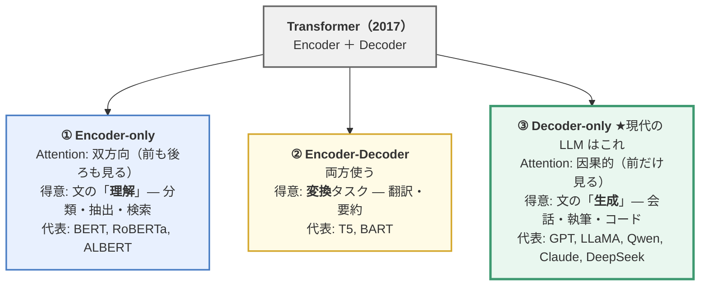
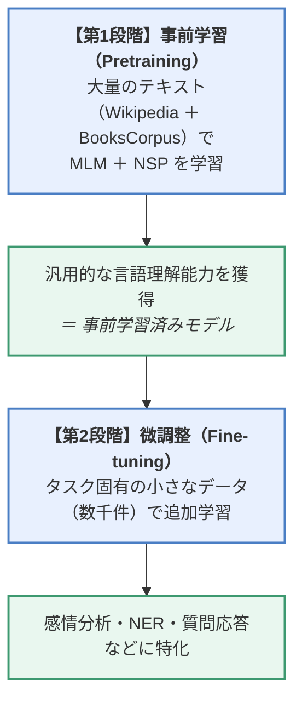
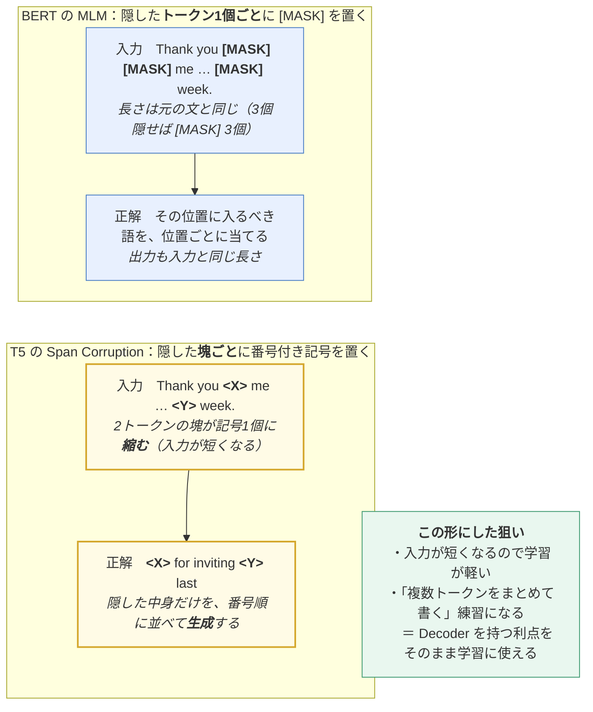
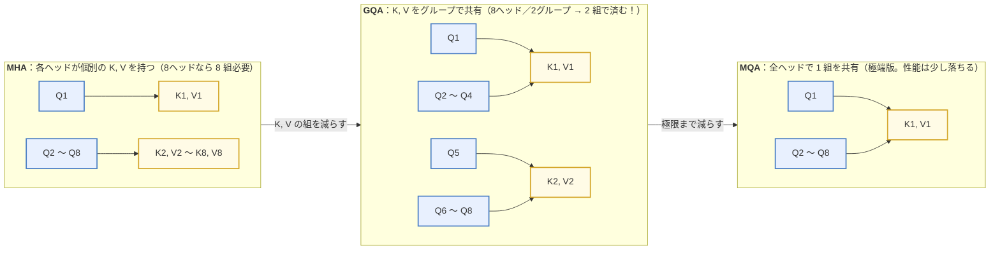
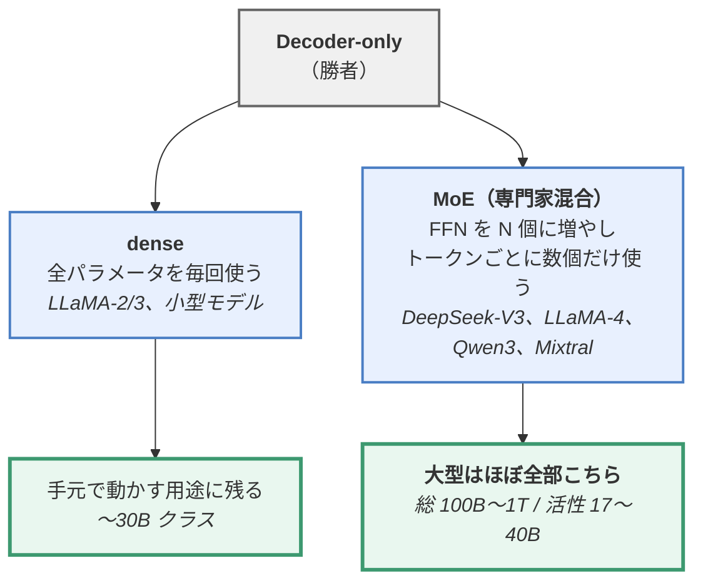
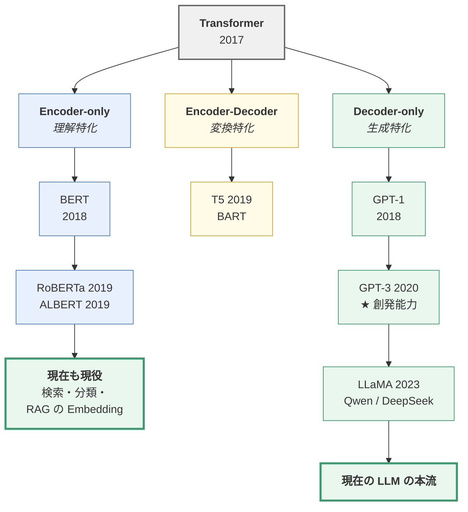

> **この章のゴール**：Transformer を「どう切り出して使うか」で3つの流派が生まれたことを理解し、
> BERT / T5 / GPT / LLaMA の違いを説明できるようになる。

---

## 3.0 大前提：3つの流派

第2章で Transformer には **Encoder** と **Decoder** の2つのブロックがあると学びました。
実は、この**どちらを使うか**で、モデルの性格が全く変わります。



**なぜ最終的に Decoder-only が勝ったのか**は、この章の最後で説明します。

### 先に結論の図：3流派は「何を隠して当てさせるか」が違うだけ

構造の違い（双方向／因果的）は、そのまま**事前学習タスクの違い**になります。
**同じ1文**を3つの方式に入れて比べると、章全体の見通しが一気に良くなります。

```
   元の文：  今日 ／ は ／ 良い ／ 天気 ／ です ／ ね      （6トークン）

  ── ① CLM（GPT・LLaMA ＝ Decoder-only）「次の1個」を当てる ─────────
     入力： 今日  は   良い  天気  です
     正解：  は  良い  天気  です   ね
            ↑ 全部の位置が同時に問題になる（1文から 5 問）

  ── ② MLM（BERT ＝ Encoder-only）「穴の中身」を当てる ──────────────
     入力： 今日  は [MASK] 天気  です  ね
     正解：           良い
            ↑ 隠すのは 15% だけ（1文から 1 問弱）。ただし穴の左右両方が見える

  ── ③ Span Corruption（T5 ＝ Encoder-Decoder）「隠した塊」を並べて出す ─
     入力： 今日  は  <X>  です  ね
     正解： <X> 良い 天気 </s>
            ↑ 連続した塊をまとめて1個の記号に置き換える
```

| | ① CLM | ② MLM | ③ Span Corruption |
|---|---|---|---|
| 1文から取れる問題数 | **トークン数ぶん（最大）** | 15% ぶんだけ | 隠した塊の数ぶん |
| 各位置が見える範囲 | 自分より前だけ | **前も後ろも** | 入力は前後、出力は前だけ |
| そのまま文章生成に使えるか | ⭕ そのまま | ❌ 使えない | ⭕（ただし変換タスク向け） |
| 学習時だけの人工記号 | 不要 | `[MASK]` が必要 | `<X>` が必要 |

> 🔑 **この表の1行目が、後の勝敗を決めます。**
> 同じ量のテキストから取れる学習信号は、**CLM が MLM の約 6.7 倍**（＝ 15% の逆数）です。
> 上の6トークンの例なら「CLM は5問、MLM は1問弱」という差になります。
> 「データを何兆トークンも流し込む」時代になったとき、この差が決定的になりました
> （→ 3.4 で詳述）。
>
> 📝 逆に2行目（前後両方が見える）は今でも MLM の強みで、
> **検索や埋め込みの用途では BERT 系が現役**です（→ [07章 RAG](https://zenn.dev/thirtypower/books/kgr-llm-guide/viewer/07-applications)）。

---

## 3.1 Encoder-only PLM

### 3.1.1 BERT（2018年・Google）

**BERT = Bidirectional Encoder Representations from Transformers**

NLP 界に激震を走らせたモデルです。11個のベンチマークで一斉に最高性能を更新しました。

#### 構造

Transformer の **Encoder だけ**を積み重ねたもの。

| モデル | 層数 | 隠れ次元 | ヘッド数 | パラメータ |
|--------|------|---------|---------|-----------|
| BERT-base | 12 | 768 | 12 | 1.1億 |
| BERT-large | 24 | 1024 | 16 | 3.4億 |

#### 事前学習タスク①：MLM（Masked Language Model / 穴埋め）

**BERT の最大の発明**です。

文中の単語の 15% をランダムに隠し（`[MASK]`）、それを当てさせます。

```
元の文：  今日 は 良い 天気 です ね
入力：    今日 は [MASK] 天気 です ね
正解：    良い
```

**なぜ画期的なのか：**

GPT のような「次の単語予測」では、左側の文脈しか使えません。
しかし穴埋めなら、**穴の左右両方の文脈を同時に使える**（＝双方向）。

だから文の意味を深く理解できます。人間が虫食い問題を解くときと同じですね。

#### 📌 細かい工夫：15% の中を 80 / 10 / 10 に分ける

選んだ 15% を全部 `[MASK]` にはしません。**3通りに振り分けます**。

```
   選ばれた1トークン（例：「良い」）に起きること

   ┌─ 80%：[MASK] に置き換える ──────────────────────────────┐
   │  入力： 今日 は [MASK] 天気 です ね      正解： 良い       │
   │  → これが本来やりたい穴埋め                                │
   └────────────────────────────────────────────────────────┘
   ┌─ 10%：ランダムな別の単語に置き換える ──────────────────────┐
   │  入力： 今日 は  バナナ  天気 です ね    正解： 良い       │
   │  → 「そこにある単語も疑え」を教える（誤りの訂正力）         │
   └────────────────────────────────────────────────────────┘
   ┌─ 10%：そのまま置いておく ─────────────────────────────────┐
   │  入力： 今日 は  良い  天気 です ね     正解： 良い       │
   │  → 「見えている単語も、ちゃんと表現を作れ」を教える         │
   └────────────────────────────────────────────────────────┘
```

**なぜこんな面倒なことをするのか**——理由は2つあります。

| 狙い | 中身 |
|---|---|
| **学習と本番のギャップを埋める** | 実際に使うとき（fine-tuning・推論）に `[MASK]` は出てきません。100% を `[MASK]` にすると、モデルは「`[MASK]` がある文」しか知らないまま本番に出ることになります |
| **手抜きを防ぐ** | 「`[MASK]` の位置だけ真面目に考え、他の位置は入力をコピーすればいい」と学習してしまうのを防ぎます。10% の「そのまま」があるので、**見えている単語の位置でも正解を出せる表現**を作らざるを得ません |

> ⚠️ **ここが「事前学習と実運用のギャップ」の元祖の例**です。
> GPT 系（CLM）にはこの問題が最初から存在しません（人工記号を使わないので）。
> 3.4 で「Decoder-only が勝った理由」の1つとして再登場します。

#### 事前学習タスク②：NSP（Next Sentence Prediction / 次文予測）

2つの文を与えて、「文Bは文Aの直後の文か？」を Yes/No で当てさせます。

```
文A: 「今日は雨が降っている。」
文B: 「だから傘を持っていこう。」   → IsNext（Yes）

文A: 「今日は雨が降っている。」
文B: 「富士山は日本一高い山だ。」   → NotNext（No）
```

文どうしの関係を学ばせる狙いでしたが、**後に「効果が薄い」ことが判明**します（後述の RoBERTa）。

#### 入力の形式

```
[CLS] 今日 は 良い 天気 です [SEP] 明日 も 晴れる でしょう [SEP]
 ↑                            ↑                          ↑
文全体の代表ベクトル用      文の区切り記号            終端
```

`[CLS]` トークンの出力ベクトルは「文全体の意味」を表すとされ、
分類タスクではこれを使います。

#### BERT が確立したパラダイム



**「1つのモデルを使い回す」** というこの発想が、現代 LLM につながります。

### 3.1.2 RoBERTa（2019年・Meta）

**"Robustly Optimized BERT Approach"**

新しい構造を作ったのではなく、**「BERT の学習方法を徹底的にチューニングしたらどうなるか」** を調べた研究です。

| 変更点 | 内容 |
|--------|------|
| **NSP を削除** | 効果がないと判明したので廃止 |
| **データを大幅増量** | 16GB → **160GB** |
| **バッチサイズを拡大** | 256 → **8000** |
| **動的マスキング** | BERT は前処理で1回マスク位置を決めて固定していたが、RoBERTa は**エポック（＝学習データ全体を1周する単位）ごとにマスク位置を変える** |
| **より長く学習** | ステップ数を大幅増加 |

結果、構造は同じなのに BERT を大きく上回りました。

> 🔑 **この研究の教訓**：**モデルの工夫より、データ量と学習量の方が効く**。
> この発見が、後の「とにかく大きくすればいい」というスケーリング則の流れを作ります。

### 3.1.3 ALBERT（2019年・Google）

**"A Lite BERT"** — パラメータを減らす工夫。

| 工夫 | 内容 |
|------|------|
| **Embedding の因数分解** | 語彙×隠れ次元（30000×768）の巨大行列を、語彙×小次元 + 小次元×隠れ次元（30000×128 + 128×768）に分解 |
| **層間パラメータ共有** | 全ての Transformer 層で**同じ重みを使い回す**。12層でも1層分のパラメータで済む |
| **SOP** | NSP の代わりに **Sentence Order Prediction**（2文の順序が入れ替わっているか当てる）を採用 |

パラメータは激減（BERT-large 3.4億 → ALBERT-large 1800万）しましたが、
**計算量は減らない**（層は依然として12回通る）ため、実行速度は速くならず、
実務での採用は限定的でした。

---

## 3.2 Encoder-Decoder PLM

### 3.2.1 T5（2019年・Google）

**T5 = Text-To-Text Transfer Transformer**

#### 中心アイデア：すべてのタスクを「テキスト → テキスト」に統一する

BERT では、タスクごとに違う出力層（分類用ヘッド、抽出用ヘッド…）を付ける必要がありました。
T5 は **「全部テキストで入出力すればいい」** と考えました。

```
【翻訳】
  入力: "translate English to German: That is good."
  出力: "Das ist gut."

【分類（感情分析）】
  入力: "sst2 sentence: this movie is terrible"
  出力: "negative"                      ← ラベルも文字列で出す！

【要約】
  入力: "summarize: <長い記事>"
  出力: "<要約文>"

【類似度（回帰）】
  入力: "stsb sentence1: ... sentence2: ..."
  出力: "3.8"                           ← 数値も文字列で出す！
```

これにより、**1つのモデル・1つの損失関数で全タスクを扱える**ようになりました。

> 🔑 この「タスクを自然言語の指示で表現する」という発想が、
> 後の **Instruction Tuning（指示チューニング）** や、
> 「プロンプトで指示する」という現代の使い方の原型です。

#### 事前学習タスク：Span Corruption

連続した複数トークンをまとめて隠し、まとめて復元させます。

```
元の文：  Thank you for inviting me to your party last week.
入力：    Thank you <X> me to your party <Y> week.
出力：    <X> for inviting <Y> last
```

**BERT の MLM と何が違うのか**を並べます。ポイントは
**「隠した塊が、入力では1個の記号に縮む」**ことです。



> 🔑 **`<X>` `<Y>` に「番号」が付いているのが重要**です。
> 出力側は元の文の並びを持たないので、**どの穴の答えなのかを記号で対応付ける**必要があります。
> 「入力にも出力にも同じ番号の記号を置く」ことで、
> **穴埋めを、ただのテキスト → テキスト変換として書ける**ようになりました。
> これが T5 の「すべてをテキスト変換に統一する」思想の、事前学習側の現れです。

#### C4 データセット

T5 と同時に公開された **C4（Colossal Clean Crawled Corpus）** は、
Common Crawl を丁寧にクリーニングした約 750GB のデータセットで、
その後の多くのモデルの学習に使われました。

---

## 3.3 Decoder-only PLM ★現代 LLM の本流

### 3.3.1 GPT シリーズ（OpenAI）

**GPT = Generative Pre-Trained Transformer**

実は **GPT-1 は BERT より先（2018年6月）** に発表されています。
当時は BERT に性能で負けていましたが、**スケールさせたときの伸びしろが桁違い**でした。

#### 事前学習タスク：CLM（Causal Language Model）

第2章で学んだ「マスク付き自己注意」を使い、ひたすら**次のトークンを予測**します。

```
入力：  今日 は 良い 天気
予測：  は   良い 天気 です
        ↑各位置で「次のトークン」を当てる
```

**MLM（BERT）と CLM（GPT）の比較：**

| | MLM（BERT） | CLM（GPT） |
|---|---|---|
| タスク | 穴埋め | 次単語予測 |
| 文脈 | 双方向 | 左方向のみ |
| 学習効率 | 15% のトークンからしか学べない | **全トークンから学べる** |
| 生成能力 | 苦手（穴埋めしかできない） | **得意（自然に文章を続けられる）** |
| 理解能力 | 得意 | 規模を上げれば追いつく |

#### GPT の進化

| モデル | 年 | パラメータ | 学習データ | 特筆点 |
|--------|-----|-----------|-----------|--------|
| GPT-1 | 2018 | 1.17億 | 5GB | 事前学習＋微調整を提案 |
| GPT-2 | 2019 | 15億 | 40GB | 「微調整なしでもタスクがこなせる」ことを示唆 |
| **GPT-3** | 2020 | **1750億** | 570GB(45TBから抽出) | **In-Context Learning / Few-shot 学習を発見** |
| InstructGPT | 2022 | 1750億 | +人手データ | **RLHF** で指示追従を実現 |
| ChatGPT | 2022 | — | — | 対話特化、社会現象に |
| GPT-4 | 2023 | 非公開 | — | マルチモーダル、推論力の大幅向上 |

#### GPT-3 の衝撃：In-Context Learning

GPT-3 で発見されたのが、**モデルの重みを一切更新せずに、プロンプトの中の例だけで新しいタスクを学ぶ**能力です。

```
【Zero-shot（例なし）】
  「次の英語を日本語に訳して： cheese →」

【One-shot（例1つ）】
  「sea otter → ラッコ
   cheese →」

【Few-shot（例数個）】
  「sea otter → ラッコ
   peppermint → ハッカ
   plush giraffe → ぬいぐるみのキリン
   cheese →」
```

これは従来の機械学習の常識（＝学習にはパラメータ更新が必要）を覆すものでした。
→ 詳しくは [04章](https://zenn.dev/thirtypower/books/kgr-llm-guide/viewer/04-what-is-llm)

### 3.3.2 LLaMA シリーズ（Meta）

**オープンソース LLM の事実上の標準アーキテクチャ**です。
第5章で実際に実装するのもこの LLaMA2 なので、しっかり押さえてください。

#### バージョンの変遷

| 版 | 年 | サイズ | 学習トークン数 | コンテキスト長 | 特徴 |
|----|-----|--------|--------------|--------------|------|
| LLaMA-1 | 2023.2 | 7B / 13B / 33B / 65B | 1.4T | 2K | 研究用途限定で公開 |
| **LLaMA-2** | 2023.7 | 7B / 13B / (34B) / 70B | **2T** | 4K | 商用利用可、**GQA** 採用、Chat 版も公開 |
| LLaMA-3 | 2024.4 | 8B / 70B | **15T** | 8K | 語彙を128Kに拡大、全サイズで GQA |
| LLaMA-3.1 | 2024.7 | 8B / 70B / **405B** | 15T | 128K | オープン最大級の 405B を公開 |
| LLaMA-4 | 2025.4 | Scout 109B / Maverick 400B<br/>（**活性 17B**） | — | 10M / 1M（公称） | **MoE 化**＋ネイティブなマルチモーダル対応 |

> 🔑 **LLaMA-4 で系列が「dense → MoE」に切り替わりました。**
> `109B / 活性 17B` は「総パラメータは 109B だが、1トークンが使うのは 17B ぶんだけ」
> という意味です。2026年時点の大型モデルはほぼ全部この形なので、
> 構成表を読むための語彙を **[05.5章](https://zenn.dev/thirtypower/books/kgr-llm-guide/viewer/055-moe-modern-arch)** にまとめました。

> **B = Billion（10億）**。「7B」＝ 70億パラメータ。
>
> ⚠️ **LLaMA-2 の 34B（括弧つき）は論文に登場するだけで、重みは公開されていません**
> （安全性の評価が終わらなかったため、と論文に記載）。探しても見つからないので注意してください。
> 実際にダウンロードできるのは **7B / 13B / 70B の3つ**（＋それぞれの Chat 版）です。

#### LLaMA が採用した5つの技術（重要）

オリジナルの Transformer から、以下が変更されています。**これが現代 LLM の標準形**です。

| 技術 | 置き換え前 | 効果 |
|------|-----------|------|
| **Pre-Norm** | Post-Norm | 深い層でも学習が安定する |
| **RMSNorm** | LayerNorm | 平均の計算を省いて高速化（性能は同等） |
| **RoPE**（回転位置埋め込み） | 絶対位置エンコーディング | 相対位置を自然に扱え、長文に強い |
| **SwiGLU** | ReLU の FFN | 表現力が上がり性能向上 |
| **GQA**（Grouped-Query Attention） | MHA | 推論時のメモリ（KVキャッシュ）を大幅削減 |

→ 実装は [05章](https://zenn.dev/thirtypower/books/kgr-llm-guide/viewer/05-build-your-own-llm) で詳しく扱います。

#### GQA（グループ化クエリ注意）の直感

推論時、過去のトークンの K と V をキャッシュします（**KV キャッシュ**。
仕組みの詳細は [05章](https://zenn.dev/thirtypower/books/kgr-llm-guide/viewer/05-build-your-own-llm) で実装しながら説明します）。
ヘッドが多いとこのキャッシュがメモリを圧迫します。



GQA は MHA（高品質）と MQA（高速）の**中間を取った折衷案**で、
品質をほぼ落とさずにメモリを削減できます。

---

## 3.4 なぜ Decoder-only が勝ったのか

現在、実用的な LLM はほぼすべて Decoder-only です。理由を整理します。

| 理由 | 説明 |
|------|------|
| **学習効率が高い** | CLM は全トークンから学習信号が得られる。MLM は 15% だけ |
| **タスクの統一性** | 「続きを書く」形式で、分類も翻訳も要約も会話も表現できる |
| **スケールしやすい** | 構造がシンプルで、大規模分散学習に向く |
| **In-Context Learning が出る** | 規模を上げると Few-shot 学習能力が創発する |
| **推論が単純** | KVキャッシュで効率的に生成できる |
| **事前学習と実運用のギャップが無い** | BERT の `[MASK]` のような、学習時だけの人工的な記号が不要 |

一方で BERT 系が消えたわけではありません。
**埋め込み生成（Embedding）や検索・リランキング**の用途では、
双方向 Encoder の方が高品質かつ高速なので、今も現役です（RAG の検索部分など）。

### 🔑 そして、その次に起きた分岐（2024〜2026）

「Decoder-only が勝った」で歴史は止まっていません。
**Decoder-only の中で、もう一段の分岐**が起きました。



理由は04章のスケーリング則と直結しています。
**パラメータは増やしたいが、推論の計算量は増やしたくない**——
その両立の答えが MoE でした。
→ 仕組みと失敗モードは **[05.5章](https://zenn.dev/thirtypower/books/kgr-llm-guide/viewer/055-moe-modern-arch)**（実行できるコード付き）

---

## この章のまとめ



| モデル | 事前学習タスク | 一言で |
|--------|--------------|--------|
| **BERT** | MLM + NSP | 穴埋めで双方向理解。「事前学習→微調整」を確立 |
| **RoBERTa** | MLM のみ | BERT をデータと計算量で殴った。スケールの重要性を証明 |
| **ALBERT** | MLM + SOP | パラメータ共有で軽量化。ただし速くはならない |
| **T5** | Span Corruption | 全タスクを text-to-text に統一 |
| **GPT** | CLM | 次単語予測。スケールで創発能力を獲得 |
| **LLaMA** | CLM | RMSNorm/RoPE/SwiGLU/GQA。OSS の標準形 |
| **（2024〜）MoE 系** | CLM | 骨格は LLaMA のまま、**FFN だけを専門家混合に**（→ 05.5章） |

## 理解度チェック

1. MLM と CLM の違いと、それぞれの長所を説明できますか？
2. RoBERTa が BERT から得た最大の教訓は何ですか？
3. T5 の「text-to-text」とは何を意味しますか？
4. GQA は何を節約するための技術ですか？
5. Decoder-only が主流になった理由を3つ挙げられますか？
6. BERT 系のモデルは完全に役目を終えたのでしょうか？

<details>
<summary><b>▶ 解答を見る</b></summary>

1. **MLM（Masked Language Model / BERT）** は文中の 15% を隠して当てさせる**穴埋め**。
   穴の**左右両方の文脈**が使えるので、文の意味を深く理解できるのが長所です。
   **CLM（Causal Language Model / GPT）** は**次のトークン予測**。左の文脈しか使えませんが、
   ① **全トークンから学習信号が得られる**（MLM は 15% だけ）ため学習効率が高く、
   ② そのまま**文章を続けて生成できる**のが長所です。
2. > **モデルの構造を工夫するより、データ量と学習量を増やす方が効く。**

   RoBERTa は BERT と**構造は完全に同じ**まま、データを 16GB→160GB、
   バッチを 256→8000 にし、NSP を削除して動的マスキングを導入しただけで BERT を大きく上回りました。
   この発見が、後の「とにかく大きくすればいい」というスケーリング則の流れを作りました。
3. **すべてのタスクの入出力を「テキスト → テキスト」に統一する**という考え方です。
   分類のラベルも（`"negative"`）、回帰の数値も（`"3.8"`）、全部**文字列として出力**します。
   これにより1つのモデル・1つの損失関数で全タスクを扱えるようになりました。
   「タスクを自然言語の指示で表現する」というこの発想が、後の Instruction Tuning と
   現代のプロンプトによる指示の原型です。
4. **推論時の KV キャッシュのメモリ**です。生成時は過去のトークンの K と V をキャッシュしますが、
   ヘッドが多いとこれがメモリを圧迫します。GQA は**複数の Q ヘッドで K/V を共有**することで
   キャッシュ量を削減します。MHA（高品質・重い）と MQA（軽い・やや品質低下）の中間を取った折衷案です。
5. 次のうち3つ挙げられていれば正解です。
   - **学習効率が高い**：CLM は全トークンから学習信号が得られる（MLM は 15% だけ）
   - **タスクの統一性**：「続きを書く」形式で分類も翻訳も要約も会話も表現できる
   - **スケールしやすい**：構造がシンプルで大規模分散学習に向く
   - **In-Context Learning が創発する**：規模を上げると Few-shot 学習能力が出る
   - **推論が単純**：KV キャッシュで効率的に生成できる
   - **事前学習と実運用のギャップが無い**：`[MASK]` のような学習時だけの人工的な記号が不要
6. **いいえ、今も現役です。** 文章を1本のベクトルに変換する**埋め込み生成（Embedding）**や、
   **検索・リランキング・分類**の用途では、双方向 Encoder の方が高品質かつ高速です。
   実際、7章で扱う **RAG の検索部分**では BERT 系のモデルが標準的に使われています。
   「生成は Decoder-only、理解と検索は Encoder」という住み分けになっています。

</details>

---

**次へ** → [04. 大規模言語モデルとは](https://zenn.dev/thirtypower/books/kgr-llm-guide/viewer/04-what-is-llm)
