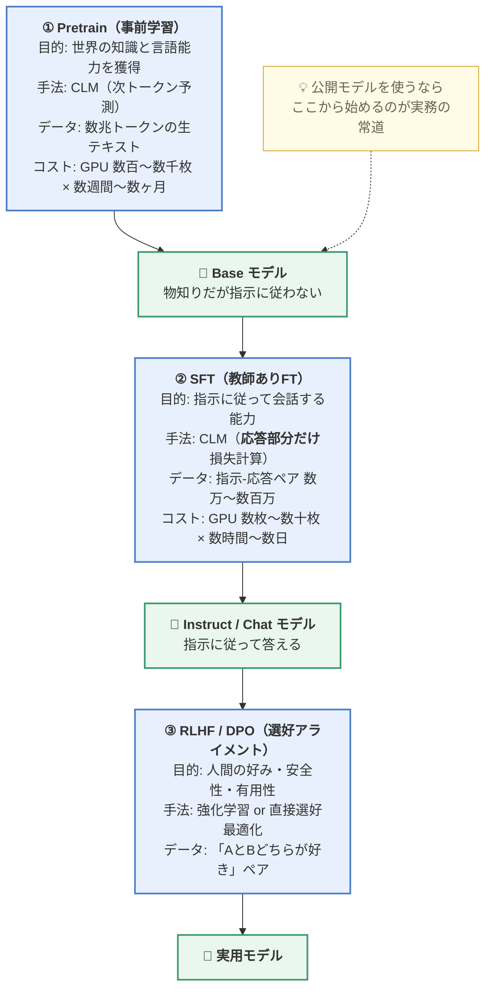
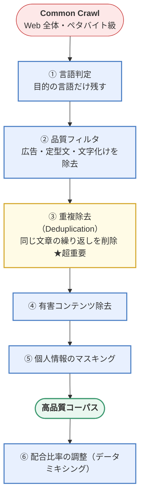
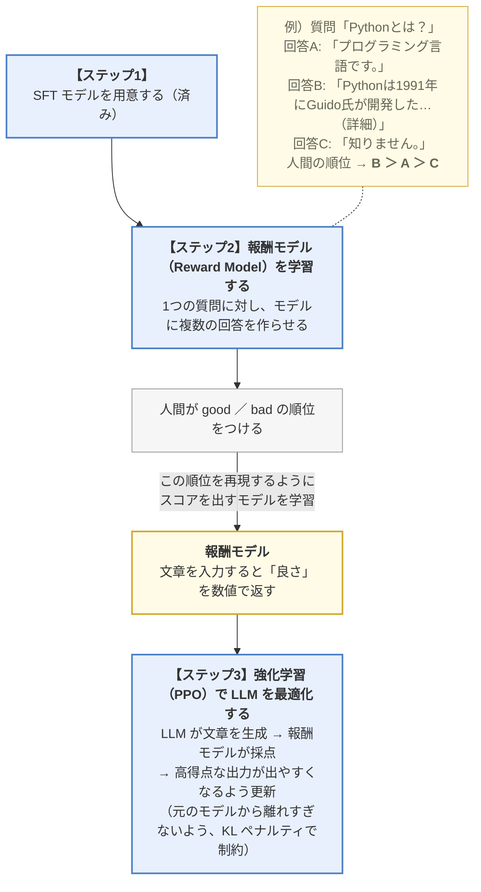
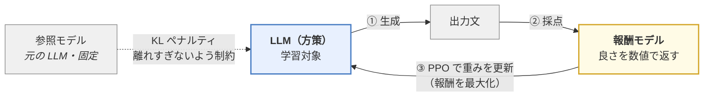
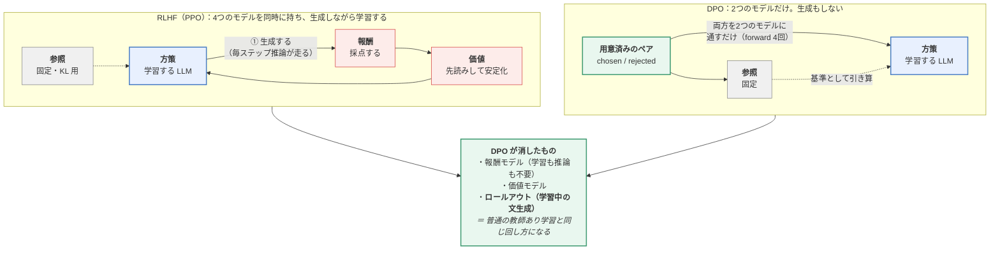

> **この章のゴール**：「大きくすると何が変わるのか」を理解し、LLM の作り方（Pretrain → SFT → RLHF）を全体として把握する。

---

## 4.1 LLM とは何か

### 4.1.1 定義

**LLM（Large Language Model / 大規模言語モデル）** の定義はこうです。

> **数百億（あるいはそれ以上）のパラメータを持ち、超大規模なテキストコーパスで学習された言語モデル**

技術的には第3章までの Transformer / Decoder-only モデルと**構造は同じ**です。
違うのは **規模だけ**。ではなぜ別の名前で呼ぶのか？

答え：**規模が一定を超えると、質的に別の存在になるから**です。
これを次で説明します。

**LLM 時代の始まり**は 2020年の **GPT-3（1750億パラメータ）** とされます。

主なモデルの規模感：

| モデル | パラメータ数 | 1トークンで実際に使う量 |
|--------|------------|----------------------|
| BERT-base | 1.1億（0.11B） | 全部 |
| GPT-2 | 15億（1.5B） | 全部 |
| **GPT-3** | **1750億（175B）** | 全部 |
| LLaMA-2 | 70億〜700億（7B〜70B） | 全部 |
| LLaMA-3.1 | 最大 4050億（405B） | 全部 |
| DeepSeek-V3（2024.12） | 6710億（671B） | **370億（37B）だけ** |
| LLaMA-4 Maverick（2025.4） | 4000億（400B） | **170億（17B）だけ** |
| 第5章で作るモデル | 2.15億（0.215B） | 全部 |

> 📝 **右の列がある理由**：2024年以降の大型モデルは **MoE（専門家混合）** といって、
> 「パラメータは大量に持つが、1トークンではその一部しか使わない」構造になっています。
> だから「パラメータ数」だけを比べると実態を見誤ります。
> **総パラメータ ≒ 知識の量、活性パラメータ ≒ 1トークンあたりの費用**、と読んでください。
> → 仕組みは [05.5章](https://zenn.dev/thirtypower/books/kgr-llm-guide/viewer/055-moe-modern-arch)

---

### 4.1.2 LLM の4つの能力

#### ① 創発能力（Emergent Abilities）

**LLM を LLM たらしめる最重要の性質**です。

> **モデルの規模を大きくしていくと、ある閾値を超えた瞬間に、
> それまで全くできなかったことが突然できるようになる現象。**

```
性能
 ↑
 │                                        ╱─────  ← 突然立ち上がる
 │                                       ╱
 │                                      ╱
 │──────────────────────────────────────╯
 │  ほぼランダムな精度（何もできない）
 └────────────────────────────────────────────→ モデル規模
                                        閾値
```

普通の機械学習では、モデルを大きくすると性能は**なだらかに**上がります。
ところが LLM では、多段階の算術、複雑な推論、指示の理解といった能力が
**「あるサイズを境に、いきなり」** 出現します。

なぜこうなるのかは**まだ完全には解明されていません**。これが LLM 研究の面白さでもあります。

#### ⚠️ 「反論」を図で理解する（創発は幻か）

「創発は幻では？」という研究（Schaeffer et al., 2023）は、
**合否のような不連続な指標で測るから急に見える**だけだ、と主張しています。
これは言葉だと分かりにくいので、**同じモデル群を2つの指標で測った模式図**にします。

```
  [A] なだらかな指標で測ると（部分点・トークン単位の正解率）
  100% |                        ####|
   87% |                    ########|
   75% |                ############|
   62% |            ################|
   50% |          ##################|
   37% |      ######################|
   25% |  ##########################|
   12% |############################|
       +----------------------------+
        1M    10M   100M   1B    10B   100B  → パラメータ数

  [B] 同じモデルを「全部合っていたら正解、1文字違えば0点」で測ると
  100% |                          ##|
   87% |                          ##|
   75% |                          ##|
   62% |                        ####|
   50% |                        ####|
   37% |                      ######|
   25% |                    ########|
   12% |############################|   ← ずっと0点に見える
       +----------------------------+
        1M    10M   100M   1B    10B   100B  → パラメータ数
```

**この2枚は同じモデルの、同じ実力を測ったものです。**
なぜ [B] は崖になるのか——たとえば答えが8トークンあるとき、
**全部当てる確率は「1トークンの正解率の8乗」**になります
（各トークンの成否を独立とみなした単純化ですが、傾向はこれで十分つかめます）。

| 1トークンの正解率 | 8トークン全部当たる確率 |
|---|---|
| 0.5 | 0.4% |
| 0.7 | 5.8% |
| 0.8 | 17% |
| 0.9 | **43%** |
| 0.99 | **92%** |

0.5 → 0.9 は「2倍弱」の改善ですが、完全一致率では **0.4% → 43%（100倍以上）** に見えます。
**指標の非線形性が、なだらかな改善を崖に見せている**——これが「幻」説の主張です。

> 🔑 **どちらの説を採っても、実務の結論は同じです。**
>
> | 論点 | 「創発は本物」派 | 「幻」派 |
> |---|---|---|
> | 何が起きているか | ある規模で質的に新しい計算ができるようになる | 連続的な改善が、指標のせいで崖に見えている |
> | 予測できるか | ❌ 事前に予測できない | ⭕ 連続な指標なら外挿できる |
> | **実務への含意** | **規模を上げると使える能力が増える**（同じ） | **評価は連続な指標でも測れ**（追加の教訓） |
>
> 📝 **持ち帰るべき教訓**は「合否だけで測ると、改善が見えない期間が長くなる」ことです。
> 自分のモデルを評価するときは、**完全一致率と部分点の両方**を見てください
> （→ [07章 7.1](https://zenn.dev/thirtypower/books/kgr-llm-guide/viewer/07-applications)、[07.5章 7.5.5](https://zenn.dev/thirtypower/books/kgr-llm-guide/viewer/075-fast-inference) の
> 「loss は無害でも正答率は半減」も同じ話です）。

#### ② 文脈内学習（In-Context Learning）

**モデルの重みを1つも更新せずに、プロンプトの中の例だけで新しいタスクを学ぶ**能力。

```
プロンプト：
  りんご → apple
  みかん → orange
  ぶどう →
出力：
  grape
```

モデルは「翻訳せよ」と一言も言われていませんが、
例から**パターンを推測して**適切に振る舞います。

| 呼び方 | 例の数 |
|--------|-------|
| **Zero-shot** | 0個（指示だけ） |
| **One-shot** | 1個 |
| **Few-shot** | 数個〜数十個 |

> 💡 実務的な意味：**わざわざ学習させなくても、プロンプトに例を書くだけで精度が上がる**。
> これが「プロンプトエンジニアリング」が成立する理由です。

#### ③ 指示追従（Instruction Following）

自然言語で書かれた指示を理解して実行する能力。

```
「以下の文章を3行で要約し、箇条書きで出力してください。ただし専門用語は避けること。」
```

これは事前学習だけでは獲得できず、**SFT（後述）** によって身につけます。
重要なのは、**学習時に見たことのない種類の指示にも対応できる（汎化する）** 点です。

#### ④ 段階的推論（Chain-of-Thought）

複雑な問題を、途中の考えを言語化しながら段階的に解く能力。

```
【CoT なし】
Q: レストランに23個のりんごがあった。20個使って、6個買い足した。今何個？
A: 27個                                    ← 間違えやすい

【CoT あり】"順を追って考えてください" と付ける
Q: （同じ問題）順を追って考えてください。
A: 最初に23個ありました。
   20個使ったので 23 - 20 = 3個 残りました。
   6個買い足したので 3 + 6 = 9個 です。
   答えは9個です。                          ← 正答率が大幅に上がる
```

**なぜ効くのか**：LLM は1トークンごとに固定量の計算しかできません。
思考過程を出力させることで、**計算のための「作業スペース」を確保している**と解釈できます。

現在の「推論モデル（o1, DeepSeek-R1 など）」は、この CoT を
**強化学習で徹底的に鍛えたもの**です。→ [08章](https://zenn.dev/thirtypower/books/kgr-llm-guide/viewer/08-reinforcement-learning)

---

### 4.1.3 LLM の特徴と弱点

| 特徴 | 内容 |
|------|------|
| **多言語対応** | 学習データに多言語が含まれるため、自然に多言語を扱える。ある言語で学んだ知識が別の言語でも使える（言語間転移） |
| **長文対応** | コンテキスト長は 4K → 32K → 128K → 100万トークンへと拡大中 |
| **マルチモーダル** | アダプタを介して画像・音声・動画も扱える（VLM: Vision Language Model） |
| **⚠ ハルシネーション** | **最大の弱点**。知らないことを、もっともらしく捏造する |

#### ハルシネーション（Hallucination / 幻覚）

```
Q: 「山田太郎博士が2019年に発表した量子重力理論について教えて」
A: 「山田太郎博士は2019年、Nature誌に...」   ← 存在しない人物・論文を堂々と創作
```

**なぜ起きるのか：**
LLM は「事実かどうか」ではなく「**もっともらしい単語の並びかどうか**」で出力を選びます。
知識がない領域でも、それらしい文を生成してしまいます。

**対策：**
- **RAG**：外部の信頼できる文書を検索して根拠を与える → [07章](https://zenn.dev/thirtypower/books/kgr-llm-guide/viewer/07-applications)
- **出典の要求**：「必ず出典を示せ、分からなければ分からないと答えよ」と指示する
- **温度パラメータを下げる**：ランダム性を減らす
- **人間による検証**：最終的にはこれが必須

---

## 4.2 LLM の学習：3段階のプロセス

ここが本章の核心です。



---

### 4.2.1 Pretrain（事前学習）

#### やること

やること自体は単純です。**大量のテキストで、ひたすら次のトークンを予測する**だけ。

```python
# 概念コード
for batch in huge_text_dataset:
    logits = model(batch[:-1])              # 入力：最後を除く全部
    loss = cross_entropy(logits, batch[1:]) # 正解：1つずらしたもの
    loss.backward()
    optimizer.step()
```

#### データの準備が9割

LLM の性能はデータの質でほぼ決まります。実際の処理パイプライン：



**データの配合例：**

| ソース | 比率の目安 | 役割 |
|--------|----------|------|
| Web クロール（CommonCrawl等） | 60〜70% | 量を稼ぐ、多様性 |
| コード（GitHub） | 5〜15% | **推論能力が上がると言われる** |
| 書籍 | 5〜10% | 長文の一貫性、高品質な文章 |
| Wikipedia・百科事典 | 3〜5% | 事実知識 |
| 論文・専門文書 | 2〜5% | 専門性 |

> 💡 **面白い経験則**：コードデータを混ぜると、**プログラミング以外の論理推論も上手くなる**
> ことが知られています。構造化された思考の訓練になるためと考えられています。

#### コスト感

| 規模 | 必要リソース（目安） |
|------|-------------------|
| 0.2B（第5章のモデル） | GPU 1枚 × 数時間〜数日 |
| 7B | A100 × 数十枚 × 数週間 |
| 70B | A100 × 1000枚前後 × 1〜数ヶ月 |
| 400B+ | 数万枚規模のクラスタ |

> **だから普通は事前学習しません。** 公開された Base モデルを使って、
> SFT や LoRA から始めるのが実務の常道です。

#### スケーリング則（Scaling Laws）

「どれだけのモデルサイズとデータ量が最適か」には経験則があります。

- **Kaplan et al. (2020)**：性能は、モデルサイズ・データ量・計算量のべき乗則で改善する
- **Chinchilla (2022)**：**モデルパラメータ数の約20倍のトークン数**で学習するのが計算効率的に最適
  （例：7B のモデルなら約 1.4T トークン）
- 近年は、推論コストを重視して**もっと小さいモデルにもっと大量のデータ**を入れる傾向
  （LLaMA-3 8B は 15T トークン ＝ パラメータの約1875倍）

> 🤔 **「20倍」と「1875倍」は矛盾しているのでは？**——**目的が違うだけ**で、どちらも正しいです。
>
> | | 何を最小にしたいか | 結論 |
> |---|---|---|
> | **Chinchilla の20倍** | **学習**にかかる計算量（1回払えば終わるコスト） | 決まった予算なら「そこそこのモデル × そこそこのデータ」が最適 |
> | **LLaMA-3 の1875倍** | **推論**にかかる計算量（使うたびに永久に払うコスト） | 小さいモデルを限界まで鍛えた方が得 |
>
> 学習は1回で終わりますが、**推論は何億回も走ります**。
> 「学習を20倍長く回してでもモデルを小さく保つ」ことが、
> 運用ではトータルで安くなる——だから業界は 20倍 →
> **数百〜数千倍**へ振り切りました（この状態を「**Chinchilla を超えて学習する**」と言います）。
>
> 🔑 **覚え方**：**Chinchilla は「作る側」の最適、いまの主流は「使う側」の最適。**

#### スケーリング則の「その後」——2つの軸が増えた（2024〜2026）

Kaplan / Chinchilla の議論は「**パラメータ数 × データ量**」の2軸でした。
その後、実務でものを言う軸が2つ増えました。ここを押さえると最近のモデル発表が読めます。

| 軸 | 中身 | 効果 |
|---|---|---|
| **③ 疎性（MoE）** | パラメータは増やすが、1トークンでは一部しか使わない | **推論の費用を据え置きにしたまま**、知識の置き場を増やせる（→ [05.5章](https://zenn.dev/thirtypower/books/kgr-llm-guide/viewer/055-moe-modern-arch)） |
| **④ 推論時の計算量**（test-time compute） | モデルを大きくする代わりに、**答えるときに長く考えさせる**（CoT を長く出す） | 同じモデルでも、考える長さを増やすと難問の正答率が上がる（→ [08章](https://zenn.dev/thirtypower/books/kgr-llm-guide/viewer/08-reinforcement-learning)） |

> 🔑 **④が「推論モデル（reasoning model）」の正体です。**
> 「賢くしたい ＝ 学習を大きくする」しか手が無かった時代が終わり、
> **「答えるときに何トークン考えさせるか」も性能のつまみになりました**。
> o1 / DeepSeek-R1 以降のモデルが「思考トークン」を大量に出すのは、
> このつまみを回しているからです。
>
> ⚠️ ただし**タダではありません**。考える長さに比例して費用と待ち時間が増えます。
> 「難しい問題だけ長く考えさせる」制御（thinking budget）が実務の論点になっています。

---

### 4.2.2 SFT（Supervised Fine-Tuning / 教師ありファインチューニング）

#### なぜ必要か

事前学習だけの Base モデルは、**「文章の続きを書く機械」** でしかありません。

```
【Base モデルに質問すると】
入力： 「日本の首都はどこですか？」
出力： 「日本の首都はどこですか？ 大阪の名物は何ですか？ 富士山の高さは？」
        ↑ 質問リストの続きだと解釈してしまう（答えてくれない）
```

これを「質問には答える」ように躾けるのが SFT です。

#### データの形式

**指示（Instruction）と応答（Response）のペア**を大量に用意します。

```json
{
  "instruction": "以下の文章を1行で要約してください。",
  "input": "本日、東京都は新たな環境政策を発表し...",
  "output": "東京都が新たな環境政策を発表した。"
}
```

会話形式（Chat Template）に整形します：

```
<|im_start|>system
あなたは親切なアシスタントです。<|im_end|>
<|im_start|>user
日本の首都はどこですか？<|im_end|>
<|im_start|>assistant
日本の首都は東京です。<|im_end|>
```

`<|im_start|>` などは **特殊トークン**で、役割の境界を示します。
モデルごとにこのフォーマット（**Chat Template**）は異なります。

#### 学習方法の核心：損失マスク

Pretrain との違いは**1点だけ**です。

> **ユーザーの発話部分では損失を計算せず、アシスタントの応答部分だけで損失を計算する。**

```
トークン列： <user> 日本 の 首都 は ? <assistant> 東京 です 。
損失計算：    ✗    ✗   ✗  ✗   ✗ ✗      ✗       ✓   ✓  ✓
              └────── 無視（マスク）─────┘      └── 学習 ──┘
```

**なぜか**：モデルに学習させたいのは「**どう答えるか**」であって、
「ユーザーがどう質問するか」ではないからです。

実装上は、マスクする位置のラベルを `-100`（PyTorch の `ignore_index`）にします。
→ 具体的な実装は [06章](https://zenn.dev/thirtypower/books/kgr-llm-guide/viewer/06-training-pipeline)

#### マルチターン会話の扱い

複数ターンの会話は、**アシスタントの発話ごとに損失を計算**します。

```
<user>A</user> <assistant>B</assistant> <user>C</user> <assistant>D</assistant>
                    ✓学習                                     ✓学習
```

（`<user>` などの表記は簡略化です。実際には上で見た `<|im_start|>user … <|im_end|>` 形式が使われます）

1つの会話データから複数の学習信号が取れて効率的です。

#### データの質 > 量

**LIMA（Less Is More for Alignment）** という研究では、
**わずか1000件の超高品質データ**で、大量データの SFT に匹敵する性能が出ました。

> 🔑 SFT で新しい知識は入りません。**知識は事前学習で入っており、SFT は「引き出し方」を教えるだけ**。
> これが「Superficial Alignment Hypothesis（表層的アライメント仮説）」です。
> 使い分けの原則：**新しい知識を足すのは RAG が得意、口調や形式などの振る舞いを変えるのは
> ファインチューニングが得意**です（詳細は [07章](https://zenn.dev/thirtypower/books/kgr-llm-guide/viewer/07-applications)）。

---

### 4.2.3 RLHF（人間のフィードバックによる強化学習）

#### なぜ SFT だけでは足りないのか

SFT は「模範解答を真似する」学習です。しかし、

- 「良い回答」は1つではなく、**微妙な良し悪しの差**がある
- 「これは答えてはいけない」という**否定的な例**を教えられない
- 人間の好み（丁寧さ、詳しさ、安全性）は**言語化しにくい**

そこで、**「どちらが良いか」の比較データ**から学ばせます。

> 📝 **先に強化学習の言葉を2つだけ**（この節の図に出てきます。詳しくは [08章 8.1.1](https://zenn.dev/thirtypower/books/kgr-llm-guide/viewer/08-reinforcement-learning)）
>
> | 用語 | この文脈での意味 |
> |------|----------------|
> | **方策（Policy）** | **学習対象の LLM 本体**のこと。「状態を見て次の行動を選ぶもの」という強化学習の言い方で、LLM の場合は「ここまでの文を見て次のトークンを選ぶもの」＝ LLM そのもの |
> | **価値モデル（Critic）** | 「この途中まで書いた文は、最終的にどれくらいの報酬になりそうか」を予測する**別のモデル**。PPO の学習を安定させるための補助役 |
>
> **「方策」と書かれていたら「LLM 本体」と読み替えて構いません。**

#### RLHF の3ステップ



> 📝 **KL ペナルティ**の KL とは、**2つの確率分布のズレの大きさを測る量**（KL ダイバージェンス）のことです。
> 「元のモデルの出す分布から離れすぎたら罰を与える」ことで、学習の暴走を防いでいます。

#### ステップ2をもう少し詳しく：「順位」からどうやって「点数」を作るのか

「人間が順位を付けたデータで報酬モデルを学習する」と言われても、
**順位（B > A）から点数（B は 7.2 点）をどう作るのか**が分かりにくいところです。
実際にやっているのはこれだけです。

> **点数そのものは当てさせません。「勝った方の点数が高くなる」ことだけを学習させます。**

```
学習データ1件 ＝ 同じ質問に対する2つの回答（勝ち / 負け）

   質問「Pythonとは？」  勝ち: 回答B（詳しい）   負け: 回答A（一言）

   報酬モデルに両方を通して点数を出させる：
        score(B) = 2.1     score(A) = 3.5    ← まだ乱数同然なので、負けの方が高い

   損失 ＝「score(勝ち) − score(負け) を大きくせよ」
        → 差が負（順位が逆）なので大きな損失 → B の点数が上がり、A が下がる方向に更新
```

これを大量のペアで繰り返すと、**人間の順位付けを再現できる点数の付け方**が出来上がります。

> 🔑 **絶対的な点数（何点が正解か）を人間に決めさせないのがミソ**です。
> 人間は「7点か8点か」は答えられませんが、「どっちが良いか」は安定して答えられます。
> **答えやすい形で聞いて、点数はモデルに作らせる**——これが報酬モデルの発想です。
>
> 💡 この「勝ち負けの差を広げる」という損失の形、実は次の **DPO とまったく同じ**です。
> 違いは、DPO が**報酬モデルを作らずに LLM 本体へ直接この損失を掛ける**点だけです。



> ⚠️ この図に出てくるモデルを数えてください。**方策・参照・報酬**、
> さらに図には描いていない**価値モデル**（＝PPO の学習を安定させるための採点補助モデル。
> 詳細は [08章](https://zenn.dev/thirtypower/books/kgr-llm-guide/viewer/08-reinforcement-learning)）の**計4つ**を同時にメモリに載せる必要があります。
> これが RLHF が重いと言われる理由です（→ 次の DPO、そして[8章の GRPO](https://zenn.dev/thirtypower/books/kgr-llm-guide/viewer/08-reinforcement-learning)）。

**RLHF の問題点**：モデルを4つ（方策・参照・報酬・価値）同時にメモリに載せる必要があり、
実装が複雑で不安定、かつ非常に重い。

#### DPO（Direct Preference Optimization / 直接選好最適化）

**「報酬モデルも強化学習も要らないのでは？」** という発想の手法（2023年）。

数学的に、RLHF の最適解は「選好データから直接求まる」ことを示し、
**単純な教師あり学習の形に書き換えました**。

```
データ形式：
{
  "prompt":   "Pythonとは？",
  "chosen":   "Pythonは汎用プログラミング言語で...",   ← 人間が好んだ方
  "rejected": "知りません。"                          ← 好まれなかった方
}

損失：chosen の確率を上げ、rejected の確率を下げる（参照モデルとの比較つき）
```

**「4モデル」が「2モデル」になる**というのが、この手法の一番わかりやすい効能です。



**損失の中身**も、報酬モデルの学習（1つ前の項）とまったく同じ形です。

```
   ① chosen と rejected を、方策と参照モデルの両方に通して確率を出す

   ② 「参照モデルから見て、どれだけ確率を上げたか」を点数とみなす
        暗黙の報酬 r(y) = β × log( 方策の確率 p(y) ÷ 参照の確率 p_ref(y) )
                                    ↑ 参照より上げれば正、下げれば負

   ③ 損失 ＝ −log σ( r(chosen) − r(rejected) )
                        ↑ 「勝ちの点数 − 負けの点数」を大きくせよ
                          （報酬モデルの学習で見たのと同じ式）
```

> 🔑 **DPO の発明は「報酬モデルを LLM 自身の確率で置き換えられる」と気づいたこと**です。
> 報酬モデルを別に作らず、**「参照モデルより確率を上げた量」をそのまま報酬とみなす**。
> そうすると強化学習の形が消えて、ただの2値分類の損失になります。

| | RLHF (PPO) | DPO |
|---|---|---|
| 報酬モデル | 必要 | **不要** |
| 学習中の文生成（ロールアウト） | **必要**（重い） | **不要** |
| 学習の安定性 | 不安定 | 安定 |
| メモリ | 4モデル分 | 2モデル分 |
| 実装難易度 | 高い | 低い |
| 最終性能 | やや上（と言われる） | 十分実用的 |

**まず DPO から試すのが実務の定石**です。

> ⚠️ **DPO の弱点も知っておいてください**（2024〜2026 に整理された点）
>
> | 弱点 | 中身 |
> |---|---|
> | **オフポリシー**である | 学習に使うペアは「他のモデルが書いた文」。自分が実際に書きそうな文の改善にはなりにくい（対策：Online DPO、自分で生成させたペアを使う） |
> | **chosen の確率まで下がることがある** | 損失は「差」だけを見るので、両方の確率を下げても差は開きます（likelihood displacement と呼ばれる現象） |
> | 検証可能な正解がある課題では弱い | 数学・コードのように**正解が機械判定できる**なら、選好ペアより強化学習が効きます → [08章 GRPO](https://zenn.dev/thirtypower/books/kgr-llm-guide/viewer/08-reinforcement-learning) |

#### その他の手法

| 手法 | 特徴 |
|------|------|
| **KTO** | ペアデータ不要。「良い」「悪い」の単独ラベルだけで学習できる |
| **ORPO** | SFT と選好学習を1段階に統合 |
| **GRPO** | 価値モデル不要。グループ内比較で advantage を計算。推論モデルの学習に使われる → [08章](https://zenn.dev/thirtypower/books/kgr-llm-guide/viewer/08-reinforcement-learning) |

---

## この章のまとめ

- LLM は Transformer と構造は同じだが、**規模が閾値を超えると質的に変化する**
- 4つの能力：**創発能力・文脈内学習・指示追従・段階的推論（CoT）**
- 最大の弱点は **ハルシネーション**。RAG などで対策する
- 学習は3段階：

| 段階 | 何を学ぶ | データ | 一言で |
|------|---------|--------|--------|
| **Pretrain** | 知識と言語能力 | 生テキスト数兆トークン | 図書館を全部読む |
| **SFT** | 指示への従い方 | 指示-応答ペア | マニュアルを覚える |
| **RLHF / DPO** | 人間の好み | 選好比較ペア | 先輩の指導で感覚を磨く |

- SFT の実装上の核心は **応答部分だけで損失を計算する（損失マスク）**
- RLHF より **DPO の方が実装が簡単**で、まずはこちらを試すべき

## 理解度チェック

1. 創発能力とは何ですか？普通のスケール則と何が違いますか？
2. In-Context Learning が「学習」と呼ばれるのに、なぜ重みが変わらないのですか？
3. Base モデルに質問しても答えてくれないのはなぜですか？
4. SFT で損失マスクを使う理由は何ですか？
5. DPO が RLHF より扱いやすい理由を2つ挙げられますか？
6. 「SFT で新しい知識は入らない」とされるのはなぜですか？
7. Chain-of-Thought が精度を上げるのはなぜだと解釈されていますか？

<details>
<summary><b>▶ 解答を見る</b></summary>

1. **モデルの規模がある閾値を超えた瞬間に、それまで全くできなかったことが突然できるようになる現象**です。
   普通のスケール則では性能は**なだらかに**（べき乗則で連続的に）上がりますが、
   創発能力は**不連続に、いきなり立ち上がります**。多段階の算術、複雑な推論、指示の理解などがこれに当たります。
   なぜこうなるのかは**まだ完全には解明されていません**。
2. **重みの更新（＝勾配降下）は一切起きていない**からです。起きているのは、
   プロンプト内の例を**文脈として読み取り、そのパターンに沿った続きを生成している**だけです。
   外から見ると「例を見せたら新しいタスクができるようになった」ので学習に見えますが、
   実体は**推論（forward）1回**の中で完結しています。だから「文脈内（In-Context）」学習と呼びます。
3. Base モデルは事前学習しかしておらず、**「文章の続きを書く機械」**でしかないからです。
   「日本の首都はどこですか？」と入力すると、それを**質問リストの一部**と解釈して
   「大阪の名物は何ですか？ 富士山の高さは？」と質問を続けてしまいます。
   「質問には答えるものだ」という振る舞いは、SFT で初めて教えられます。
4. モデルに学習させたいのは「**どう答えるか**」であって、
   「**ユーザーがどう質問するか**」ではないからです。
   ユーザー発話の部分まで損失を計算すると、モデルは質問文の生成も学習してしまいます。
   実装上は、マスクしたい位置のラベルを `-100`（`cross_entropy` の `ignore_index`）にします。
5. 次のうち2つ挙げられていれば正解です。
   - **報酬モデルが不要**：RLHF は別途スコアリング用モデルを学習する必要がある
   - **メモリが半分**：RLHF は4モデル（方策・参照・報酬・価値）、DPO は2モデルで済む
   - **学習が安定している**：強化学習ではなく通常の教師あり学習の形なので発散しにくい
   - **実装が単純**：報酬モデルも価値モデルも作らず、通常の教師あり学習と同じ形式で学習できる
6. **知識は事前学習の段階でモデルに入っており、SFT は「その引き出し方」を教えているだけ**だからです。
   根拠として、**LIMA** の研究ではわずか **1000件**の超高品質データで、
   大量データの SFT に匹敵する性能が出ました。少量データで振る舞いが変わるということは、
   新しい知識を注入しているのではなく、既にある能力の**表出のさせ方**を調整しているに過ぎない、
   という解釈になります（**Superficial Alignment Hypothesis / 表層的アライメント仮説**）。
   したがって、社内知識などを入れたい場合は SFT ではなく **RAG** が適します。
   使い分けの原則は「**新しい知識を足すのは RAG が得意、口調や形式などの振る舞いを変えるのは
   ファインチューニングが得意**」です（詳細は 7章）。
7. **計算のための「作業スペース」を確保しているから**と解釈されています。
   LLM は1トークンを出すのに固定量の計算しかできません。難しい問題を1トークンで答えようとすると、
   その計算量では足りません。思考過程を出力させると、**途中結果をトークン列として外部に書き出し、
   それを次の入力として読み直せる**ようになり、実質的に使える計算量が増えます。
   現在の推論モデル（o1、DeepSeek-R1）は、この CoT を強化学習で徹底的に鍛えたものです（→ 8章）。

</details>

---

**次へ** → [05. 自分で LLM を作る](https://zenn.dev/thirtypower/books/kgr-llm-guide/viewer/05-build-your-own-llm)
