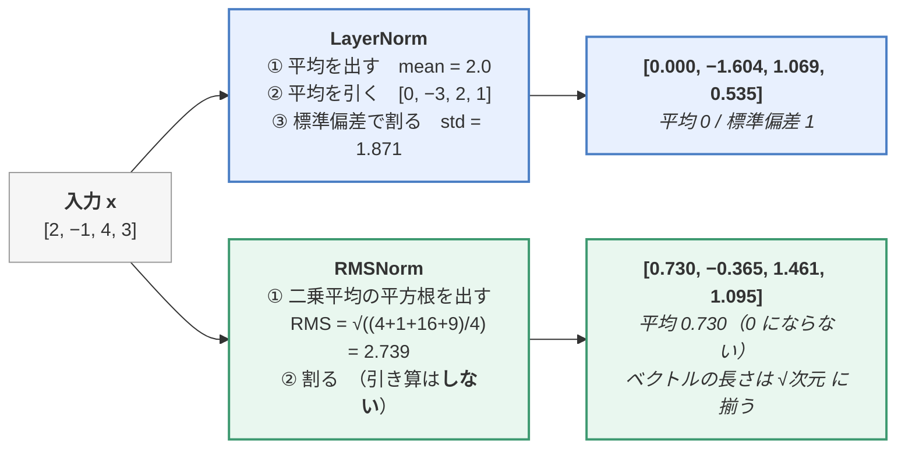
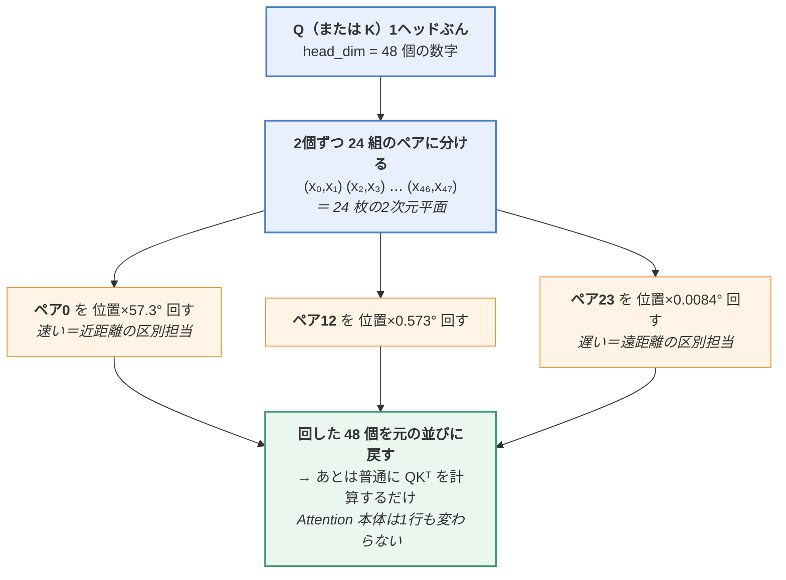
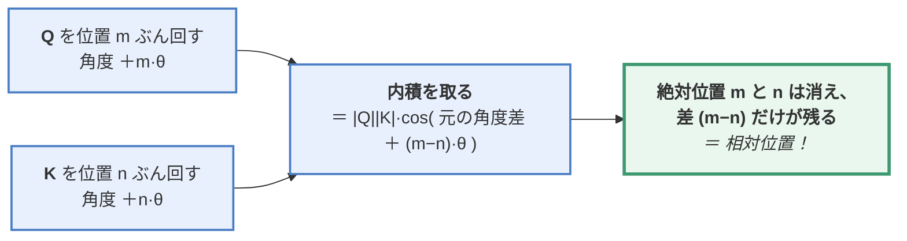
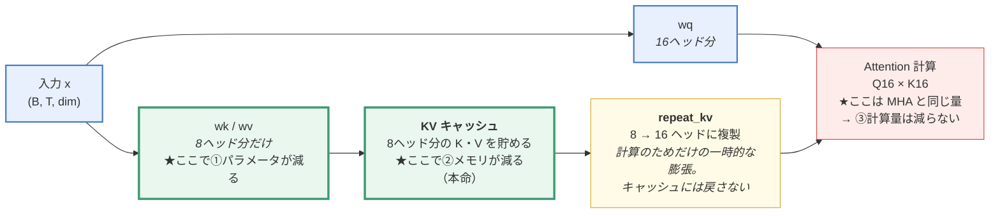
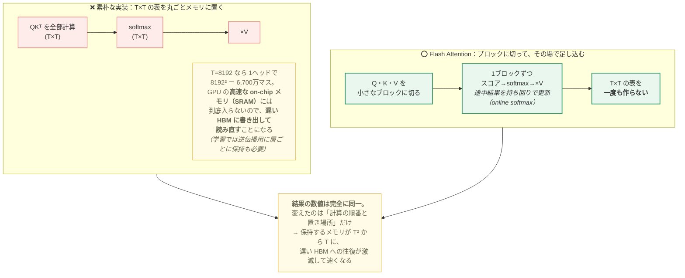
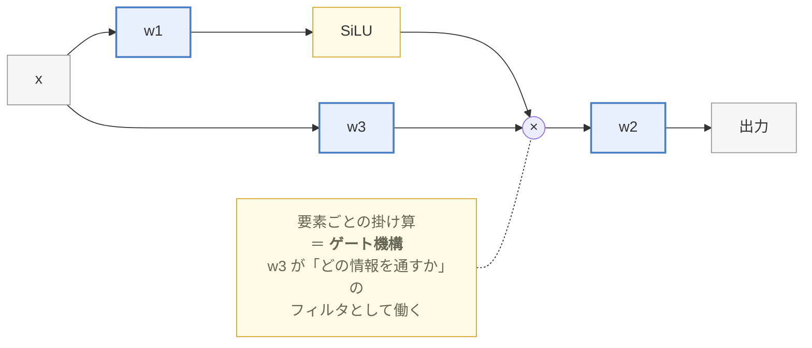
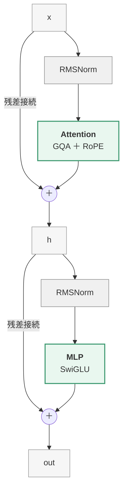

> **この章のゴール**：LLaMA2 のアーキテクチャを PyTorch でゼロから書き、
> トークナイザを訓練し、**215M パラメータの小さな LLM を実際に学習させる**。
>
> 📎 **対応コード**：[`code/05_llama.py`](https://github.com/thirtypower/kgr-llm/blob/main/code/05_llama.py)（5.1〜5.2 の検証）／
> [`code/06_pretrain.py`](https://github.com/thirtypower/kgr-llm/blob/main/code/06_pretrain.py)（5.3 の事前学習パイプライン完全版）
> `04_minigpt.py` で作った **GPT-2 相当のモデルを、LLaMA2 に「現代化」していく**構成です。
> 変更点は5つだけで、**それぞれ「本当に効いているか」を数値で確認**します。
>
> ```bash
> cd code
> python 05_llama.py            # 全部の検証を実行（CPU/GPU どちらでも数十秒）
> python 05_llama.py --train    # ミニコーパスで実際に学習まで行う
> ```

ここから実践パートです。ここまでの理論が、コードとしてどう現れるかを見ていきます。

> ⚠️ **この章がいきなり難しく感じたら、先に [02.7章](https://zenn.dev/thirtypower/books/kgr-llm-guide/viewer/027-mini-gpt) を読んでください。**
> 素の GPT-2 を CPU だけで数分で学習させる章です。
> **「動くモデルを1回作った」状態でこの章に来ると、難易度が体感で半分になります。**
> この章がやっているのは、そこで作った GPT-2 の部品を5個入れ替える作業だからです。
>
> ```
>   02.7章の GPT-2          この章の LLaMA2
>   ─────────────────────────────────────────
>   LayerNorm         →     RMSNorm      （高速化）
>   学習型 位置埋め込み  →     RoPE         （相対位置・長文対応）
>   MHA               →     GQA          （KVキャッシュの保存量を削減）
>   ReLU の FFN       →     SwiGLU       （表現力）
>   バイアス項         →     全部なくす     （不要と分かった）
> ```

---

## 5.0 この章で作るもの

| 項目 | 値 |
|------|-----|
| アーキテクチャ | LLaMA2（Decoder-only Transformer） |
| パラメータ数 | **215M（2.15億）** |
| 次元 `dim` | 1024 |
| 層数 `n_layers` | 18 |
| 語彙数 `vocab_size` | 6144 |
| 最大系列長 | 512 |
| 事前学習データ | 日本語 Wikipedia など（5.3.1 で用意） |
| SFT データ | 日本語の指示-応答データ（5.3.1 で用意） |

> 💡 **2026年の実物とのギャップについて**：この章で作るのは
> **dense（MoE でない）モデル**です。いま公開されている大型モデルはほぼ全部 MoE で、
> KV キャッシュもさらに圧縮（MLA）されています。
> **その差分だけを集めた補講が [05.5章](https://zenn.dev/thirtypower/books/kgr-llm-guide/viewer/055-moe-modern-arch)** です。
> ただし骨格（Pre-Norm / RMSNorm / RoPE / SwiGLU）はこの章のままなので、
> **先にこの章を通してください。**

> 💡 学習に使うデータは 5.3.1 で用意します。日本語 Wikipedia や
> [llm-jp-corpus](https://gitlab.llm-jp.nii.ac.jp/) など、好きなコーパスに差し替えられます
> （5.3.1 に実際のダウンロードスクリプトがあります）。

### 本文コードと `code/` スクリプトの対応

この章には「2つのバージョン」のコードが登場します。混乱しないように先に整理しておきます。

| | 本文のコード | [`code/05_llama.py`](https://github.com/thirtypower/kgr-llm/blob/main/code/05_llama.py) | [`code/06_pretrain.py`](https://github.com/thirtypower/kgr-llm/blob/main/code/06_pretrain.py) |
|---|---|---|---|
| 位置づけ | 写経用のリファレンス実装（**215M 設計**） | CPU で数分で動く**検証・学習デモ** | 5.3 節の学習パイプラインの**完全に動く版** |
| 規模 | dim=768〜1024 / vocab=6144 | dim=256 / vocab=400 | `--demo`＝ミニ構成 / `--full`＝215M 構成 |
| 追加実装 | — | KV キャッシュ、`verify()`（数値検証） | データDL・トークナイザ訓練・checkpoint 保存 |
| 用途 | 写経して構造を理解する | 各技術の効果を数値で確認する | 実際に事前学習を1周する |

クラス名も少し違います（役割は同じ）：

| 本文 | code/05_llama.py | 役割 |
|------|-----------------|------|
| `ModelConfig` | `LlamaConfig` | ハイパーパラメータ |
| `Transformer` | `Llama` | モデル全体 |
| `DecoderLayer` | `TransformerBlock` | Decoder 1層 |
| `MLP` | `FeedForward` | SwiGLU FFN |

### 必要リソースの目安（誇張なしの現実的な数字）

| やること | 必要な環境 | 目安 |
|---------|-----------|------|
| この章を読む・写経する | なんでも可 | — |
| `code/05_llama.py` / `06_pretrain.py --demo` | **CPU で十分** | 数十秒〜数分 |
| **215M の事前学習**（`06_pretrain.py --full`） | GPU **VRAM 12GB〜**（RTX 3060 12GB で可） | 10B トークンを回すと**数週間規模**。**1〜2B トークンに絞れば数日**、まず 0.1B（約1億）トークンで1晩回して感触を掴むのが現実的 |
| 215M の SFT | 同上（VRAM 12GB〜） | 数時間（データ数万件の場合） |

> 💡 GPU が無い場合も、この章の内容は `--demo` で全て体験できます。
> 「215M を本当に回す」のは Colab（無料 T4 でも可、時間はかかる）という手もあります。

---

## 5.1 LLaMA2 を実装する

### 5.1.1 ハイパーパラメータの定義

まずモデルの設定をまとめるクラスを作ります。

```python
from dataclasses import dataclass
from typing import Optional

@dataclass
class ModelConfig:
    dim: int = 768                       # 隠れ層の次元（d_model）
    n_layers: int = 12                   # Decoder 層の数
    n_heads: int = 16                    # Attention のヘッド数
    n_kv_heads: Optional[int] = 8        # GQA 用：K/V のヘッド数（None なら MHA）
    vocab_size: int = 6144               # 語彙数
    hidden_dim: Optional[int] = None     # FFN の中間次元（None なら自動計算）
    multiple_of: int = 64                # hidden_dim を 64 の倍数に揃える
    norm_eps: float = 1e-5               # 正規化のゼロ除算防止用
    max_seq_len: int = 512               # 最大系列長
    dropout: float = 0.0
```

`n_heads`（16）> `n_kv_heads`（8）となっている点に注目してください。
これが **GQA（Grouped-Query Attention）** の設定です。

---

### 5.1.2 RMSNorm

第2章の LayerNorm を簡略化したものです。**LLaMA 以降の標準**。

**LayerNorm との違い：平均を引く処理を省略する。**

```
LayerNorm:  y = γ · (x - mean) / std + β        ← 平均と分散の両方を計算
RMSNorm:    y = γ · x / RMS(x)                   ← 二乗平均平方根だけ

  RMS(x) = √( (1/n) Σ xᵢ² )
```

**電卓で1回やってみます。** `x = [2, −1, 4, 3]`（4次元）のとき：



**2つの出力を見比べると、違いは「平行移動したか」だけ**です。
どちらも「大きさを揃える」仕事はできていて、RMSNorm は**平均を求める1パスを省いている**だけです。

| | LayerNorm | RMSNorm |
|---|---|---|
| 引き算（中心化） | する | **しない** |
| 出力の平均<br/><i>（γ・β を掛ける前）</i> | 必ず 0 | 0 にならない |
| 出力の大きさ<br/><i>（同上）</i> | 標準偏差が 1 | **ベクトルの長さが √次元**（上の例では 2.0） |
| 学習パラメータ | γ と β（2本） | **γ だけ**（1本） |
| 次元ぶんの走査 | 平均で1回 ＋ 分散で1回 | **1回** |

**なぜこれで良いのか**：研究の結果、LayerNorm の効果の大半は
「平均を0にすること」ではなく「**スケールを揃えること**」だと分かりました。
平均の計算を省くことで **7〜64% 高速化**しつつ、性能は変わりません。

> 🔑 **正規化の目的は「次の層に渡す数字の大きさを一定に保つこと」**です
> （→ [02.5章 2.2.3](https://zenn.dev/thirtypower/books/kgr-llm-guide/viewer/025-transformer-block)）。
> 大きさが揃っていれば、平均がどこにあるかは後段の重みが吸収できます。
> だから「引き算をやめても壊れなかった」わけです。

```python
import torch
import torch.nn as nn

class RMSNorm(nn.Module):
    def __init__(self, dim: int, eps: float = 1e-5):
        super().__init__()
        self.eps = eps
        self.weight = nn.Parameter(torch.ones(dim))   # 学習可能なスケール γ

    def _norm(self, x):
        # x.pow(2).mean(-1) = 二乗平均、rsqrt = 1/√x
        return x * torch.rsqrt(x.pow(2).mean(-1, keepdim=True) + self.eps)

    def forward(self, x):
        return self.weight * self._norm(x.float()).type_as(x)
```

> 💡 `eps` は LLaMA 公式実装でも **1e-5 と 1e-6 の間で揺れがあります**
> （LLaMA-2 は 1e-5、初代 LLaMA は 1e-6）。どちらでも学習結果はほぼ変わりません。
> この教材では `ModelConfig.norm_eps` と `code/05_llama.py` に合わせて **1e-5** で統一します。

---

### 5.1.3 RoPE（回転位置埋め込み）

第2章の sin/cos 位置エンコーディングの後継です。**LLaMA / Qwen / 現代 LLM の標準**。

#### 考え方

従来は「位置ベクトルを**足す**」でしたが、RoPE は
**「Q と K のベクトルを、位置に応じた角度だけ**回転させる**」** という方式です。

まず「回転」を絵にします。**次元を2個だけ取り出して**、
1トークン進むごとに θ = 30° ずつ回していったところです。

```
   時計の文字盤と同じです（θ = 30° の場合、1周ちょうど12トークン）

                          位置3
                位置4               位置2
         位置5                             位置1

      位置6                ●                  位置0

         位置7                            位置11
                位置8              位置10
                          位置9

   位置0            位置1(+30°)       位置2(+60°)       位置3(+90°)
     →                  ↗                 ↗                 ↑
  [1.00, 0.00]     [0.87, 0.50]     [0.50, 0.87]     [0.00, 1.00]
     └──────── 長さはいつも 1（回転は長さを変えない）────────┘
```

**足し算と違って、値が大きくなっていきません。** 位置 10000 でも、
ベクトルは同じ円の上のどこかにいるだけです。

> ❓ **文字盤なら、位置12 は位置0 と同じ向きに戻ってしまいませんか？**
> はい、**1つの回転速度だけでは位置が一意になりません**（12個ごとに一巡します）。
> だから RoPE は **24組（head_dim=48 の場合）のペアを全部違う速さで回します**。
> 「秒針・分針・時針が全部同じ位置に戻る」ことがめったに無いのと同じ理屈で、
> 24本の針が同時に一致することは実質起きません。
> 各ペアの速さは、この節の後半（「ペアごとの回る速さ」の表）で実際に数えます。

#### 何を 64 個ぶん回すのか（実装の全体像）

RoPE は head_dim の数字を**2個ずつのペア**に分け、
**ペアごとに違う速さで回します**。ここが 02.5章 の sin/cos と同じ「秒針と時針」の発想です。
5.1.1 の既定値（`dim=768` / `n_heads=16`）なら head_dim は 48 なので、**24 組**になります
（5.0 の 215M 構成は `dim=1024` なので head_dim 64 ＝ **32 組**。以下は 48 で通します）。



> 📝 **V は回しません。**回すのは Q と K だけです。
> 位置を効かせたいのは「どこを見るか（スコア）」であって、
> 「何を持ってくるか（中身）」ではないからです。

#### なぜ優れているのか

2つのベクトルの内積を取ると、**回転角の差だけが残ります**。



つまり、**絶対位置で回転させているのに、内積の結果は相対位置で決まる**という性質があります。

#### 電卓だけで確かめる（2次元・1ペアだけ）

「回転角の差だけが残る」を、[02章 2.1.4](https://zenn.dev/thirtypower/books/kgr-llm-guide/viewer/02-transformer-attention) と同じやり方で実際に確かめます。
**2次元のベクトル1組で足ります。**

**準備**：2次元ベクトルを角度 θ だけ回す計算はこれだけです（座標を混ぜるだけ）。

```
  [x, y] を θ 回転  →  [ x·cosθ − y·sinθ ,  x·sinθ + y·cosθ ]
```

**設定**：Q も K も、回転する前は同じ向き `[1, 0]` だとします。
1回転ぶんの角度を θ = 30° として、**位置3の Q** と **位置1の K** の内積を計算します。

```
  位置3の Q ＝ [1,0] を 3θ = 90° 回した   → [cos90°, sin90°] = [0.00, 1.00]
  位置1の K ＝ [1,0] を 1θ = 30° 回した   → [cos30°, sin30°] = [0.87, 0.50]

  内積 = 0.00×0.87 + 1.00×0.50 = 0.50
```

**次に、両方の位置を2つずつ後ろにずらして、まったく同じ計算をします。**

```
  位置5の Q ＝ [1,0] を 5θ = 150° 回した  → [−0.87,  0.50]
  位置3の K ＝ [1,0] を 3θ =  90° 回した  → [ 0.00,  1.00]

  内積 = (−0.87)×0.00 + 0.50×1.00 = 0.50    ← ★ さっきと同じ値！
```

> 🔑 **(3,1) でも (5,3) でも内積は 0.50。**
> どちらも**位置の差が 2**だからです（`cos(3θ−1θ) = cos(5θ−3θ) = cos(2θ) = cos60° = 0.50`）。
>
> **絶対位置（3 と 5）は内積から完全に消え、差（2）だけが効いている。**
> これが「RoPE は相対位置を自然に扱える」の正体です。
> 回転は**長さを変えない**ので、`[1,0]` を何度回しても内積が壊れない（＝どこまで位置が進んでも
> 値が爆発しない）のもポイントです。

**02章の sin/cos と何が違うのか**：

| | 02章の位置エンコーディング | RoPE |
|---|---|---|
| やり方 | 位置ベクトルを Embedding に **足す** | Q と K を位置の分だけ **回す** |
| 効くのは | 絶対位置（何番目か） | **相対位置（何個離れているか）** |
| 学習長を超えたとき | 足す値が未知の領域に入る | **回転角の付け方を調整するだけで伸ばせる**（下の ⚠️ 参照） |

| 利点 | 説明 |
|------|------|
| 相対位置を自然に扱える | 「3つ前の単語」といった関係を学習しやすい |
| 追加パラメータ不要 | 学習するパラメータが増えない |
| 文脈長を後から伸ばせる | 位置の表し方が「回転角」なので、**重みを作り直さずに**伸ばす細工ができる |

> ⚠️ **よくある誤解：「RoPE は長文にそのまま外挿できる」——これは正しくありません。**
>
> **素の RoPE は、学習した長さを超えると性能が急激に落ちます。**
> 回転角は `位置 × 周波数` なので、学習中に一度も見ていない**大きな回転角**が現れ、
> モデルはその角度での振る舞いを学んでいないからです。
>
> 長文を扱える実際のモデルは、例外なく**RoPE を伸ばす追加の細工**を入れています。
>
> | 手法 | 中身 |
> |---|---|
> | **PI（位置補間）** | 位置 `m` を `m/s` に薄めて、既知の角度の範囲に押し込む。近い位置の区別がぼやける |
> | **NTK-aware / YaRN** ★現在の標準 | **速い波（近距離担当）は触らず、遅い波（遠距離担当）だけ薄める** |
>
> 正しい言い方はこうです——
> **「RoPE は位置を回転で表しているので、重みを作り直さずに文脈長を伸ばす細工ができる。
> ただし細工なしでは伸びない」**。
> 詳しくは [05.5章 5.5.3](https://zenn.dev/thirtypower/books/kgr-llm-guide/viewer/055-moe-modern-arch) で扱います。

#### ★ ペアごとの「回る速さ」を実際に数える（YaRN の伏線）

上の警告と 05.5章 を理解する鍵は、**ペアごとに回転速度が桁違いに違う**という事実です。
`head_dim = 48`、`theta = 10000` で計算した実数値です。

| ペア番号 | 1トークン進むと回る角度 | 1周（360°）に必要なトークン数 | 役割 |
|---|---|---|---|
| ペア0 | **57.30°** | 約 **6** トークン | 隣か2つ隣か、を区別する |
| ペア1 | 39.04° | 約 9 | ↑ |
| ペア4 | 12.34° | 約 29 | 句レベル |
| ペア8 | 2.66° | 約 135 | 文レベル |
| ペア12 | 0.573° | 約 628 | 段落レベル |
| ペア18 | 0.0573° | 約 6,283 | 文書レベル |
| ペア23 | **0.0084°** | 約 **42,807** トークン | ほぼ動かない |

```
   ペア0  ●→◐→○→◑→●→◐   6トークンで1周（速い＝細かい距離）
   ペア12 ●→●→●→●→●→●    628トークンでやっと1周（遅い＝大まかな距離）
```

> 🔑 **ここから、2つの重要な事実がまとめて出てきます。**
>
> 1. **なぜ「学習した長さを超えると壊れる」のか**
>    この章のモデルは `max_seq_len = 512` です。その 512 トークンの間に、
>    ペア18 は **29.3° しか進みません**（1周の 8%）。ペア23 は **4.3°** だけです。
>    つまり**遅いペアは、学習中に「ごく狭い角度の範囲」しか経験していません**。
>    文脈を 8倍に伸ばせば、そこは**訓練中に一度も見たことがない角度**になります。
>    → 壊れるのは**遅い波の方**、というのが次の項の出発点です。
> 2. **なぜ YaRN は「遅い波だけ薄める」のか**
>    速い波（ペア0付近）は 6 トークンで1周してしまうので、学習中にあらゆる角度を経験済みです。
>    ここを薄めると**近い距離の区別が壊れる**だけで、得るものがありません。
>    薄めるべきは、未知の角度に入る**遅い波の方**です。→ [05.5章 5.5.3](https://zenn.dev/thirtypower/books/kgr-llm-guide/viewer/055-moe-modern-arch)

#### 実装

```python
def precompute_freqs_cis(dim: int, end: int, theta: float = 10000.0):
    """回転角を事前計算する（複素数表現）"""
    freqs = 1.0 / (theta ** (torch.arange(0, dim, 2)[: (dim // 2)].float() / dim))
    t = torch.arange(end)                       # 位置 0, 1, 2, ...
    freqs = torch.outer(t, freqs).float()       # (位置, 次元/2)
    # 大きさ1・角度 freqs の複素数を作る（＝回転を表す）
    return torch.polar(torch.ones_like(freqs), freqs)

def reshape_for_broadcast(freqs_cis, x):
    """freqs_cis (T, hd/2) を x (B, T, H, hd/2) に掛けられる形 (1, T, 1, hd/2) にする"""
    assert freqs_cis.shape == (x.shape[1], x.shape[-1]), \
        f"freqs_cis {tuple(freqs_cis.shape)} が x {tuple(x.shape)} と合いません"
    shape = [d if i in (1, x.ndim - 1) else 1 for i, d in enumerate(x.shape)]
    return freqs_cis.view(*shape)                     # (1, T, 1, hd/2)

def apply_rotary_emb(xq, xk, freqs_cis):
    """Q, K に回転を適用する。xq, xk: (バッチ, 系列長, ヘッド数, head_dim)"""
    # 実数ベクトルを2次元ずつペアにして複素数とみなす
    xq_ = torch.view_as_complex(xq.float().reshape(*xq.shape[:-1], -1, 2))
    xk_ = torch.view_as_complex(xk.float().reshape(*xk.shape[:-1], -1, 2))
    # ★ 形を (1, T, 1, hd/2) に整えてから掛ける。ここを省くと必ず落ちる（下の警告参照）
    freqs_cis = reshape_for_broadcast(freqs_cis, xq_)
    # 複素数の掛け算 ＝ 回転
    xq_out = torch.view_as_real(xq_ * freqs_cis).flatten(3)
    xk_out = torch.view_as_real(xk_ * freqs_cis).flatten(3)
    return xq_out.type_as(xq), xk_out.type_as(xk)
```

> 💡 複素数が出てきますが、怖がる必要はありません。
> 「2次元ベクトルの回転は、複素数の掛け算で書ける」という数学の便利技を使っているだけです。
> 上の手計算では `[x·cosθ − y·sinθ, …]` と座標を混ぜましたが、
> **複素数の掛け算1回がその計算とまったく同じ**なので、コードが1行で済むわけです。

#### コードで起きている「形の変化」だけ追う

このコードで迷うのは数学ではなく **shape** です。やっていることは
**「48個の数字を、2個ずつ24組のペアにして、各ペアを回して、また48個に戻す」**だけです
（`head_dim = dim / n_heads = 768 / 16 = 48`）。

```
  ① 入ってくる Q           (B, T, H, 48)          ← head_dim = 48
       ↓ .reshape(..., -1, 2)     48個を「2個ずつ」に割る
  ②                        (B, T, H, 24, 2)       ← 24組のペア
       ↓ torch.view_as_complex(...)  末尾の2個を「1つの複素数」とみなす
  ③                        (B, T, H, 24)          ← 複素数24個（実質は同じ数値）
       ↓ × freqs_cis  (1, T, 1, 24)   複素数の掛け算 ＝ 24組を同時に回転
  ④                        (B, T, H, 24)          ← 回転後
       ↓ torch.view_as_real(...)     複素数を実数2個に戻す
  ⑤                        (B, T, H, 24, 2)
       ↓ .flatten(3)                 3番目の軸から後ろを平らに潰す
  ⑥ 出ていく Q             (B, T, H, 48)          ← ★ 入ってきた形に戻った
```

> 🔑 **`view_as_complex` / `view_as_real` は「見方を変える」だけで、数値も個数も変えません。**
> `flatten(3)` の `3` は「3番目の軸（0から数えて）より後ろをくっつける」という指定で、
> `(…, 24, 2)` を `(…, 48)` に戻しています。
> **入口と出口の形が同じ**（`(B, T, H, 48)`）なので、RoPE を挟んでも後ろの処理は何も変わりません。
>
> 📝 head_dim が偶数でなければならないのは、この「2個ずつペアにする」ができないからです。
> LLaMA 系の設定で head_dim が 64・128 のような偶数になっているのは、この都合です。
>
> 💡 なぜ「2個ずつペア」なのか——**回転は2次元でしか定義できない**からです。
> 64次元のベクトルを、32枚の2次元平面に分けて、それぞれ別の速さで回している
> （速さの違いが `freqs_cis` の中身で、02.5章の sin/cos の「速い波・遅い波」と同じ発想です）。

> ⚠️ **`reshape_for_broadcast` は絶対に省略しないでください（実装で最も間違えやすい箇所）**
>
> `xq_` の形は `(バッチ, 系列長, ヘッド数, head_dim/2)` の4次元ですが、
> `freqs_cis` は `(系列長, head_dim/2)` の2次元です。そのまま掛けると
> PyTorch のブロードキャスト規則は**後ろの軸から**合わせようとするので、
> `系列長` が `ヘッド数`（この章の設定では 16）とぶつかり、
>
> ```
> RuntimeError: The size of tensor a (16) must match the size of tensor b (512) ...
> ```
>
> で必ず落ちます。`freqs_cis.view(1, T, 1, -1)` のように
> 「系列長の軸だけ残して他を 1 にする」整形が必須です。
> さらに怖いのは、形がたまたま一致して**エラーにならずに間違った位置情報が入る**ケースで、
> 「学習は進むのに性能が出ない」という最悪のバグになります。
> `assert` で形を検査しているのはそのためです。

> ⚠️ **実装の落とし穴（この教材の開発中に実際に踏んだバグ）**
>
> `freqs_cis` を `max_seq_len` 分ちょうどしか事前計算していないと、
> **生成時に学習文脈長を超えた瞬間、空のスライスを掴んでクラッシュ**します。
>
> ```
> AssertionError: freqs_cis (0, 16) が x (6, 1, 8, 16) と合いません
> ```
>
> 学習は `max_seq_len` で切り出すので絶対に超えませんが、**生成は普通に超えます**
> （64トークンで学習したモデルに300トークン書かせる、など）。
> RoPE は学習長を超えて外挿できるのが売りなので、テーブルは長めに確保します。
> この教材では本文の `Transformer`（5.1.7）も [`code/05_llama.py`](https://github.com/thirtypower/kgr-llm/blob/main/code/05_llama.py) も
> `max_seq_len × 8` を確保しています。
> **「学習では絶対通るのに生成だけで落ちる」パターンの典型例**として覚えておいてください。

---

### 5.1.4 Attention（GQA + RoPE + Flash Attention）

第2章の Multi-Head Attention に、GQA・RoPE・高速化を加えたものです。

```python
import math
import torch.nn.functional as F

def repeat_kv(x, n_rep: int):
    """GQA: K/V ヘッドを Q ヘッド数に合わせて複製する"""
    bs, slen, n_kv_heads, head_dim = x.shape
    if n_rep == 1:
        return x
    return (x[:, :, :, None, :]
            .expand(bs, slen, n_kv_heads, n_rep, head_dim)
            .reshape(bs, slen, n_kv_heads * n_rep, head_dim))

class Attention(nn.Module):
    def __init__(self, args: ModelConfig):
        super().__init__()
        self.n_kv_heads = args.n_heads if args.n_kv_heads is None else args.n_kv_heads
        self.n_local_heads = args.n_heads
        self.n_rep = self.n_local_heads // self.n_kv_heads   # 複製回数
        self.head_dim = args.dim // args.n_heads

        # Q は全ヘッド分、K/V は kv_heads 分だけ作る ← GQA の本体（下の解説を参照）
        self.wq = nn.Linear(args.dim, args.n_heads * self.head_dim, bias=False)
        self.wk = nn.Linear(args.dim, self.n_kv_heads * self.head_dim, bias=False)
        self.wv = nn.Linear(args.dim, self.n_kv_heads * self.head_dim, bias=False)
        self.wo = nn.Linear(args.n_heads * self.head_dim, args.dim, bias=False)

        # PyTorch 2.0 以降なら Flash Attention が使える
        self.flash = hasattr(F, 'scaled_dot_product_attention')
        if not self.flash:
            mask = torch.full((1, 1, args.max_seq_len, args.max_seq_len), float("-inf"))
            self.register_buffer("mask", torch.triu(mask, diagonal=1))

    def forward(self, x, freqs_cis):
        bsz, seqlen, _ = x.shape

        xq, xk, xv = self.wq(x), self.wk(x), self.wv(x)
        xq = xq.view(bsz, seqlen, self.n_local_heads, self.head_dim)
        xk = xk.view(bsz, seqlen, self.n_kv_heads, self.head_dim)
        xv = xv.view(bsz, seqlen, self.n_kv_heads, self.head_dim)

        # ① RoPE で位置情報を注入
        xq, xk = apply_rotary_emb(xq, xk, freqs_cis)

        # ② GQA: K/V を Q のヘッド数まで複製
        xk = repeat_kv(xk, self.n_rep)
        xv = repeat_kv(xv, self.n_rep)

        xq, xk, xv = (t.transpose(1, 2) for t in (xq, xk, xv))

        # ③ Attention 計算（causal=True で自動的に未来をマスク）
        if self.flash:
            output = F.scaled_dot_product_attention(xq, xk, xv, is_causal=True)
        else:
            scores = xq @ xk.transpose(-2, -1) / math.sqrt(self.head_dim)
            scores = scores + self.mask[:, :, :seqlen, :seqlen]
            output = F.softmax(scores.float(), dim=-1).type_as(xq) @ xv

        output = output.transpose(1, 2).contiguous().view(bsz, seqlen, -1)
        return self.wo(output)
```

#### ★ GQA は「何が」減るのか（`repeat_kv` で複製し直すのはなぜ？）

このコードを読むと、必ずこう思います——
**「`wk` を小さくしたのに、`repeat_kv` で Q と同じヘッド数まで複製し直している。それでは減っていないのでは？」**

答えを先に書きます。**3つのうち、減るのは2つ、減らないのは1つ**です。

| | GQA で減るか | なぜ |
|---|---|---|
| **① パラメータ数**（`wk`, `wv` の重み） | ✅ **減る** | `wk` の出力が `n_kv_heads × head_dim` と小さくなるので、行列自体が小さい（16→8 なら半分） |
| **② KV キャッシュ**（推論時にメモリに貯める K/V） | ✅ **大きく減る** ← **これが本命** | **キャッシュに貯めるのは `repeat_kv` する前の小さい K/V** だから |
| **③ Attention の計算量** | ❌ **変わらない** | 複製後は MHA と同じ形（Q が16ヘッドなら K も16ヘッド）で計算するため |

**②が本命である理由**：

```
生成中、キャッシュに貯まっていくもの（例：dim=1024, head_dim=64, 4096トークン）

   MHA（16ヘッド）:  16ヘッド × 64 × 4096トークン × 2(K と V) = 8.4M 個の数値 / 層
   GQA( 8ヘッド):    8ヘッド × 64 × 4096トークン × 2         = 4.2M 個の数値 / 層  ← 半分
                     ↑ 貯めるのは「複製前」の 8 ヘッド分だけ
```

つまり `repeat_kv` は、**キャッシュから小さい K/V を取り出した"後"に、計算のためだけに一時的に膨らませる**処理です。
膨らませた結果はキャッシュに戻しません。だから**保存量だけが減る**わけです。

**この「膨らませる場所」が図の要点**です。



> 🔑 **一言でまとめると**：
> **GQA は「保存するものを減らす」技術で、「計算を減らす」技術ではありません。**
> 生成が長くなるほど KV キャッシュはどんどん膨らみ、**長文生成ではモデル本体より大きくなる**ことすらあります。
> そこを半分・4分の1にできるので、長いコンテキストを扱う現代の LLM では必須になりました。
>
> 💡 だから GQA の効果が見えるのは「**長文**」「**推論**」のときだけで、
> この章の最後（「実測」節）で小規模な学習の性能差が出ないのは、これが理由です。

#### Flash Attention

**Flash Attention** は、Attention 行列を一度に全部メモリに置かずに
ブロックごとに計算する高速化アルゴリズムです。
数学的な結果は同じで、**メモリ使用量と速度が大幅に改善**します。
PyTorch 2.0 以降は `F.scaled_dot_product_attention` を呼ぶだけで自動的に使われます。

**何が問題で、何を変えたのか**を1枚にします。



> 🔑 **Flash Attention は「近似」ではありません。**
> 出力は素朴な実装と（丸め誤差の範囲で）一致します。
> **速くなる理由は計算量ではなくメモリ移動**——GPU の遅い側のメモリ（HBM）と
> 速い側（SRAM）の往復を減らしただけ、というのがこの手法の面白いところです。
> 逆に言うと **計算量（T² のオーダー）は減っていない**ので、
> 長文化の本質的な解決にはなりません（→ [05.5章 5.5.4](https://zenn.dev/thirtypower/books/kgr-llm-guide/viewer/055-moe-modern-arch)）。

---

### 5.1.5 MLP（SwiGLU）

LLaMA の FFN は、第2章の 2層 ReLU ではなく **3つの線形層 + SiLU** を使います。



```python
class MLP(nn.Module):
    def __init__(self, dim, hidden_dim, multiple_of, dropout=0.0):
        super().__init__()
        if hidden_dim is None:
            hidden_dim = 4 * dim
            hidden_dim = int(2 * hidden_dim / 3)          # SwiGLU 用に 2/3 に縮める
            # multiple_of の倍数に切り上げ（GPU 効率のため）
            hidden_dim = multiple_of * ((hidden_dim + multiple_of - 1) // multiple_of)
        self.w1 = nn.Linear(dim, hidden_dim, bias=False)
        self.w2 = nn.Linear(hidden_dim, dim, bias=False)
        self.w3 = nn.Linear(dim, hidden_dim, bias=False)
        self.dropout = nn.Dropout(dropout)

    def forward(self, x):
        return self.dropout(self.w2(F.silu(self.w1(x)) * self.w3(x)))
```

#### 電卓だけで確かめる：「ゲート」は何をしているのか

「`w3(x)` がフィルタとして働く」と言われてもピンと来ないので、**数値を4個だけ**通します。
`hidden_dim = 4` として、2つの線形層の出力がこうなったとします。

```
   a = w1(x)  =  [ 2.0 ,  −3.0 ,   0.5 ,   1.0 ]     ← 「特徴の値」
   g = w3(x)  =  [ 1.5 ,   1.0 ,   0.0 ,  −1.0 ]     ← 「ゲート（通す量）」
```

| | 1番目 | 2番目 | 3番目 | 4番目 |
|---|---|---|---|---|
| `a`（特徴） | 2.0 | −3.0 | 0.5 | 1.0 |
| `SiLU(a)` | 1.7616 | **−0.1423** | 0.3112 | 0.7311 |
| `g`（ゲート） | 1.5 | 1.0 | **0.0** | **−1.0** |
| **`SiLU(a) × g`** → w2 へ | **2.6424**<br/>1.5倍に増幅 | −0.1423<br/>そのまま通過 | **0.0000**<br/>**完全に遮断** | **−0.7311**<br/>**符号が反転** |

**ここが ReLU の FFN との決定的な違い**です。

| | 2層 ReLU の FFN（02.5章） | SwiGLU |
|---|---|---|
| その特徴を通すかどうかを決めるのは | **その特徴自身の値**（負なら 0、正ならそのまま） | **もう1本の別の射影 `w3(x)`** |
| 同じ特徴値 0.5 の扱い | 常に `0.5` が通る | `SiLU(0.5)=0.311` に `g` を掛けるので、`g=0` なら 0、`g=2` なら 0.62 |
| 言い換えると | 「大きければ通る」 | **「今の入力の文脈では、この特徴を使うべきか？」を別途判断する** |

> 🔑 **ゲートとは「掛け算で作るスイッチ」**です。
> 足し算では情報を消せませんが、**0 を掛ければ確実に消えます**。
> 「同じ特徴でも、文脈によって使う／使わないを切り替えられる」——
> これが線形層1本ぶんのコストを払ってでも SwiGLU が使われる理由です。
>
> 💡 [05.5章の MoE](https://zenn.dev/thirtypower/books/kgr-llm-guide/viewer/055-moe-modern-arch) の「ルータ」も、
> 発想はこれと同じ「掛け算で選ぶ」の拡張版です
> （あちらは FFN まるごとを選ぶ、という粒度の違い）。

**SiLU（Swish）**：`SiLU(x) = x · sigmoid(x)`。ReLU と違って滑らかで、負の値も少し通します。

| x | −3.0 | −1.0 | −0.5 | 0.0 | 0.5 | 1.0 | 2.0 |
|---|---|---|---|---|---|---|---|
| **SiLU(x)** | −0.142 | **−0.269** | −0.189 | 0.000 | 0.311 | 0.731 | 1.762 |
| ReLU(x) | 0.00 | 0.00 | 0.00 | 0.00 | 0.50 | 1.00 | 2.00 |

> 📝 **負の側が「少しだけ」通るのがポイント**です。
> ReLU は負の入力で出力も勾配も完全に 0 になるため、
> そのニューロンが**二度と学習しなくなる**ことがあります（dying ReLU）。
> SiLU は −0.27 付近を底に持つ滑らかな曲線なので、勾配が残ります。

#### `hidden_dim` はなぜ 2752 のような中途半端な数になるのか

線形層が1つ増える分、`hidden_dim` を 2/3 に縮めてパラメータ数を揃えています。
コードの3行を `dim = 1024` で実際に計算すると：

```
   ① hidden_dim = 4 × dim         = 4 × 1024      = 4096
   ② hidden_dim = int(2/3 × 4096)                 = 2730     ← 3本ぶんに合わせて縮める
   ③ 64 の倍数に切り上げ            2730 → 2752            ← GPU が扱いやすい形に
```

- **なぜ 2/3 か**：2層 FFN のパラメータは `dim × 4dim × 2` 本ぶん。
  3層にすると `dim × h × 3` 本になるので、`h = 4dim × 2/3` にすれば **合計がほぼ同じ**になります
- **なぜ 64 の倍数か**：行列積は決まった大きさのブロック単位で計算されるため、
  端数があると最後のブロックが無駄になります（`multiple_of=64` の意味）

---

### 5.1.6 Decoder Layer

部品を組み立てます。**Pre-Norm 構成**（正規化が各サブ層の前）です。

```python
class DecoderLayer(nn.Module):
    def __init__(self, layer_id: int, args: ModelConfig):
        super().__init__()
        self.attention = Attention(args)
        self.feed_forward = MLP(args.dim, args.hidden_dim, args.multiple_of, args.dropout)
        self.attention_norm = RMSNorm(args.dim, eps=args.norm_eps)
        self.ffn_norm = RMSNorm(args.dim, eps=args.norm_eps)

    def forward(self, x, freqs_cis):
        # 残差接続： x + サブ層(Norm(x))
        h = x + self.attention(self.attention_norm(x), freqs_cis)
        out = h + self.feed_forward(self.ffn_norm(h))
        return out
```

たった6行ですが、ここに **第2章で学んだ Attention・FFN・正規化・残差接続がすべて**入っています。



> 💡 [02.7章](https://zenn.dev/thirtypower/books/kgr-llm-guide/viewer/027-mini-gpt) の GPT-2 のブロック図と**見比べてみてください**。
> 形は完全に同じで、**箱の中身が LayerNorm→RMSNorm、MHA→GQA+RoPE、ReLU FFN→SwiGLU
> に入れ替わっているだけ**だと分かります。

---

### 5.1.7 モデル全体

```python
class Transformer(nn.Module):
    def __init__(self, args: ModelConfig):
        super().__init__()
        self.args = args
        self.tok_embeddings = nn.Embedding(args.vocab_size, args.dim)
        self.dropout = nn.Dropout(args.dropout)
        self.layers = nn.ModuleList(
            [DecoderLayer(i, args) for i in range(args.n_layers)]
        )
        self.norm = RMSNorm(args.dim, eps=args.norm_eps)
        self.output = nn.Linear(args.dim, args.vocab_size, bias=False)

        # 重み共有（Weight Tying）：入力の Embedding と出力層で同じ重みを使う
        self.tok_embeddings.weight = self.output.weight

        # RoPE の回転角を事前計算してバッファに保持
        # ★ max_seq_len「ちょうど」ではなく 8 倍まで確保する（5.1.3 の警告参照）。
        #   学習は max_seq_len で切り出すので超えないが、生成は普通に超える。
        #   テーブルが足りないと生成の途中で空のスライスを掴んで落ちる。
        freqs_cis = precompute_freqs_cis(args.dim // args.n_heads, args.max_seq_len * 8)
        self.register_buffer("freqs_cis", freqs_cis, persistent=False)

    def forward(self, tokens, targets=None):
        _bsz, seqlen = tokens.shape
        h = self.dropout(self.tok_embeddings(tokens))
        freqs_cis = self.freqs_cis[:seqlen]

        for layer in self.layers:
            h = layer(h, freqs_cis)
        h = self.norm(h)

        if targets is not None:
            # 学習時：全位置で損失を計算
            logits = self.output(h)
            loss = F.cross_entropy(
                logits.view(-1, logits.size(-1)), targets.view(-1), ignore_index=-100
            )
            return logits, loss
        else:
            # 推論時：最後の位置だけ計算すれば十分（高速化）
            logits = self.output(h[:, [-1], :])
            return logits, None
```

**重み共有（Weight Tying）**：入力 Embedding（語彙数×次元）と出力層（次元×語彙数）は
形が転置の関係にあるため、同じ行列を使い回せます。パラメータを大幅に節約でき、性能も落ちません。

> ⚠️ **この本文版には KV キャッシュが入っていません（意図的な省略です）**
>
> [02.7章の検査5](https://zenn.dev/thirtypower/books/kgr-llm-guide/viewer/027-mini-gpt) で「KV キャッシュは実務では必須」と書いたのに、
> 上の `forward` には `cache` 引数がありません。理由は、**本文版は「構造を理解して写経する」ため**の
> 最小構成にしてあるからです（学習には KV キャッシュを一切使いません。使うのは生成時だけ）。
>
> **生成の高速化まで含んだ完成版は [`code/05_llama.py`](https://github.com/thirtypower/kgr-llm/blob/main/code/05_llama.py) 側**にあり、
> `forward(tokens, targets=None, caches=None, start_pos=0)` という形で2つの引数が増えています。
>
> ```python
> # code/05_llama.py 側（イメージ）
> def forward(self, tokens, targets=None, caches=None, start_pos: int = 0):
>     ...
>     # ★ ここが本文版との決定的な違い
>     freqs_cis = self.freqs_cis[start_pos : start_pos + seqlen]
> ```
>
> 🔑 **`start_pos` が要る理由（KV キャッシュ実装の最大の落とし穴）**：
> キャッシュを使う生成では、**毎回「新しい1トークンだけ」を forward に渡します**。
> すると `seqlen` は常に 1 なので、本文版の `self.freqs_cis[:seqlen]` は
> **いつも「位置0の回転角」を拾ってしまいます**。
> 500トークン目を処理していても「これは1個目です」と嘘の位置情報を入れることになり、
> **エラーは出ないのに生成が崩壊する**——という最悪のバグになります。
> だから「いま何トークン目から処理しているか」を `start_pos` で渡す必要があります。
>
> 02.7章の検査5（**一括 forward の結果と、キャッシュを使った1トークンずつの結果が一致するか**）は、
> まさにこのズレを検出するための検査です。

これで **`dim=768, n_layers=12, n_heads=16` なら約 8259万パラメータ**、
**`dim=1024, n_layers=18` なら約 2.15億パラメータ**のモデルができました。

#### ★ 「215M」の中身を1つずつ数える

この「2.15億」がどこから来ているのかを、**実際に数え上げます**
（`dim=1024, n_layers=18, n_heads=16, n_kv_heads=8, vocab=6144, hidden_dim=2752`）。
`torch` で数えた値と、電卓で出せる式を並べます。

| 部品 | 数え方 | 1層あたり | 全体（×18層） | 割合 |
|---|---|---|---|---|
| **Embedding**（`tok_embeddings`） | `vocab × dim` = 6144 × 1024 | — | **6,291,456** | 2.9% |
| **Attention** `wq` | `dim × (n_heads × head_dim)` = 1024 × 1024 | 1,048,576 | | |
| **Attention** `wk` | `dim × (n_kv_heads × head_dim)` = 1024 × **512** | 524,288 | | |
| **Attention** `wv` | 同上 | 524,288 | | |
| **Attention** `wo` | `dim × dim` | 1,048,576 | | |
| **Attention 小計** | | **3,145,728** | **56,623,104** | 26.3% |
| **FFN** `w1` / `w3` | `dim × hidden_dim` = 1024 × 2752 | 2,818,048 ×2 | | |
| **FFN** `w2` | `hidden_dim × dim` | 2,818,048 | | |
| **FFN 小計** | | **8,454,144** | **152,174,592** | **70.7%** |
| **RMSNorm** | `dim` × 2本／層 ＋ 最終1本 | 2,048 | 37,888 | 0.02% |
| **出力層** | **Embedding と共有**（Weight Tying） | — | **0** | 0% |
| **合計** | | | **215,127,040** | 100% |

**この表から持ち帰るべきことが4つあります。**

| 気づき | 意味 |
|---|---|
| **FFN が 7割** | [02.5章 ⑦](https://zenn.dev/thirtypower/books/kgr-llm-guide/viewer/025-transformer-block) の「パラメータの 2/3 は FFN」がそのまま出ています。**LLM の"知識"はほぼ FFN にある**、と言われる根拠です。だから[05.5章の MoE](https://zenn.dev/thirtypower/books/kgr-llm-guide/viewer/055-moe-modern-arch) は FFN だけを増やします |
| **`wk`/`wv` が `wq` の半分** | GQA（`n_kv_heads=8`）の効果です。MHA なら Attention 小計は 4,194,304／層 ＝ 全体 75.5M で、**約 19M 増えます** |
| **Embedding が 2.9% しかない** | 語彙 6144 が小さいためです。実物（vocab=128k、LLaMA-3）では **Embedding だけで数億**になり、小型モデルでは無視できない比率になります |
| **出力層が 0** | Weight Tying（入口と出口で同じ行列を使う）のおかげ。切ると **+6.3M** です |

> 💡 **この数え方が使えると、実務で効きます。**
> 「このモデルは VRAM に載るか？」は
> **パラメータ数 × バイト数（bf16 なら2）** が出発点です。
> 215M なら重みだけで 430MB、学習するなら [06章 6.1.5](https://zenn.dev/thirtypower/books/kgr-llm-guide/viewer/06-training-pipeline) の
> 16バイト/パラメータで **約 3.4GB** ——という見積もりが即座にできます。

---

**前編はここまでです。** ここまでで「LLaMA2 のモデル本体」が書けました。
後編では、このモデルに与える**トークナイザを訓練し、実際に事前学習を回して文章を生成させる**ところまで行きます。

**次へ** → [05. 自分で LLM を作る（後編）トークナイザ訓練と事前学習](https://zenn.dev/thirtypower/books/kgr-llm-guide/viewer/05-2-pretrain-your-llm)
