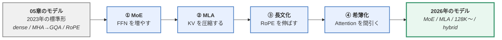
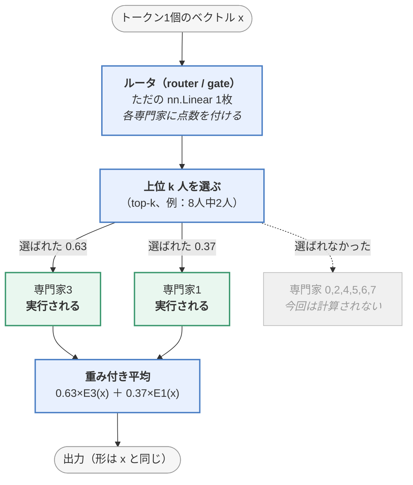
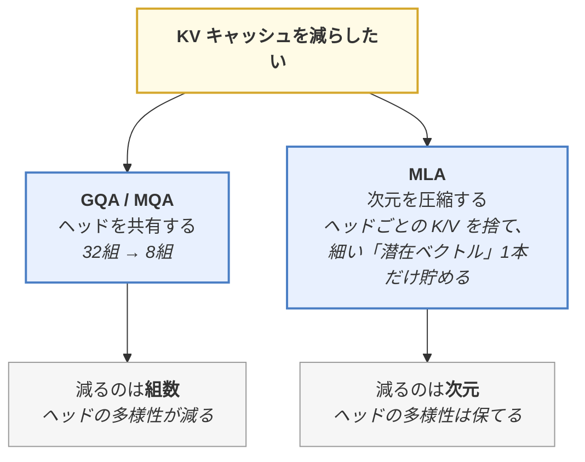
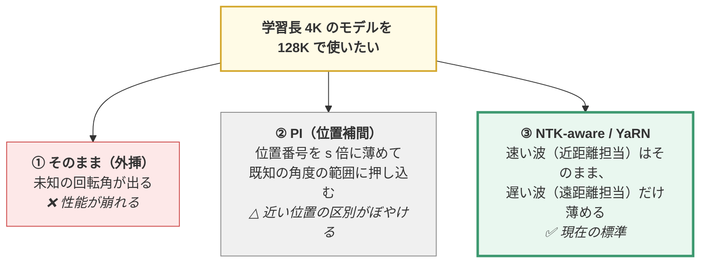
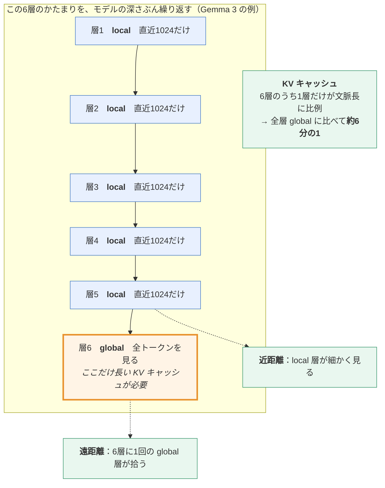
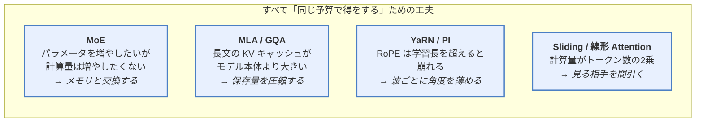

> この章は、**05章で作った LLaMA2 と、2026年の実物との差**を埋める補講です。
> **この章のゴール**：いま公開されている大きなモデルの構成表（「671B・37B activated」「MLA」
> 「262K context」など）を読んで、**何がどう効いているのかを説明できる**ようになる。
>
> 📎 **対応コード**：[`code/08_moe.py`](https://github.com/thirtypower/kgr-llm/blob/main/code/08_moe.py)
> **CPU だけで動きます**（検証のみ約10秒、`--train` 付きで約2〜3分）。
>
> ```bash
> cd code
> python 08_moe.py            # 仕組みの検証だけ
> python 08_moe.py --train    # ルータが偏る様子まで実測する
> ```

---

## なぜこの章があるのか

05章で作った LLaMA2（2023年の標準形）と、2026年に公開されているモデルを並べると、
**構成表の語彙がまるで違って見えます**。

```
【05章で作ったもの】  Decoder-only / RMSNorm / RoPE / GQA / SwiGLU / dense / 512 トークン

【2026年の実物の例】  671B total・37B activated / MoE 256 experts (8 + 1 shared)
                     / MLA (KV 潜在 512次元) / 128K context / MTP
```

しかし、**中身の差分は驚くほど少ない**です。この章で埋めるのは次の4点だけです。

| # | 差分 | 何が変わるのか | 節 |
|---|------|--------------|-----|
| ① | **MoE**（専門家混合） | FFN を N 個に増やし、トークンごとに数個だけ使う | 5.5.1 |
| ② | **MLA** | KV キャッシュを「潜在ベクトル1本」に圧縮する（GQA の次） | 5.5.2 |
| ③ | **長文コンテキスト** | RoPE を**そのままでは伸ばせない**。だから伸ばす工夫が要る | 5.5.3 |
| ④ | **Attention の希薄化** | 全トークンを見るのをやめる（sliding window / 線形 Attention） | 5.5.4 |



> 🔑 **この章の一番大事なメッセージ**：
> ①〜④ はすべて「**賢くする工夫**」ではなく「**同じ予算で得をする工夫**」です。
> 何を節約したくて生まれたのかを押さえれば、名前を覚える必要はありません。

---

## 5.5.1 MoE（Mixture of Experts / 専門家混合）

### 動機：パラメータは増やしたい、計算量は増やしたくない

02.5章 ⑦ で見たとおり、Transformer のパラメータの **約 2/3 は FFN** にあり、
「知識の置き場」はそこです。そして04章のスケーリング則が言うのは
「**パラメータを増やせば賢くなる**」。

ところが dense（普通の）モデルでは、**パラメータを2倍にすると計算量も2倍**になります。
計算量が増えるということは、

- 学習が2倍高い
- **推論も永久に2倍高い**（04章 4.2.1 で見た「使う側の最適」に反する）

そこで出てくる問いがこれです。

> **パラメータだけ10倍にして、1トークンあたりの計算量は据え置きにできないか？**

できます。**トークンごとに、増やしたパラメータの一部しか使わなければいい。**
これが MoE です。

### 仕組み：FFN を N 人に増やして、top-k 人だけ使う



コードにすると、本当にこれだけです（[`code/08_moe.py`](https://github.com/thirtypower/kgr-llm/blob/main/code/08_moe.py) から抜粋）。

```python
# ① ルータが点数を付ける（専門家の人数ぶんの logits を出すだけ）
logits = self.router(flat)                       # (トークン数, 専門家数)
probs  = F.softmax(logits, dim=-1)

# ② 上位 k 人を選び、その k 人ぶんだけで重みを再正規化する
topv, topi = torch.topk(probs, k, dim=-1)
topv = topv / topv.sum(dim=-1, keepdim=True)     # ← 合計が 1 になる

# ③④ 選ばれた専門家だけを実行して、重みで混ぜる
for e, expert in enumerate(self.experts):
    rows = (topi == e).any(dim=-1).nonzero(as_tuple=True)[0]   # この専門家を選んだトークン
    if rows.numel() == 0:
        continue                                  # ★ 選ばれなければ計算されない
    out[rows] += weight[rows] * expert(flat[rows])
```

> 🔑 **「専門家（expert）」の正体は、ただの FFN です。**
> 02.5章で手計算した `W₂ · 活性化(W₁ x)` が、そのまま N 個並んでいるだけです。
> 新しい数学は1つも出てきません。
>
> そして**混ぜ方は Attention とまったく同じ形**です。
>
> | | 何を混ぜるか | 重みの出どころ | 誰を混ぜるか |
> |---|---|---|---|
> | **Attention** | 他のトークンの V | Q·Kᵀ の softmax | **全員** |
> | **MoE** | 専門家の出力 | ルータの softmax | **top-k 人だけ** |
>
> 「全員を混ぜる」のをやめて「上位数人だけ混ぜる」ようにしたのが MoE、と読めます。

### ⚠️ 最大の誤解：「専門家」は分野の専門家ではない

`expert` という名前から「数学担当」「コード担当」のような分業を想像しますが、
**実際にはそうなりません**。ルータは学習で勝手に決まるので、
できあがる分業は**人間に解釈できない単位**です（トークンの表層的な性質で分かれることが多い、
と報告されています）。

> 🔑 **正しい読み方**：MoE は「専門家を雇う」仕組みではなく、
> **「巨大な FFN を N 個のブロックに分けて、毎回一部だけ引く」仕組み**です。
> 02.5章 ⑥ の「FFN ＝ 連想メモリ」の比喩で言えば、
> **辞書を N 冊に分けて、毎回関係ありそうな2冊だけ開いている**イメージです。

### ★ 実測1：総パラメータは4倍、計算量は据え置き

`python 08_moe.py` の STEP 1 の実出力です。

```
    dim = 128

    【Dense FFN】     中間次元  352                総  135,168 / 使う  135,168
    【MoE  FFN】      専門家 8 人 × 中間次元 176   総  541,696 / 使う  136,192
                      （1 トークンが通るのは top-2 の 2 人だけ）

    → 総パラメータは約 4.0 倍、
      1 トークンあたりの計算量は約 1.0 倍。
```

**専門家1人の中間次元を `dense ÷ k` にしてあるので、k 人使っても計算量が dense と同じ**
になります。そのうえで置き場だけが 8/2 = 4倍。これが MoE の設計思想そのものです。

> 📝 **実物での比率**：`総パラメータ ÷ 活性パラメータ` を見ると分かりやすいです。
>
> | モデル | 総パラメータ | 1トークンで使う量 | 比 |
> |---|---|---|---|
> | Mixtral 8x7B（2023.12） | 46.7B | 12.9B | 約 3.6倍 |
> | DeepSeek-V3（2024.12） | 671B | 37B | 約 18倍 |
> | Llama 4 Scout（2025.4） | 109B | 17B | 約 6.4倍 |
> | Llama 4 Maverick（2025.4） | 400B | 17B | 約 24倍 |
>
> ⚠️ **`8x7B` は「7B が8個で56B」ではありません**（実際は 46.7B）。
> MoE 化されるのは FFN だけで、**Attention と Embedding は共有**されるからです。
> 名前に釣られやすいところなので注意してください。

> ⚠️ **「12.9B 相当の速度で 46.7B の賢さ」は半分だけ本当です。**
> 速く（安く）なるのは**計算量**だけで、**メモリには 46.7B 全部を載せる必要があります**
> （どの専門家が選ばれるかは実行時に決まるので、全員を待機させておくしかない）。
>
> | | dense 7B | MoE 46.7B/12.9B |
> |---|---|---|
> | 1トークンの計算量 | 7B 相当 | **12.9B 相当**（安い） |
> | 必要な VRAM | 14GB | **93GB**（高い） |
>
> **MoE は「メモリを計算量と交換する」技術**です。だから
> 「GPU は積めるがトークン単価を下げたい」大規模サービス向きで、
> **手元の1枚の GPU で動かしたい用途にはまったく向きません**。

### 負荷分散：MoE の最大の失敗モード

MoE には dense に無い固有の壊れ方があります。

> **ルータが少数の専門家だけを選び続け、残りが遊ぶ（routing collapse）。**

理由は単純です。最初に少し多く選ばれた専門家は、それだけ多く学習されて上手くなり、
**さらに選ばれやすくなります**。放っておくと勝者総取りになります。

そこで **負荷分散の補助損失（auxiliary loss）** を本来の損失に足します。

```
    総損失 = 交差エントロピー + α × aux

    aux = 専門家数 × Σ_e ( f_e × P_e )

      f_e … 専門家 e に実際に振られたトークンの割合
      P_e … ルータが専門家 e に付けた確率の平均
```

読み方は「**よく選ばれている専門家（f_e が大きい）に、さらに高い確率（P_e）を
付けようとしたら罰する**」です。全員均等なら最小値（＝1）になります。

### ★ 実測2：補助損失を切ると本当に偏る

`python 08_moe.py --train` の実出力です（専門家8人 × 4層 ＝ 32枠）。

```
    【補助損失なし（aux_loss_coef = 0）】
      層 | E0  E1  E2  E3  E4  E5  E6  E7  |  最大   遊び
      ---+---------------------------------+-------------
       0 |  40  23   0   0  10   1  26   0 |   40%  4 人
       1 |  44   0   3  27   1   2  22   0 |   44%  4 人
       2 |   0  16  43  13   0   2  23   2 |   43%  4 人
       3 |  29   0   0   0  29  14  18  10 |   29%  3 人

    【補助損失あり（aux_loss_coef = 0.01）】
       0 |  45   5   6   6  12   8  17   0 |   45%  1 人
       1 |   7  18  10  19  16   5  12  13 |   19%  0 人
       2 |   6  14   9  10  12  15  13  20 |   20%  0 人
       3 |  12   8   4  14  18  10  17  18 |   18%  0 人

    ------------------------------------------------------------------
                    | val loss | 偏り(層平均) | 遊んでいる専門家
      補助損失なし   |  0.6983  |     39%      |  15 / 32 人
      補助損失あり   |  0.6943  |     25%      |   1 / 32 人
    ------------------------------------------------------------------
```

**注目すべきは val loss ではなく右の2列です。**

> 🔑 **loss はほぼ同じ（0.698 vs 0.694）なのに、働いている専門家の数が15人も違う。**
>
> つまり——**loss を見ているだけでは、MoE が壊れていることに気づけません。**
> 補助損失なしの側は「増やしたパラメータの半分が遊んだまま」学習が終わっています。
> これは 02.7章の「因果マスクのバグは loss が下がるので気づけない」と同じ構図です。
>
> ★ **MoE を学習させるときは、必ず専門家ごとの担当割合をログに出す。**
> これが 02.7章の「初期 loss ≈ ln(語彙数)」に並ぶ、MoE 版の検査項目です。
>
> 📝 なお `--steps 30` のように学習を極端に短くすると、
> 補助損失なしの側は「2人だけが 50% ずつ担当し、6人が完全に 0%」という
> **教科書どおりの崩壊**を見せます。自分で試してみてください。

### 補助損失のその後：aux-loss-free と共有専門家

補助損失には副作用があります。**本来の損失（＝賢さ）と競合する**からです。
「均等に配れ」という圧力は、「一番良い専門家を選べ」という本来の目的を歪めます。

そこで近年は2つの工夫が標準になりました。

| 工夫 | 中身 | 採用例 |
|------|------|-------|
| **共有専門家（shared expert）** | 「全トークンが必ず通る専門家」を1〜2人置く。どの入力にも要る共通知識をそこに集め、残りの専門家は分業に専念できる | DeepSeek-V2/V3 |
| **補助損失なしの負荷分散**（aux-loss-free） | 損失を足すのをやめ、**ルータの点数に専門家ごとのバイアス項を足して、混みぐあいを見ながらそのバイアスだけを調整する**。本来の損失に手を入れないので性能を削らない | DeepSeek-V3 以降 |

> 💡 `code/08_moe.py` の `MoEConfig(n_shared_experts=1)` で共有専門家を試せます。
> STEP 1 の出力に「MoE ＋ 共有専門家1人」の行が出ます。

### MoE のコスト（教材では見えない部分）

| 代償 | 内容 |
|------|------|
| **メモリ** | 全専門家を常駐させる必要がある（上の表のとおり） |
| **通信** | 大規模学習では専門家を GPU 間に分散（**expert parallelism**）するので、トークンを持つ GPU と専門家がいる GPU の間で毎層 all-to-all 通信が発生する |
| **バッチのばらつき** | どの専門家が呼ばれるかは入力次第なので、GPU の負荷が揃わない（容量上限 `capacity factor` を設け、溢れたトークンは専門家を通さず残差だけで通す＝**token dropping** という実装もある） |
| **微調整の難しさ** | ルータごと微調整すると分業が崩れやすい。LoRA を当てる対象の選び方も dense と変わる |

> 🔑 だから **MoE は「小さいモデルを作る人が最初に手を出す技術ではありません」**。
> 05章の 215M を MoE 化しても、得はほぼありません（実測2のとおり loss は変わらない）。
> **MoE が効くのは「データが膨大で、dense では容量が足りない」領域だけ**です。

---

## 5.5.2 MLA（Multi-head Latent Attention）— GQA の次

### なぜ KV キャッシュがそんなに問題なのか

05章 5.1.4 で「GQA が減らすのは KV キャッシュの保存量」と学びました。
その保存量が実際どれくらいなのかを、`python 08_moe.py` の STEP 6 で計算します。

```
    設定: dim=4096 / ヘッド 32 / 層 32 / 文脈 32,768 トークン / bf16

      MHA（32 組の K,V）         16.00 GB   … 1 リクエストでこれだけ食う
      GQA（8 組に共有）           4.00 GB   … 4 分の 1
      MQA（1 組に共有）           0.50 GB   … 極端版（品質は少し落ちる）
      MLA（潜在 512 次元 1 本）     1.00 GB   … MHA の約 16 分の 1
```

計算式はこれだけです。

```
   KV キャッシュのバイト数
     = 2（K と V）× 層数 × KVヘッド数 × head_dim × トークン数 × 1要素のバイト数
```

> 🔑 **7B のモデル本体は bf16 で 14GB。上の表の MHA は 1リクエストで 16GB。**
> つまり**長文では、キャッシュがモデル本体より大きくなります**。
> しかも同時に10人が使えばキャッシュは10倍です。
> 「LLM のサービスが高い」理由の大半はここにあります（→ [07.5章](https://zenn.dev/thirtypower/books/kgr-llm-guide/viewer/075-fast-inference)）。

### GQA と MLA は「別の方向」に減らしている



MLA の手順は3つです。

1. 入力 x を、**細い潜在ベクトル c**（例：512次元）に落として **c だけをキャッシュに貯める**
2. 使うときに、c から各ヘッドの K と V を**掛け算で復元する**（up-projection）
3. 位置情報（RoPE）は圧縮すると壊れるので、**RoPE を掛ける小さな部分だけ別に持つ**
   （decoupled RoPE）

> 🤔 **「復元するなら減っていないのでは？」**——05章 5.1.4 の `repeat_kv` と同じ話です。
> **貯めるのは圧縮した c だけ。膨らませるのは計算の直前で、膨らませた結果は捨てます。**
> だから**保存量だけが減り、計算量は減りません**（GQA とまったく同じ構図）。
>
> 📝 上の表の「潜在512次元1本」は**圧縮された本体だけ**を数えた概算です。
> 実際には ③ の decoupled RoPE 用の小さなキー（DeepSeek-V2/V3 では 64次元）も
> 一緒に貯めるので、実物の値は表より少し大きくなります。
> **桁の感覚（MHA の十数分の1）を掴むための数字**として読んでください。

### ★ なぜ潜在1本に潰しても壊れないのか（実測）

MLA は「K/V は低ランクに潰しても情報がほとんど失われない」という**賭け**です。
それが自明でないことも、同じ STEP 6 で確認できます。

```
    どちらも 2048 × 1024 の行列ですが、上位 64 成分だけを残すと——

      ① 実質 64 次元ぶんの情報しかない行列  … 元の情報の 100.0% が残る
      ② 本当に 1024 次元ぶん情報がある行列  … 元の情報の  15.9% しか残らない
```

> ⚠️ **② が示すとおり、低ランク性は自動的に成り立つ性質ではありません。**
> 「実際の LLM の K/V は ① に近い」という**経験的な観察**があるから MLA が成立しています。
> LoRA（06章 6.3.2）の「ΔW は低ランク」という仮説と、まったく同じ形の賭けです。
> **この2つが同じ発想だと分かると、両方まとめて覚えられます。**

| | 圧縮する対象 | 賭けている仮説 |
|---|---|---|
| **LoRA** | 微調整による重みの**変化量 ΔW** | 変化は低ランク |
| **MLA** | 推論時にキャッシュする **K/V** | K/V は低ランク |

### どちらが標準なのか（2026年時点）

**両方が併存しています。** 単純さを取るか圧縮率を取るかの選択です。

| 方式 | 採用しているモデル系列 |
|------|---------------------|
| **GQA** | Llama、Gemma、Qwen（主系列）、gpt-oss、Mistral 系 |
| **MLA** | DeepSeek-V2/V3 系、Kimi K2 系 |

> 📝 **迷ったら GQA**。実装が単純で、Hugging Face でもそのまま動きます。
> MLA は圧縮率で勝ちますが、実装（特に RoPE の切り分け）が明確に難しく、
> 推論エンジン側の対応も必要です。

---

## 5.5.3 長文コンテキスト：RoPE は「そのままでは」伸びない

### ⚠️ 05章の説明を、ここで1段精密にします

05章 5.1.3 で RoPE の利点として「**長文への外挿が効く**」と書きました。
これは**方向としては正しいが、そのままでは実務で通用しません**。正確にはこうです。

> **素の RoPE は、学習した長さを超えると性能が急激に落ちます。**
> 長い文脈を扱えるモデルは、例外なく**RoPE を伸ばす追加の工夫**を入れています。

なぜ落ちるのか。RoPE の回転角は `位置 × 周波数` なので、
**学習で一度も見たことのない大きな回転角**が現れます。
モデルはその角度での Attention の振る舞いを学んでいないため、
「回転を続けるだけだから大丈夫」とはならないのです。

> 📝 **では 05章の実測（学習64トークン → 生成300トークン）は何だったのか**
>
> あれは**壊れていないことの証明にはなっていますが、一般的な保証ではありません**。
> あのコーパスは「1文が7〜8トークンで完結し、離れた位置を参照する必要が一切ない」
> という極端に易しい設定です。**遠くを見る必要がないので、遠くの回転角が壊れていても
> 影響が出ない**わけです。本物の長文（前の章を参照する、など）では通用しません。
>
> 🔑 **教訓**：小さい実験で「動いた」ことは、スケールしたときの保証にはならない。
> どういう条件で動いたのかを毎回言えるようにしてください。

### 伸ばす3つの方法



**② PI（Position Interpolation）** は、位置 `m` を `m/s` に置き換えるだけの方法です。
4K 学習のモデルを 32K で使いたければ `s = 8`。
「位置3000は、学習時の位置375のつもりで扱え」ということです。
既知の角度の範囲に収まるので崩れませんが、**隣どうしの区別がぼやけます**
（1 トークンの差が 1/8 の角度差になってしまう）。

**③ NTK-aware / YaRN** は、②の弱点を直したものです。
02.5章 2.3.2 で見た「**速い波が細かい位置を、遅い波が大まかな位置を表す**」を思い出してください。

| 波 | 担当 | 伸ばすときの扱い |
|---|---|---|
| **速い波**（高周波） | 近くのトークンの区別 | **触らない**（隣どうしの区別を守る） |
| **遅い波**（低周波） | 遠くの大まかな位置 | **薄める**（未知の角度に入らないようにする） |

> 🔑 **PI が「全部の波を一律に薄めた」のに対し、YaRN は「波ごとに扱いを変えた」。**
> これだけの違いです。時計の比喩で言えば、
> **秒針はそのままにして、時針だけ目盛りを広げた**ということです。

実務上は次のように現れます。

```python
# Hugging Face では設定ファイルに書くだけ（自分で実装することはまずない）
# config.json
"rope_scaling": { "rope_type": "yarn", "factor": 8.0,
                  "original_max_position_embeddings": 4096 }
```

そして重要なのが最後の点です。

> ⚠️ **YaRN でも「ゼロコストで無限に伸びる」わけではありません。**
> - **長いデータでの追加学習が（少量でも）必要**なことが多い
> - **「読める」と「使える」は別**。128K を宣伝しているモデルでも、
>   文脈の**真ん中に置いた情報を取り落とす**現象（lost in the middle）が知られています
> - だから長文能力は **RULER / LongBench** のような**専用のベンチマークで測る**必要があります
>   （→ [07章 7.1.1](https://zenn.dev/thirtypower/books/kgr-llm-guide/viewer/07-applications)）
>
> **「context 1M」は「1M トークンを理解できる」という意味ではなく、
> 「1M トークンを入力してもエラーにならない」という意味**だと読むのが安全です。

---

## 5.5.4 Attention を希薄にする（sliding window / 線形 Attention）

02章 2.1.6 で見たとおり、Attention の計算量は**トークン数の2乗**です。
長文化すると、ここが最後に残る壁になります。2026年の主な回避策は3つです。

| 手法 | 考え方 | 代償 |
|------|-------|------|
| **Sliding Window Attention**（SWA） | 各トークンは**直近 W トークンだけ**を見る（例：W=1024〜4096）。数層に1層だけ「全部見る層」を挟む（**local : global = 5 : 1** など） | 遠距離の直接参照が減る |
| **Sparse Attention** | 全部の中から**重要そうな一部だけ**を選んで見る（選び方も学習する） | 実装が複雑 |
| **線形 Attention 系**（Gated DeltaNet、Lightning Attention など） | softmax(QKᵀ) を使うのをやめ、**固定サイズの「状態」を持って RNN のように更新する**。計算量がトークン数に比例（1乗）になる | 表現力が落ちるので、通常の Attention と**混ぜて**使う（hybrid） |

### 図で見る：sliding window はマスクを変えるだけ

02章 2.1.7 で作った「右上を −∞ にするマスク」を思い出してください。
**sliding window は、そのマスクに「左下も切る」を足しただけ**です。

```
  [A] 通常の causal Attention（全部見る）    [B] Sliding Window（W=4：直近4個だけ）
       t0 t1 t2 t3 t4 t5 t6 t7                  t0 t1 t2 t3 t4 t5 t6 t7
  t0    #  .  .  .  .  .  .  .             t0    #  .  .  .  .  .  .  .
  t1    #  #  .  .  .  .  .  .             t1    #  #  .  .  .  .  .  .
  t2    #  #  #  .  .  .  .  .             t2    #  #  #  .  .  .  .  .
  t3    #  #  #  #  .  .  .  .             t3    #  #  #  #  .  .  .  .
  t4    #  #  #  #  #  .  .  .             t4    .  #  #  #  #  .  .  .
  t5    #  #  #  #  #  #  .  .             t5    .  .  #  #  #  #  .  .
  t6    #  #  #  #  #  #  #  .             t6    .  .  .  #  #  #  #  .
  t7    #  #  #  #  #  #  #  #             t7    .  .  .  .  #  #  #  #
        ↑ 行が下に行くほど長くなる                ↑ どの行も長さ4で打ち止め（帯になる）
```

| | 1トークンが見る相手 | 計算量 | **KV キャッシュ** |
|---|---|---|---|
| causal（全部見る） | 最大 T 個 | T² に比例 | T に比例（**際限なく増える**） |
| sliding window W | 最大 W 個 | T×W に比例（＝T の**1乗**） | **W で打ち止め**（増えない） |

> 🔑 **本当に効くのは右端の列**です。
> 計算量が減るのは当然ですが、それ以上に **KV キャッシュが「文脈長に比例しなくなる」**
> のが大きい。7.5.3 で見るとおり、同時に何人さばけるかは KV キャッシュの本数で決まるので、
> ここが定数になるのは運用上とても強い性質です。

### ❓ 直近しか見ないなら、遠くの情報は失われるのでは？

**1層だけならそうですが、層を積むと間接的に届きます。**
CNN で「3×3 の畳み込みを積むと広い範囲が見える」のと同じ理屈です。

```
   層1：t100 は t97〜t100 を見る（W=4）
   層2：その t97 は、層1 で t94〜t97 を見ている
   層3：さらに t91 まで……
   → L 層積めば、届く範囲はおよそ L × W
```

ただし届くのは**要約された情報**で、「50000トークン前の固有名詞をそのままコピーする」
ような仕事は苦手になります。だから実物は **数層に1層だけ「全部見る層」を混ぜます**。



| モデル | 混ぜ方 | 窓 W |
|---|---|---|
| **Mistral 7B**（2023） | 全層 SWA | 4096 |
| **Gemma 2**（2024） | local : global = **1 : 1** | 4096 |
| **Gemma 3**（2025） | local : global = **5 : 1** | **1024**（さらに絞った） |
| **gpt-oss / 近年の多くのモデル** | local と global を交互〜数層おき | 128〜1024 |

> 📝 Gemma 3 の技術報告では、この構成で **長文時に KV キャッシュが占める割合が
> 約60%から15%未満に落ちた**一方、**言語モデルとしての性能低下はほぼ無かった**と
> 報告されています（→ [参考文献](https://zenn.dev/thirtypower/books/kgr-llm-guide/viewer/appendix-references)）。
> 「全部のトークンが全部のトークンを見る」必要は、実はほとんど無かったわけです。

> 🔑 **RNN が一周して戻ってきた**、というのが線形 Attention の面白いところです。
> 02章で「RNN は①遅い ②忘れる、で Transformer に負けた」と書きましたが、
> ①（並列化できない）を解決する定式化が見つかったため、
> **「長文では固定サイズの状態を持つ方が安い」**という利点が復活しました。
> ただし②（忘れる）は残るので、**全層を置き換えるのではなく数層に1層だけ通常の Attention を
> 混ぜる**のが2026年の主流です。

そのほか、細かいが広く入った工夫を2つだけ挙げておきます。

- **QK-Norm**：Q と K に正規化を掛けてから内積を取る。Attention のスコアが
  巨大になって学習が発散するのを防ぐ（大規模学習の安定化）
- **Attention sink**：モデルは**文頭のトークンに大量の注意を割り当てる**性質があり、
  これは「特に見るものが無いときの捨て場」として機能していると考えられています。
  文脈を途中で切り捨てる実装（streaming）では、**文頭だけは残す**必要があります

---

## 5.5.5 2026年の構成表を読む

ここまでの語彙で、実物の構成表が読めるようになります。代表例を並べます。

| モデル | 総 / 活性 | 専門家 | Attention | 文脈 | 特徴 |
|-------|----------|-------|-----------|------|------|
| **LLaMA-2 70B**（2023） | 70B / 70B（dense） | — | GQA 8 | 4K | 05章で作った形 |
| **Mixtral 8x7B**（2023.12） | 46.7B / 12.9B | 8人中2人 | GQA | 32K | MoE を広めた |
| **DeepSeek-V3**（2024.12） | 671B / 37B | 256人中8人 ＋ 共有1人 | **MLA**（潜在512） | 128K | aux-loss-free / FP8 学習 / MTP |
| **Llama 4 Scout**（2025.4） | 109B / 17B | 16人 | GQA ＋ iRoPE | 10M（公称） | Meta 初の MoE |
| **Qwen3 系**（2025） | 235B / 22B など | 128人中8人 | GQA | 128K〜 | dense 版も併売 |

> 📝 **共通して読み取れる傾向**（2026年時点）
> 1. **大型はほぼ全部 MoE**。dense は小型（〜30B）と、手元で動かす用途に残る
> 2. **活性パラメータは 17B〜40B あたりに収束**した（推論コストの現実的な上限）
> 3. **GQA か MLA のどちらかは必ず入っている**。素の MHA は大型では絶滅した
> 4. **RMSNorm / RoPE / SwiGLU / Pre-Norm は 05章のまま**。ここは3年変わっていない

> 🔑 **だから 05章で作ったものは古くなっていません。**
> 骨格（Decoder-only + Pre-Norm + RMSNorm + RoPE + SwiGLU）はそのままで、
> **FFN が MoE になり、KV が圧縮され、文脈が伸びただけ**です。
> 「毎年ゼロから変わっている」ように見えるのは、名前が増えているだけです。

---

## この章のまとめ



| 項目 | ひとことで |
|------|-----------|
| **MoE** | FFN を N 人に増やし top-k 人だけ使う。**総パラメータ↑・計算量→・メモリ↑** |
| **専門家の正体** | ただの FFN。分野の専門家ではなく「辞書を分冊にしたもの」 |
| **MoE の検査項目** | **専門家ごとの担当割合をログに出す**。loss では偏りに気づけない |
| **負荷分散** | 補助損失 → 共有専門家 ＋ aux-loss-free（本来の損失を歪めない方向へ） |
| **MLA** | KV を潜在ベクトル1本に圧縮して貯める。LoRA と同じ「低ランクへの賭け」 |
| **長文** | 素の RoPE は伸びない。PI → NTK-aware → **YaRN** が標準。読めても使えるとは限らない |
| **希薄化** | sliding window / sparse / 線形 Attention（hybrid で使う） |
| **変わっていないもの** | Decoder-only / Pre-Norm / RMSNorm / RoPE / SwiGLU |

## 理解度チェック

1. MoE で「総パラメータは増えるのに、1トークンあたりの計算量は増えない」のはなぜですか？
2. `Mixtral 8x7B` が 56B ではなく 46.7B なのはなぜですか？
3. MoE が「手元の GPU 1枚で動かしたい用途に向かない」のはなぜですか？
4. MoE の学習で loss だけを見ていると気づけない失敗は何ですか？ どうやって検出しますか？
5. MLA と GQA は、それぞれ何を減らしていますか？
6. 「RoPE は長文に外挿できる」という説明を、より正確に言い直せますか？
7. YaRN が PI より優れているのはなぜですか？

<details>
<summary><b>▶ 解答を見る</b></summary>

1. **ルータが選んだ top-k 人の専門家しか実行しないから**です。専門家が8人いても、
   1トークンが通るのは（例えば）2人だけなので、計算されるのは全体の 2/8 です。
   専門家1人の中間次元を「dense ÷ k」にしておけば、k 人使っても計算量は dense と同じまま、
   置き場だけが `専門家数 ÷ k` 倍になります。
2. **MoE 化されるのは FFN だけで、Attention 層と Embedding は8個の専門家で共有されるから**です。
   `8x7B` という名前は「7B のモデルが8個」ではなく「FFN が8系統ある」という意味で、
   実際の総パラメータは 46.7B、1トークンで使うのは 12.9B です。
3. **計算量は減っても、メモリは減らない（むしろ大幅に増える）から**です。
   どの専門家が選ばれるかは実行時にトークンごとに決まるため、**全専門家を常駐させる**
   必要があります。Mixtral 8x7B は bf16 で約 93GB。
   「12.9B の速さ」は本当ですが「12.9B のメモリ」ではありません。
   **MoE はメモリを計算量と交換する技術**なので、GPU を積める大規模サービス向きです。
4. **routing collapse（ルータの偏り／専門家の遊び）**です。
   一部の専門家だけが選ばれ続け、残りが学習されないまま終わります。
   実測では、補助損失を切ると 32枠のうち 15枠が「ほぼ担当ゼロ」になったのに、
   **val loss は 0.6983 vs 0.6943 でほとんど差がありませんでした**。
   検出方法は **専門家ごとの担当トークン割合をログに出すこと**。
   これ以外に気づく手段が実質ありません。
5. - **GQA**：K/V の**組数（ヘッド数）**を減らす（32組 → 8組）。ヘッドの多様性が減る
   - **MLA**：K/V の**次元**を圧縮する（各ヘッドの K/V を貯めるのをやめ、
     細い潜在ベクトル1本だけを貯めて、使うときに各ヘッドへ復元する）

   どちらも**減るのは「保存量」だけで、計算量は減りません**（復元・複製してから計算するため）。
6. 「そのまま伸ばせる」ではなく——
   **「素の RoPE は学習した長さを超えると性能が急に落ちる。ただし RoPE は位置を回転で
   表しているので、回転角の付け方を調整するだけで（重みを作り直さずに）長さを伸ばせる」**
   が正確な言い方です。伸ばす工夫（PI / NTK-aware / YaRN）が必須で、
   多くの場合は長文データでの追加学習も伴います。
7. **PI が全部の周波数を一律に薄めるのに対し、YaRN は周波数ごとに扱いを変えるから**です。
   RoPE の速い波（高周波）は「近いトークンどうしの区別」を担当しているので、
   ここを薄めると隣接語の区別がぼやけます。YaRN は速い波を触らず、
   遠距離を担当する遅い波だけを薄めるので、近距離の解像度を保ったまま長さを伸ばせます。

</details>

---

## 手を動かす

```bash
cd code

# 仕組みの検証だけ（10秒）
python 08_moe.py

# ルータが偏る様子まで実測する（2〜3分）
python 08_moe.py --train

# 学習を極端に短くすると、教科書どおりの「崩壊」が見える
python 08_moe.py --train --steps 30
```

**必ず見てほしいのは STEP 4 の2つの表**です。
「loss は同じなのに、半分の専門家が遊んでいる」を自分の目で見ておくと、
MoE の論文が何と戦っているのかが一発で分かります。

---

**次へ** → [06. 学習フローの実践](https://zenn.dev/thirtypower/books/kgr-llm-guide/viewer/06-training-pipeline)
／ 推論を速くする話に飛ぶなら → [07.5. 推論を速くする](https://zenn.dev/thirtypower/books/kgr-llm-guide/viewer/075-fast-inference)
／ 戻る → [05. 自分で LLM を作る](https://zenn.dev/thirtypower/books/kgr-llm-guide/viewer/05-build-your-own-llm)
