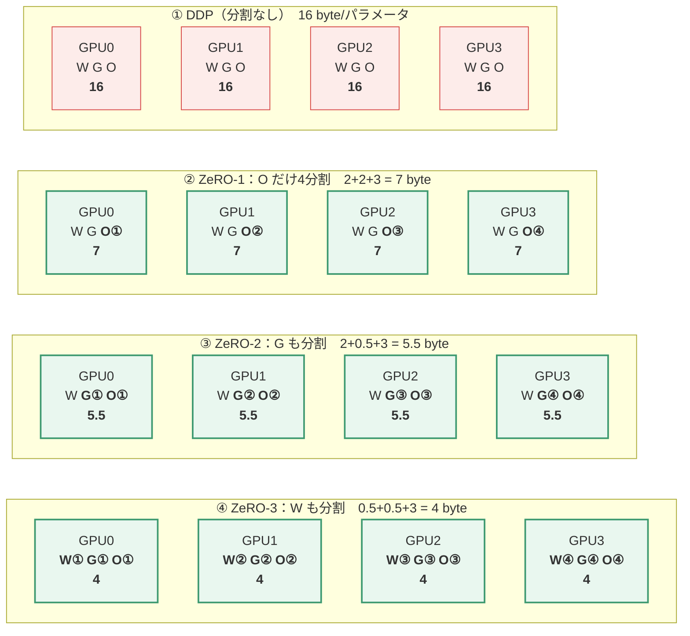
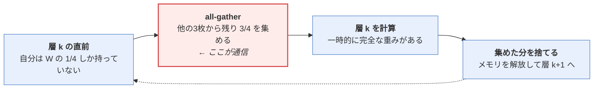
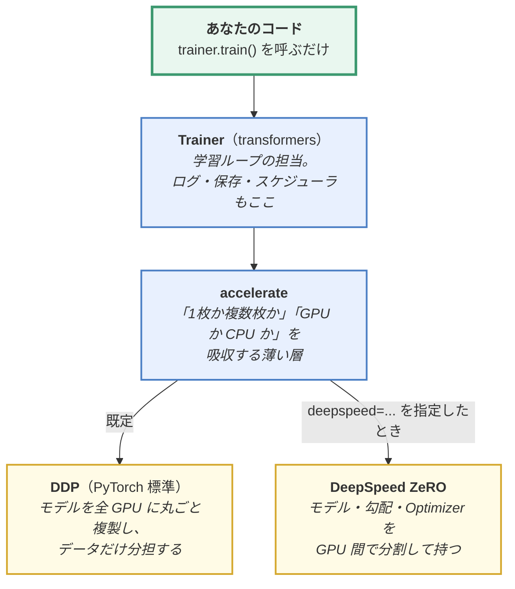
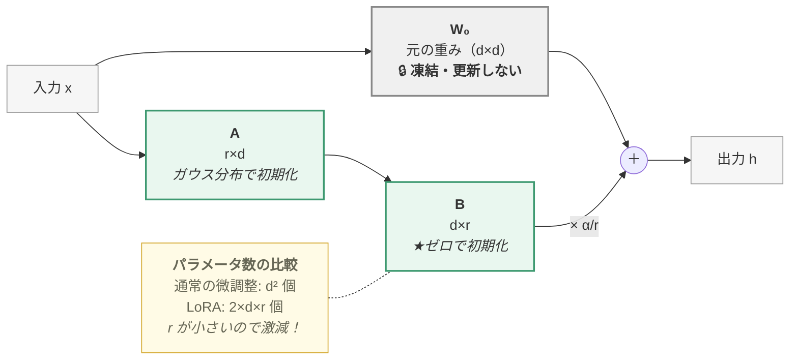
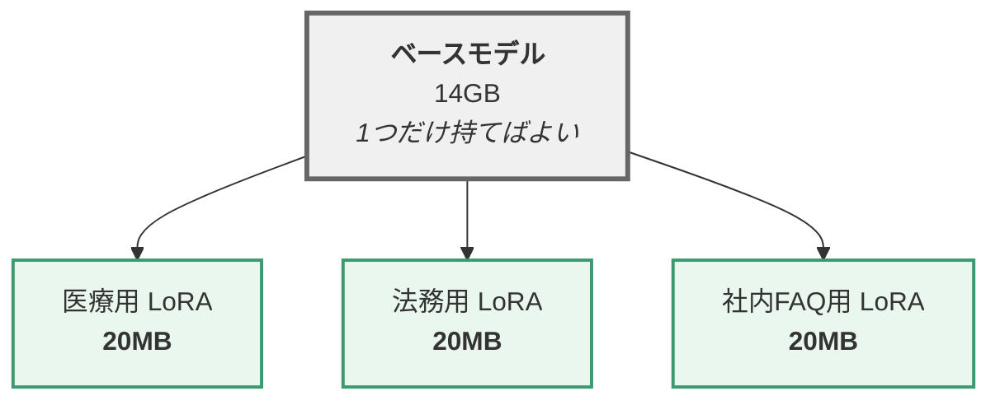
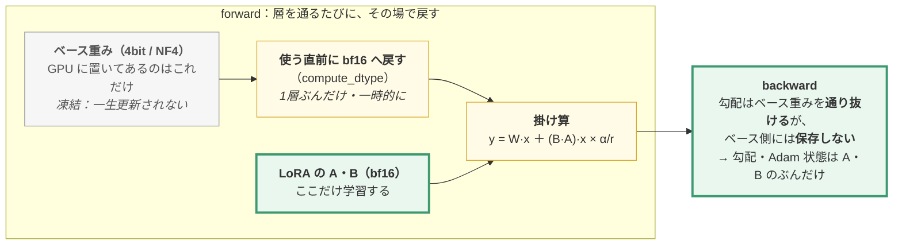
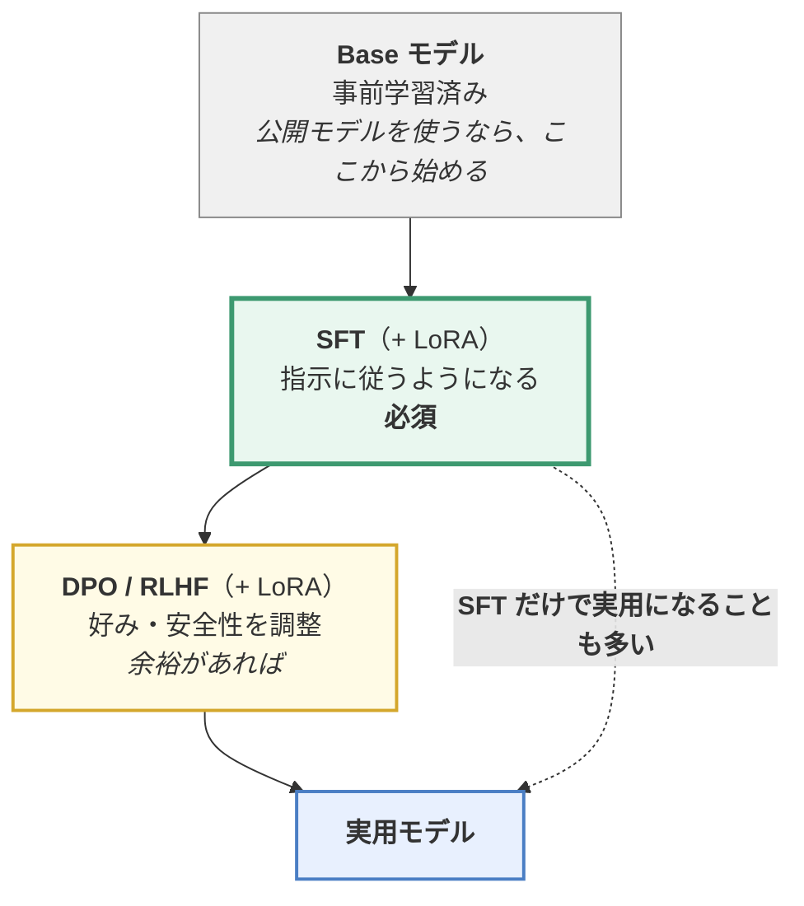

> **この章のゴール**：第5章で「ゼロから書いた」ものを、**実務で使う標準ツール**でやり直す。
> Hugging Face エコシステムと、少ないリソースで微調整する **LoRA** を習得する。

第5章は「原理を理解するため」に全部自分で書きました。
実務ではその必要はありません。**Hugging Face Transformers** を使うのが標準です。

---

## 6.1 モデルの事前学習（Transformers 版）

### 6.1.1 フレームワークの紹介

**Hugging Face Transformers** は、数百種類のモデルアーキテクチャを
**統一されたインターフェース**で扱えるライブラリです。

| ライブラリ | 役割 | この教材での登場 |
|-----------|------|----------------|
| **transformers** | モデル本体（数百種類を統一 API で） | 6.1 |
| **datasets** | データの読み込み・前処理 | 6.1.3 |
| **tokenizers** | トークナイザ | [02.6章](https://zenn.dev/thirtypower/books/kgr-llm-guide/viewer/026-tokenizer) |
| **accelerate** | 分散学習の抽象化 | 6.1.5 |
| **peft** | LoRA など効率的微調整 | 6.3 |
| **trl** | SFT / DPO / PPO の学習器 | 6.2, 6.4 |
| **DeepSpeed** | 大規模分散（ZeRO） | 6.1.5 |
| **Hub** | モデル・データセットの共有基盤 | 全体 |

```bash
pip install torch transformers datasets accelerate peft trl

# deepspeed は分散学習（6.1.5）で使うときだけ。
# ⚠️ Windows ではまずビルドできません（Linux / WSL2 / Colab 専用と考えてください）
pip install deepspeed
```

### 6.1.2 モデルの初期化

**パターン①：既存モデルの重みを読み込む（最も一般的）**

```python
from transformers import AutoModelForCausalLM, AutoTokenizer

model_name = "Qwen/Qwen2.5-1.5B"
tokenizer = AutoTokenizer.from_pretrained(model_name)
model = AutoModelForCausalLM.from_pretrained(
    model_name,
    torch_dtype=torch.bfloat16,
    device_map="auto",           # 複数GPUに自動配置
)
```

**パターン②：構造だけ借りて、重みはランダム初期化（自分で事前学習する場合）**

```python
from transformers import AutoConfig, AutoModelForCausalLM

config = AutoConfig.from_pretrained("Qwen/Qwen2.5-1.5B")
config.num_hidden_layers = 12       # 好きなように小さくできる
config.hidden_size = 768
model = AutoModelForCausalLM.from_config(config)   # ← 重みは空
```

> `AutoModelForCausalLM` の「CausalLM」は第3章の CLM のこと。
> 分類なら `AutoModelForSequenceClassification` など、タスク別のクラスがあります。

### 6.1.3 事前学習データの処理

```python
from datasets import load_dataset

# ① データ読み込み
ds = load_dataset("json", data_files="corpus.jsonl", split="train")

# ② トークン化
def tokenize_fn(examples):
    return tokenizer(examples["text"])

tokenized = ds.map(tokenize_fn, batched=True, remove_columns=ds.column_names,
                   num_proc=8)

# ③ 固定長のブロックに詰め直す（Packing）
BLOCK = 1024
def group_texts(examples):
    # 全部繋げる
    concatenated = {k: sum(examples[k], []) for k in examples.keys()}
    total = (len(concatenated["input_ids"]) // BLOCK) * BLOCK
    result = {
        k: [t[i:i+BLOCK] for i in range(0, total, BLOCK)]
        for k, t in concatenated.items()
    }
    result["labels"] = result["input_ids"].copy()   # CLM は入力＝正解
    return result

lm_dataset = tokenized.map(group_texts, batched=True, num_proc=8)
```

**Packing（詰め込み）** は重要な工夫です。
短い文書をパディングで埋めると計算が無駄になるので、
**複数の文書を繋げて 1024 トークンぴったりに切り分けます**。

> `labels = input_ids` としていますが、ずらし（shift）は
> Transformers のモデル内部で自動的にやってくれます。

### 6.1.4 Trainer での学習

`Trainer` を使うと、学習ループを自分で書く必要がなくなります。

```python
from transformers import Trainer, TrainingArguments, DataCollatorForLanguageModeling

args = TrainingArguments(
    output_dir="./output",
    per_device_train_batch_size=4,
    gradient_accumulation_steps=8,        # 実質バッチサイズ = 4 × 8 × GPU数
    num_train_epochs=1,
    learning_rate=3e-4,
    warmup_ratio=0.03,
    lr_scheduler_type="cosine",
    bf16=True,                            # 混合精度
    logging_steps=10,
    save_steps=1000,
    save_total_limit=3,
    gradient_checkpointing=True,          # メモリ節約（速度は少し落ちる）
    report_to="tensorboard",
)

trainer = Trainer(
    model=model,
    args=args,
    train_dataset=lm_dataset,
    data_collator=DataCollatorForLanguageModeling(tokenizer, mlm=False),
)

trainer.train()
trainer.save_model("./final_model")
```

第5章で30行以上書いた学習ループが、これだけになりました。
チェックポイント保存、ログ、学習率スケジュール、分散対応が全部含まれています。

**メモリが足りないときの主な対処：**

| 設定 | 効果 |
|------|------|
| `per_device_train_batch_size` を下げる | 直接的にメモリ削減 |
| `gradient_accumulation_steps` を上げる | バッチサイズを保ったままメモリ削減 |
| `gradient_checkpointing=True` | 中間活性値を捨てて再計算。メモリ大幅減、速度 -20〜30% |
| `bf16=True` | 精度を半分にしてメモリ半減 |
| `optim="adafactor"` or `"adamw_8bit"` | Optimizer の状態を軽量化 |

### 6.1.5 DeepSpeed による分散学習

モデルが1枚の GPU に載らないときは、**DeepSpeed の ZeRO** を使います。

#### ZeRO の考え方

学習時、GPU メモリを食うのは4つです。

```
① モデルの重み（Parameters）
② 勾配（Gradients）
③ Optimizer の状態（Adam は m と v の2つの統計量を、パラメータ1個につき持つ）
④ 中間活性値（Activations）
```

7B モデルを fp16/bf16 + Adam（混合精度学習）で学習する場合の目安：

```
重み        7B × 2byte  =  14GB   （fp16/bf16）
勾配        7B × 2byte  =  14GB   （fp16/bf16）
Adam状態    7B × 12byte =  84GB   ← これが一番重い
────────────────────────────────
合計                    ≈ 112GB   （A100 80GB でも足りない）
```

**「Adam 状態 = 12byte/パラメータ」の内訳**に注意してください。
「Adam は m と v の2つだから重みの2倍」とよく言われますが、
混合精度学習では Optimizer 側は**精度を落とせない**（小さな更新量が消えるため）ので、
全部 **fp32（4byte）** で持ちます。さらに fp32 の**マスター重み**も Optimizer 側に持つため：

```
m（勾配の移動平均）        fp32 = 4byte
v（勾配の2乗の移動平均）   fp32 = 4byte
fp32 マスター重み          fp32 = 4byte
─────────────────────────────────
合計                            12byte/パラメータ  （2byte の重みの6倍）
```

つまり「**個数として2倍（m と v）**、**バイト数として6倍（fp32 ×3本）**」です。
この区別が付いていれば、上の表の 84GB = 7B × 12byte がすっと読めるはずです。

**ZeRO は、これらを複数 GPU で分割して持ちます。**

| ステージ | 分割するもの | メモリ削減 | 通信コスト |
|---------|------------|-----------|-----------|
| **ZeRO-1** | Optimizer 状態 | 約 4倍 | 小 |
| **ZeRO-2** | + 勾配 | 約 8倍 | 中 |
| **ZeRO-3** | + モデル重み | GPU数に比例 | 大 |
| **ZeRO-Offload** | CPU メモリへ退避 | さらに大 | 非常に大 |

> 🔢 **「約4倍」「約8倍」はどこから出た数字か**（GPU が十分な枚数あるときの理屈上の上限です）
>
> 上で見たとおり、1パラメータあたりのメモリは **重み2 + 勾配2 + Optimizer 12 = 16 バイト**。
> 分割したものは「GPU 台数で割り算」できるので、台数が多ければ**ほぼ 0 と見なせます**。
>
> ```
>   分割なし   : 2（重み） + 2（勾配） + 12（Optimizer） = 16 バイト     → 倍率 1
>   ZeRO-1     : 2         + 2         + (12 ÷ 台数≒0)  =  4 バイト     → 16 ÷ 4 = 約 4倍
>   ZeRO-2     : 2         + (2÷台数≒0)+ (12÷台数≒0)   =  2 バイト     → 16 ÷ 2 = 約 8倍
>   ZeRO-3     : (2÷台数)  + …                          → 台数を増やすほど無限に減る（＝GPU数に比例）
> ```
>
> 🔑 **要するに「16 バイトのうち、何バイト分を全 GPU で割り勘にできるか」**の話です。
> 一番重い Optimizer（12バイト）を割り勘にするだけで 4倍効くので、
> **ZeRO-1 だけでも効果が大きい**わけです。
> （実際には中間活性値も乗るので、この倍率そのままにはなりません）

**GPU 4枚のとき、各 GPU が何を持っているのか**を絵にします。
`W` = 重み(2) / `G` = 勾配(2) / `O` = Optimizer 状態(12)、色が付いた枠が「自分の担当ぶんだけ」です。



| | GPU 4枚のとき | GPU 64枚のとき | 分割していないもの |
|---|---|---|---|
| DDP | 16.0 byte（1.0倍） | 16.0 byte（1.0倍） | 全部 |
| **ZeRO-1** | 7.0 byte（2.3倍） | 4.2 byte（3.8倍） | 重み・勾配 |
| **ZeRO-2** | 5.5 byte（2.9倍） | 2.2 byte（7.2倍） | 重み |
| **ZeRO-3** | 4.0 byte（4.0倍） | 0.25 byte（**64倍**） | なし |

> 📝 表の「約4倍／約8倍」は**枚数が十分多いとき**の値です。
> 4枚しかなければ ZeRO-3 でも 4倍で、上の理屈どおりです。
> **枚数を増やすほど得をするのは ZeRO-3 だけ**、という点が選択の分かれ目になります。

#### ZeRO-3 の通信コストはどこから来るのか

「重みを分割する」と、**forward で自分が持っていない重みが必要になります**。
そこで層を通るたびに集めて、使い終わったら捨てます。



> 🔑 **ZeRO はメモリを通信で買っています。**
> だから「1枚に載るなら DDP、載らないときだけ ZeRO」という判断になります。
> ノードをまたぐ（GPU 間が InfiniBand ではなく普通のネットワーク）環境で ZeRO-3 を使うと、
> **計算より通信の待ち時間の方が長くなる**ことがあります。

#### 設定ファイル

```json
// ds_config.json
{
  "bf16": { "enabled": true },
  "zero_optimization": {
    "stage": 2,
    "offload_optimizer": { "device": "none" },
    "allgather_bucket_size": 5e8,
    "reduce_bucket_size": 5e8,
    "contiguous_gradients": true,
    "overlap_comm": true
  },
  "gradient_accumulation_steps": "auto",
  "train_micro_batch_size_per_gpu": "auto",
  "gradient_clipping": 1.0
}
```

#### 起動

```bash
deepspeed --num_gpus=8 train.py \
    --deepspeed ds_config.json \
    --model_name_or_path Qwen/Qwen2.5-1.5B \
    --output_dir ./output \
    --per_device_train_batch_size 4 \
    --gradient_accumulation_steps 8 \
    --bf16 True
```

`TrainingArguments(deepspeed="ds_config.json")` と書くだけで Trainer が対応します。

#### 道具の関係を先に整理する（どれがどれを呼んでいるのか）

`Trainer` / `accelerate` / `DDP` / `DeepSpeed` が同時に出てきて混乱しやすいので、
**包含関係**を1枚にします。**あなたが直接書くのは一番上だけ**です。



| | 何をするもの | あなたが書くこと |
|---|---|---|
| **Trainer** | 学習ループそのもの（6.1.4） | `Trainer(...)` と `trainer.train()` |
| **accelerate** | 「何枚の GPU でどう動かすか」の切り替え役 | 基本なし（`accelerate launch` で起動するだけ） |
| **DDP** | **モデルを複製**して**データを分担**。最も基本的な並列化 | なし（既定でこれ） |
| **DeepSpeed ZeRO** | **モデル自体を分割**して持つ。1枚に載らないとき | `ds_config.json` を書き、`TrainingArguments(deepspeed=...)` |

> 🔑 **DDP と ZeRO の違いは1点だけ**：
> **DDP は「モデルは全員が丸ごと持ち、データを分ける」／ZeRO は「モデルも分ける」。**
> だから **1枚に載るなら DDP で十分**（通信が少なく速い）で、
> 載らないときだけ ZeRO を持ち出します。

**選び方の目安：**
- GPU 1枚に載る → DeepSpeed 不要（**DDP** で十分）
- ギリギリ載らない → **ZeRO-2**
- 全く載らない → **ZeRO-3**
- それでも足りない → ZeRO-3 + CPU Offload（遅いが動く）

---

## 6.2 教師ありファインチューニング（SFT）の実装

### 6.2.1 Pretrain と SFT の違い（再確認）

| | Pretrain | SFT |
|---|---|---|
| 損失関数 | CLM（次トークン予測） | **CLM（同じ）** |
| データ | 生テキスト | 指示-応答ペア |
| 損失を計算する範囲 | **全トークン** | **応答部分のみ** |
| 学習率 | 1e-4 〜 3e-4 | 1e-5 〜 5e-5（小さめ） |
| エポック数 | 1回（データが膨大） | 2〜3回 |

**同じ損失関数を使っているのに結果が違うのは、データと損失マスクの差だけ**です。

### 6.2.2 Chat Template とマルチターン対応

```python
messages = [
    {"role": "system",    "content": "あなたは親切なアシスタントです。"},
    {"role": "user",      "content": "こんにちは"},
    {"role": "assistant", "content": "こんにちは！何かお手伝いできますか？"},
    {"role": "user",      "content": "Pythonとは？"},
    {"role": "assistant", "content": "Pythonは汎用プログラミング言語です。"},
]

text = tokenizer.apply_chat_template(messages, tokenize=False)
```

出力（ChatML 形式の例）：

```
<|im_start|>system
あなたは親切なアシスタントです。<|im_end|>
<|im_start|>user
こんにちは<|im_end|>
<|im_start|>assistant
こんにちは！何かお手伝いできますか？<|im_end|>
<|im_start|>user
Pythonとは？<|im_end|>
<|im_start|>assistant
Pythonは汎用プログラミング言語です。<|im_end|>
```

### 6.2.3 損失マスクの実装

```python
IGNORE_INDEX = -100

class SupervisedDataset(Dataset):
    def __init__(self, data, tokenizer, max_len=2048):
        self.data, self.tokenizer, self.max_len = data, tokenizer, max_len

    def __getitem__(self, i):
        messages = self.data[i]["messages"]
        input_ids, labels = [], []

        for msg in messages:
            # このターンの全トークン
            part = self.tokenizer.apply_chat_template([msg], tokenize=True,
                                                      add_generation_prompt=False)
            input_ids += part
            if msg["role"] == "assistant":
                labels += part                       # ★ 学習対象
            else:
                labels += [IGNORE_INDEX] * len(part) # ★ マスク

        input_ids = input_ids[:self.max_len]
        labels    = labels[:self.max_len]
        return {
            "input_ids": torch.tensor(input_ids),
            "labels":    torch.tensor(labels),
            "attention_mask": torch.ones(len(input_ids), dtype=torch.long),
        }
```

```
トークン列： <|im_start|>user こんにちは <|im_end|> <|im_start|>assistant こんにちは！ <|im_end|>
labels：      -100  -100  -100    -100      -100        -100        <本物のID>   <本物のID>
                    └───── 損失計算しない ─────┘           └──── 損失計算する ────┘
```

**マルチターンでも考え方は同じ**で、「assistant の発話だけ」を何箇所でも学習対象にします。

```
   ┌ 入力（input_ids）はすべて渡す。モデルは全部を「読む」──────────────────┐
   │ <|im_start|>system あなたは… <|im_end|>                                │  → labels: -100（読むだけ）
   │ <|im_start|>user 東京の人口は？ <|im_end|>                              │  → labels: -100（読むだけ）
   │ <|im_start|>assistant 約1400万人です。 <|im_end|>                       │  → labels: 本物のID ★学習
   │ <|im_start|>user 大阪は？ <|im_end|>                                    │  → labels: -100（読むだけ）
   │ <|im_start|>assistant 約880万人です。 <|im_end|>                        │  → labels: 本物のID ★学習
   └────────────────────────────────────────────────────────────────────┘
              ↑ 役割による追加のマスクは一切しない
                （因果的マスクは当然かかる＝各位置は自分より前だけを見る）
                変えているのは損失の対象だけ
```

> 🔑 **「読ませる」と「真似させる」は別の操作**です。
> `attention_mask` は「読ませるか」、`labels = -100` は「真似させるか」を制御します。
> **user の発話も全部読ませます**（読まなければ質問に答えられません）。
> 学習させたくないのは「user のように喋る癖」だけです。
>
> ⚠️ ここを間違えて user の発話も学習対象にすると、
> **モデルが勝手に次の質問を自分で書き始める**ようになります（よくある失敗）。

> 📝 **`labels` を自分で1つずらす必要はありません。**
> [00.5章 6節](https://zenn.dev/thirtypower/books/kgr-llm-guide/viewer/005-deep-learning-basics) で「正解は入力を1つ後ろにずらしたもの」と書きましたが、
> Hugging Face の `...ForCausalLM` は **`labels` を渡すとモデル内部でずらして**くれます。
> `input_ids` と `labels` は**同じ長さ・同じ位置合わせ**で渡すのが正しい使い方です。
> （自分で `logits` から損失を計算するときだけ、自分でずらす必要があります）

> ⚠️ **このコードは「損失マスクの中身」を理解するための骨格**です。
> サンプルごとに長さが違うのに**パディングをしていない**ので、
> このまま `batch_size > 1` で回すとテンソルの形が揃わず落ちます。
> 実際に使うときは、バッチ内で最長に合わせて詰め物をする **data_collator** を指定します
> （例：`transformers` の `DataCollatorForSeq2Seq(tokenizer, padding=True)` は
> `labels` を `-100` で埋めてくれるので SFT 向き）。
> **実務ではこの一式を TRL の `SFTTrainer` が全部やってくれます**（下の 💡 参照）。

> 💡 **TRL ライブラリを使えばもっと簡単**
> ```python
> from trl import SFTTrainer, SFTConfig
> trainer = SFTTrainer(model=model, train_dataset=ds,
>                      args=SFTConfig(output_dir="./out", max_seq_length=2048))
> trainer.train()
> ```
> Chat Template の適用と損失マスクを自動でやってくれます。

---

## 6.3 効率的ファインチューニング（PEFT / LoRA）

### 6.3.1 なぜ必要か

7B モデルを普通に SFT すると、**80GB 級の GPU が必要**です。
しかし多くの場合、やりたいのは「少し性格を変える」「専門用語を覚えさせる」程度。

そこで生まれたのが **PEFT（Parameter-Efficient Fine-Tuning / 効率的パラメータ微調整）** です。

> **元のモデルは凍結（freeze）したまま、ごく少数の新しいパラメータだけを学習する。**

主な手法の比較：

| 手法 | 内容 | 欠点 |
|------|------|------|
| **Adapter Tuning** | 各層の間に小さなモジュールを挿入 | **推論が遅くなる**（層が増える） |
| **Prefix Tuning** | 入力の前に学習可能な仮想トークンを付ける | **使える系列長が減る** |
| **LoRA** ★ | 重み行列の「変化量」を低ランク行列で近似 | **欠点がほぼ無い** |

### 6.3.2 LoRA の原理

**LoRA = Low-Rank Adaptation（低ランク適応）**

#### 出発点となる仮説

「ファインチューニングによる重みの変化 `ΔW` は、**本質的に低次元（低ランク）**である」

つまり、`d × d` の巨大な行列の変化を、**細長い2つの行列の積**で十分表現できる、という仮説です。



> **緑（A・B）だけが学習対象**、グレーの `W₀` は凍結したまま動きません。
> 学習後は `W = W₀ + B·A` とマージできるので、推論時のオーバーヘッドはゼロです。

#### 数式

```
順伝播：  h = W₀·x + ΔW·x
              ↓ ΔW = B·A に置き換え
          h = W₀·x + (α/r)·B·A·x

  W₀ : 元の重み（凍結、更新しない）
  A  : r × d の行列（ガウス分布で初期化）
  B  : d × r の行列（★ゼロで初期化）
  r  : ランク（4, 8, 16, 32, 64 など。小さいほど軽い）
  α  : スケーリング係数（通常 r の 2倍程度）
```

> **B をゼロ初期化する理由**：学習開始時に `B·A = 0` となり、
> 元のモデルと完全に同じ出力から始められるため、学習が安定します。

> 🤔 **なぜ `α/r` で割るのか**（`lora_alpha` の正体）
>
> `B·A` の出力の大きさは、**r（内側の次元）が大きいほど自然に大きくなります**
> ——内積が r 個の項の足し算になるからです（[00.5章 0.6節](https://zenn.dev/thirtypower/books/kgr-llm-guide/viewer/005-deep-learning-basics)）。
>
> ```
>   r = 8  のとき  B·A·x の大きさ … 8項の和
>   r = 64 のとき  B·A·x の大きさ … 64項の和  ← 何もしないと8倍近く効きすぎる
> ```
>
> このままだと **`r` を変えるたびに学習率を調整し直す**必要が出てしまいます。
> そこで `α/r` を掛けて、**r をいくつにしても「元のモデルへの影響の強さ」が同じになるよう揃えます**。
>
> **だから慣例が `α = 2r`（＝ `α/r` が常に 2）になっているわけです。**
> `r=8, α=16` と `r=32, α=64` は、どちらも実効スケール2で揃っています。
>
> 🔑 **覚え方：`r` は「表現力のつまみ」、`α/r` は「効き具合のつまみ」。**
> `r` を変えても効き具合が変わらないようにするための割り算です。

#### ★ 電卓だけで1回やってみる（4×4 の重み・r=2）

「低ランク」が何を制約しているのかは、**小さい行列を1回作れば**分かります。
`d=4`, `r=2`, `α=4`（なので `α/r = 2`）とします。

```
   A（r × d ＝ 2×4、ガウス分布で初期化）        B（d × r ＝ 4×2、ゼロで初期化 → 学習後）
     A₁ = [ 1,  0,  2, −1 ]                      [  0.5 ,  0.0 ]
     A₂ = [ 0,  1,  1,  1 ]                      [  0.0 ,  0.3 ]
                                                 [  0.2 ,  0.2 ]
                                                 [ −0.1 ,  0.0 ]
```

**① 学習開始時：`B` が全部ゼロなので `ΔW = B·A` も全部ゼロ**

```
   ΔW = 0（4×4 の零行列）  →  h = W₀·x + 0 = W₀·x
   つまり「元のモデルと1ビットも違わない出力」から学習が始まる
```

**② 学習が進んで `B` が上の値になったとき：`ΔW = B·A` を実際に掛け算する**

```
   ΔW =  [  0.5   0.0   1.0  −0.5 ]   ← B の1行目(0.5, 0.0) → 0.5×A₁ + 0.0×A₂
         [  0.0   0.3   0.3   0.3 ]   ← 0.0×A₁ + 0.3×A₂
         [  0.2   0.2   0.6   0.0 ]   ← 0.2×A₁ + 0.2×A₂
         [ −0.1   0.0  −0.2   0.1 ]   ← −0.1×A₁ + 0.0×A₂
```

> 🔑 **右のコメントが「低ランク」の正体です。**
> `ΔW` の**どの行も、`A₁` と `A₂` の2本を混ぜたものしか作れません**。
> 16個のマスがありますが、**自由に決められるのは「2本の方向」と「その混ぜ方」だけ**です。
> これが `rank(ΔW) = 2` の意味です。

**③ 実際に入力を通す**（`x = [1, 2, 0, −1]`、`α/r = 2`）

```
   ① A·x       = [ 1+1 , 2−1 ]            = [ 2 , 1 ]        ← 4次元 → 2次元に潰す
   ② B·(A·x)   = [ 0.5×2+0.0×1 , 0.0×2+0.3×1 , 0.2×2+0.2×1 , −0.1×2+0.0×1 ]
               = [ 1.0 , 0.3 , 0.6 , −0.2 ]                  ← 2次元 → 4次元に戻す
   ③ ×(α/r)=2  = [ 2.0 , 0.6 , 1.2 , −0.4 ]                  ← これを W₀·x に足す
```

> 💡 **`ΔW`（4×4）を作らずに、`A` → `B` の順に2回掛けている**ことに注目してください。
> 追加の計算量は `2 × r × d`（この例では 2×2×4 = 16回）で、
> `ΔW` を持つ場合の `d × d`（16回）と**この大きさでは同じ**です。
> 差が出るのは実物の大きさになってからで、`d=4096, r=8` なら
> **6.5万回 vs 1677万回（256分の1）**になります（次項の削減率と同じ比です）。
> （学習後に `W = W₀ + (α/r)BA` とマージしてしまえば、推論時の追加コストは 0 です）

#### ⚠️ 低ランクだから表せない更新もある

上の制約は「軽さ」の裏返しで、**代償でもあります**。
例えば「4つの次元をそれぞれ独立に少しずつ動かしたい」という更新
（＝単位行列のような `ΔW`）は、**`r=2` では原理的に表せません**。

```
   表したい ΔW = 単位行列（rank 4）
   r=2 で作れる最良の近似  →  4つの成分のうち2つしか拾えない
                              （更新の"エネルギー"の 50% が捨てられる）
```

> 🔑 **だから `r` は「表現力のつまみ」**です。
> スタイル・口調の調整は少数の方向で足りるので `r=8` でも効きますが、
> **新しい知識やドメインを入れる**ときは `r` を上げないと入り切りません
> （6.3.4 末尾の目安表がこの理屈です）。
>
> 📝 逆に「LoRA で事前学習はできない」と言われるのも同じ理由です。
> ゼロから知識を入れる更新は低ランクに収まりません。
> **LoRA が効くのは「元のモデルが既に持っている能力を引き出す」方向の更新**——
> [04章の表層的アライメント仮説](https://zenn.dev/thirtypower/books/kgr-llm-guide/viewer/04-what-is-llm)と、ぴったり同じ話です。

#### 削減効果の具体例

LLaMA 7B の Attention の Q/V 行列（4096 × 4096）に `r=8` の LoRA を適用すると：

```
通常の微調整： 4096 × 4096 = 16,777,216 パラメータ / 行列
LoRA (r=8) ： 4096 × 8 + 8 × 4096 = 65,536 パラメータ / 行列

                → 約 0.4%（256分の1）
```

モデル全体では、**学習パラメータが 0.1〜1% 程度**になり、
必要な GPU メモリは 1/3 〜 1/10 に減ります。

#### LoRA の3つの利点

1. **メモリ削減**：Optimizer の状態（Adam なら 12byte/パラメータ、6.1.5 参照）が学習対象の分しか要らなくなる
2. **推論時のオーバーヘッドがゼロ**：学習後に `W = W₀ + BA` と**マージできる**
3. **アダプタの切り替えが容易**：数MBのファイルを差し替えるだけで別タスク用モデルに



> フル微調整なら用途ごとに **14GB のモデルを丸ごと**持つ必要がありますが、
> LoRA なら**数MBのファイルを差し替えるだけ**で別タスク用モデルになります。

### 6.3.3 peft ライブラリでの実装

```python
from peft import LoraConfig, get_peft_model, TaskType

lora_config = LoraConfig(
    task_type=TaskType.CAUSAL_LM,
    r=8,                       # ランク
    lora_alpha=16,             # スケーリング（通常 r の2倍）
    lora_dropout=0.05,
    target_modules=[           # どの層に適用するか
        "q_proj", "k_proj", "v_proj", "o_proj",      # Attention
        "gate_proj", "up_proj", "down_proj",         # MLP（性能重視ならこちらも）
    ],
    bias="none",
)

model = get_peft_model(model, lora_config)
model.print_trainable_parameters()
# → trainable params: 4,194,304 || all params: 1,547,714,560 || trainable%: 0.271
```

> ❓ **`target_modules` の `"q_proj"` という名前はどこから来るのか**
>
> これは **そのモデルの実装の中で、層に付けられている変数名**です。
> LLaMA / Qwen 系では [05章 5.1.4](https://zenn.dev/thirtypower/books/kgr-llm-guide/viewer/05-build-your-own-llm) の `self.wq` に相当する層が
> `q_proj` という名前で定義されているため、この文字列で指定できます。
>
> **自分が使うモデルでの正しい名前は、こうやって調べます**：
>
> ```python
> for name, module in model.named_modules():
>     if isinstance(module, torch.nn.Linear):
>         print(name)
> # → model.layers.0.self_attn.q_proj
> #   model.layers.0.self_attn.k_proj
> #   model.layers.0.mlp.gate_proj  ...
> ```
>
> 出てきた名前の**末尾の部分**（`q_proj` など）を `target_modules` に並べるだけです。
> ⚠️ モデルによって名前が違います（GPT-2 系は `c_attn`、一部は `query_key_value` で
> Q・K・V が1つにまとまっている）。**名前を間違えると、エラーも出ないまま
> 「LoRA が1つも挿入されずに学習が終わる」**ので、
> `print_trainable_parameters()` で学習対象が 0 でないことを必ず確認してください。
>
> 💡 迷ったら `target_modules="all-linear"` と書けば、すべての線形層に自動で適用されます。

あとは **普通の Trainer で学習するだけ**です。
`args` は 6.1.4 で作った `TrainingArguments`、`ds` は 6.2.3 のような
トークン化済み Dataset（あるいは `datasets` ライブラリで読み込んだもの）です。

```python
trainer = Trainer(model=model, args=args, train_dataset=ds)
trainer.train()
model.save_pretrained("./lora_adapter")     # 数MB のみ保存される
```

> ⚠️ `ds` に 6.2.3 の自作 Dataset（パディングなし）をそのまま使う場合は、
> 6.2.3 の警告どおり **data_collator の指定が必要**です
> （`Trainer(..., data_collator=DataCollatorForSeq2Seq(tokenizer))` など）。
> 下の `07_lora_sft.py` は collator まで実装済みなので、まずはそちらを動かすのが確実です。

> 🏃 **ここまでを1本で通せる完全スクリプト → [`code/07_lora_sft.py`](https://github.com/thirtypower/kgr-llm/blob/main/code/07_lora_sft.py)**
>
> Qwen2.5-**0.5B**-Instruct ＋ 日本語 SFT データ（dolly-15k-ja）＋ LoRA で、
> 「学習前後で同じ質問への応答がどう変わるか」まで比較表示します。
>
> ```bash
> pip install transformers datasets peft accelerate
> python 07_lora_sft.py --samples 500      # データを500件に絞った軽量実行
> ```
>
> **環境の目安**：0.5B ＋ LoRA なら **VRAM 6GB 程度**で動きます。
> **Colab 無料枠の T4（16GB）でも余裕**です。手元に GPU が無い場合の第一候補は Colab。
> 7B クラスを扱いたくなったら QLoRA（6.3.4）＋ VRAM 12〜24GB が目安です。

**推論時：**

```python
from peft import PeftModel

base = AutoModelForCausalLM.from_pretrained("Qwen/Qwen2.5-1.5B")
model = PeftModel.from_pretrained(base, "./lora_adapter")

# 完全にマージして単体モデルにすることもできる
model = model.merge_and_unload()
model.save_pretrained("./merged_model")
```

#### peft は内部で何をしているか

```python
# 概念的な実装
for name, module in model.named_modules():
    if any(t in name for t in target_modules):     # ① 対象の層を正規表現で探す
        lora_layer = LoRALayer(module, r, alpha)   # ② LoRA 層でラップ
        setattr(parent, attr_name, lora_layer)     # ③ 差し替え

for param in model.parameters():                   # ④ 元の重みを全部凍結
    param.requires_grad = False
for name, param in model.named_parameters():
    if "lora_" in name:                            # ⑤ LoRA の A, B だけ学習可能に
        param.requires_grad = True
```

### 6.3.4 QLoRA

**QLoRA = Quantization + LoRA**。さらにメモリを削減する手法です。

> **ベースモデルを 4bit に量子化して凍結し、その上に LoRA を載せる。**

```
通常の LoRA:  ベースモデル 16bit（14GB） + LoRA
QLoRA     :  ベースモデル  4bit（ 3.5GB） + LoRA（計算時だけ16bitに戻す）
```

これにより、**65B のモデルを 48GB の GPU 1枚で微調整できる**ようになりました。

#### 何がどこに乗っているのか（7B での内訳）

QLoRA が効く理由は、**「一番重い3つ（勾配・Optimizer 状態）が LoRA の分しか要らない」**
ことと、**「残った重み本体も 4bit にできる」**ことの合わせ技です。

| | 重み本体 | 勾配 | Optimizer 状態 | 合計（目安） |
|---|---|---|---|---|
| **フル微調整** | 14 GB | 14 GB | 84 GB | **約 112 GB** |
| **LoRA**（bf16 ベース） | 14 GB（凍結） | 約 0.08 GB | 約 0.48 GB | **約 14.6 GB** |
| **QLoRA**（4bit ベース） | **約 3.5 GB**（凍結） | 約 0.08 GB | 約 0.48 GB | **約 4.1 GB** |

> 📝 LoRA 側の数字の出し方（LLaMA-7B：32層 / dim 4096 / FFN 11008、`r=16` を
> **全ての線形層**（q,k,v,o,gate,up,down）に入れた場合）：
>
> ```
>   1層あたり  Attention 4×16×(4096+4096)        =   524,288
>              FFN       2×16×(4096+11008)+16×(11008+4096) = 724,992
>   ────────────────────────────────────────────────────────
>   32層で     1,249,280 × 32 ≒ 4,000万パラメータ（本体の 0.57%）
>              → 勾配 bf16 で 0.08GB ／ AdamW 12byte で 0.48GB
> ```
>
> Attention だけに入れる（`q,v` など）構成なら学習対象は 1/2〜1/5 になります。
> なお実際には**中間活性値**のぶんが別に乗るので、この表は「下限」です。



> ⚠️ **「4bit なら4倍速い」ではありません。**
> QLoRA の目的は**メモリ削減**で、`bf16` に戻す処理が挟まるため
> **学習は bf16 の LoRA より遅くなる**のが普通です。
> 「載らないものを載せる」ための技術だと理解してください。

主な技術要素：
- **NF4（4bit NormalFloat）**：正規分布に最適化された4bit数値形式。
  重みが正規分布に従うことを前提に、**段の間隔を等間隔にせず**、
  値が密集する 0 付近を細かく刻む（→ [07.5章 7.5.5](https://zenn.dev/thirtypower/books/kgr-llm-guide/viewer/075-fast-inference) の量子化の図）
- **二重量子化**：量子化定数（グループごとの scale）自体も量子化してさらに節約。
  原論文の設定（ブロック64・scale を fp32 で持つ）だと帳簿は `32/64 = 0.5 bit/パラメータ`。
  これを量子化して `0.127 bit` まで落とすので、**削減は約 0.37 bit/パラメータ**です
  （65B なら約 3GB ぶん）
- **Paged Optimizer**：メモリ不足時に CPU へ退避

```python
from transformers import BitsAndBytesConfig

bnb_config = BitsAndBytesConfig(
    load_in_4bit=True,
    bnb_4bit_quant_type="nf4",
    bnb_4bit_compute_dtype=torch.bfloat16,
    bnb_4bit_use_double_quant=True,
)
model = AutoModelForCausalLM.from_pretrained(model_name, quantization_config=bnb_config)
# あとは通常の LoRA と同じ
```

#### ハイパーパラメータの目安

| `r` | 用途 |
|-----|------|
| 4〜8 | 軽いスタイル調整、口調の変更 |
| 16〜32 | 一般的な指示チューニング（**まずここから**） |
| 64〜128 | ドメイン知識の注入、大きな挙動変更 |

`lora_alpha` は `r` の 2倍が定番。学習率は通常の SFT より高め（1e-4 〜 2e-4）で問題ありません。

---

## 6.4 選好アライメント（Preference Alignment）

### 6.4.1 なぜ必要か

SFT が終わったモデルは「指示には従う」ようになりますが、

- 危険な質問にも素直に答えてしまう（安全性）
- 冗長すぎる、または素っ気なさすぎる（有用性）
- 事実に基づかない断定をする（正直さ）

これらは「正解が1つに定まらない」ため、模範解答の模倣（SFT）では教えられません。

そこで **「A と B、どちらが良いか」** という比較データで学習します。
目指すのは **3H：Helpful（有用）・Honest（正直）・Harmless（無害）**。

### 6.4.2 主な手法の比較

| 手法 | 報酬モデル | 学習の安定性 | メモリ | 実装難度 |
|------|----------|------------|--------|---------|
| **RLHF (PPO)** | 必要 | 不安定 | 4モデル分 | 高 |
| **DPO** | 不要 | 安定 | 2モデル分 | 低 |
| **KTO** | 不要 | 安定 | 2モデル分 | 低 |
| **ORPO** | 不要 | 安定 | 1モデル分 | 低 |
| **SimPO** | 不要 | 安定 | **1モデル分**（参照モデルも不要） | 低 |

> 📝 **SimPO** は DPO から参照モデルを取り除き、**報酬を「長さで割った平均対数確率」に
> 変えた**もの（＝長さバイアス対策）です。メモリが最小で、DPO の代替として広く使われます。

#### データ形式の違い

```jsonc
// DPO：ペア（どちらが良いか）が必要
{
  "prompt":   "AIの倫理について教えて",
  "chosen":   "AIの倫理には公平性、透明性、説明責任などの観点があります。...",
  "rejected": "知らない。"
}

// KTO：単独の良し悪しラベルだけでよい（データ収集がずっと楽）
{ "prompt": "...", "completion": "...", "label": true  }
{ "prompt": "...", "completion": "...", "label": false }
```

#### DPO の実装（TRL）

```python
from trl import DPOTrainer, DPOConfig

trainer = DPOTrainer(
    model=model,                     # SFT 済みモデル
    ref_model=None,                  # None なら内部で SFT モデルのコピーを使う
    args=DPOConfig(
        output_dir="./dpo_out",
        beta=0.1,                    # 参照モデルからの逸脱の許容度
        learning_rate=5e-7,          # ★ 非常に小さい値を使う
        per_device_train_batch_size=2,
        num_train_epochs=1,
    ),
    train_dataset=preference_dataset,
    processing_class=tokenizer,
)
trainer.train()
```

> ⚠️ **DPO の既知の弱点（2024〜2026 に分かってきたこと）**
>
> 「まず DPO」は今でも正しい出発点ですが、**DPO で全部解決するわけではありません**。
> 主に3つの弱点が報告されています。
>
> | 弱点 | 中身 | 対処 |
> |------|------|------|
> | **長さバイアス** | 損失が「文全体の対数確率の和」に依存するため、**長い応答ほど有利**になり、出力がどんどん冗長になる | **SimPO**（長さで正規化する）／出力長を評価指標に入れて監視する |
> | **オフラインの限界** | 用意した選好データの範囲しか学べない（モデル自身が新しく生成した応答は評価されない） | **iterative DPO**（学習したモデルに生成させ、選好を付け直して回す）／オンラインの RL に戻す |
> | **参照モデルとのズレ** | 選好データが、いま学習しているモデルの出力分布と違いすぎると効きが悪い | 自分の SFT モデルに生成させたデータで選好を作る（on-policy 化） |
>
> 🔑 **だから 2025〜2026 の実務は「DPO で土台を作り、仕上げは on-policy な RL」**
> という形に戻りつつあります（[08章](https://zenn.dev/thirtypower/books/kgr-llm-guide/viewer/08-reinforcement-learning) の GRPO 系）。
> **「DPO は簡単で安定、RL は重いが上限が高い」という関係**を押さえてください。
>
> 💡 なお、**出力が冗長になったら真っ先に長さバイアスを疑う**のが実務の勘所です。
> 「なぜか回答が長くなった」は DPO 後の最頻出の症状です。

**注意点：**
- 学習率は SFT よりさらに1〜2桁小さくします（5e-7 〜 5e-6）。
  SFT が「指示に従う」という**新しい振る舞いの獲得**なのに対し、
  DPO は**既に完成したモデルの好みを微調整する**工程だからです。
  大きく動かすと選好データに過剰適合し、SFT で得た能力ごと壊れます
- `beta` が小さいほど元のモデルから大きく離れられる（暴走のリスクも上がる）
- **エポックを回しすぎると壊れます**。1エポックで十分なことが多い
- LoRA と組み合わせられます（メモリ節約）

### 6.4.3 全体の位置づけ



**学習の順序としての推奨：**

1. まず **SFT** を単独でマスターする（これだけで実用になることが多い）
2. リソースが限られるなら **LoRA / QLoRA** で SFT
3. 品質を詰めたくなったら **DPO** を追加
4. RLHF (PPO) は最後。実装コストに見合うかを慎重に判断

---

## この章のまとめ

- 実務では **Hugging Face Transformers + Trainer** を使う。学習ループは書かない
- メモリ不足への対処：`gradient_accumulation` → `gradient_checkpointing` → `bf16` → **DeepSpeed ZeRO**
- **ZeRO** は Optimizer 状態（1）→ 勾配（2）→ 重み（3）の順に GPU 間で分割する
- **SFT の実装の核心は損失マスク（`-100`）**。TRL の `SFTTrainer` なら自動
- **LoRA** は `ΔW ≒ B·A` と低ランク近似することで、学習パラメータを 0.1〜1% に削減
  - 推論時はマージできるので**速度低下ゼロ**
  - **QLoRA** ならベースを4bit化してさらに省メモリ
- **選好アライメントは DPO から始める**。RLHF (PPO) より簡単で十分実用的

## 理解度チェック

1. Packing（詰め込み）は何のための処理ですか？
2. ZeRO-2 と ZeRO-3 の違いは何ですか？
3. LoRA で `B` をゼロ初期化するのはなぜですか？
4. LoRA が推論速度を落とさないのはなぜですか？
5. DPO の学習率が SFT より2桁小さいのはなぜだと考えられますか？
6. 7B モデルを Adam でフル微調整するとメモリが 112GB 必要になる内訳を説明できますか？
7. LoRA のアダプタが数MBで済むことの、実運用上のメリットは何ですか？

<details>
<summary><b>▶ 解答を見る</b></summary>

1. **パディングによる計算の無駄をなくすため**です。
   短い文書をパディングで埋めると、意味のない `<pad>` トークンにも計算資源を使ってしまいます。
   Packing は複数の文書を繋げてから固定長（例：1024トークン）ぴったりに切り分けるので、
   **全トークンが有効な学習データ**になります。事前学習では標準的な処理です。
2. 分割するものの範囲が違います。
   - **ZeRO-2**：Optimizer 状態 **＋ 勾配** を GPU 間で分割（約8倍のメモリ削減）
   - **ZeRO-3**：さらに **モデルの重み本体**も分割（削減量は GPU 数に比例）

   ZeRO-3 は重みまで分散するため通信コストが大きくなります。
   **ギリギリ載らないなら ZeRO-2、全く載らないなら ZeRO-3** が選び方の目安です。
3. **学習開始時に `B·A = 0` となり、元のモデルと完全に同じ出力から始められるから**です。
   `h = W₀·x + (α/r)·B·A·x` において `B = 0` なら第2項が消え、
   ファインチューニング開始直後の挙動がベースモデルと一致します。
   これにより、学習の初期に出力が突然おかしくなることがなく、安定して学習が進みます。
   （`A` と `B` の両方を 0 にすると勾配が流れなくなるので、`A` は乱数で初期化します）
4. **学習後に `W = W₀ + B·A` として元の重みにマージできる**からです。
   マージしてしまえば行列の形も演算回数も元のモデルと完全に同じになり、
   推論時のオーバーヘッドは**ゼロ**です。
   これが Adapter Tuning（層が増えるので遅くなる）や
   Prefix Tuning（使える系列長が減る）に対する LoRA の決定的な優位点です。
5. **選好学習は「既に完成しているモデルを微妙に調整する」工程であり、大きく動かすと壊れるから**です。
   SFT は「指示に従う」という新しい振る舞いを教えるので、ある程度大きく動かす必要があります。
   一方 DPO は既に指示に従えるモデルの好みを微調整するだけで、
   学習率が大きいと**選好データに過剰適合して出力が破綻**します
   （同じ理由で「エポックを回しすぎると壊れる」ため、1エポックで十分なことが多いです）。
6. bf16（2バイト）で 7B（70億）パラメータを Adam で学習する場合（混合精度学習）：

   | 項目 | 計算 | サイズ |
   |------|------|--------|
   | 重み（bf16） | 7B × 2 byte | 14GB |
   | 勾配（bf16） | 7B × 2 byte | 14GB |
   | Adam の状態 | 7B × 12 byte | **84GB** ← 最大 |
   | 合計 | | **約112GB** |

   12byte の内訳は **m（fp32 4byte）＋ v（fp32 4byte）＋ fp32 マスター重み（4byte）** です。
   Optimizer 側は小さな更新量が消えないよう fp32 で持つ必要があるため、
   「m と v で個数は2倍」でも「バイト数では 2byte 重みの6倍」になります。
   **Optimizer の状態が最も重い**ことが分かります。だから ZeRO-1（Optimizer 状態の分割）だけでも
   約4倍のメモリ削減になり、LoRA では Optimizer の状態がほぼ消えるため劇的に軽くなります。
7. **1つのベースモデルを共有して、用途ごとにアダプタだけを差し替えられる**ことです。

   ```
      ベースモデル（14GB、サーバーに1つだけ持てばよい）
           ├── 医療用 LoRA (20MB)
           ├── 法務用 LoRA (20MB)
           └── 社内FAQ用 LoRA (20MB)
   ```

   フル微調整だと用途ごとに 14GB のモデルを丸ごと持つ必要がありますが、
   LoRA なら数MBのファイルを差し替えるだけです。
   保存コストもデプロイの手間も、桁違いに小さくなります。

</details>

---

**次へ** → [07. LLM の応用](https://zenn.dev/thirtypower/books/kgr-llm-guide/viewer/07-applications)
／ アーキテクチャ側の最新形が気になるなら → [05.5. MoE と現代アーキテクチャ](https://zenn.dev/thirtypower/books/kgr-llm-guide/viewer/055-moe-modern-arch)
