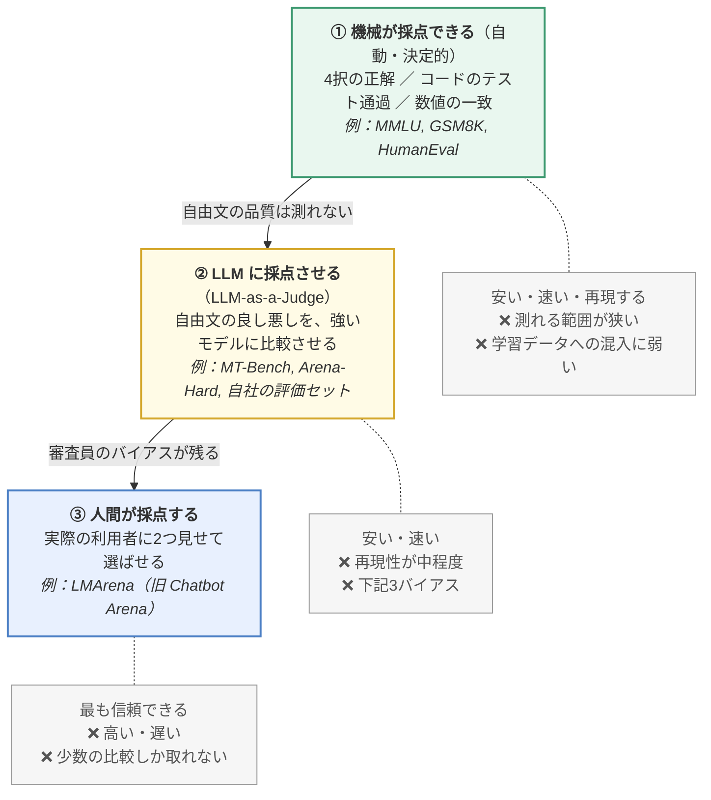
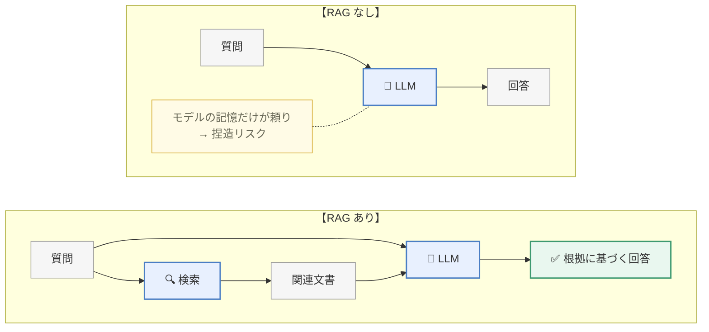
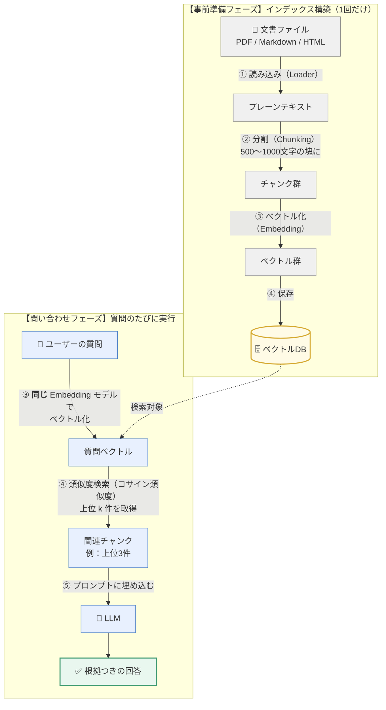
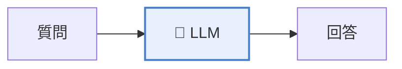
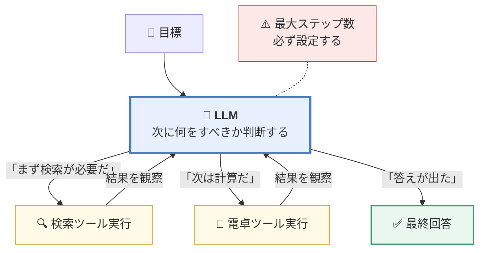
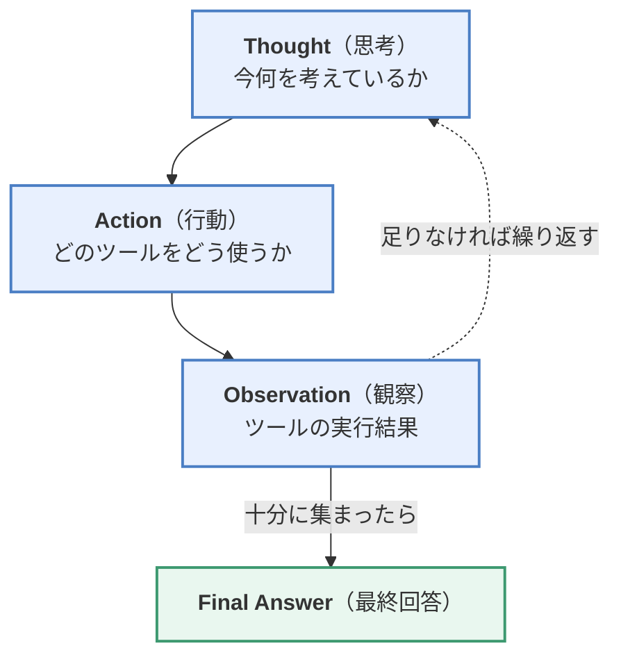
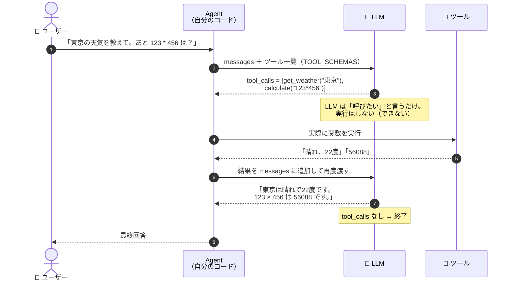

> **この章のゴール**：作った/選んだモデルを **測り**、**知識を補い**（RAG）、**道具を使わせる**（Agent）方法を理解する。

第6章までは「モデルを作る」話でした。ここからは「**作ったモデルを実際に役立てる**」話です。

---

## 7.1 LLM の評価（Evaluation）

### なぜ評価が難しいのか

従来の機械学習なら「正解率 92%」と一言で言えました。しかし LLM では、

- 出力が自由な文章なので、**正解が1つに定まらない**
- 「良い回答」の基準が用途によって違う（正確さ？親切さ？簡潔さ？）
- ベンチマークの問題が学習データに混入していることがある（**データ汚染 / Contamination**）

そこで、**複数のベンチマークを組み合わせて多角的に測る**のが標準です。

### 評価の3階層：何で採点するか

「LLM の評価」と一口に言っても、**採点者が誰か**で3つに分かれます。
自分がどれをやっているのかを意識しないと、数字の意味を読み間違えます。



> 🔑 **実務での組み立て方は「下から上」です。**
> ① で回帰テストのように毎回自動で測り（壊れていないことの確認）、
> ② で自分のタスクに近い自由文の質を測り、
> ③ は本当に重要な意思決定のときだけ使う。
>
> ⚠️ **① の数字だけで「うちのモデルは GPT-4 級」と言ってはいけません。**
> 4択に強いことと、実際に使って役に立つことは別の能力です
> （→ [04章の創発の図](https://zenn.dev/thirtypower/books/kgr-llm-guide/viewer/04-what-is-llm)で見た「指標次第で見え方が変わる」問題そのものです）。

### 7.1.1 主要な評価データセット

| ベンチマーク | 測るもの | 形式 |
|------------|---------|------|
| **MMLU** | 57分野（数学・法律・医学・歴史など）の総合知識 | 4択 |
| **MMLU-Pro** | MMLU の難化版 | 10択 |
| **GSM8K** | 小学生レベルの文章題（多段階の算術推論） | 記述 |
| **MATH** | 高校〜競技数学レベル | 記述 |
| **HumanEval** | Python のコード生成 | コード実行で判定 |
| **MBPP** | 基礎的なプログラミング | コード実行で判定 |
| **ARC-Challenge** | 科学的推論（小学校の理科の難問） | 4択 |
| **HellaSwag** | 常識推論（文の自然な続きを選ぶ） | 4択 |
| **GPQA** | 博士レベルの科学問題（Google 検索でも解けない難問） | 4択 |
| **BFCL** | 関数呼び出し（Function Calling）の正確さ | 実行判定 |
| **TruthfulQA** | 誤情報を鵜呑みにせず正直に答えるか | 選択/記述 |
| **LongBench / RULER** | 長文の理解能力 | 各種 |
| **JGLUE / llm-jp-eval** | **日本語**の総合能力 | 各種 |

> 🇯🇵 日本語モデルを評価するなら、**llm-jp-eval**、**JGLUE**、**Nejumi リーダーボード** が定番です。

> ⚠️ **重要：ベンチマークには「賞味期限」があります（2026年時点）**
>
> 上の表の古典的なベンチマークは、**上位モデルが 90〜95% を超えてしまい、
> もう差が付かなくなりました**（これを **飽和 / saturation** と言います）。
>
> | 状態 | ベンチマーク | 代わりに使うもの |
> |---|---|---|
> | **飽和** | MMLU、HumanEval、HellaSwag、GSM8K | MMLU-Pro、GPQA-Diamond、LiveCodeBench、AIME |
> | **現役** | GPQA-Diamond（博士級の科学）、**SWE-bench Verified**（実際の GitHub issue を直せるか）、**LiveCodeBench**（出題日で絞って汚染を避ける）、Arena（人間の投票）、RULER / LongBench（長文）、τ-bench・BFCL（ツール利用） | — |
>
> 🔑 **いま生き残っているベンチマークの共通点は3つ**です。
> 1. **汚染に強い**（問題を毎月入れ替える／モデルの学習期限より後の問題を使う）
> 2. **検証可能**（テストを実行して判定する。SWE-bench は実際にテストスイートを走らせます）
> 3. **長い作業を測る**（1問1答ではなく、複数ステップの遂行を測る）
>
> ⚠️ だから **「MMLU で 88点」という数字を見ても、2026年ではほぼ情報がありません。**
> 論文やモデルカードのスコアを読むときは、**まずそのベンチマークが飽和していないか**を
> 確認してください。そして最終的には——**自分のタスクで測る**以外に方法はありません。

### 7.1.2 主要なリーダーボード

| 名称 | 特徴 |
|------|------|
| **Open LLM Leaderboard**（Hugging Face） | オープンモデルの自動評価。複数ベンチの平均でランキング |
| **LMSYS Chatbot Arena** | **人間が2つの回答を見比べて投票**。Elo レーティングで順位化。最も実感に近いと言われる |
| **Nejumi LLM リーダーボード** | 日本語 LLM の総合評価（Weights & Biases） |

**Chatbot Arena が重視される理由**：自動ベンチマークは対策（過学習）されやすいのに対し、
人間の盲検比較は誤魔化しにくいためです。

### 7.1.3 分野特化のリーダーボード

| 分野 | ベンチマーク |
|------|------------|
| 金融 | CFBenchmark、FinBen |
| 法律 | LawBench |
| 医療 | MedBench、MedQA |
| 安全性 | Flames、SafetyBench |

### 評価の実務的なやり方

```python
# lm-evaluation-harness を使うのが標準
# pip install lm-eval
```

```bash
lm_eval --model hf \
        --model_args pretrained=./my_model \
        --tasks mmlu,gsm8k,hellaswag \
        --device cuda:0 --batch_size 8
```

**LLM-as-a-Judge（LLM を審査員にする）** もよく使われます。
GPT-4 などの強力なモデルに、2つの回答を比較採点させる方法です。
安価で高速ですが、代表的な**3つのバイアス**に注意が必要です：

1. **冗長性バイアス**：長く詳しそうな回答を、中身に関係なく高く評価しがち
2. **位置バイアス**：2つ並べて見せると、**先に提示された方**を選びやすい
   （対策として、順番を入れ替えて2回評価するのが定番）
3. **自己好みバイアス**：**自分と同系統のモデル**が生成した文体を好む傾向
   （GPT-4 に GPT-4 の出力を採点させると甘くなる）

---

## 7.2 RAG（検索拡張生成）

**RAG = Retrieval-Augmented Generation**

### 7.2.1 基本原理

> **回答を生成する前に、外部の文書データベースから関連情報を検索し、
> それをプロンプトに含めて回答させる。**



質問と検索結果の**両方**を LLM に渡すのがポイントです。

### 何が解決するのか

| 問題 | RAG による解決 |
|------|--------------|
| **ハルシネーション** | 実在する文書を根拠にするので捏造が減る |
| **知識が古い** | データベースを更新するだけで最新化。**再学習不要** |
| **社内情報を知らない** | 社内文書を入れれば即対応 |
| **出典が示せない** | どの文書を参照したか提示できる |

> 🔑 **RAG vs ファインチューニング、どちらを使うべきか**
> | | RAG | ファインチューニング |
> |---|---|---|
> | 知識の追加 | ◎ 得意 | △ 苦手（大量データが必要） |
> | 文体・形式の調整 | △ | ◎ 得意 |
> | 更新コスト | ◎ 文書を差し替えるだけ | ✗ 再学習が必要 |
> | 出典の提示 | ◎ できる | ✗ できない |
> | 推論コスト | △ プロンプトが長くなる | ◎ 変わらない |
>
> **「知識」は RAG、「振る舞い」はファインチューニング**、が原則です。併用も普通です。

### 7.2.2 RAG の構成要素（Tiny-RAG を作る）

RAG システムは5つの部品でできています。



> 🔑 **③ の Embedding モデルは、事前準備と問い合わせで必ず同じものを使います。**
> 違うモデルを使うとベクトル空間が別物になり、類似度検索が完全に無意味になります。
> RAG が「なぜか全く関係ない文書を拾ってくる」ときの典型的な原因です。

#### ① 文書の読み込み

```python
def read_file(path):
    if path.endswith('.pdf'):
        import PyPDF2
        with open(path, 'rb') as f:
            return "\n".join(p.extract_text() for p in PyPDF2.PdfReader(f).pages)
    elif path.endswith('.md') or path.endswith('.txt'):
        return open(path, encoding='utf-8').read()
```

#### ② チャンク分割

**RAG の品質を最も左右するパート**です。

```python
def split_text(text, chunk_size=600, overlap=100):
    chunks = []
    start = 0
    while start < len(text):
        chunks.append(text[start:start + chunk_size])
        start += chunk_size - overlap        # ★ 少し重ねる
    return chunks
```

**オーバーラップ（重なり）が重要**な理由を、具体例で見ます。

```
   元の文書（…600文字目のあたりを拡大…）

        … 当社の返品期限は | 商品到着後14日以内です。 …
                          ↑ ちょうど 600 文字目

  [A] オーバーラップなし（start += 600）
      chunk1 : [0 ─────────────── 600]  → 「…当社の返品期限は」で終わる
      chunk2 :                    [600 ─────────── 1200]
                                   → 「商品到着後14日以内です。」で始まる
      ❌ 「返品期限は何日か」で検索しても、
         chunk1 には日数が無く、chunk2 には「返品期限」の語が無い
         → どちらを引いても答えられない

  [B] オーバーラップ 100（start += 500）
      chunk1 : [0 ─────────────── 600]
      chunk2 :             [500 ──────────── 1100]
                            └─重なり100─┘
      ⭕ 分断された文が chunk2 の中に丸ごと入る
         → 「返品期限は商品到着後14日以内です」が1つのチャンクに収まる
```

> 🔑 **オーバーラップは「切れ目の事故」に対する保険**です。
> どこで切っても必ず何かが分断されるので、**分断された箇所を必ずもう一方に含める**、
> という力技で対処します（代償は「保存量が 100/500 ＝ 20% 増える」だけ）。

**チャンクの大きさは、そのまま精度のトレードオフになります。**

| | 小さいチャンク（200文字程度） | 大きいチャンク（1500文字程度） |
|---|---|---|
| 検索の精度 | ⭕ **1つの話題だけを含むので、ベクトルがぼやけない** | ❌ 複数の話題が混ざり、平均化されて特徴が薄まる |
| 答えるための文脈 | ❌ 前後が切れていて、LLM が意味を取れない | ⭕ 十分な文脈が付いてくる |
| 1回のプロンプトに入る数 | 多い（多様な情報を渡せる） | 少ない |
| 向く用途 | FAQ・定義・数値の引き当て | 手順書・議事録・経緯の説明 |

> 💡 **実務の定石**：まず `chunk_size=500〜800 / overlap=10〜20%` から始め、
> **自分の質問例20件で当たり外れを数える**。
> 「小さく切って検索し、当たったチャンクの前後を後から連結して LLM に渡す」
> （small-to-big / parent document retrieval）という折衷案が、現在の定番です。

**分割の戦略：**

| 方法 | 説明 |
|------|------|
| 固定長 | 単純。実装が楽 |
| **意味的な区切り** | 段落・見出し単位で切る。**品質が高い** |
| 再帰的分割 | `\n\n` → `\n` → `。` の順に、収まるまで細かく切る（LangChain の標準） |

#### ③ ベクトル化（Embedding）

文章を「意味を表すベクトル」に変換します。第1章の Word2Vec の発展形で、
**文全体**をベクトルにするモデル（多くは BERT 系）を使います。

> ⚠️ **「Embedding」という同じ言葉が、この教材で2回別の意味で出てきます。混同しないでください。**
>
> | | **トークンの埋め込み**（[02.5章 2.3.1](https://zenn.dev/thirtypower/books/kgr-llm-guide/viewer/025-transformer-block)） | **文の埋め込み**（この節） |
> |---|---|---|
> | 何をベクトルにする | **トークン1個** | **文・段落まるごと** |
> | 実体 | `nn.Embedding` ＝ 語彙数×次元の**参照テーブル** | BERT 系モデルを**1回実行した結果** |
> | 出てくるもの | トークンごとに1本（100トークンなら100本） | 入力全体で**1本だけ** |
> | 使う場所 | LLM の入口（内部の部品） | RAG の検索（外部で使う道具） |
>
> **RAG で必要なのは後者**——「この文書は何について書かれているか」を1本のベクトルで表したものです。
>
> 💡 **どうやってトークン100本を1本にまとめるのか**：主に2つの方式があります。
> ① 全トークンのベクトルの**平均を取る**（mean pooling。`e5` 系や `bge` 系はこちら）、
> ② [03章](https://zenn.dev/thirtypower/books/kgr-llm-guide/viewer/03-pretrained-models) で出た **`[CLS]` トークンの出力を使う**。
> どちらを使うかはモデルごとに決まっているので、**`sentence-transformers` に任せれば自動で正しい方**が使われます。
> （自分で BERT を直接呼ぶときは、この方式を間違えると精度が大きく落ちます）

```python
from sentence_transformers import SentenceTransformer

# 日本語なら intfloat/multilingual-e5-large などが定番
model = SentenceTransformer('intfloat/multilingual-e5-large')
vectors = model.encode(chunks, normalize_embeddings=True)
```

| 代表的な Embedding モデル | 備考 |
|------------------------|------|
| `intfloat/multilingual-e5-large` | 多言語（日本語も強い）、無料 |
| `BAAI/bge-m3` | 多言語、長文対応 |
| OpenAI `text-embedding-3-large` | API、高品質 |
| `cl-nagoya/ruri-large` | 日本語特化 |

#### ④ ベクトルデータベースと検索

```python
import numpy as np

class VectorStore:
    def __init__(self):
        self.vectors, self.texts = [], []

    def add(self, texts, vectors):
        self.texts.extend(texts)
        self.vectors.extend(vectors)

    def search(self, query_vec, k=3):
        # コサイン類似度（正規化済みなら内積と同じ）
        sims = np.dot(np.array(self.vectors), query_vec)
        top_idx = np.argsort(sims)[::-1][:k]
        return [self.texts[i] for i in top_idx]
```

**コサイン類似度**：2つのベクトルの「向きの近さ」。1に近いほど意味が似ています。

```
cos(A, B) = (A · B) / (|A| × |B|)
```

#### ★ 電卓で1回：検索は本当に「向きの比較」で当たるのか

実際の Embedding は768〜1024次元で中身が読めないので、
**「意味の軸」を4本だけに減らした説明用の空間**で、同じ計算を手で追います
（値は説明のために置いたものですが、**cos の計算は実際に計算した実数値**です）。

```
   4本の軸 ＝ [ 返品・交換 , 期限・日数 , 送料 , 会員登録 ]

   文書側（チャンク）
     C1「返品の受付は商品到着後14日以内です」  → [ 0.90 , 0.40 , 0.10 , 0.00 ]
     C2「送料は全国一律500円です」            → [ 0.05 , 0.10 , 0.95 , 0.00 ]
     C3「会員登録は無料です」                  → [ 0.00 , 0.05 , 0.00 , 0.98 ]
     C4「キャンペーンの応募期限は3月31日です」  → [ 0.00 , 0.90 , 0.00 , 0.10 ]
```

**質問①「返品はいつまで？」** → `[0.85, 0.50, 0.00, 0.00]`

| 相手 | 内積 | cos | 判定 |
|---|---|---|---|
| **C1 返品の期限** | 0.85×0.90 ＋ 0.50×0.40 ＝ 0.965 | **0.988** | ✅ 1位 |
| C4 応募期限 | 0.50×0.90 ＝ 0.450 | 0.504 | 2位 |
| C2 送料 | 0.093 | 0.098 | |
| C3 会員登録 | 0.025 | 0.026 | |

**質問②「買ったものをキャンセルしたい」** → `[0.88, 0.20, 0.00, 0.00]`

| 相手 | cos |
|---|---|
| **C1** | **0.976** ✅ |
| C4 | 0.220 |

> 🔑 **ここが「キーワード検索ではなくベクトル検索」の値打ちです。**
> 質問②と C1 は、**内容語が1つも重なっていません**
> （「キャンセル」「買った」 vs 「返品」「受付」「14日」）。
> それでも「**買ったものを手放す**」という向きが揃っているので、正しく引けます。
> **単語の一致だけを見る検索（BM25）では、この質問から C1 には辿り着けません。**
>
> 📝 逆に BM25 が強いのは「型番 `XR-2200` の在庫は？」のような、
> **表記が完全に一致する固有名詞**です。だから実務では両方を併用します
> （下の表の「ハイブリッド検索」）。

#### ⚠️ 逆に、ベクトル検索が外しやすい形の質問

**質問③「いつまでですか？」**（会話の2ターン目。主語が省略されている）→ `[0.05, 0.95, 0.00, 0.00]`

| 相手 | cos | |
|---|---|---|
| **C4 キャンペーンの応募期限** | **0.993** | ❌ **1位になってしまう** |
| C1 返品の期限 | 0.451 | 本当に欲しかったのはこちら |

> 🔑 **質問文に「何について」が書かれていないと、ベクトルは「期限」の方向しか向きません。**
> すると「期限の話をしている別の文書」が満点で当たります。
> **RAG が実運用で外す原因の第1位がこれ**——単発の質問では動くのに、
> 会話の2ターン目から急に精度が落ちる、という形で現れます。
>
> **対策は「検索する前に質問を書き直す」**ことです（下の表の「クエリ書き換え」）。
>
> ```
>    元の質問  : 「いつまでですか？」
>    会話履歴  : 「返品したいのですが」→（回答）→「いつまでですか？」
>    書き直し  : 「返品の受付期限はいつまでですか？」  ← これで検索する
> ```
>
> 📝 この例からもう1つ分かること：**チャンクの中に主題語を残す**のが大事です。
> 「14日以内です」だけのチャンクは、どんな質問でも引けません
> （→ 7.2.2 ② のオーバーラップと親子チャンクの話に繋がります）。

実務では専用の DB を使います：

| DB | 特徴 |
|----|------|
| **FAISS** | Meta 製。ローカル、高速、無料 |
| **Chroma** | 手軽、開発向け |
| **Qdrant / Milvus / Weaviate** | 本格的な運用向け |
| **pgvector** | PostgreSQL の拡張。既存 DB を活かせる |

#### ⑤ LLM に渡す

```python
RAG_PROMPT = """以下の参考文書だけを根拠にして、質問に答えてください。
参考文書に答えが書かれていない場合は、「文書からは判断できません」と答えてください。

===== 参考文書 =====
{context}
====================

質問: {question}

回答:"""

def answer(question, store, embed_model, llm):
    q_vec = embed_model.encode(question, normalize_embeddings=True)
    docs = store.search(q_vec, k=3)
    prompt = RAG_PROMPT.format(context="\n---\n".join(docs), question=question)
    return llm.chat(prompt)
```

ここで渡している `llm` は「プロンプトを投げると回答が返る何か」であれば
何でも構いません。OpenAI 互換 API を使う最小実装は次のとおりです。

> 📌 **先に読む場所**：下のコードの `localhost:8000` は、**自分で立てるローカルの LLM サーバ**です。
> **立て方は 7.3.3 の「🖥 ローカルに OpenAI 互換サーバを立てる2つの方法」にまとめてあります**
> （Ollama なら Windows でも数分）。手元で動かしたい人は先にそこを見てください。
> ここでは「LLM を呼ぶ部分は差し替え可能な部品である」ことだけ押さえれば十分です。

```python
from openai import OpenAI            # pip install openai

class SimpleLLM:
    def __init__(self, base_url="http://localhost:8000/v1", api_key="dummy",
                 model="Qwen/Qwen2.5-7B-Instruct"):
        self.client, self.model = OpenAI(base_url=base_url, api_key=api_key), model

    def chat(self, prompt: str) -> str:
        resp = self.client.chat.completions.create(
            model=self.model, messages=[{"role": "user", "content": prompt}])
        return resp.choices[0].message.content

llm = SimpleLLM()   # サーバの立て方は 7.3.3 の囲みを参照
```

> 📌 プロンプトで **「文書に無ければ無いと答えよ」** と明示するのが極めて重要です。
> これを書かないと、モデルは知ったかぶりをします。

### RAG の精度を上げる工夫

| 手法 | 内容 |
|------|------|
| **ハイブリッド検索** | ベクトル検索 + キーワード検索（BM25）を併用。固有名詞に強くなる |
| **リランキング（Rerank）** | 上位20件を取り、Cross-Encoder で精査して上位3件に絞る |
| **クエリ書き換え** | 曖昧な質問を LLM に検索用に書き直させる |
| **HyDE** | 質問から「仮の回答」を生成し、それで検索する |
| **親子チャンク** | 検索は小さいチャンクで、LLM に渡すのは前後を含む大きい塊で |
| **メタデータフィルタ** | 日付・部署などで検索範囲を絞る |

---

## 7.3 Agent（エージェント）

### 7.3.1 LLM Agent とは

> **LLM を「頭脳」として、目標を理解し、計画を立て、
> 外部ツールを使いながら、自律的にタスクを遂行するシステム。**

普通の LLM 利用との違い：

**普通の LLM** は1回のやり取りで終わりです。



**Agent** は、自分で「次に何をすべきか」を判断しながらループを回します。



Agent の4つの構成要素：

| 要素 | 役割 |
|------|------|
| **計画（Planning）** | 目標をサブタスクに分解し、順序を決める |
| **記憶（Memory）** | 短期記憶（会話履歴）と長期記憶（ベクトルDB） |
| **ツール（Tools）** | 検索・電卓・コード実行・API 呼び出し |
| **省察（Reflection）** | 結果を検証し、失敗したらやり直す |

### 7.3.2 Agent の種類

| タイプ | 説明 |
|--------|------|
| **タスク特化型** | 特定の業務に絞った Agent（顧客対応、コードレビューなど） |
| **推論・計画型** | ReAct、Plan-and-Execute など、汎用的な思考フレームワーク |
| **マルチエージェント** | 複数の役割（PM・エンジニア・レビュアー）が協調（MetaGPT、AutoGen、CrewAI） |
| **探索学習型** | 環境との相互作用から学習して改善する（Voyager など） |

### ReAct フレームワーク（最も基本かつ重要）

**ReAct = Reasoning（推論）+ Acting（行動）**



実例：

```
質問: 「2024年のノーベル物理学賞受賞者の年齢の合計は？」

Thought: 受賞者が誰か知らないので、まず検索する必要がある。
Action: search("2024 ノーベル物理学賞 受賞者")
Observation: ジョン・ホップフィールド氏とジェフリー・ヒントン氏

Thought: 2人の生年を調べる必要がある。
Action: search("John Hopfield 生年 Geoffrey Hinton 生年")
Observation: Hopfield 1933年生、Hinton 1947年生

Thought: 2024年時点の年齢を計算する。
Action: calculate("(2024-1933) + (2024-1947)")
Observation: 168

Thought: 答えが出た。
Final Answer: 約168歳です（91歳と77歳の合計）。
```

**ReAct が優れている点**：思考を明示させることで、
①精度が上がる、②どこで間違えたか追跡できる、という2つの利点があります。

### 7.3.3 Tiny-Agent を作る

#### ① ツールを定義する

```python
import json

def get_weather(city: str) -> str:
    """指定した都市の天気を取得する"""
    return f"{city}の天気は晴れ、気温は22度です。"

def calculate(expression: str) -> str:
    """数式を計算する"""
    try:
        return str(eval(expression))     # ⚠ 実運用では eval は危険。専用パーサを使うこと
    except Exception as e:
        return f"計算エラー: {e}"

TOOLS = {"get_weather": get_weather, "calculate": calculate}

# LLM に渡すツールの説明（JSON Schema 形式）
TOOL_SCHEMAS = [
    {
        "type": "function",
        "function": {
            "name": "get_weather",
            "description": "指定した都市の現在の天気を取得します",
            "parameters": {
                "type": "object",
                "properties": {
                    "city": {"type": "string", "description": "都市名（例：東京）"}
                },
                "required": ["city"],
            },
        },
    },
    {
        "type": "function",
        "function": {
            "name": "calculate",
            "description": "数式を計算します",
            "parameters": {
                "type": "object",
                "properties": {
                    "expression": {"type": "string", "description": "例: 2 * (3 + 4)"}
                },
                "required": ["expression"],
            },
        },
    },
]
```

#### ② Agent のループ

その前に、**接続先の LLM サーバを用意する**必要があります（下のコードの `localhost:8000` の正体）。
クライアント側は `pip install openai` も忘れずに。

> 🖥 **ローカルに OpenAI 互換サーバを立てる2つの方法**
>
> **方法A：vLLM**（Linux / WSL2、GPU 16GB 以上推奨）
> ```bash
> pip install vllm
> vllm serve Qwen/Qwen2.5-7B-Instruct        # http://localhost:8000/v1 で待ち受け
> ```
> VRAM が足りなければ `Qwen/Qwen2.5-1.5B-Instruct` などに下げてください。
>
> **方法B：Ollama**（Windows / macOS / Linux 対応。**より手軽でまずはこちら推奨**）
> [ollama.com](https://ollama.com/) からインストーラを入れて：
> ```bash
> ollama pull qwen2.5:7b          # 初回のみ（VRAM 8GB〜。厳しければ qwen2.5:1.5b）
> ollama serve                    # 常駐していれば不要
> ```
> Ollama は OpenAI 互換エンドポイントを **`http://localhost:11434/v1`** で公開するので、
> 下のコードの `base_url` をこれに差し替え、`model="qwen2.5:7b"` とすれば動きます。
>
> ⚠️ なお、**5章で自作した 215M モデルは Function Calling を学習していないため、
> この Agent の頭脳には使えません**。ツール呼び出し対応の公開モデルを使ってください。

```python
from openai import OpenAI          # pip install openai

class TinyAgent:
    def __init__(self, base_url, api_key, model="Qwen/Qwen2.5-7B-Instruct"):
        self.client = OpenAI(base_url=base_url, api_key=api_key)
        self.model = model
        self.messages = [{"role": "system", "content": "あなたは道具を使えるアシスタントです。"}]

    def run(self, user_input, max_steps=10):
        self.messages.append({"role": "user", "content": user_input})

        for step in range(max_steps):
            # ① LLM に問い合わせ（ツール一覧つき）
            resp = self.client.chat.completions.create(
                model=self.model,
                messages=self.messages,
                tools=TOOL_SCHEMAS,
            )
            msg = resp.choices[0].message
            self.messages.append(msg)

            # ② ツール呼び出しが無ければ完了
            if not msg.tool_calls:
                return msg.content

            # ③ 要求されたツールを実行
            for call in msg.tool_calls:
                fn_name = call.function.name
                fn_args = json.loads(call.function.arguments)
                result = TOOLS[fn_name](**fn_args)
                print(f"  [Tool] {fn_name}({fn_args}) → {result}")

                # ④ 結果を会話履歴に戻す
                self.messages.append({
                    "role": "tool",
                    "tool_call_id": call.id,
                    "content": str(result),
                })
            # ⑤ ループの先頭に戻り、LLM が次の判断をする

        return "最大ステップ数に達しました。"

# vLLM の場合（model 名は serve に渡した ID と同じにする）
agent = TinyAgent(base_url="http://localhost:8000/v1", api_key="dummy")
# Ollama の場合はこちら：
# agent = TinyAgent(base_url="http://localhost:11434/v1", api_key="dummy", model="qwen2.5:7b")
print(agent.run("東京の天気を教えて。あと 123 * 456 は？"))
```

#### 動作の流れ



> 🔑 **重要な誤解ポイント**：LLM は**ツールを実行しません**。
> 「この関数をこの引数で呼んでほしい」という **JSON を出力するだけ**です。
> 実際に関数を呼ぶのは、あなたが書いた Agent 側のコードです。
> だから**セキュリティの責任は完全に実装側にあります**。

**Function Calling（関数呼び出し）** は、
モデルが「どのツールを、どんな引数で呼ぶべきか」を JSON で出力する仕組みです。
これに対応したモデル（GPT-4、Claude、Qwen2.5、Llama-3.1 など）が必要です。

### Agent 実装の注意点

| 注意点 | 対策 |
|--------|------|
| **無限ループ** | 最大ステップ数を必ず設定する |
| **コスト暴走** | ステップごとに全履歴を送るのでトークン消費が急増。上限を設ける |
| **セキュリティ** | `eval` やシェル実行は極めて危険。**サンドボックスで隔離**する |
| **ツールが多すぎる** | 20個を超えると選択精度が落ちる。階層化するか絞り込む |
| **エラー処理** | ツールが失敗したときのメッセージも LLM に返して、やり直させる |

> 💡 **MCP（Model Context Protocol）**：ツール接続を標準化するプロトコル。
> 各社のツールを共通の方法で LLM に繋げられるため、近年急速に普及しています。

> ⚠️ **Agent は「トークンを最も食う使い方」です。**
> ステップごとに全履歴を送り直すので、消費は会話の**2乗**に近い勢いで増えます。
> **「Agent が遅い・高い」の対策は、Agent の設計ではなく推論の最適化側にある**
> ことがよくあります（プロンプトキャッシュが効くかどうかで費用が数倍変わります）。
> → **[07.5章 推論を速くする](https://zenn.dev/thirtypower/books/kgr-llm-guide/viewer/075-fast-inference)**

### 主要な Agent フレームワーク

| 名前 | 特徴 |
|------|------|
| **LangChain / LangGraph** | 最も普及。グラフでワークフローを定義できる |
| **LlamaIndex** | RAG に強い |
| **AutoGen**（Microsoft） | マルチエージェント会話 |
| **CrewAI** | 役割ベースのチーム編成が直感的 |
| **Claude Agent SDK** | Anthropic 公式の Agent 構築キット |

---

## この章のまとめ

- **評価**：単一の指標では測れない。MMLU（知識）・GSM8K（推論）・HumanEval（コード）等を組み合わせ、
  最終的には **Chatbot Arena のような人間評価**や実タスクでの検証が重要
- **RAG**：検索 → プロンプトに注入 → 生成。**ハルシネーション対策と知識更新の主力**
  - 構成要素：読み込み → **チャンク分割** → Embedding → ベクトルDB → 検索 → 生成
  - 品質を左右するのは **チャンク分割** と **検索の精度**（ハイブリッド検索・リランキング）
  - 「知識」は RAG、「振る舞い」はファインチューニング
- **Agent**：LLM を頭脳に、**計画・記憶・ツール・省察**でタスクを自律遂行
  - 基本形は **ReAct**（Thought → Action → Observation のループ）
  - 実装は「LLM に聞く → ツール実行 → 結果を返す」のループを回すだけ
  - 無限ループ・コスト・セキュリティに必ずガードを入れる

## 理解度チェック

1. 自動ベンチマークだけで LLM を評価するのが危険なのはなぜですか？
2. RAG とファインチューニングは、それぞれどんな課題に向いていますか？
3. チャンク分割でオーバーラップを設けるのはなぜですか？
4. ReAct の3つのステップを言えますか？
5. Agent に必ず最大ステップ数を設定すべき理由は？
6. RAG のプロンプトに「文書に無ければ無いと答えよ」と書くのが重要なのはなぜですか？
7. LLM-as-a-Judge を使うときに注意すべきバイアスは何ですか？

<details>
<summary><b>▶ 解答を見る</b></summary>

1. 主な理由は2つです。
   - **データ汚染（Contamination）**：ベンチマークの問題が学習データに混入していることがあり、
     その場合は「解いた」のではなく「覚えていた」だけになります
   - **ベンチマーク対策（過学習）**：スコアを上げるためにベンチマーク向けの最適化が可能で、
     実際の使い勝手と乖離します

   加えて、LLM の出力は自由な文章なので**正解が1つに定まらず**、
   自動採点そのものに限界があります。だから **Chatbot Arena のような人間の盲検比較**や、
   実タスクでの検証が重視されます。
2. **「知識」は RAG、「振る舞い」はファインチューニング**が原則です。

   | 課題 | 向いている手段 |
   |------|--------------|
   | 社内文書・最新情報などの知識を足したい | **RAG**（文書を差し替えるだけ、再学習不要、出典も出せる） |
   | 文体・出力形式・口調を変えたい | **ファインチューニング**（RAG では制御しにくい） |
   | 頻繁に更新される情報を扱いたい | **RAG**（ファインチューニングは都度再学習が必要） |
   | 推論コストを抑えたい | **ファインチューニング**（RAG はプロンプトが長くなる） |

   実務では**併用が普通**です。
3. **切れ目に重要な文がまたがると、どちらのチャンクでも意味が通らなくなるから**です。
   例えば「この制度の適用条件は」でチャンクが切れると、
   前半チャンクには条件が入らず、後半チャンクには何の条件か分かる文脈が無くなります。
   少し重ねておくことで、どちらか一方のチャンクには意味の通る形で含まれるようにします。
4. **Thought（思考）→ Action（行動）→ Observation（観察）** です。これを繰り返し、
   最後に Final Answer（最終回答）を出します。
   思考を明示させることで、①精度が上がる、②どこで間違えたか追跡できる、という利点があります。
5. **無限ループを防ぐため**です。Agent は「まだ情報が足りない」と判断し続けると
   永久にツールを呼び続けます。さらに深刻なのが**コスト面**で、
   Agent はステップごとに**全履歴を再送信**するため、トークン消費が急激に膨らみます。
   ステップ上限は、暴走による事故（時間・料金の両方）を止める最後の砦です。
6. **書かないとモデルが知ったかぶりをするから**です。
   LLM は「事実かどうか」ではなく「もっともらしい単語の並びかどうか」で出力を選ぶため、
   検索で適切な文書が取れなかった場合でも、**それらしい回答を捏造してしまいます**。
   RAG を導入する目的そのもの（ハルシネーション対策）が損なわれるので、
   「文書からは判断できません」と答えてよいことを明示的に許可する必要があります。
7. **冗長な回答を高く評価してしまうバイアス**が代表的です。
   ほかにも、**提示順による偏り**（先に見せた方を選びやすい）、
   **自分と同じモデルが生成した文章を好む傾向**などが報告されています。
   安価で高速なので実務では広く使われますが、
   重要な判断では人間の評価や実タスクでの検証と組み合わせるべきです。

</details>

---

**次へ** → **[07.5. 推論を速くする](https://zenn.dev/thirtypower/books/kgr-llm-guide/viewer/075-fast-inference)**（作ったものを実運用に乗せる話）
／ 理論を進めるなら → [08. 大規模モデルの強化学習](https://zenn.dev/thirtypower/books/kgr-llm-guide/viewer/08-reinforcement-learning)
