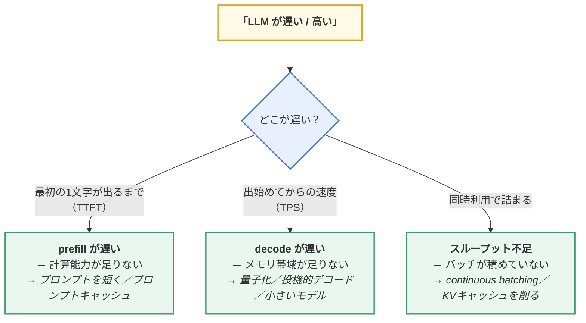
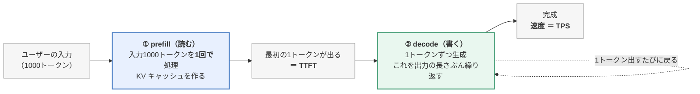
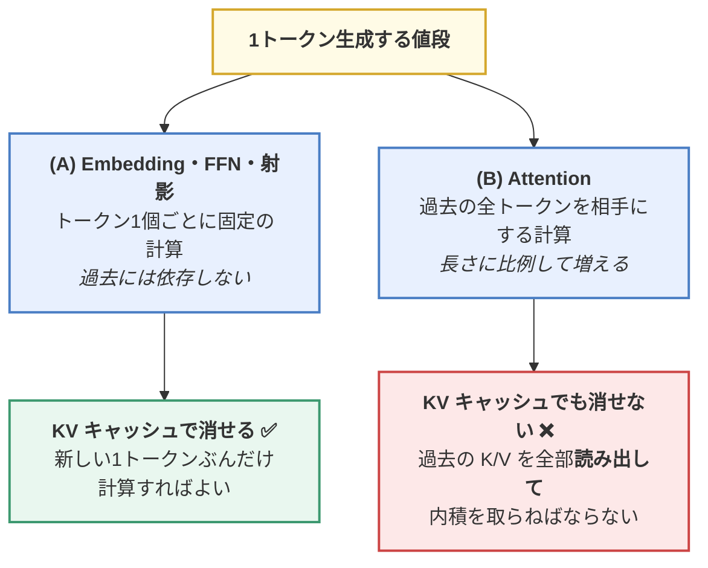
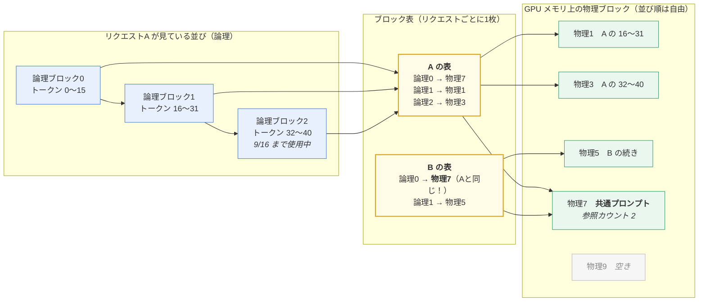
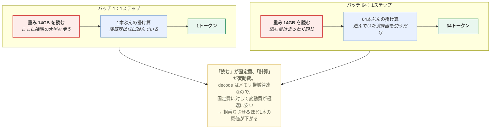
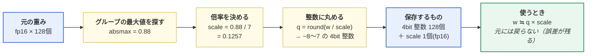
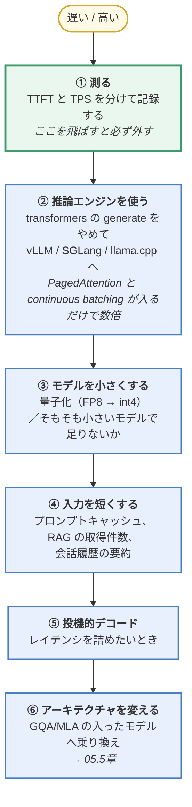

> この章は、**「作ったモデルを実際に使う」ときに必ずぶつかる速度と費用**を扱う補講です。
> **この章のゴール**：LLM が遅い・高いときに、**どこが遅いのかを切り分けて、
> どの手を打つべきかを選べる**ようになる。
>
> 📎 **対応コード**：[`code/09_inference.py`](https://github.com/thirtypower/kgr-llm/blob/main/code/09_inference.py)
> **CPU だけで動きます**（速度の実測 約20秒、`--quant` 付きで約1分）。
>
> ```bash
> cd code
> python 09_inference.py            # KV キャッシュ・バッチの実測
> python 09_inference.py --quant    # 量子化で品質がどう落ちるかまで測る
> ```

---

## なぜこの章があるのか

ここまでの章は全部「**モデルを作る**」話でした。しかし——

> **実務でかかる費用と時間の大半は、学習ではなく推論（inference）です。**

事前学習は1回払えば終わりますが、推論は**ユーザーが使うたびに永久に払い続けます**。
04章 4.2.1 で「業界が Chinchilla を超えて学習するのは推論コストのため」と書いたのも、
05.5章で GQA / MLA / MoE が全部入っている理由も、根っこはここです。

そして、この領域には**知っているかどうかで10倍以上変わる**知識が集まっています。



**この図を自分で描けるようになるのが、この章のゴールです。**

---

## 7.5.1 推論は「まったく性質の違う2つの処理」でできている

まずこれを分けないと、何も議論できません。



| | **prefill（読む）** | **decode（書く）** |
|---|---|---|
| 何をする | 入力プロンプト全体を1回で処理 | 1トークンずつ生成 |
| 行列積の形 | 大きい行列 × 行列（1000×768 など） | **1行 × 行列**（1×768）——極端に細長い |
| 律速するもの | **計算能力**（compute bound） | **メモリ帯域**（memory bound） |
| 効く指標 | **TTFT**（最初の1文字までの待ち時間） | **TPS**（1秒あたり何トークン出るか） |
| 効く対策 | プロンプトを短く／プロンプトキャッシュ | 量子化／投機的デコード／バッチ |

> 🔑 **decode がメモリ帯域律速、というのがこの章の一番大事な事実です。**
>
> 1トークン生成するには、**モデルの（MoE なら活性ぶんの）パラメータを
> メモリから読み出して1回掛け算する**必要があります。7B・bf16 なら 14GB を読みます。
> 一方、計算量は「14GB ぶんの数値 × 1トークン」だけ。
> つまり **「大量に読んで、ちょっとだけ計算する」** ——
> 演算器は暇で、**メモリからの読み出しが渋滞している**状態です。
>
> **ここから2つの結論が自動的に出ます。**
> 1. **重みを小さくすれば速くなる**（量子化）——読む量が減るから
> 2. **バッチを増やしてもほとんど遅くならない**（同じ重みを読んで全員ぶん計算できるから）

---

## 7.5.2 KV キャッシュ：消せるものと、消せないもの

### まず「壊れていないこと」を確かめる

02.7章の検査5 の再確認です。最適化を入れたら、**速さを測る前に一致を測ります**。

```
    キャッシュなしの出力 == キャッシュありの出力 : True
    [OK] 一致しました。
```

貪欲法（argmax）で生成すれば結果は決定的なので、完全一致するはずです。
一致しないときの原因は**ほぼ位置のずれ**です（→ 05章 5.1.7 の `start_pos`）。

### 何を節約しているのか（数え上げで正確に言う）

`python 09_inference.py` の STEP 1 の実出力です。

```
      条件: すでに 1024 トークンある状態から、さらに 32 トークン生成

      キャッシュなし :  33,264 トークンぶんを forward
                      （1024+1025+…+1055 と毎回作り直すため）
      キャッシュあり :   1,056 トークンぶんを forward
                      （最初の 1024 は 1 回だけ。以降は 1 トークンずつ）

                      → 無駄な計算は 約 32 倍
```

> 🔑 この比は**モデルの大きさにも GPU にも依存しない、純粋な数え上げ**です。
> 本物の LLM（数千トークンの入力に数千トークン生成）では**数百〜数千倍**になります。
> だから KV キャッシュは「あると速い」ではなく「**ないと実用にならない**」機能です。

### ★ ここが盲点：キャッシュを入れても「1トークンの値段」は一定にならない

多くの解説が「KV キャッシュを入れれば毎回1トークンぶんの計算で済む」で終わります。
**それは半分だけ本当です。** 実測してみます（STEP 2）。

```
      すでに書いた長さ |  キャッシュなし  |  キャッシュあり  |  差
      -----------------+------------------+------------------+------
                 32 tok |      7.32 ms    |      6.57 ms    |  1.1x
                128 tok |      7.19 ms    |      6.83 ms    |  1.1x
                512 tok |     10.07 ms    |      8.82 ms    |  1.1x
               1024 tok |     24.55 ms    |     15.01 ms    |  1.6x
               1900 tok |     61.67 ms    |     29.83 ms    |  2.1x
```

**キャッシュありでも、長くなるほど遅くなっています。** 理由を分解します。



> 🔑 **KV キャッシュが消せるのは (A) だけ。(B) は原理的に消せません。**
> 新しいトークンは、過去の全トークンとの関連度を計算しなければならない——
> それは 02章の Attention の定義そのものだからです。
> しかも計算を省いても、**過去の K と V をメモリから読み出す**必要は残ります。
>
> だから **長い文脈は、キャッシュを入れても高いままです。**
> そして「(B) をどう安くするか」が、[05.5章](https://zenn.dev/thirtypower/books/kgr-llm-guide/viewer/055-moe-modern-arch) で見た
> **GQA / MLA（読む量を減らす）** と
> **sliding window / 線形 Attention（相手の数を減らす）** の動機です。
> **上の表の右列の伸びが、あの技術群が生まれた理由そのものです。**

---

## 7.5.3 KV キャッシュのメモリと PagedAttention

### まず、どれくらい食うのか

```
   KV キャッシュのバイト数
     = 2（K と V）× 層数 × KVヘッド数 × head_dim × トークン数 × 1要素のバイト数
```

LLaMA-2 7B 相当（層32 / head_dim 128 / bf16）で計算した実出力です（STEP 5）。

```
      文脈長    |  MHA(32組)  |  GQA(8組)  |  MQA(1組)
      ----------+-------------+------------+-----------
         2,048 |     1.00 GB |    0.25 GB |   0.03 GB
         8,192 |     4.00 GB |    1.00 GB |   0.12 GB
        32,768 |    16.00 GB |    4.00 GB |   0.50 GB
       131,072 |    64.00 GB |   16.00 GB |   2.00 GB
```

> 🔑 **モデル本体は bf16 で約 14GB。128K の MHA では、1人ぶんのキャッシュが
> モデル本体の4倍以上**になります。
> しかもこれが**同時利用者の人数ぶん**必要です。
>
> つまり——**「同時に何人さばけるか」は、ほぼ「KV キャッシュを何本置けるか」で決まります。**
> GPU メモリの残りを KV キャッシュの1本ぶんで割った数が、実質的な同時接続数の上限です。

### PagedAttention：メモリの「断片化」をなくす

素朴に実装すると、リクエストごとに「最大長ぶんのキャッシュ置き場」を
連続領域で予約することになります。しかし——

```
   予約: 4096 トークンぶん  ■■■■■■■■■■■■■■■■
   実際: 300 トークンで終わった  ■■□□□□□□□□□□□□□□
                                  ↑ 93% が無駄
```

**vLLM が導入した PagedAttention** は、これを OS の仮想メモリと同じ発想で解決します。

| | 素朴な実装 | PagedAttention |
|---|---|---|
| 置き場の確保 | リクエストごとに最大長を**連続領域で予約** | **小さなブロック（例:16トークン）に分割**して、空いている所へバラバラに置く |
| 対応表 | 不要 | 「論理位置 → 物理ブロック」のブロック表を持つ |
| 無駄 | 予約したのに使わない領域が大量に出る | **最後のブロックの端だけ**（報告値で 4% 未満） |
| おまけ | — | **同じプロンプトのブロックを複数リクエストで共有できる** |

**「ブロック表で辻褄を合わせる」の中身**を1枚にします。



> 🔑 **OS のページングとまったく同じ仕組み**です（名前もそこから来ています）。
> 「連続領域を予約するのをやめ、ブロック単位で貸し出して対応表で辻褄を合わせる」。
> これだけでさばける同時リクエスト数が数倍になります。

この図から、実務で効く性質が3つ読み取れます。

| 性質 | どういうことか | どこで効くか |
|---|---|---|
| **必要になってから確保する** | 論理ブロック2 が埋まってから、初めて次の物理ブロックを取る | 「最大長を予約」しないので、短い応答でメモリを無駄にしない |
| **物理ブロックを共有できる** | 同じプロンプト（システムプロンプト等）は物理7 を**1本だけ**持つ | 全員に同じ長い指示を渡す業務用途で劇的に効く。7.5.7 のプロンプトキャッシュの土台 |
| **書き込む瞬間に分岐させる**（Copy-on-Write） | 共有ブロックに追記が必要になった側だけコピーを作る | 1つのプロンプトから n 個の候補を出す（`n=4` の並列サンプリング）が安く済む |

### continuous batching：バッチの区切りをなくす

もう1つ、実運用で効くのがこれです。

```
【素朴なバッチ処理】
   4件を集めて一斉にスタート → 一番長い1件が終わるまで、他の3枠は空席のまま待つ
      req1  ■■■□□□□□□□□      ← 早く終わったのに枠が空かない
      req2  ■■■■■■■■■■■
      req3  ■■□□□□□□□□□
      req4  ■■■■□□□□□□□

【continuous batching】
   1トークン進めるたびに、終わった枠へ次の待ち行列を差し込む
      req1  ■■■|req5 ■■■■■■■   ← 空いた瞬間に次が入る
      req2  ■■■■■■■■■■■
      req3  ■■|req6 ■■■■■■■■
      req4  ■■■■|req7 ■■■■■■
```

> 🔑 **decode は「1トークンずつ」進む処理なので、1トークンの区切りで
> バッチの中身を入れ替えられます**。これが LLM 特有の面白いところで、
> **リクエスト単位ではなく反復単位でバッチを組む**（iteration-level scheduling）と呼ばれます。
> vLLM や SGLang が標準で持っている機能で、GPU の稼働率が大きく上がります。

---

## 7.5.4 バッチとスループット：レイテンシとの取引

7.5.1 の「decode はメモリ帯域律速」から予測されることを実測します（STEP 3）。

```
      バッチ |  1ステップの時間  |  スループット   |  1本あたりの値段
      -------+-------------------+-----------------+------------------
          1  |        7.27 ms   |       138 tok/s |  1.00 倍
          4  |        7.55 ms   |       530 tok/s |  1.04 倍
         16  |        7.72 ms   |      2072 tok/s |  1.06 倍
         64  |        8.86 ms   |      7221 tok/s |  1.22 倍
```

**バッチを64倍にしても、1ステップの時間は 1.2 倍しか増えていません。**
つまり1本あたりのコストは約 **50分の1**、スループットは約 **52倍**です。

**なぜこんな都合のいいことが起きるのか**を絵にすると、こうなります。



> 📝 **どこまでも下がるわけではありません。**
> バッチを増やし続けると、やがて演算器が埋まって「計算能力律速」に切り替わります。
> そこから先は **バッチ N 倍 ＝ 時間 N 倍** になり、1本あたりの原価は下がりません。
> 実運用では、その手前（GPU の稼働率が飽和する直前）が最適点になります。

> 🔑 **これが「LLM API が自分で動かすより安い」最大の理由です。**
> 事業者は世界中からのリクエストを1つのバッチに詰め込めるので、
> **1トークンの原価がまるで違います**。
>
> 📝 上の実測は CPU なので、伸びの内訳は GPU と違います
> （CPU では固定オーバーヘッドの寄与が大きい）。
> ただし **「バッチを N 倍にしても時間は N 倍にならない」という結論は同じ**で、
> GPU ではその理由が「decode がメモリ帯域律速だから」になります。

### ⚠️ ただし、タダではありません

| バッチを増やすと | どうなるか |
|---|---|
| **スループット**（全体で1秒に何トークン） | ⭕ 大幅に上がる |
| **レイテンシ**（1人が体感する速さ） | ❌ **少しずつ悪化する** |
| **KV キャッシュのメモリ** | ❌ **人数分だけ必要**（ここが実際の上限） |

> 🔑 **「速い」には2つの意味があり、両方を同時に最大化はできません。**
>
> | 目的 | 最適化する対象 | 打ち手 |
> |---|---|---|
> | 対話UI（人が待っている） | **レイテンシ**（TTFT / TPS） | バッチを小さく、投機的デコード、小さいモデル |
> | バッチ処理（大量の文書を夜間に処理） | **スループット** | バッチを最大まで大きく |
>
> 自分がどちらを最適化しているのかを最初に決めないと、施策が矛盾します。

---

## 7.5.5 量子化：重みを小さくする

7.5.1 の結論①「重みを小さくすれば decode が速くなる」の実践です。
そして**モデルが載るかどうか**も、そのまま量子化で決まります。

### そもそも量子化は何をしているのか（3行で）

**なめらかな数直線を、決まった段数の階段に置き換えているだけ**です。
4bit なら段数は 2⁴ = 16 段しかありません。

```
   元の重み（fp16：実質なめらか）
   ────────●────●──●─────────●────────●──────●──→
   
   4bit（16段の階段しか無い。近い段に丸める）
   ─┬──┬──┬──┬──┬──┬──┬──┬──┬──┬──┬──┬──┬──┬──┬──┬─
   -8 -7 -6 -5 -4 -3 -2 -1  0  1  2  3  4  5  6  7
```

問題は「16段をどこに置くか」です。重みの大きさは層ごと・行ごとに全然違うので、
**重みを小さなグループ（例：128個）に区切り、グループごとに倍率（scale）を持ちます**。



8個で実際に計算した結果です（`scale = 0.1257`）。

```
   元の重み  | +0.10  -0.35  +0.88  -0.02  +0.44  -0.71  +0.05  +0.20
   4bit 整数 |   +1     -3     +7      0     +4     -6      0     +2
   戻した値  | +0.126 -0.377 +0.880 +0.000 +0.503 -0.754 +0.000 +0.251
   誤差      |  0.026  0.027  0.000  0.020  0.063  0.044  0.050  0.051
                                                   ↑ 最大でも 0.063 なら実用範囲
```

### ⚠️ グループに1個だけ「外れ値」が混ざると崩れる

同じグループの4番目だけを `+9.00` に変えて、まったく同じ計算をします。

```
   元の重み  | +0.10  -0.35  +0.88  +9.00  +0.44  -0.71  +0.05  +0.20
   4bit 整数 |    0      0     +1     +7      0     -1      0      0
   戻した値  | +0.000 +0.000 +1.286 +9.000 +0.000 -1.286 +0.000 +0.000
   誤差      |  0.100  0.350  0.406  0.000  0.440  0.576  0.050  0.200
                ↑ 8個のうち5個が「0」に潰れた（scale が 10倍に広がったせい）
```

> 🔑 **量子化の研究がほぼ全部「外れ値との戦い」なのは、これが理由です。**
> LLM の活性値・重みには**ごく少数の極端に大きい成分**があり、
> そこに合わせて階段を作ると、残りの大多数が 0 に潰れます。
>
> | 手法 | 外れ値への対処 |
> |---|---|
> | **グループを小さくする**（128 → 64 → 32） | 外れ値の影響を近所だけに閉じ込める。ただし scale の個数が増える |
> | **AWQ** | 「活性値が大きい列 ＝ 重要」と見て、**その重みだけ精度を守る** |
> | **GPTQ** | 丸め誤差を、**まだ量子化していない後ろの重みに押し付けて**補正する |
> | **NF4**（QLoRA） | 重みが正規分布に従うことを前提に、**段の間隔を等間隔にしない** |

> 📝 **「4bit モデル」は 1パラメータ 0.5 バイトぴったりにはなりません。**
> グループごとの scale を別に持つためです。
> 128個ごとに fp16 の scale を1個持つなら `4 + 16/128 = 4.125 bit/重み`。
> `Q4_K_M` のような名前に細かい区別があるのは、この「余分な帳簿」の持ち方の違いです。

### 実測：どこで壊れるのか

`python 09_inference.py --quant` の実出力です（02.7章のモデル。理論下限 0.6827）。

```
      精度      |  val loss  |  文法正答率  |  モデルの大きさ
      ----------+------------+--------------+-----------------
      fp32(元)  |   0.6947   |    88.3%     |   1.00 倍
       8 bit    |   0.6955   |    88.3%     |   0.25 倍
       6 bit    |   0.6955   |    88.3%     |   0.19 倍
       4 bit    |   0.6959   |    86.9%     |   0.12 倍
       3 bit    |   0.6956   |    93.0%     |   0.09 倍
       2 bit    |   0.7469   |    46.4%     |   0.06 倍
```

> 🔑 **読み方の要点は2つです。**
>
> 1. **じわじわ悪くなるのではなく、崖がある。** ある bit 数まではほぼ無料で、
>    そこを割ると急に落ちます。
> 2. **loss の悪化はごくわずかでも、正答率は半分に落ちている**（2bit の行）。
>    → **loss だけ見て「まだ大丈夫」と判断してはいけません。**
>    量子化の可否は、**必ず自分のタスクの指標で**測ってください。
>
> ⚠️ **この表を「4bit でも 3bit でも無料」と読まないでください。**
> ここでの課題は 180通りの文型を覚えるだけで、モデルには余裕がありすぎます
> （正答率の ±数% は生成のサンプリング誤差です）。
> 本物の LLM では崖がもっと手前に来ます。

### 実務での目安（報告されている傾向）

| 精度 | 品質 | 使いどころ |
|------|------|-----------|
| **bf16 / fp16**（2バイト） | 基準 | 学習、品質最優先の推論 |
| **FP8 / int8**（1バイト） | ほぼ劣化なし | **本番の標準**。新しい GPU なら FP8 が速くて綺麗 |
| **int4（GPTQ / AWQ / NF4）** | 多くの用途で許容 | 消費者向け GPU に載せる定番。ただし**数学・コード・長い推論で劣化が出やすい** |
| **3bit 以下** | 素朴な方式では壊れる | 実用は限定的 |

主な形式・手法の使い分け：

| 名前 | 何者か | 使う場面 |
|------|-------|---------|
| **GPTQ** | 校正データを使い、誤差を後段の重みで補正しながら量子化 | GPU 推論の int4 で定番 |
| **AWQ** | 「活性値が大きい ＝ 重要な重み」を見つけ、そこの精度を守る | GPU 推論の int4。GPTQ と競合 |
| **GGUF**（llama.cpp） | ファイル形式。`Q4_K_M` などの多数の量子化レベルを持つ | **CPU / Mac / 混在オフロード**。Ollama もこれ |
| **NF4**（QLoRA） | 正規分布に最適化した4bit。**微調整のためのベース凍結**用 | → [06章 6.3.4](https://zenn.dev/thirtypower/books/kgr-llm-guide/viewer/06-training-pipeline) |
| **FP8** | 8bit の浮動小数点。新しい GPU がハードで対応 | 品質と速度の両立。本番推論 |

> 📝 **重みだけでなく KV キャッシュも量子化できます**（`kv_cache_dtype=fp8` など）。
> 7.5.3 の表がそのまま半分になるので、長文・多人数のときに効きます。
> ただし品質への影響は重みの量子化より読みにくいので、必ず測ってください。

---

## 7.5.6 投機的デコード（Speculative Decoding）

「decode はメモリ帯域律速で、演算器は暇」——ならば、
**1回の forward で2トークン以上確定できれば丸儲け**です。


**なぜ検証はまとめてできるのか**：検証は prefill と同じ「複数トークンを1回で処理」なので、
1トークンずつ生成するのと**ほぼ同じ時間で終わります**（演算器が暇だったから）。

期待して確定できるトークン数（受理率 α、下書き k トークン）は
`E = (1 − α^(k+1)) / (1 − α)` です。実出力：

```
      受理率 α |  k=2  |  k=4  |  k=8   ← 1回の検証で確定するトークン数
      ---------+-------+-------+-------
        0.5    |  1.75 |  1.94 |  2.00
        0.7    |  2.19 |  2.77 |  3.20
        0.8    |  2.44 |  3.36 |  4.33
        0.9    |  2.71 |  4.10 |  6.13
```

> 🔑 **出力は元のモデルと数学的に同一**です（違うところは検証で弾くので）。
> **品質を1ミリも落とさずに速くなる**——だから本番で広く使われています。
>
> ⚠️ 逆に、**受理率が低いと遅くなります**（下書きのコストだけが乗る）。
> 受理率は「下書きモデルの質」と「出力の予測しやすさ」で決まるので、
> 定型文やコードでは効きやすく、創作では効きにくい傾向があります。
>
> 💡 下書きに別モデルを使わない変種もあります
> （**Medusa**：本命モデルに複数の予測ヘッドを足す、
> **n-gram / prompt lookup**：入力文からの単純なコピーを下書きにする）。
> 特に後者は、**入力の一部をそのまま引用する要約や書き換えのタスクで異常に効きます**。

---

## 7.5.7 プロンプトキャッシュ（prefix caching）

7.5.1 の「prefill は計算能力律速」への対策です。

会話やエージェントでは、**毎ターン同じ長い前置き**（システムプロンプト、
RAG で引いた文書、これまでの会話履歴）を送り直します。
その部分の KV キャッシュは**毎回まったく同じ**なので、貯めておけば prefill を丸ごと省けます。

```
  1ターン目 : [長いシステムプロンプト 2000 tok][質問1]     ← 2000 tok 分を prefill
  2ターン目 : [長いシステムプロンプト 2000 tok][質問2]     ← ★ここを再利用できる
```

| 呼び方 | どこで見るか |
|--------|------------|
| **prefix caching / automatic prefix caching** | vLLM、SGLang（RadixAttention） |
| **prompt caching** | 商用 API の機能名（キャッシュヒット分は料金も安くなる） |

> 🔑 **設計上の含意が1つあります。**
> **変わらないものを前に、変わるものを後ろに置く。**
> プロンプトは前方一致でしかキャッシュできないので、
> 冒頭に日時やユーザー名のような**毎回変わる文字列を入れると、
> 以降が全部キャッシュできなくなります**。
> RAG の文書もプロンプトの前方に固定できるなら、そうする方が安くなります。

---

## 7.5.8 どこから手を付けるか（優先順位）



> ⚠️ **①を飛ばさないでください。**
> 「LLM が遅い」の原因が、実は RAG のベクトル検索だった／
> ネットワークの往復だった／プロンプトが1万トークンあった——というのは
> 本当によくあります。**LLM 以外が原因の可能性を先に潰すのが最短です。**

### 主な推論エンジン

| 名前 | 得意なところ |
|------|------------|
| **vLLM** | GPU サーバの定番。PagedAttention / continuous batching / prefix caching / 投機的デコード |
| **SGLang** | vLLM と同系。RadixAttention による前方一致キャッシュが強い |
| **TensorRT-LLM** | NVIDIA 純正。最速だがビルドと制約が重い |
| **llama.cpp / Ollama** | **CPU / Mac / 手元の GPU**。GGUF 量子化。導入が最も簡単（→ [07章 7.3.3](https://zenn.dev/thirtypower/books/kgr-llm-guide/viewer/07-applications)） |
| **TGI**（Hugging Face） | HF エコシステムとの統合 |

> 💡 **`transformers` の `model.generate()` は「学習の付属品」**です。
> 正しく動きますが、PagedAttention も continuous batching も入っていません。
> **本番で使うものではない**と覚えておいてください
> （逆に、**教材として中身を読むには最適**です）。

---

## この章のまとめ

| 項目 | ひとことで |
|------|-----------|
| **2つのフェーズ** | prefill（計算律速・TTFT）と decode（メモリ帯域律速・TPS）は別物 |
| **decode の本質** | 「全パラメータを読んで1トークンだけ計算する」＝ 演算器は暇、メモリが渋滞 |
| **KV キャッシュ** | 無いと実用にならない。ただし**消せるのは FFN 側だけで、Attention 側は残る** |
| **KV キャッシュのメモリ** | 長文では**モデル本体より大きくなる**。同時接続数の上限を決めるのはこれ |
| **PagedAttention** | KV キャッシュをブロック単位で貸し出し、断片化をなくす（OS のページング） |
| **continuous batching** | 1トークンの区切りでバッチの中身を入れ替える |
| **バッチ** | スループットは激増、レイテンシは悪化。**どちらを最適化するか先に決める** |
| **量子化** | FP8/int8 はほぼ無料、int4 は多くの用途で可。**崖がある／loss だけで判断するな** |
| **投機的デコード** | 品質を落とさず速くなる。受理率が低いと逆効果 |
| **プロンプトキャッシュ** | 変わらないものを前に、変わるものを後ろに |
| **最初にやること** | **TTFT と TPS を分けて測る**。次に推論エンジンを入れる |

## 理解度チェック

1. prefill と decode で、律速するものはそれぞれ何ですか？
2. 「重みを量子化すると生成が速くなる」のはなぜですか？（メモリが減るから、では不十分です）
3. KV キャッシュを入れても、長い文脈で1トークンの値段が上がり続けるのはなぜですか？
4. 「同時に何人さばけるか」を実質的に決めているのは何ですか？
5. PagedAttention は何の問題を解決していますか？
6. バッチサイズを大きくすると、良くなるものと悪くなるものは何ですか？
7. 投機的デコードが「品質を落とさない」と言えるのはなぜですか？
8. システムプロンプトの冒頭に現在時刻を入れると、何が起きますか？

<details>
<summary><b>▶ 解答を見る</b></summary>

1. - **prefill**：**計算能力**（compute bound）。入力トークン全部を1回で処理するので、
     行列積が「大きい行列 × 行列」になり演算器を使い切れます
   - **decode**：**メモリ帯域**（memory bound）。1トークンずつなので行列積が
     「1行 × 行列」と極端に細長く、演算はすぐ終わるのに全パラメータの読み出しが必要です

   だから **TTFT（最初の1文字までの待ち時間）と TPS（そのあとの速度）は
   別のボトルネックで決まります**。
2. **decode がメモリ帯域律速で、1トークン出すたびに全パラメータを読み出しているから**です。
   bf16（2バイト）から int4（0.5バイト）にすれば**読み出すバイト数が4分の1**になり、
   渋滞していた部分が直接4分の1になります。
   「メモリに載るようになる」のは副産物であって、**速くなる理由は読む量が減ること**です。
3. 1トークンの値段は2つに分かれます。
   - **(A) Embedding・FFN・射影**：トークン1個ごとに固定 → **KV キャッシュで消せる**
   - **(B) Attention**：過去の全トークンとの関連度計算 → **消せない**

   (B) は Attention の定義そのもの（新しいトークンは過去全部を見なければならない）なので、
   原理的に省けません。しかも計算を省いても**過去の K/V をメモリから読み出す**必要は残ります。
   これが sliding window や線形 Attention（→ 05.5章）が生まれた動機です。
4. **KV キャッシュを何本置けるか**です。
   GPU メモリからモデル本体を引いた残りを、1リクエストあたりのキャッシュ量で割った数が
   実質的な同時接続数の上限になります。
   だから GQA / MLA（キャッシュを小さくする）と PagedAttention（無駄をなくす）が、
   そのままさばける人数に直結します。
5. **KV キャッシュ置き場の断片化と、予約による無駄**です。
   素朴な実装ではリクエストごとに最大長ぶんの連続領域を予約するため、
   短い応答で終わると予約の大半が無駄になります。
   PagedAttention は OS の仮想メモリと同じく**小さなブロック単位で貸し出し、
   ブロック表で辻褄を合わせる**ので無駄がほぼゼロになり、
   おまけに**同じプロンプト部分のブロックを複数リクエストで共有**できます。
6. - **良くなる**：スループット（全体で1秒あたり何トークン出せるか）。
     decode はメモリ帯域律速なので、同じ重みを1回読んで全員ぶん計算できます。
     1本あたりのコストが大幅に下がります
   - **悪くなる**：レイテンシ（1人が体感する速さ）と、**KV キャッシュのメモリ**（人数分必要）

   だから「対話UI ならバッチ小さめ、夜間バッチ処理ならバッチ最大」と、
   **目的によって設定が逆になります**。
7. **下書きが間違っていた部分は、本命モデルの検証で弾かれるから**です。
   採用されるのは「本命モデルが出したはずのトークン」だけなので、
   出力の分布は元のモデルと数学的に同一になります。
   ただし受理率が低いと下書きのコストだけが乗るので、**遅くなることはあります**
   （品質は落ちないが、速くなる保証はない）。
8. **プロンプトキャッシュがまったく効かなくなります。**
   キャッシュできるのは前方一致した部分だけなので、
   冒頭が毎回変わると**それ以降の全部（長いシステムプロンプトや RAG 文書を含む）が
   毎回 prefill され直します**。
   時刻のような可変情報は、変わらない前置きの**後ろ**に置いてください。

</details>

---

## 手を動かす

```bash
cd code

# KV キャッシュ・長さの効果・バッチの効果（約20秒）
python 09_inference.py

# 量子化で品質がどう落ちるかまで（約1分）
python 09_inference.py --quant
```

**必ず見てほしいのは STEP 2 の表**です。
「KV キャッシュを入れてもキャッシュあり側が遅くなっていく」を自分の目で見ておくと、
GQA・MLA・sliding window・線形 Attention が**なぜ全部同じ問題と戦っているのか**が
一度で腹落ちします。

---

**次へ** → [08. 大規模モデルの強化学習](https://zenn.dev/thirtypower/books/kgr-llm-guide/viewer/08-reinforcement-learning)
／ 戻る → [07. LLM の応用](https://zenn.dev/thirtypower/books/kgr-llm-guide/viewer/07-applications)
／ アーキテクチャ側の話は → [05.5. MoE と現代アーキテクチャ](https://zenn.dev/thirtypower/books/kgr-llm-guide/viewer/055-moe-modern-arch)
