> **この章のゴール**：DeepSeek-R1 や o1 のような「推論モデル」を支える技術、
> **GRPO / On-Policy 蒸留 / Search-R1 / ReTool** の考え方を理解する。
> **本書で最も高度な章**です。1〜7章を理解してから読んでください。

---

## 8.0 なぜ強化学習なのか

第4章で RLHF（人間の好みに合わせる強化学習）を学びました。
この章で扱うのは、それとは目的が違う **もう一段先の強化学習**です。

```
【第4章の RLHF】
   目的：人間の「好み」に合わせる（丁寧さ・安全性）
   報酬：人間の選好（主観的、報酬モデルが必要）

【第8章の RLVR】  ← Reinforcement Learning with Verifiable Rewards
   目的：正解にたどり着く「能力」そのものを鍛える
   報酬：答えが合っているか（客観的、プログラムで自動判定できる）
```

**RLVR（検証可能な報酬による強化学習）** が革命的だったのは、
**人間のラベル付けなしに、無限に学習信号を作れる**点です。

```
数学の問題： 答えが一致するか → 自動判定可能 ✓
プログラム： テストが通るか   → 自動判定可能 ✓
```

DeepSeek-R1 が示したのは、**「正解したら報酬」というだけの単純な設定で、
モデルが自分で長く考えるようになる（＝推論能力が創発する）** という驚くべき事実でした。

### この章で扱う4つの手法

| 手法 | 何をするか |
|------|-----------|
| **GRPO** | 基本アルゴリズム。価値モデル不要の効率的な強化学習（→ 8.1.4 に修正版の注記あり） |
| **On-Policy 蒸留** | 強い先生モデルから、生徒が自分の言葉で学ぶ |
| **Search-R1** | 「いつ検索すべきか」を強化学習で覚えさせる |
| **ReTool** | 「いつコードを実行すべきか」を強化学習で覚えさせる |

---

## 8.1 GRPO（Group Relative Policy Optimization）

### 8.1.1 言語モデルを強化学習の枠組みで見る

強化学習の用語を LLM に対応させます。

| 強化学習の用語 | LLM での意味 |
|--------------|------------|
| **方策（Policy）** | LLM そのもの |
| **状態（State）** | これまでのトークン列（プロンプト＋生成済み部分） |
| **行動（Action）** | 次に出力するトークン |
| **軌跡（Trajectory）** | 生成された文章全体 |
| **報酬（Reward）** | その文章の良さのスコア |
| **ロールアウト（Rollout）** | モデルに実際に文章を生成させること |

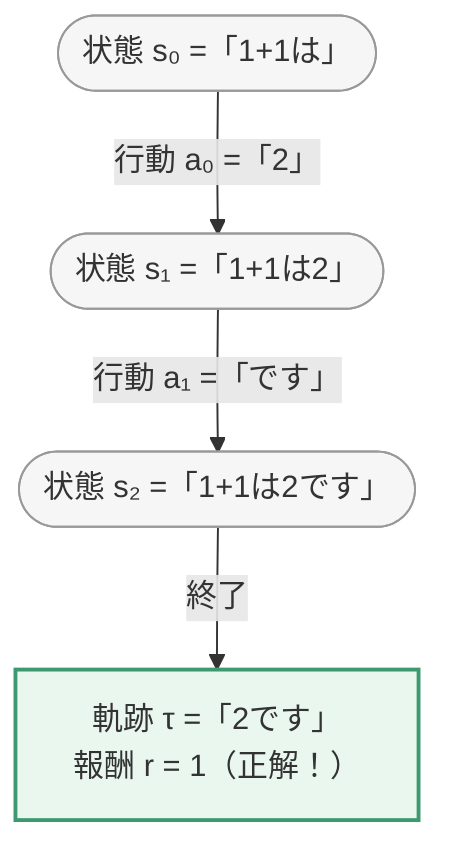

### 8.1.2 PPO から GRPO へ

#### PPO の問題点

PPO（第4章の RLHF で使う手法）では、**4つのモデルを同時にメモリに載せる**必要があります。

| # | モデル | 役割 | サイズ |
|---|-------|------|-------|
| ① | **方策モデル** | 学習対象の LLM | 7B |
| ② | **参照モデル** | 元の LLM（固定）。離れすぎを防ぐ基準 | 7B |
| ③ | **報酬モデル** | 出力にスコアを付ける | 7B |
| ④ | **価値モデル**（Critic） | 将来の期待報酬を推定 ← **これが厄介** | 7B |
| | | **合計** | **28B 相当** |

**価値モデル**は「この状態から将来どれくらい報酬が得られそうか」を予測するモデルです。
学習が難しく、不安定で、メモリも食います。

#### GRPO のアイデア：「同じ問題の中で相対比較すればいい」

> **価値モデルで「期待値」を推定する代わりに、
> 同じ問題に対して複数回答を生成し、その平均を基準にする。**

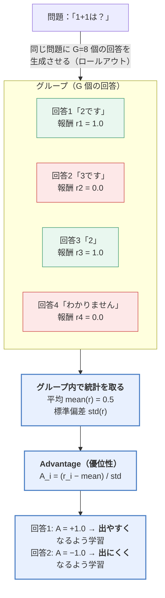

> 🔑 **「平均より良かったか、悪かったか」だけで学習できる**ので、
> 「この状態から将来どれくらい報酬が得られそうか」を予測する
> **価値モデルが丸ごと不要**になります。これが GRPO の核心です。

必要なモデル数を比べると、削減幅がはっきりします。

| 手法 | 必要なモデル | 数 |
|------|------------|---|
| **PPO** | 方策・参照・報酬・価値 | **4** |
| **GRPO** | 方策・参照・報酬 | **3** |
| **GRPO + RLVR** | 方策・参照<br/><i>（報酬はルールベース判定なのでモデル不要）</i> | **2** |

### 8.1.3 検証可能な報酬（Verifiable Rewards）

DeepSeek-R1 の報酬設計は驚くほど単純です。

```python
def compute_reward(response, ground_truth):
    reward = 0.0

    # ① 形式報酬：指定のフォーマットに従っているか
    if "<think>" in response and "</think>" in response:
        reward += 0.1

    # ② 正答報酬：答えが合っているか
    answer = extract_answer(response)      # \boxed{} の中身などを抽出
    if answer == ground_truth:
        reward += 1.0

    return reward
```

#### ★ 1回のロールアウトを最後まで計算する（G=8）

8.1.2 の「グループで相対比較」と、この報酬関数、そして次項の advantage が
**どう繋がるのか**を、1問ぶん最後まで数字で追います。問題は「1+1は？」（正解 `2`）。

| # | モデルの出力 | ① 形式<br/>+0.1 | ② 正答<br/>+1.0 | **報酬 r** | **advantage A**<br/>`(r − mean) / std` |
|---|---|---|---|---|---|
| 1 | `<think>…</think>` ＋ `\boxed{2}` | +0.1 | +1.0 | **1.1** | **+1.044** |
| 2 | `<think>…</think>` ＋ `\boxed{3}` | +0.1 | 0 | 0.1 | −0.899 |
| 3 | `2です`（think 無し・正解） | 0 | +1.0 | 1.0 | +0.850 |
| 4 | `<think>…</think>` ＋ `\boxed{2}` | +0.1 | +1.0 | **1.1** | **+1.044** |
| 5 | `<think>…</think>` だけで答えなし | +0.1 | 0 | 0.1 | −0.899 |
| 6 | `わかりません` | 0 | 0 | 0.0 | −1.093 |
| 7 | `<think>…</think>` ＋ `\boxed{2}` | +0.1 | +1.0 | **1.1** | **+1.044** |
| 8 | `答えは2`（**抽出に失敗**） | 0 | **0** ⚠️ | 0.0 | **−1.093** ⚠️ |

```
   グループの統計   合計 4.5 ／ 平均 mean = 0.5625 ／ 標準偏差 std = 0.5146

   例）#1 の advantage = (1.1 − 0.5625) / 0.5146 = +1.044
       #6 の advantage = (0.0 − 0.5625) / 0.5146 = −1.093
```

**この表1枚から、GRPO の性質が4つ読み取れます。**

| 気づき | 意味 |
|---|---|
| **正解でも A に差が付く**（#1 の +1.044 vs #3 の +0.850） | `<think>` を書いた方が得なので、モデルは**放っておいても考えるようになります**。これが「形式報酬で推論を誘導する」の実際の効き方です |
| **平均が基準**（#3 は正解でも満点扱いではない） | 「絶対的に良いか」ではなく**「このグループの中で良かったか」**だけを見ています。だから価値モデルが不要になります |
| **#8 が理不尽に罰される** | 中身は正解なのに、抽出が `\boxed{}` にしか対応していないせいで 0 点。**しかも −1.093 という強い罰**が付きます。「答えの抽出が脆い」が、なぜ致命的なのかがここで分かります |
| **A の合計はほぼ 0** | 平均を引いているので当然です。**「グループの中で順位を入れ替える」学習**をしている、と言えます |

> 💡 **おまけの気づき：全員が守るようになった報酬は、自動的に効かなくなります。**
> 学習が進んで8個すべてが `<think>` を書くようになると、形式報酬 +0.1 は**全員に付く定数**になり、
> **平均を引く時点で消えます**（advantage は正答だけで決まる）。
> 「形式を教える → 覚えたら勝手に無効化される」という、よくできた設計です。

> ⚠️ **全員が同じ点数だったグループは、学習に何も貢献しません。**
> 8個すべてが正解（r = 1.1）だと、`mean = 1.1`、`std = 0` になり、
> **advantage は `0 / 0`**——実装では 0 になるか、`std + 1e-8` のせいで**巨大な値に暴れます**。
>
> ```
>    易しすぎる問題（全員正解） → 学ぶことが無い（A = 0）
>    難しすぎる問題（全員不正解）→ 学ぶことが無い（A = 0）
>    ちょうど半分できる問題      → いちばん学習が進む
> ```
>
> 🔑 **だから DAPO は「グループ内で点数が全員同じ問題を捨てる」（dynamic sampling）**のです。
> 8.1.4 の「std で割ることによる偏り」も、この `std → 0` の話が根っこにあります。

**設計上の落とし穴：**

| 問題 | 説明 |
|------|------|
| **答えの抽出が脆い** | `\boxed{2}` と `答えは2` を同一視できないと、正解を不正解にしてしまう（上の表の #8） |
| **形式報酬が支配的になる** | 形式だけ整えて中身を諦める挙動（報酬ハッキング）が起きる。上の例で形式報酬を **+1.5**（正答報酬 +1.0 より大きく）にすると、**#2（形式だけ守った不正解＝1.5点）が #3（形式無しの正解＝1.0点）を上回ります**。形式報酬は「正答報酬より必ず小さく」が原則です |
| **部分点がない** | 惜しい回答と完全に的外れな回答が同じ 0 点になる（上の #2 と #6 は 0.1 と 0.0 で、ほとんど区別されていません） |

### 8.1.4 方策比と損失関数

#### 先に：advantage をどうやって損失に入れるのか

8.1.2 で「回答ごとに advantage を計算する」と書きましたが、
**損失はトークン単位で計算します**。両者はこう繋がります。

> **1つの回答に付いた advantage を、その回答の全トークンに同じ値で配る。**

```
   回答1「2です」  advantage = +1.0
        ↓ 全トークンに同じ値を配る
     「2」  → A = +1.0    → このトークンを出す確率を上げる
     「で」  → A = +1.0    → 同じく上げる
     「す」  → A = +1.0    → 同じく上げる

   回答2「3です」  advantage = −1.0
     「3」  → A = −1.0    → 下げる
     「で」  → A = −1.0    → ★ 「で」自体は悪くないのに下げられる
     「す」  → A = −1.0
```

> ⚠️ **これが GRPO の弱点そのものです。** 正解・不正解しか分からないので、
> **「どのトークンが悪かったのか」を区別できません**（上の「で」のように、
> 無関係なトークンまで一緒に罰されます）。
> だから大量のサンプルで平均を取らないと学習が進みません。
> **8.2 の On-Policy 蒸留が「信号が密」と言われるのは、まさにここが違うから**です
> （あちらはトークンごとに別の値が付きます）。

#### 方策比 r

学習では、**「更新前のモデル」と「更新後のモデル」の確率の比**を使います。

```
        πθ(aₜ | sₜ)          新しいモデルがそのトークンを出す確率
rₜ(θ) = ─────────────  =  ───────────────────────────────────
        πθ_old(aₜ | sₜ)      古いモデルがそのトークンを出す確率
```

- `rₜ > 1` … 新モデルはこのトークンをより出しやすくなった
- `rₜ < 1` … 出しにくくなった

> 🤔 **「更新直前なら、比は常に 1 では？」**——最初の1回はそのとおりです。
> ここが分からないと以降が読めないので、順番を追います。
>
> ```
>   ① ロールアウト：いまのモデル（＝ πθ_old）で 8個の回答を生成する
>        ↓  この 8個 が、この後の学習で使う「データ」
>   ② 1回目の更新 ： πθ = πθ_old なので 比 r = 1（クリッピングは効かない）
>   ③ 2回目の更新 ： モデルはもう①の時点から動いている  → r ≠ 1 になる
>   ④ 3回目、4回目…同じデータを使い回すほど r は 1 から離れていく
> ```
>
> **生成（①）は非常に高コスト**なので、**1回のロールアウトで得たデータを何回も使い回します**。
> しかし使い回すほど「そのデータを作ったモデル」と「いま学習中のモデル」がズレていく——
> このズレを補正する仕組みが **importance sampling（重要度サンプリング）** で、
> その補正係数がこの `rₜ` です。
> そして**ズレが大きくなりすぎたら効果を打ち切る**のが、次のクリッピングです。
>
> 🔑 **`rₜ` は「古いデータを新しいモデルの学習に流用するための補正」**。
> これが分かると、8.2.4 の「損失の枠組みは GRPO と共通」もそのまま読めます。

**PPO クリッピング**：この比が極端に動かないよう、上下限で切ります。

```
L = min( rₜ · Aₜ,  clip(rₜ, 1-ε, 1+ε) · Aₜ )

  ε = 0.2 なら、比が 0.8 〜 1.2 の範囲を超えたら効果を打ち切る
```

**なぜ必要か**：1回の更新でモデルが大きく変わりすぎると、
生成される文章が崩壊して学習が破綻します。**「少しずつ変える」ための安全装置**です。

#### この `min` と `clip` は結局何をしているのか

式を睨んでも分かりにくいので、**advantage の符号ごとに、比 r を動かして値を見ます**
（ε = 0.2）。

```
   [A > 0] 良い回答のトークン → 確率を「上げたい」
        r = 0.5  →  効果あり（もっと上げる）
        r = 1.0  →  効果あり
        r = 1.2  →  効果あり（ここが境界）
        r = 1.5  →  ★打ち切り（勾配 0）「もう十分上げた。行き過ぎだ」

   [A < 0] 悪い回答のトークン → 確率を「下げたい」
        r = 1.5  →  効果あり（もっと下げる）
        r = 1.0  →  効果あり
        r = 0.8  →  効果あり（ここが境界）
        r = 0.5  →  ★打ち切り（勾配 0）「もう十分下げた」
```

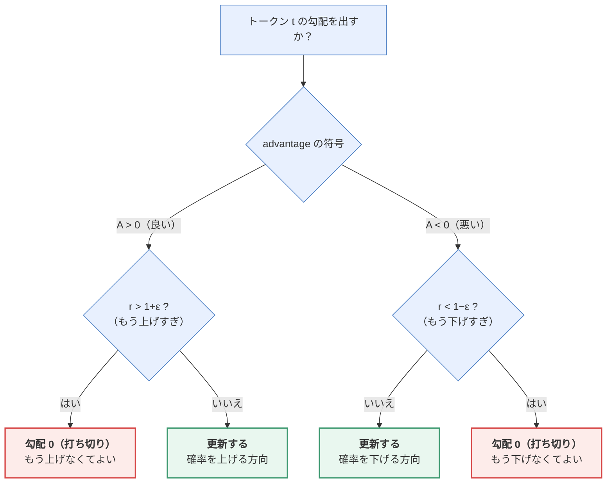

> 🔑 **クリッピングは「行き過ぎた方向にだけブレーキを掛ける」仕組み**です。
> 「上げたいトークンが、もう 1.2 倍以上出やすくなっている」なら、
> それ以上押しても得はなく、壊れるリスクだけが増えます。だから勾配を 0 にして止めます。
> **逆方向（まだ足りない側）には制限を掛けません。**
>
> 📝 これは PPO からそのまま持ってきた部分で、GRPO 独自ではありません。
> GRPO が捨てたのは**価値モデル**であって、クリッピングは残しています。

#### ⚠️ GRPO の式には、後から見つかったバイアスがある

GRPO は 2024年に DeepSeekMath で提案されてから急速に標準になりましたが、
**元の式には2つの偏りがある**ことが 2025年に指摘され、いまは修正版が使われます。
実装するとき（あるいはライブラリの設定を読むとき）に必ず出てくるので、ここで押さえます。

| 偏り | 何が起きるか | 修正 |
|------|------------|------|
| **① 長さで割ることによる偏り** | 損失を「その応答のトークン数」で割ると、**長い誤答1トークンあたりの罰が薄まります**。結果、モデルは「長く書けば罰が減る」ことを学び、**間違えているときほど冗長になる** | **Dr. GRPO**：長さでの正規化をやめる<br/>**DAPO**：グループ全体のトークン数で割る（＝トークン単位で集計する） |
| **② 標準偏差で割ることによる偏り** | `A = (r − mean) / std` の `std` が小さいグループ（＝全員ほぼ同じ点数）で advantage が**過大に増幅**される。「全員正解／全員不正解」の易しすぎる・難しすぎる問題が学習を支配してしまう | `std` で割るのをやめる／グループ内の点数が全員同じ問題は**捨てる**（DAPO の dynamic sampling） |

> 🔑 **どちらも「平均を取る単位を間違えていた」という種類のバグです。**
> **「応答ごとに平均してから足す」のか「全トークンをまとめて平均する」のか**で
> 結果が変わる——実装で最も間違えやすく、かつ気づきにくい部分です。
>
> 💡 **持ち帰り**：GRPO 系を回して「出力がどんどん長くなる」「易しい問題ばかり学習している」
> と感じたら、それはハイパーパラメータの問題ではなく**損失の集計単位の問題**かもしれません。
> ライブラリの `loss_agg_mode`（`token-mean` など）や
> `scale_rewards` の設定を確認してください。

### 8.1.5 GRPO の実装フロー

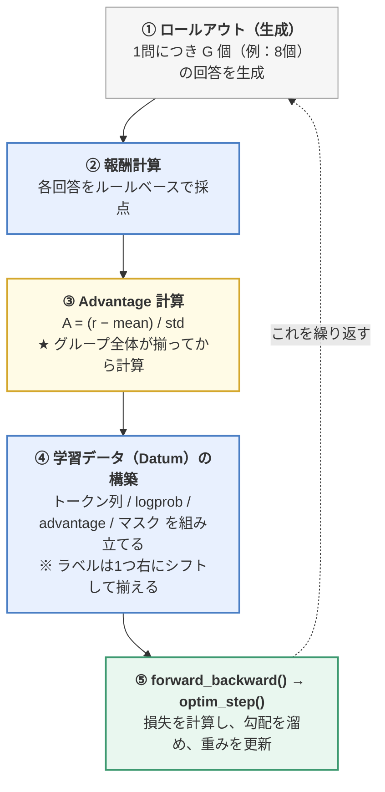

> 📝 図中の `Datum` / `forward_backward()` / `optim_step()` は、
> 研究用ライブラリ **Tinker** の API 名です。
> ここでは**処理の流れを示す疑似コード**として読んでください（写経の対象ではありません）。
> PyTorch なら「④ = テンソルの組み立て、⑤ = `loss.backward()` → `optimizer.step()`」に相当します。

**③ の「グループ全体が揃ってから」が重要**です。
1つでも欠けると平均がずれ、advantage が正しく計算できません。

### 8.1.6 同期版と非同期版

| 方式 | 動作 | 特徴 |
|------|------|------|
| **同期（Synchronous）** | 生成 → 全部待つ → 学習 | 実装が単純。GPU が生成待ちで遊ぶ |
| **非同期（Asynchronous）** | 生成と学習を並行させる | 実測時間が大幅短縮。実装が複雑 |

**アルゴリズムのロジックは全く同じ**で、違うのは実行効率だけです。
まず同期版で理解し、必要になったら非同期版に進むのが順路です。

> 実務では **vLLM** などの高速推論エンジンで生成を担当させ、
> 学習側と分離するのが一般的です。

---

## 8.2 On-Policy 蒸留（On-Policy Distillation）

### 8.2.1 オフライン蒸留の限界

**知識蒸留（Knowledge Distillation）** とは、
大きな「先生モデル（Teacher）」の知識を、小さな「生徒モデル（Student）」に移す技術です。

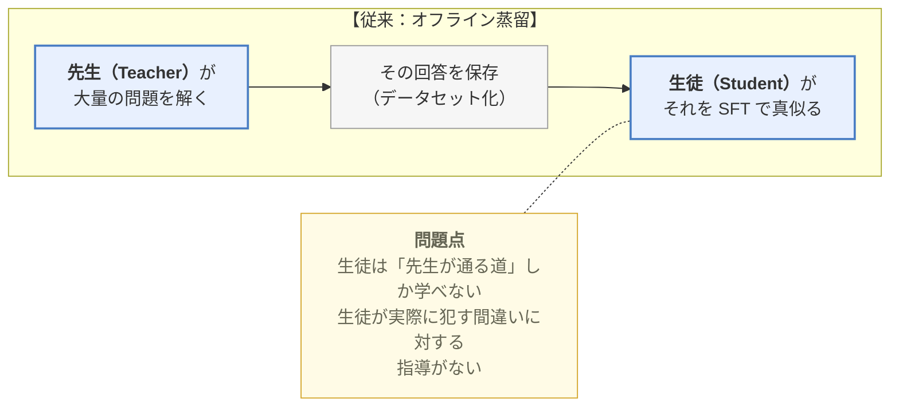

たとえるなら：
- **オフライン蒸留** ＝ 名人の棋譜を暗記する
- **On-Policy 蒸留** ＝ 自分で指して、その一手ごとに先生が「その手は悪い」と指摘する

### 8.2.2 On-Policy 蒸留の仕組み

> **生徒に自分で文章を生成させ、その生徒自身の軌跡に対して、
> 先生が「各トークンの良し悪し」を評価する。**

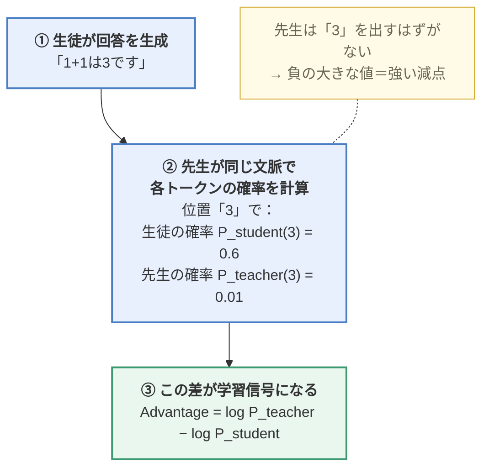

これは数学的には **逆 KL ダイバージェンス（Reverse KL）** の最小化に対応します。

> 📖 **KL ダイバージェンスとは**：2つの確率分布の「ずれ」を測る量です。
> 完全に一致していればゼロ、離れるほど大きくなります（距離に似ていますが非対称）。
> 「逆（Reverse）」と付くのは、KL(生徒‖先生) と KL(先生‖生徒) のどちらを
> 最小化するかで性質が変わるためで、逆 KL は
> 「**先生が絶対に出さないトークンを、生徒も出さなくなる**」方向に強く働きます。

### 8.2.3 GRPO との比較（ここが理解のポイント）

| | GRPO | On-Policy 蒸留 |
|---|---|---|
| 学習信号の元 | 報酬（正解/不正解） | 先生モデルの確率 |
| 信号の粒度 | **軌跡ごと（粗い）** | **トークンごと（密）** |
| 必要なもの | 検証可能な問題 | 強い先生モデル |
| 学習効率 | 遅い（1回答＝1ビットの情報） | **速い**（全トークンに信号） |

```
【GRPO の信号】
  「1+1は3です」  →  報酬 0    （どこが悪かったかは教えてくれない）

【On-Policy 蒸留の信号】
  「1」→ OK
  「+」→ OK
  「1」→ OK
  「は」→ OK
  「3」→ ★大幅減点（ここが悪い！）
  「で」→ OK
  「す」→ OK
```

**信号の密度が段違い**なので、はるかに少ないサンプル数で学習が進みます。

### 8.2.4 実装上の注意

| 注意点 | 内容 |
|--------|------|
| **同じ軌跡を評価すること** | 先生には**生徒が生成したトークン列そのもの**を採点させる。先生に生成させてはいけない |
| **トークナイザの一致** | 先生と生徒のトークナイザが違うと位置がずれて破綻する。事前に必ず確認する |
| **損失の枠組みは GRPO と共通** | importance sampling（＝8.1.4 の方策比 `r` を使った重み付けのこと。**古い方策で集めたデータを、新しい方策の学習に流用するための補正**）の損失は使い回せる。**違うのは advantage の作り方だけ** |

---

## 8.3 Search-R1：検索を強化学習で覚えさせる

### 8.3.1 固定的な検索から自律的な検索へ

第7章の RAG は **「必ず1回検索してから答える」** という固定パイプラインでした。

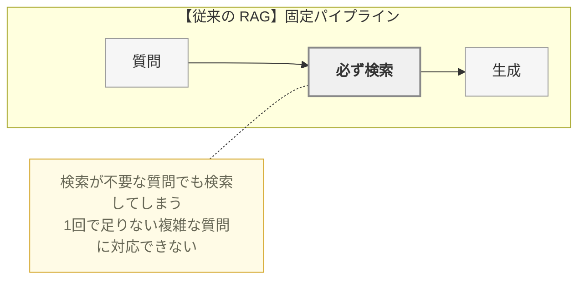

**Search-R1** は、**検索するかどうか・何を検索するか・いつ止めるかを、モデル自身に決めさせます**。
そしてその判断を強化学習で鍛えます。

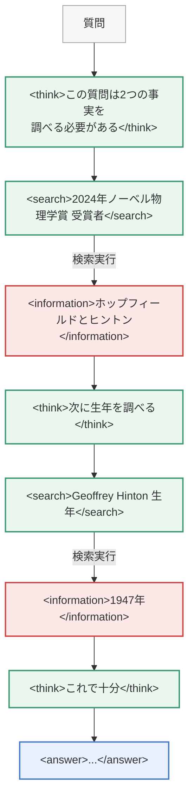

> 緑のタグは**モデル自身が生成**した部分、赤の `<information>` は
> **検索エンジン（環境）が返した**部分です。この区別が 8.3.5 のマスクに繋がります。

**学習データには質問と最終的な答えしかありません。**
「どう検索すべきか」は一切教えず、**正解にたどり着いた軌跡が強化される**ことで、
モデルが検索戦略を自分で獲得します。

### 8.3.2 検索バックエンドを「環境の観測」として扱う

強化学習の言葉で言えば、検索エンジンは **環境（Environment）** です。

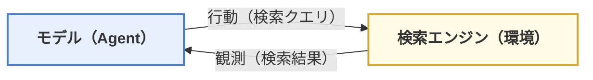

実装上は、検索結果を統一的な `SearchResult` オブジェクトで包み、
学習側のコードが検索エンジンの実装詳細（Wikipedia か Google か社内DB か）を
知らなくて済むようにします。

### 8.3.3 マルチターンのロールアウト

1ターンで終わらないため、状態機械（State Machine）として管理します。

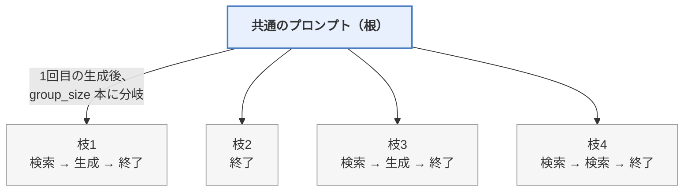

**各枝は独立に検索を繰り返します**（枝2 のように1回も検索せずに終わる枝もあります）。
最初の分岐までは共通なので計算を共有し、その後は各枝で `num_samples=1` として進めます。

### 8.3.4 トークンの連続性（実装の最難関）

複数ターンを繋げるとき、**トークン列が途中でずれると学習が壊れます**。

```
❌ 悪い例：ターンごとに文字列を結合して、最後に全体を再トークン化
   → 境界でトークンの切れ方が変わり、logprob の位置がずれる

✅ 良い例：各ターンで生成されたトークン ID を、そのまま連結していく
   → チャットテンプレートの終端トークンも、
     ダミーメッセージを使って事前に ID として取得しておく
```

### 8.3.5 報酬とマスク

**報酬は結果のみ（Outcome-only）：**

```python
if format_invalid:      reward = -0.1     # タグが壊れている
elif answer_correct:    reward =  1.0
else:                   reward =  0.0
```

**観測マスク（Observation Masking）が極めて重要：**

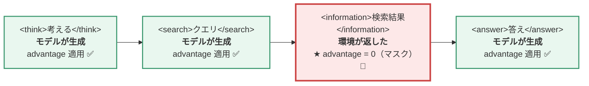

**なぜか**：`<information>` の中身は**モデルが作ったものではありません**。
検索エンジンが返したテキストです。
これを「モデルが生成すべきトークン」として学習させると、
モデルが**検索結果を捏造するようになってしまいます**。

### 8.3.6 学習の単位

- グループ全員の報酬が出揃ってから advantage を計算する（8.1.5 と同じ）
- **動的マイクロバッチ**：軌跡ごとに長さが違うので、
  メモリに収まるよう分割しつつ、**全体の平均としての勾配が保たれる**ように重み付けする

---

## 8.4 ReTool：コード実行を強化学習で覚えさせる

### 8.4.1 「呼び方」から「使い方」へ

Function Calling（第7章）は「**ツールの呼び出し形式**」を SFT で教えるものでした。
ReTool が教えるのは、**「そもそも、いつツールを使うべきか」という戦略**です。

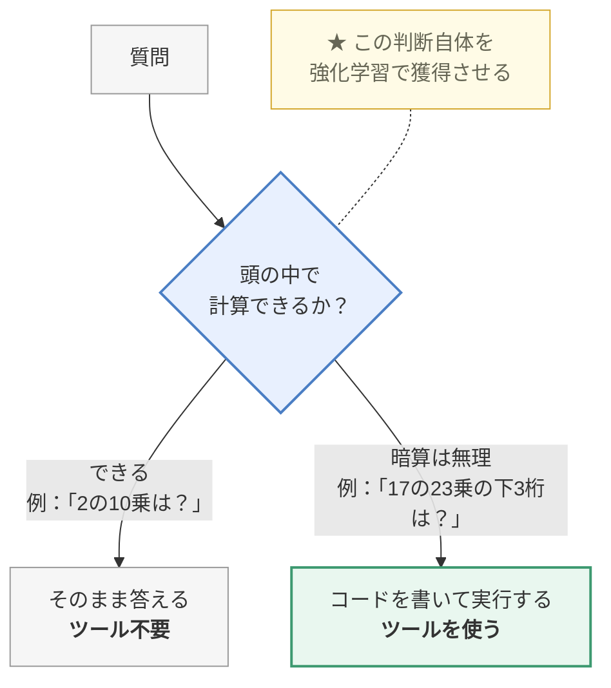

LLM は算術が苦手ですが、**Python を書いて実行させれば正確**です。
「自分の弱点を道具で補う」ことを覚えさせるわけです。

### 8.4.2 コールドスタート

いきなり強化学習を始めても、モデルはコードの書き方すら知りません。
そこで **コールドスタート SFT** で最低限の能力を仕込みます。

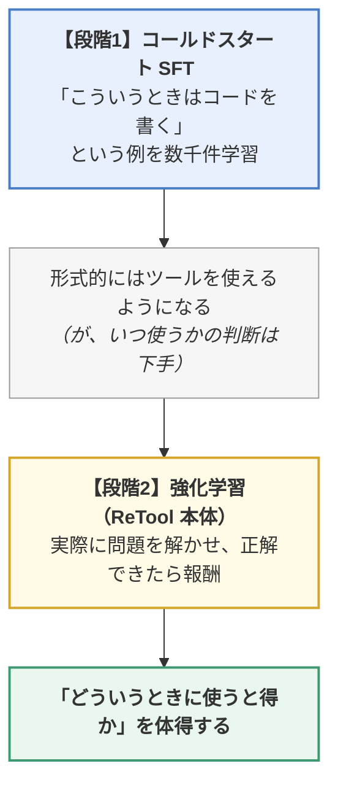

### 8.4.3 実行結果をトークン列に組み込む

Search-R1 と全く同じ構造です。

```
<think>この計算は大きすぎるのでコードを使う</think>
<code>
print(pow(17, 23, 1000))
</code>
<interpreter>
393
</interpreter>            ← ★ 実行結果。マスクして advantage = 0
<think>下3桁は393だ</think>
<answer>393</answer>
```

> 各コード実行は**新しい Python プロセス**で行われ、状態は共有されません
> （前のセルの変数は残らない）。安全性と再現性のためです。

### 8.4.4 報酬とマスク

```python
reward = 1.0 if final_answer == ground_truth else 0.0
```

- 結果のみで判定。**途中でコードを何回書いたかは問わない**
  → 「効率的な使い方」はモデルが自分で見つける
- `<interpreter>` の中身は環境の出力なので **advantage = 0 でマスク**

**非対称なクリッピング**：ReTool では PPO のクリップ範囲を
`[0.8, 1.28]` のように**上側を広く**取ります。
良い挙動（＝ツールを使って正解した）をより強く伸ばすためです。

### 8.4.5 コード実行のセキュリティ ⚠

**この章で最も現実的に重要な注意点**です。

LLM が生成したコードをそのまま実行するのは、**極めて危険**です。

| 対策レベル | 内容 |
|-----------|------|
| **最低限**（教材レベル） | サブプロセスで実行、タイムアウト、出力の切り詰め、スレッド数制限 |
| **本番必須** | Docker などの**コンテナ隔離**、ネットワーク遮断、読み取り専用ファイルシステム、CPU/メモリ制限、非特権ユーザー |
| **さらに堅牢** | gVisor / Firecracker などの軽量VM、専用サンドボックスサービス |

> 「ローカルのサブプロセスで実行するだけ」の方式には
> **OS レベルの隔離がありません**。
> 学習目的の閉じた環境でのみ使い、本番では必ずコンテナ化してください。

### 8.4.6 評価

ReTool の効果を測るには、**同じ条件で比較**する必要があります。

- 同じ temperature / top-p
- 同じコンテキスト長の上限
- 同じ答えの抽出ロジック
- テキストのみのモード vs ツール使用モード

---

## 8.5 4手法の共通構造

第8章の4つの手法は、実は**すべて同じパイプライン**です。

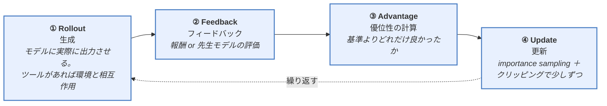

違いは、**この4つの箱の中身の設計だけ**です。

| 手法 | 行動空間 | 環境の観測 | 報酬 | マスクする部分 |
|------|---------|-----------|------|--------------|
| **GRPO** | トークン | なし | 正解判定 | なし |
| **On-Policy 蒸留** | トークン | なし | 先生の logprob 差 | なし |
| **Search-R1** | トークン + 検索 | 検索結果 | 正解判定 | `<information>` |
| **ReTool** | トークン + コード | 実行結果 | 正解判定 | `<interpreter>` |

### 新しい手法を設計するときの5つの問い

1. **行動空間**は何か？（トークンだけ？ツール呼び出しも？）
2. **環境の観測**は何か？（外部から返ってくる情報は？）
3. **報酬**をどう定義するか？（自動判定できるか？ハッキングされないか？）
4. **どのトークンをマスク**するか？（モデルが生成していない部分は必ずマスク）
5. **logprob の位置合わせ**は正しいか？（1トークンのずれが学習を壊す）

---

## この章のまとめ

- **RLVR**（検証可能な報酬による強化学習）が推論モデルの鍵。人間のラベル不要で無限に学習できる
- **GRPO**：同じ問題への複数回答を相対比較して advantage を作る。
  **価値モデルが不要**になり、PPO より軽く安定
- **On-Policy 蒸留**：生徒自身の軌跡を先生が採点。**トークン単位の密な信号**で高速に学習
- **Search-R1**：検索するかどうかをモデルに判断させ、強化学習で戦略を獲得
- **ReTool**：コード実行を「いつ使うか」から学ばせる
- 全手法に共通：**rollout → feedback → advantage → update**
- 実装の落とし穴：
  - **環境が返したトークンは必ずマスク**（しないと捏造を学習する）
  - **トークン境界とlogprobの位置ずれ**が最大のバグ源
  - **コード実行は必ずサンドボックスで隔離**

## 理解度チェック

1. RLHF と RLVR の目的の違いは何ですか？
2. GRPO が PPO より軽い理由を説明できますか？
3. On-Policy 蒸留の学習信号が GRPO より「密」なのはなぜですか？
4. Search-R1 で `<information>` をマスクしないと何が起きますか？
5. 4手法に共通する4段階のパイプラインを言えますか？
6. PPO のクリッピングは何のためにありますか？
7. GRPO で「グループ全員の報酬が揃ってから」advantage を計算するのはなぜですか？

<details>
<summary><b>▶ 解答を見る</b></summary>

1. | | RLHF（4章） | RLVR（8章） |
   |---|---|---|
   | 目的 | 人間の**好み**に合わせる（丁寧さ・安全性） | 正解にたどり着く**能力**そのものを鍛える |
   | 報酬 | 人間の選好（**主観的**、報酬モデルが必要） | 答えが合っているか（**客観的**、プログラムで自動判定） |

   RLVR が革命的だったのは、**人間のラベル付けなしに無限に学習信号を作れる**点です。
   数学は答えの一致、プログラムはテストの通過で自動判定できます。
2. **価値モデル（Value Model / Critic）が丸ごと不要になる**からです。
   PPO は方策・参照・報酬・価値の**4モデル**を同時にメモリに載せる必要があります（7B なら 28B 相当）。
   GRPO は「価値モデルで期待値を推定する」代わりに、
   **同じ問題に複数回答させ、そのグループ内の平均を基準にします**。
   `A = (r − mean) / std` で「平均より良かったか悪かったか」が分かるので、価値モデルが要りません。
   さらに RLVR ならルールベース判定で報酬モデルも不要になり、**2モデル**まで減ります。
3. **信号の粒度が違う**からです。

   ```
   【GRPO】     「1+1は3です」 → 報酬 0   （軌跡全体で1つの数値。どこが悪いかは不明）
   【On-Policy 蒸留】
       「1」→OK  「+」→OK  「1」→OK  「は」→OK
       「3」→★大幅減点（ここが悪い！）    「で」→OK  「す」→OK
   ```

   GRPO は**1回答につき実質1ビット**の情報しか得られませんが、
   On-Policy 蒸留は先生モデルの確率と比較するので**全トークンに信号が付きます**。
   だからはるかに少ないサンプル数で学習が進みます。
4. **モデルが検索結果を捏造するようになります。**
   `<information>` の中身は**モデルが生成したものではなく、検索エンジンが返したテキスト**です。
   これを「モデルが生成すべきトークン」として学習させると、
   モデルは検索せずに「それらしい検索結果」を自分で書く方向に最適化されてしまいます。
   これでは検索を使う意味が消えます。ReTool の `<interpreter>`（コード実行結果）も同じ理由でマスクします。
5. **Rollout（生成）→ Feedback（フィードバック）→ Advantage（優位性の計算）→ Update（更新）** です。
   4手法の違いは、この4つの箱の**中身の設計だけ**です。

   | 手法 | 行動空間 | 環境の観測 | 報酬 | マスクする部分 |
   |------|---------|-----------|------|--------------|
   | GRPO | トークン | なし | 正解判定 | なし |
   | On-Policy 蒸留 | トークン | なし | 先生の logprob 差 | なし |
   | Search-R1 | トークン + 検索 | 検索結果 | 正解判定 | `<information>` |
   | ReTool | トークン + コード | 実行結果 | 正解判定 | `<interpreter>` |
6. **1回の更新でモデルが大きく変わりすぎて、生成が崩壊するのを防ぐため**です。
   新旧モデルの確率比 `rₜ` が極端に動かないよう、`[1−ε, 1+ε]`（ε=0.2 なら 0.8〜1.2）で
   効果を打ち切ります。**「少しずつ変える」ための安全装置**です。
   なお ReTool では上側を広く（例：`[0.8, 1.28]`）取る**非対称クリッピング**を使い、
   「ツールを使って正解した」という良い挙動をより強く伸ばします。
7. **advantage が「グループ内の相対評価」として定義されているから**です。
   `A = (r − mean) / std` の `mean` と `std` は、そのグループ全員の報酬から計算されます。
   1つでも欠けると平均と標準偏差がずれ、**全員の advantage が間違った値になります**。
   非同期実装で高速化するときも、この同期点だけは崩せません。

</details>

---

**戻る** → [README（目次）](https://github.com/thirtypower/kgr-llm) ／ [用語集](https://zenn.dev/thirtypower/books/kgr-llm-guide/viewer/appendix-glossary) ／ [参考文献](https://zenn.dev/thirtypower/books/kgr-llm-guide/viewer/appendix-references)

> 🎉 **ここまで読んだ人へ**：8章までで理論と実装は一巡しました。
> 手を動かす側の締めとして、**[05.5章（MoE と現代アーキテクチャ）](https://zenn.dev/thirtypower/books/kgr-llm-guide/viewer/055-moe-modern-arch)** と
> **[07.5章（推論を速くする）](https://zenn.dev/thirtypower/books/kgr-llm-guide/viewer/075-fast-inference)** をまだ読んでいなければ、
> そこで「2026年の実物」と「運用の現実」が繋がります。
